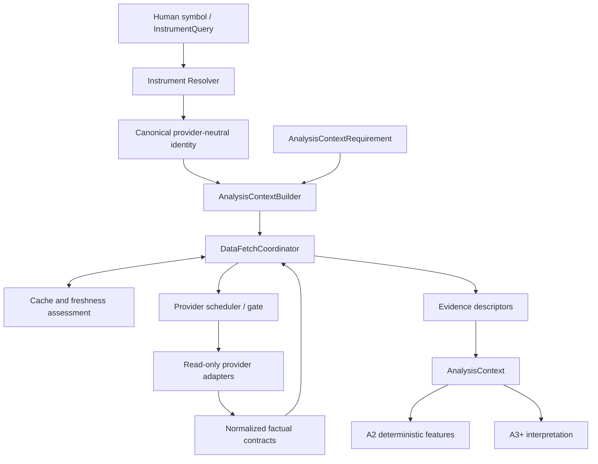

# TIAF A1 Data Foundation Baseline

## 1. Purpose

TIAF_A1 turns provider-specific market-data infrastructure into a
provider-neutral, freshness-aware, provenance-preserving factual analysis
substrate. It accepts human symbols or exact instrument queries, resolves
canonical identity, acquires normalized facts through a shared runtime, and
assembles an immutable `AnalysisContext`.

A1 answers, "What do we factually know?" It does not generate trading
intelligence, predictions, rankings, recommendations, or actions.

## 2. Baseline status

| Target | Status |
|---|---|
| TIAF_A1.1 | COMPLETE |
| TIAF_A1.2 | COMPLETE / LIVE VALIDATED |
| TIAF_A1.3 | COMPLETE / LIVE VALIDATED |
| TIAF_A1.4 | COMPLETE / LIVE VALIDATED |
| TIAF_A1.5 | COMPLETE / LIVE VALIDATED |
| TIAF_A1.6 | COMPLETE / LIVE VALIDATED |
| TIAF_A1.7 | COMPLETE / LIVE VALIDATED |

- Baseline tag: `tiaf-a1.7`
- Resolved baseline commit: `eecd7736aa939f919c0fba5b4fdbec7722179979`
- Tag date: 2026-09-06

## 3. A1 architectural flow



Provider-native payloads stop inside their adapter. Normal A2 and later
consumers use `AnalysisContext`; they do not call Dhan directly.

## 4. A1.1 — Provider-neutral contracts

A1.1 establishes normalized instruments, quotes, OHLCV bars and historical
series, provider capability protocols, typed data failures, and normalization
helpers. Identity distinguishes exchange, segment, instrument type, expiry,
strike, option side, and provider ID where applicable.

All datetimes are timezone-aware and normalize to `Asia/Kolkata`. Finalized
semantic collections are immutable tuples while normal Python lists and JSON
arrays remain accepted inputs. JSON output uses ordinary arrays and `+05:30`
timestamps, and validated model reconstruction round-trips. Factual quality is
represented by `GOOD`, `PARTIAL`, `DEGRADED`, or `UNAVAILABLE` rather than by
provider-specific flags.

The package version (`0.1.0`) and contract schema version (`1.0`) are separate
concepts.

## 5. A1.2 — Core Dhan market data

A1.2 adds a secret-safe, read-only HTTPX Dhan adapter for full quotes and daily
or supported intraday OHLCV. It validates parallel response arrays, preserves
ordered quote batching, normalizes provider facts, and translates
authentication, rate-limit, timeout, network, not-found, unsupported, and bad
response conditions into typed TIAF errors.

The adapter implements no account, portfolio, order, or execution endpoint.

## 6. A1.3 — Live derivatives

A1.3 adds provider-neutral active-expiry lists and live option chains. It
preserves underlying and child-contract security identity, explicit expiry,
spot, prices, top-of-book bid/ask, quantities, OI, volume, IV, and
provider-reported Greeks. CE and PE facts remain independently visible.

Every chain request requires an exact expiry. A1.3 does not select an expiry,
strike, side, or recommended contract and does not recompute provider Greeks
or IV.

## 7. A1.4 — Historical / expired options

A1.4 adds factual rolling historical option series for CE or PE with OHLC, IV,
OI, volume, actual strike, and underlying spot. Request ranges are half-open
`[start_date, end_date)`, split into adjacent chunks of at most 30 calendar
days, then validated, sorted, and deterministically deduplicated.

The Dhan rolling-option endpoint has a live-validated, endpoint-specific expiry
mapping:

- `1 = NEAR`
- `2 = NEXT`
- `3 = FAR`

This differs from older/general Dhan annexure material that may show `0/1/2`.
TIAF uses the dedicated `HistoricalOptionExpiryCode` only for this endpoint;
`0` and `None` are rejected and unrelated API semantics are unchanged.

## 8. A1.5 — Instrument resolution

A1.5 converts human inputs into canonical provider-neutral and provider
identity using Dhan's detailed instrument master. Normal callers use
symbol-first resolution and do not need Dhan security IDs. Exact provider-ID,
trading-symbol, equity, index, future, and option queries remain available when
explicitly required.

The current deployment policy uses NSE as the configurable primary cash and
F&O exchange. An explicit BSE query overrides it. Policy selection is visible;
ambiguity is preserved when a unique safe result cannot be selected. The
canonical F&O-underlying universe is exchange-scoped, derived from derivative
relationships, deterministic, and excludes identified Dhan diagnostic
`DUMMYSAN` records without broad symbol filtering.

Live-observed identity examples, not production constants:

| Human identity | Observed Dhan security ID |
|---|---:|
| RELIANCE, NSE | 2885 |
| HDFCBANK, NSE | 1333 |
| KAYNES, NSE | 12092 |

Production code resolves these values from the current master; it does not
hard-code them.

## 9. Identity integrity rule

```text
caller symbol + provider ID mismatch
                -> reject before provider call
```

An early live smoke invocation labeled Dhan security ID `1333` as RELIANCE.
Dhan correctly returned data for ID `1333`, later confirmed by the master to be
HDFCBANK. The transport was factual; the caller-supplied display identity was
wrong. This could have silently attributed one instrument's evidence to
another.

A1.5 permanently closes this class of error: symbol-first diagnostic paths
resolve canonical identity, and any additionally supplied provider ID must
match before provider construction or transport. Future code must never trust
an independent caller label and provider ID as co-equal facts; identity comes
from the resolver and canonical contract.

## 10. A1.6 — Data runtime

A1.6 provides `CacheKey`, `CacheEntry`, `FreshnessRequirement`, `FetchResult`,
`InMemoryCacheBackend`, an atomic provider scheduler/gate, explicit rate
policies, key-scoped single flight/coalescing, bounded opt-in stale-on-error,
cache invalidation, local metrics, and provider enable/disable or cooldown
controls.

The runtime first uses an acceptable cached fact when policy permits. A new
provider callback executes only after an atomic gate reservation. Cache and
scheduler state are process-local.

Core rule: **no hidden sleeps**. A1.6 answers:

> May this factual provider request execute now, or can an acceptable cached
> result be used?

It does not decide when deferred analytical work should be retried.

## 11. Freshness semantics

Retrieval/acquisition freshness and source/market observation age are distinct.
A response retrieved on 2026-09-06 may be retrieval-`FRESH` while its actual
last trade is `2026-09-04T15:59:14+05:30` because the market is closed.

A1.7 exposes:

- `retrieval_freshness` and `retrieval_age_seconds`: cache/acquisition recency;
- `received_at`: when the normalized response was received, where available;
- `source_observed_at` and `observation_age_seconds`: age of the factual source
  observation;
- `source_observation_semantics`: what that observation timestamp means;
- `overall_retrieval_freshness`: required-evidence retrieval aggregation only.

Future consumers must not treat retrieval freshness as proof that the market
observation itself is current. A1 does not invent market-calendar-aware source
recency. Dhan option-chain responses have no authoritative market-event time,
so their acquisition-time observation semantics are labeled explicitly.

## 12. A1.7 — AnalysisContext

A1.7 provides `AnalysisPurpose`, `AnalysisContextRequirement`,
`HistoricalOptionRequirement`, `AnalysisSubject`, `EvidenceDescriptor`,
`AnalysisContext`, `ContextSummary`, `AnalysisContextBatchItem`, and
`AnalysisContextBuilder`.

The builder resolves one canonical subject and routes every requested factual
operation through A1.6. The resulting immutable `AnalysisContext` is the stable
factual substrate for A2 deterministic features and later Agent consumers.

## 13. Evidence requirement semantics

Each evidence descriptor states both `requested` and `required`, with one
explicit role:

- `NOT_REQUESTED`
- `OPTIONAL_REQUESTED`
- `REQUIRED`

`complete=True` means all `REQUIRED` evidence satisfied its explicit quality,
freshness, partial-data, and stale policy. It does not mean every possible
evidence source exists. Optional failure can reduce aggregate quality and add a
warning without making the context incomplete. Required failure yields an
incomplete/degraded context in partial mode or a typed build failure in strict
mode.

## 14. Evidence status semantics

- `AVAILABLE`: requested evidence satisfied its normal factual policy.
- `PARTIAL`: usable evidence is present but incomplete/degraded.
- `STALE`: evidence is usable only under explicit stale policy.
- `MISSING`: the provider result explicitly contains no usable fact.
- `FAILED`: an actual provider/build attempt failed.
- `NOT_REQUESTED`: the caller did not request the slot.
- `DEFERRED`: A1.6 blocked execution before a provider attempt.

`ProviderScheduleBlockedError` is not factual unavailability. Deferred evidence
has no invented factual quality or retrieval freshness.

## 15. Batch / deferred semantics

Every ordered `build_many` input produces one `AnalysisContextBatchItem`:

- `COMPLETE_CONTEXT`
- `PARTIAL_CONTEXT`
- `DEFERRED`
- `ERROR`

In live acceptance, RELIANCE completed immediately while subsequent HDFCBANK
and KAYNES items could be temporarily deferred by the provider rate gate.
Independent HDFCBANK and KAYNES builds succeeded, proving the batch state was
scheduling deferral rather than factual unavailability.

Deferred items retain provider, operation, reason, gate state,
`retry_after_seconds`, typed cause, and available correlation/context identity.
Facts acquired before a later block remain in the retained partial context. A
required deferred slot forces overall retrieval freshness to `UNKNOWN`.
A1.7 never waits or retries implicitly; a future orchestrator owns that policy.

## 16. Quality semantics

A1.7 aggregates quality deterministically in this order:

1. A missing/unacceptable required core quote or history, excluding a scheduler
   deferral, yields `UNAVAILABLE`.
2. Other missing/unacceptable required evidence, excluding deferral, yields
   `DEGRADED`.
3. Required evidence missing only because it is deferred yields `PARTIAL`.
4. Otherwise required `STALE` or underlying `DEGRADED` evidence yields
   `DEGRADED`.
5. Otherwise requested `PARTIAL`, `STALE`, `FAILED`, `MISSING`, or `DEFERRED`
   evidence—or underlying `PARTIAL` quality—yields `PARTIAL`.
6. Otherwise the context is `GOOD`.

`UNAVAILABLE` describes factual usability, never a provider gate block.

## 17. Provider provenance

Consumers can distinguish `PROVIDER`, `CACHE`, and `COALESCED` acquisition and
explicit stale fallback. Evidence retains provider attribution, retrieval age,
source-observed time, observation age, data quality, evidence status, cache and
fetch disposition, and scheduling details for deferral. Consumers must carry
these facts forward rather than reducing evidence to a value alone.

## 18. Public contract for A2

A2 may assume:

- symbol-first provider-neutral identity;
- normalized quotes, OHLCV, derivatives, and historical options;
- immutable `AnalysisContext` contracts;
- truthful required/optional evidence semantics;
- separate retrieval and source-observation provenance;
- typed deferred and error states;
- canonical aware `Asia/Kolkata` timestamps;
- immutable semantic collections with JSON-array interoperability;
- stale fallback only when explicitly requested and visibly marked;
- no hidden provider sleeps.

A2 must not:

- call Dhan transport directly;
- hard-code Dhan security IDs or bypass the resolver;
- bypass `DataFetchCoordinator` for factual provider acquisition;
- discard evidence status, quality, freshness, or provenance;
- collapse retrieval freshness into observation recency;
- treat `DEFERRED` as `UNAVAILABLE`;
- infer BUY/SELL or any recommendation from A1 contracts;
- silently choose an option expiry, strike, or side;
- mutate `AnalysisContext` or its semantic collections.

The same rules apply to A3 and later consumers. Agents consume shared context;
they do not independently hammer provider APIs.

## 19. Explicit non-goals of A1

A1 does not provide technical indicators, derived market features, trend
classification, scoring/ranking, opportunity prediction, CE/PE recommendation,
strike-selection intelligence, sector intelligence, news intelligence,
fundamentals, LLMs, Agents, LangGraph, position intelligence, TradeMonitor
integration, continuous Intelligence OS orchestration, or broker execution.

## 20. Known deferred work

Intentional future work includes:

- market-calendar-aware source-observation recency;
- provider fallback and Zerodha integration;
- persistent/distributed cache, if operational evidence justifies it;
- orchestration and retry of deferred batch work;
- provider health/degradation integration;
- external news, filings, fundamentals, macro, sector, and peer evidence;
- future Agent/runtime queues and continuous orchestration.

These are explicit boundaries, not defects in the accepted A1 contract.

## 21. A1 acceptance criteria

A1 is accepted because its contracts and failure modes are tested and the
read-only live path has validated Dhan quote/history, live option chains,
historical CE/PE option facts, symbol-first resolution, identity mismatch
rejection, canonical F&O universe derivation, provider-to-cache reuse,
freshness/provenance distinctions, `AnalysisContext`, required-evidence
failure, and truthful deferred-batch semantics.

The closure verification count is recorded in
[`TIAF_A1_ACCEPTANCE_REPORT.md`](TIAF_A1_ACCEPTANCE_REPORT.md) so this baseline
does not embed a test count that will become stale.

## 22. Handoff to A2

```text
A1:  What do we factually know?
     -> produces AnalysisContext

A2:  What deterministic structure/features can be computed from those facts?
     -> consumes AnalysisContext

A3+: What does that evidence imply, and what should we do?
```

A2 begins above—not inside—the resolver, provider adapter, cache, scheduler, or
factual normalization boundaries.
