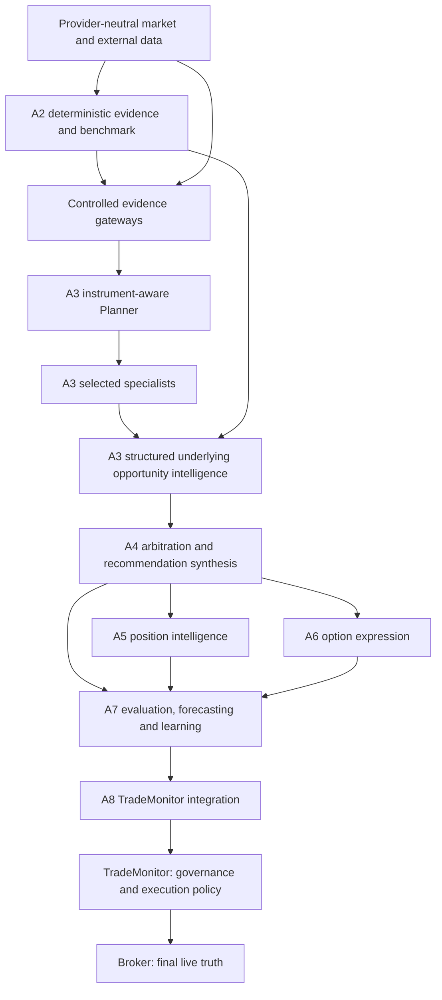
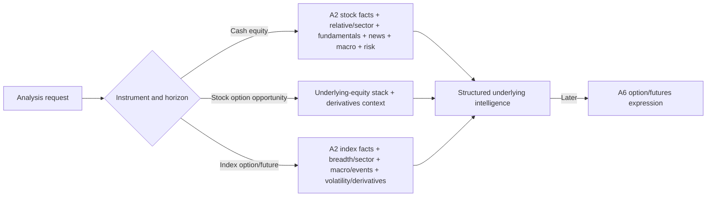
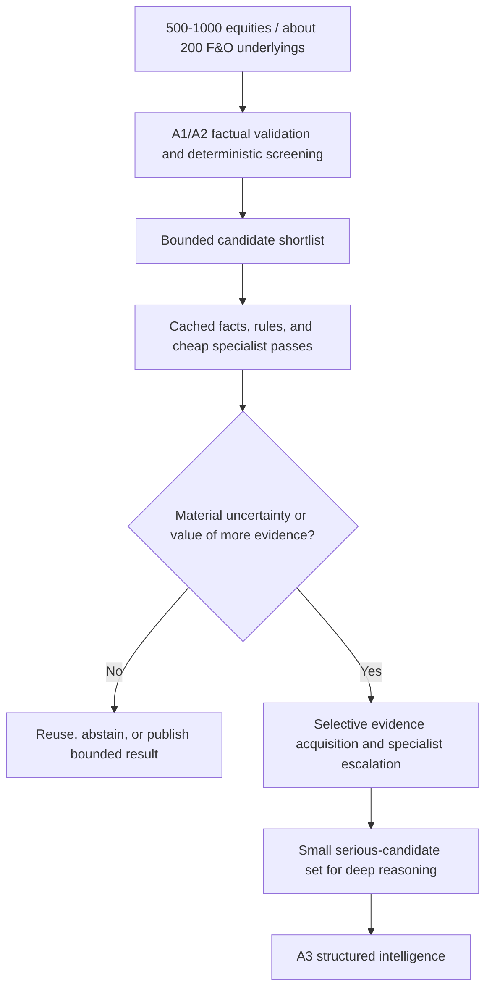
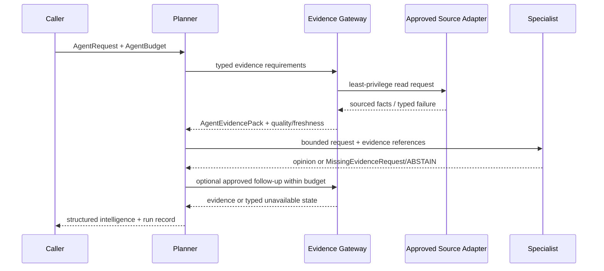
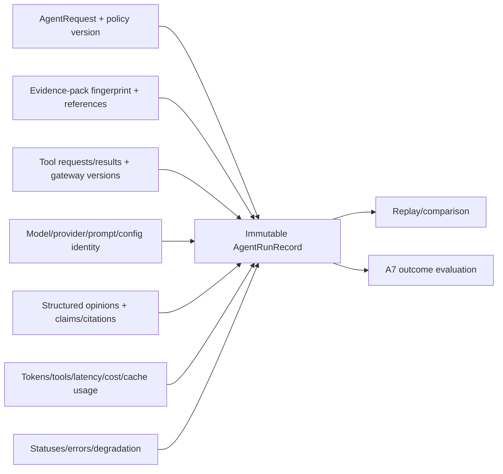
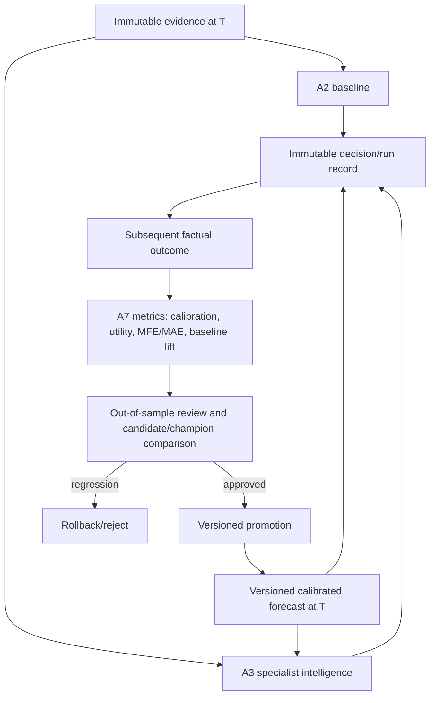

# TIAF A3 Specialist Intelligence Architecture

## Status and authority

**Status:** architecture accepted at `tiaf-a3-arch`.

**Runtime status:** A3.1 through A3.4 complete / accepted; A3.5 implemented /
pending acceptance.

**Accepted substrate:** `tiaf-a2-baseline` at
`e27674070537a7d81e6e117283913d7da2785d1c`, with 1,229 accepted tests.

**Current milestone:** TIAF_A3.5 — News / Catalyst / Event Intelligence,
documented in
[`TIAF_A3_5_NEWS_EVENT_INTELLIGENCE.md`](TIAF_A3_5_NEWS_EVENT_INTELLIGENCE.md).

This is the authoritative architecture for TIAF_A3. It supplements the
[canonical roadmap](TRADINGINTELLIGENCE_ROADMAP.md), and the executable sequence
is defined in the [A3 detailed roadmap](TIAF_A3_DETAILED_ROADMAP.md). It does
not claim that unimplemented specialists, a live model provider,
multi-Agent orchestration, or execution authority exist.

## North star

TradingIntelligence is intended to become a disciplined decision-intelligence
system working in the user's economic interest. It will combine deterministic
evidence, calibrated probabilistic forecasts, specialist reasoning, and later
outcome feedback to improve risk-adjusted expected economic utility through
better selection, timing, capital efficiency, position quality, downside
avoidance, and loss containment.

This objective is not “maximize raw profit at any cost,” and A3 does not turn
it into an arbitrary score. `WAIT`, `NO_TRADE`, `ABSTAIN`, and
`INSUFFICIENT_EVIDENCE` are economically useful results.

## Governing principles

1. Be deterministic where possible; use AI only where judgment adds value.
2. Evidence precedes interpretation, and claims cite the evidence they use.
3. Specialists consume explicit, least-privilege capabilities; they do not
   browse, query brokers, execute shell commands, or open databases freely.
4. Agent does not mean LLM. Deterministic, policy, lightweight-model, full-LLM,
   and selectively deep paths are all valid.
5. LLM use is budgeted, observable, optional, and skipped when evidence has not
   materially changed.
6. Confidence and probability are never fabricated.
7. A2 remains the immutable factual and deterministic benchmark. A3 may
   disagree with it, but cannot erase or silently recalculate it.
8. Instruments and horizons receive different reasoning compositions.
9. Underlying opportunity intelligence and option-contract expression are
   separate concerns.
10. Fundamentals matter for longer-horizon equities; news and events require
    sourced, time-aware evidence.
11. Forecasts carry model identity, uncertainty, validation, and calibration.
12. Learning uses realized outcomes and controlled promotion, not
    self-confirming Agent prose.
13. Every conclusion must be attributable, auditable, and evaluable.
14. A4 owns cross-specialist arbitration; A5 owns position lifecycle
    intelligence; A6 owns option expression; A7 proves value; TradeMonitor owns
    governance; the broker remains final live-state truth.
15. TIAF has no order-placement or authority-escalation path.

## Intelligence stack and ownership

A3 ends at structured specialist and opportunity intelligence. It does not
select an executable action, manage an open position, choose a strike/expiry,
or place an order.

## The A2/A3 invariant

A2 answers, “What does versioned deterministic evidence say?” A3 answers,
“What does a bounded specialist make of that evidence?”

An A3 component must not independently recreate ATR, RSI, MACD, SuperTrend,
support/resistance geometry, relative-strength arithmetic, multi-timeframe
facts, option-chain arithmetic, or deterministic opportunity scoring already
owned by A2. Shared normalized evidence is computed once and referenced by ID.
Any later deterministic fundamental, event, or forecast feature likewise
belongs in its evidence subsystem rather than in an LLM prompt.

Every A3 result retains:

- the A2 snapshot and assessment IDs;
- the A2 policy and candidate class;
- explicit agreement, disagreement, or non-comparability;
- evidence quality, freshness, and missing-evidence state; and
- the Agent policy/model/prompt identities needed for audit.

If A3 is unavailable, a valid A2 baseline remains available as a baseline—not
as a silently promoted A3 conclusion.

## Instrument-aware composition

Shared contracts do not imply a universal pipeline.

| Instrument | Required core | Selective additions | A3 prohibition |
|---|---|---|---|
| Cash equity | A2 technical/market state, relative context, opportunity risk | fundamentals, valuation, filings/news, sector, macro, calibrated forecast | no broker action or position advice |
| Stock-option candidate | complete underlying-equity view plus current derivatives context | catalyst timing and calibrated path/level evidence | no `CE`/`PE`, strike, expiry, or strategy selection |
| Index option/future | index structure, breadth/constituent and sector context, macro/events, volatility/derivatives | calibrated expiry-horizon forecast | no contract or leverage decision |

## Progressive cost funnel

The normal design target is a preferred NIFTY 500 cash universe, expandable to
roughly 1,000 equities, and an F&O universe of roughly 200 underlyings. Deep
research across every name is explicitly out of scope.

The Planner applies caller limits and policy caps; it never keeps escalating
merely to fill a requested number of candidates.

## Controlled evidence and tool architecture

### Separation of acquisition and reasoning

Evidence acquisition validates identity, provenance, time roles, freshness,
quality, normalization, deduplication, and permissions. Specialist reasoning
receives only the approved `AgentEvidencePack` and may request additional
evidence through a typed `MissingEvidenceRequest`.

Candidate capabilities are allow-listed rather than dynamically invented:

- `READ_A2_EVIDENCE`
- `READ_FUNDAMENTALS`
- `READ_FILINGS`
- `READ_NEWS`
- `READ_SECTOR_CONTEXT`
- `READ_MACRO_CONTEXT`
- `READ_DERIVATIVES`
- `READ_FORECAST`
- `REQUEST_ADDITIONAL_MARKET_EVIDENCE`

Each request names subject, purpose, allowed evidence families, as-of boundary,
freshness requirement, and budget. A gateway returns immutable references or a
typed unavailable/partial/stale result. It never exposes credentials, a generic
HTTP client, SQL, shell, code execution, broker sessions, or write authority.

### Fundamental evidence foundation

Fundamentals must arrive during A3. Long-horizon equity intelligence cannot be
accepted on technical evidence alone. A3.4 therefore owns provider-neutral
fundamental evidence contracts, deterministic normalization/features, a
read-only acquisition boundary, and the Company Quality specialist.

Minimum evidence families are revenue and profit growth, margins, ROE/ROCE,
operating/free cash flow, leverage and interest coverage, working-capital
quality, dilution, valuation history/peers, ownership, earnings/guidance,
capital allocation, corporate developments, balance-sheet strength, business
quality inputs, and sector economics. Numeric facts, units, periods, restatement
status, source, acquisition time, effective/as-of time, and point-in-time
availability are deterministic evidence. Business-quality, management,
valuation-context, and competing-hypothesis interpretation belong to the
specialist.

A3.4 must accept at least one bounded read-only source path before it is
complete, but the architecture does not select a paid vendor. Corporate-action
price adjustment remains the separate DEF-013 concern.

### News, filing, and event evidence foundation

A3.5 owns the provider-neutral event contract, deterministic preprocessing, a
read-only acquisition boundary, and the Catalyst/Event specialist. Each item
retains source URI/identifier, publisher, publication time, event time when
known, acquisition time, subject/entity mapping, content hash, language,
source-quality assessment, freshness, structured event fields, and a bounded
text excerpt/reference.

Deterministic processing owns schema normalization, timestamp roles, entity
mapping, exact/near-duplicate clustering, freshness, source allow-listing, and
contradiction flags. A specialist may interpret relevance, likely mechanism,
duration, surprise, dependencies, and competing explanations. It may not invent
an absent event, source, quote, or causal fact. A3.5 also requires one bounded
read-only acquisition path; provider choice remains implementation-time and
provider-neutral contracts remain authoritative.

## Core conceptual contracts

These names define responsibilities; A3.1 will freeze exact fields and schema
versions without implementing orchestration or model calls.

| Contract/protocol | Required meaning |
|---|---|
| `AgentRequest` | request ID, subject/instrument, horizon, analysis style, purpose, decision/as-of time, A2 snapshot/assessment references, requested capabilities, mode, and budget |
| `AgentEvidencePack` | immutable bounded set of evidence references plus coverage, quality, freshness, conflicts, missing families, and pack fingerprint |
| `AgentEvidenceReference` | evidence ID/type, subject, producer/source, observation/effective/acquisition times, quality/freshness, checksum, and access-safe locator |
| `EvidenceClaim` / `Citation` | atomic claim, claim kind, supporting/contradicting evidence IDs, quoted-data boundaries, and qualification |
| `MissingEvidenceRequest` | requested family/subject/time window, reason, expected decision value, urgency, and allowed capability; never an instruction to browse freely |
| `AgentOpinion` | specialist/capability/version, stance, thesis, claims/citations, supporting and contradictory evidence, risks/concerns/caveats, missing evidence, applicability, separated confidence dimensions, A2 comparison, and linked run ID through which model/prompt/policy/usage/latency are preserved |
| `AgentRunRecord` | immutable request/evidence/output fingerprints, specialist/provider/model/prompt/policy/config identities, tool results, timestamps, status, usage, cost, and errors |
| `AgentBudget` | allowed modes/models/capabilities, token/tool/specialist/latency/cost limits, deadline, cache policy, and escalation ceiling |
| `AgentUsage` | actual cached/fresh calls, model tokens, tool calls, specialists, duration, cost units, retries, and budget-stop reason |
| `SpecialistCapability` | stable capability ID/version, supported instruments/horizons/evidence, deterministic or model modes, cost class, prohibitions, and degradation policy |
| `SpecialistAgent` | provider-neutral protocol to evaluate a bounded request and evidence pack into a typed opinion/run result |
| `ReasoningProvider` | structured-generation protocol with model/config identity, schema-constrained output, usage, timeout, and typed failures; no evidence acquisition authority |

Finalized semantic collections are immutable tuples and all contract timestamps
are aware and normalized to `Asia/Kolkata`, consistent with TIAF contracts.

### Compatibility with frozen A0 contracts

The accepted A0 `tiaf.contracts.AgentOpinion` wire schema 1.0 requires a
`BULLISH`/`BEARISH`/`NEUTRAL` direction and scalar confidence. It cannot
truthfully represent A3's `MIXED`, `INSUFFICIENT_EVIDENCE`, `ABSTAIN`, or
unavailable/separated confidence. A3.1 must not mutate that frozen schema in
place.

A3.1 therefore introduces a new, explicitly versioned **AgentOpinion v2** in
the A3 domain namespace (a non-shadowing Python name such as
`AgentOpinionV2` is preferred until a future package-major migration). The A0
v1 type and public import remain supported. A documented adapter may map a v1
opinion to v2 when semantics are lossless; v2 states that v1 cannot express
must not be down-converted. The A0 `AgentDecisionBundle` is likewise not the A3
assembler because its consensus fields belong to A4 arbitration.

Package release version and contract schema version remain separate concepts:
the repository package is currently `0.1.0`, A0 contracts remain schema `1.0`,
and an A3 opinion's incompatible wire semantics require their own major schema
version. Exact names, compatibility matrix, and exports are frozen by A3.1
tests before any consumer is added.

### Specialist stance vocabulary

Specialists may return only:

- `POSITIVE`
- `NEGATIVE`
- `NEUTRAL`
- `MIXED`
- `INSUFFICIENT_EVIDENCE`
- `ABSTAIN`

These are evidence interpretations, not actions. Specialists never emit
`BUY`, `SELL`, `CE`, `PE`, `HOLD`, or `EXIT`.

### Confidence and probability discipline

One scalar called “confidence” is insufficient. A3 records separately:

- evidence quality: reliability/provenance of what was supplied;
- evidence coverage: how much required evidence was available;
- self-reported confidence: optional, uncalibrated specialist assessment;
- policy-derived confidence: deterministic policy output with a version;
- empirically calibrated confidence: held-out observed frequency, method,
  cohort, sample size, and calibration version.

Unavailable dimensions remain unavailable; they are not imputed. Self-reported
confidence must never be presented as probability. Numerical future-event
probabilities may appear only as cited, calibrated `ForecastEvidence` produced
outside the LLM.

Claims must cite evidence IDs individually. A thesis without claim-to-evidence
links is malformed, and conflicting evidence is retained rather than omitted.

## Planner architecture

The Planner is a deterministic/policy-led coordinator, not a market oracle or
god-Agent. Its responsibilities are to:

- validate request, subject, horizon, freshness, and A2 prerequisites;
- choose an instrument-aware specialist plan from a versioned policy;
- apply the progressive cost funnel and choose no-LLM/shallow/deep mode;
- retrieve only allow-listed evidence through gateways;
- select, order, skip, cache, or stop specialists within the budget;
- approve or reject typed missing-evidence requests;
- isolate failures and preserve partial results;
- assemble opinions without deciding which specialist is ultimately right;
- retain A2 comparison, disagreement, provenance, usage, and run records; and
- return `INSUFFICIENT_EVIDENCE`/`ABSTAIN` when completion is not justified.

It does not calculate A2 facts, generate forecast probabilities, arbitrate
conflicts, manage positions, select option contracts, execute trades, or alter
authorization.

Conceptually its input is an `AgentRequest`, visible A2 eligibility/baseline,
available-evidence summary, capability registry, `AgentBudget`, and versioned
planning policy. Its output is an immutable `AnalysisPlan`: selected and
skipped capabilities with reasons, required evidence families, dependency
order, reasoning depth, cache/reuse choices, per-step budgets, escalation and
stop conditions. Execution returns an `OrchestrationResult` containing the
unchanged plan, separate step results/opinions, missing evidence, degradation,
and aggregate usage. Neither object is a final recommendation.

## Specialist taxonomy

Specialists are coarse, bounded domains with one evidence vocabulary and one
testable mandate. They are not one god-Agent, but neither is every indicator a
separate Agent.

### Technical and Market Structure

- **Purpose/output:** interpret A2 trend, structure, participation, levels,
  MTF conflict, and extension into a cited specialist stance.
- **Inputs/dependencies:** A2 feature/indicator/MTF bundles and A2.9 baseline;
  implemented after A3.1–A3.2.
- **Mode/tools:** deterministic template or optional reasoning provider;
  `READ_A2_EVIDENCE` only.
- **Prohibited:** recomputing indicators, inventing price patterns, overriding
  A2, or issuing trades.
- **Use/skip/cost:** useful for all market-price instruments and day-to-
  positional horizons; skip when A2 evidence is invalid; low-to-medium cost.
- **Failures:** missing history, conflicting timeframes, stale facts, malformed
  model output; degrade to `INSUFFICIENT_EVIDENCE` or an attributable
  deterministic summary.

### Fundamental and Company Quality

- **Purpose/output:** interpret durability, financial quality, valuation
  context, balance-sheet risk, capital allocation, and long-horizon caveats.
- **Inputs/dependencies:** normalized point-in-time fundamental evidence from
  A3.4 plus sector context.
- **Mode/tools:** rules for factual screens plus optional qualitative model;
  `READ_FUNDAMENTALS` and `READ_FILINGS`.
- **Prohibited:** calculating source-less metrics, treating latest data as
  historically available, inventing guidance, or setting price targets.
- **Use/skip/cost:** important for cash equities and stock underlyings over
  positional/months horizons; normally skip for intraday index views; medium,
  with high-cost filing interpretation only on finalists.
- **Failures:** stale/restated/incomplete periods, incomparable peers, missing
  filings; qualify claims or abstain.

### News, Catalyst, and Event

- **Purpose/output:** interpret sourced company, sector, policy, macro, and
  geopolitical events for relevance, sign, likely duration, and uncertainty.
- **Inputs/dependencies:** normalized, deduplicated, time-aware A3.5 event
  evidence.
- **Mode/tools:** deterministic event filters plus optional text reasoning;
  `READ_NEWS` and `READ_FILINGS`.
- **Prohibited:** open-web browsing, fabricated news, unlinked quotations,
  unsourced causal claims, or treating absence of news as positive/negative.
- **Use/skip/cost:** use around fresh relevant events and for medium/long
  horizons; skip when no relevant sourced event exists; low filter cost,
  medium/high synthesis cost for finalists.
- **Failures:** stale feeds, duplicates, conflicts, entity ambiguity, partial
  filings; preserve the conflict and lower coverage or abstain.

### Relative Context

- **Purpose/output:** interpret explicit market/sector/peer-relative A2 facts
  and identify whether absolute strength is broadly or idiosyncratically based.
- **Inputs/dependencies:** A2.8 explicit-benchmark evidence and caller-approved
  mappings.
- **Mode/tools:** usually deterministic/rule or lightweight reasoning;
  `READ_A2_EVIDENCE`.
- **Prohibited:** silently choosing a benchmark, recalculating returns, or
  presenting correlation as causation.
- **Use/skip/cost:** equities, stock underlyings, and indices across horizons;
  skip when a valid comparator is absent; low cost.
- **Failures:** missing/misaligned comparator, weak mapping, short overlap;
  return insufficient evidence rather than neutral.

### Sector and Rotation Context

- **Purpose/output:** explain industry/sector participation, leadership,
  breadth, and rotation context around the subject.
- **Inputs/dependencies:** normalized sector classification, constituent facts,
  and A2 relative/MTF evidence; automatic mapping prerequisite DEF-047.
- **Mode/tools:** deterministic aggregation plus optional qualitative context;
  `READ_SECTOR_CONTEXT` and `READ_A2_EVIDENCE`.
- **Prohibited:** arbitrary peer selection, double-counting the subject, or
  silently substituting a broad index.
- **Use/skip/cost:** equities, stock options, and index composition; skip if
  mapping/coverage fails; low-to-medium cost.
- **Failures:** stale classifications, thin coverage, conglomerate ambiguity;
  mark mapping and coverage limitations.

### Macro Context

- **Purpose/output:** identify material rate, currency, commodity, policy, and
  macro-event sensitivities relevant to instrument and horizon.
- **Inputs/dependencies:** explicit macro series/event evidence and declared
  exposure mappings.
- **Mode/tools:** deterministic change/regime facts plus selective reasoning;
  `READ_MACRO_CONTEXT` and sourced event reads.
- **Prohibited:** generic macro commentary, fabricated releases, or predicting
  macro outcomes without forecast evidence.
- **Use/skip/cost:** indices, macro-sensitive sectors, and longer horizons;
  skip when no material mapped exposure exists; medium cost only when selected.
- **Failures:** release revisions, stale series, weak exposure mapping, event
  uncertainty; qualify or abstain.

### Derivatives Context

- **Purpose/output:** interpret A2.7 liquidity, IV, Greeks, OI/volume, expiry,
  and available temporal derivatives facts as context for an underlying view.
- **Inputs/dependencies:** A1 option evidence, A2.7 features, and later explicit
  derivative extensions.
- **Mode/tools:** rules/lightweight reasoning; `READ_DERIVATIVES` and
  `READ_A2_EVIDENCE`.
- **Prohibited:** selecting strike/expiry/strategy, inventing expected move or
  probability of profit, or treating OI as known positioning intent.
- **Use/skip/cost:** stock/index F&O candidates; skip for cash-only questions or
  invalid chains; low-to-medium cost.
- **Failures:** stale/illiquid chain, missing Greeks, expiry mismatch, absent
  term structure; return partial/insufficient context.

### Opportunity Risk

- **Purpose/output:** expose downside hypotheses, evidence fragility,
  extension/liquidity/event risks, invalidation concepts, and missing evidence
  before later synthesis.
- **Inputs/dependencies:** A2 baseline plus selected specialist evidence; no
  portfolio or live-position state.
- **Mode/tools:** deterministic checks plus optional reasoning over the bounded
  pack; only already-approved evidence capabilities.
- **Prohibited:** position sizing, stop orders, portfolio limits, `HOLD/EXIT`,
  or claiming TradeMonitor authority.
- **Use/skip/cost:** all opportunities/horizons; a mandatory bounded pass for
  publishable A3.9 output; low-to-medium cost.
- **Failures:** missing risk evidence or malformed output becomes an explicit
  coverage gap, never a positive opinion.

### Contrarian Hypothesis Challenger

- **Purpose/output:** identify a plausible evidence-linked alternative thesis,
  hidden assumption, or disconfirming observation.
- **Inputs/dependencies:** completed first-pass opinions and the same immutable
  evidence pack.
- **Mode/tools:** policy template or selective reasoning provider; no new tools
  unless the Planner approves a typed evidence request.
- **Prohibited:** performative disagreement, final arbitration, new factual
  claims without citations, or re-running every specialist.
- **Use/skip/cost:** high-conviction, conflicted, high-downside, or deep-mode
  finalists; skip routine low-value cases; medium cost.
- **Failures:** unsupported contradiction or redundant prose is rejected;
  other opinions remain intact.

### Forecast Interpretation

- **Purpose/output:** translate externally produced calibrated forecast
  evidence into decision-relevant caveats, horizon fit, distribution shape,
  and regime applicability.
- **Inputs/dependencies:** validated `ForecastEvidence`; actual forecast
  production/calibration belongs primarily to A7.
- **Mode/tools:** deterministic validation plus optional interpretation;
  `READ_FORECAST` only.
- **Prohibited:** creating or adjusting numerical probabilities, hiding poor
  calibration, or interpreting a forecast outside its declared cohort/regime.
- **Use/skip/cost:** only when calibrated forecast evidence exists and matches
  subject/horizon; otherwise do not run and report unavailable; low-to-medium.
- **Failures:** stale, uncalibrated, mismatched, or out-of-domain forecast is
  rejected/qualified, never converted to model “confidence.”

## LLM and reasoning-provider policy

A3 supports five execution modes:

1. **deterministic only:** reuse A2 and deterministic evidence validation;
2. **rule/policy:** stable templates and explicit policies;
3. **lightweight reasoning:** constrained low-cost structured interpretation;
4. **full specialist reasoning:** one or more selected domain specialists;
5. **deep analysis:** small finalist set with additional sourced evidence and
   hypothesis challenge.

The Planner justifies escalation using expected decision value, material
uncertainty, candidate priority, evidence change, requested horizon, and
remaining budget. Arithmetic, thresholds, transforms, unchanged analysis, and
simple filtering do not justify an LLM. Every reasoning call is schema-bound,
timeout-bound, temperature/config-recorded, cacheable by input fingerprint,
and replaceable through `ReasoningProvider`.

Budgets cover analysis depth, allowed model classes, tokens, evidence tool
calls, elapsed latency, specialist count, concurrency, retries, and optional
monetary/cost units. Policies impose per-request/session/day ceilings. Cache
keys include evidence, prompt, model, policy, and configuration versions;
reuse is forbidden after material evidence or policy change. Batching is
allowed only when identity and per-subject audit records remain separate.

No-LLM operation is first-class. Budget exhaustion stops escalation and returns
the best attributable partial result with an explicit budget state.

## Failure and degradation

| Condition | Required behavior |
|---|---|
| reasoning provider unavailable/timeout | retain valid evidence and other opinions; use allowed fallback or return typed unavailable |
| malformed structured output | reject it, optionally retry within policy, never parse prose into an implied stance |
| fundamental/news source unavailable | mark missing family and coverage; do not infer the absent evidence's sign |
| stale news/incomplete filing | retain with stale/partial label only if policy allows; qualify affected claims |
| conflicting sources | preserve both and cite contradiction; do not silently choose one |
| missing sector mapping | skip sector specialist or return insufficient evidence |
| forecast unavailable/uncalibrated | omit numerical forecast conclusion and record unavailable |
| budget exhausted | stop tool/model escalation and record a budget-limited partial/abstaining result |
| one specialist fails | isolate failure; keep completed opinions and explicit missing capability |
| multiple/required specialists fail | return insufficient evidence/abstain; never manufacture consensus |

A failure is not a `POSITIVE`, `NEGATIVE`, or `NEUTRAL` opinion. A valid A2
baseline remains separately visible.

## Run records, replay, and memory

Reproducibility means reconstructing what the Agent knew, which immutable
evidence and tool results it used, which model/prompt/policy/config it used,
what it concluded, what it cost, where it disagreed with A2, and whether that
disagreement later helped. Exact prose reproduction is not promised for
non-deterministic providers.

Storage concerns remain separated:

- **immutable decision history:** evidence, run, opinion, and later outcome
  records; append-only semantics;
- **workflow state:** transient Planner/orchestrator progress, resumable but not
  treated as evidence;
- **cache:** replaceable performance data with TTL and fingerprints;
- **model state:** versioned forecast/training artifacts with promotion status;
- **configuration:** versioned policy, prompt, capability, gateway, and budget
  definitions.

Agent history is not market truth. Retrieval-augmented memory may supply prior
records as explicitly cited historical evidence, never as an uncited fact.

## Framework portability and LangGraph

LangGraph is the selected orchestration framework and enters at A3.8, after
domain contracts and specialist boundaries are stable. Its nodes may represent
request validation, plan construction, evidence-pack assembly, individual
specialist execution, bounded missing-evidence review, and result assembly; its
state may carry IDs, immutable domain records, step status, and budget usage.

Domain contracts, Planner policy, specialist protocols, gateways, run records,
and evaluation semantics remain framework-neutral. The LangGraph adapter may
provide branching, bounded evidence requests, retries, timeouts, checkpointing,
and resumability, but must not define domain schemas, hide model/tool calls, own
factual calculations, or become required by a specialist unit test. A simple
in-process runner remains the reference portability/test seam.

## Forecasting and feedback boundary

A3.1 defines a minimal consumer-facing `ForecastEvidence` seam so Agents can
recognize valid calibrated evidence and explicitly report its absence. It
contains horizon/reference price, return/price quantiles, threshold
probabilities, drawdown/path measures where supported, interval, model/version,
training window, point-in-time evidence reference, calibration status/metrics,
regime applicability, creation time, and validity boundary.

A3 does not implement forecasting models. A7 is refined—but not renumbered—as
**Evaluation, Forecasting and Learning**. It owns forecast production,
walk-forward/out-of-sample evaluation, calibration, candidate/champion model
management, promotion and rollback. A3 consumes only accepted forecast records.

The loop learns from realized outcomes, not from the Agent agreeing with its
own prior narrative. Training/evaluation time cuts, data vintages, cohorts,
metrics, and promotion approvals must be recorded.

A7 measures specialist accuracy, disagreement value, incremental value over
A2, confidence/forecast calibration, results by horizon and regime, cost per
useful assessment, value of deeper research and individual evidence tools,
human comparison, and defined outcome quality. It promotes nothing merely
because the same in-sample records became more attractive.

## A3 output

A3.9 emits a versioned, immutable structured underlying-opportunity record. It
may contain ranked opportunities (subject to eligibility), symbol/identity,
instrument context, horizon, directional specialist stance, bounded
interpretation, entry-state and invalidation concepts, expected remaining
opportunity only when evidence supports it, specialist opinions, atomic
claims/citations, disagreement, missing evidence, quality/freshness,
confidence dimensions, A2 baseline comparison, and full run references. Any
A3 ordering is explicitly the preserved A2 order or a non-arbitrating policy
order; it cannot convert specialist disagreement into hidden weights. A4 owns
the final intelligence-aware ranking/recommendation.

`CE` and `PE` are removed from A3 output. They prematurely choose an option
expression. A6 owns contract type, strike, expiry, strategy, payoff, liquidity,
and expression suitability after an underlying view exists. A3 may say that a
stock/index view is positive, negative, mixed, neutral, insufficient, or an
abstention; A4 later converts evidence into a recommendation policy result.

## Major-milestone boundaries

| Boundary | A3 owns | A3 does not own |
|---|---|---|
| A2/A3 | specialist interpretation of immutable A2 evidence | factual calculation, indicators, deterministic baseline mutation |
| A3/A4 | separate cited opinions and visible disagreement | debate, weighting, arbitration, consensus, final recommendation |
| A3/A5 | opportunity-level risk and invalidation concepts | adopted thesis, position state, P&L-aware hold/protect/book/exit |
| A3/A6 | underlying and derivative-context intelligence | option/futures contract, strike, expiry, strategy, sizing/expression |
| A3/A7 | run records and forecast-consumption seam | training, forecast generation/calibration, causal value evaluation, promotion |
| A3/A8 | provider-neutral intelligence output | service/SLA contract, TM lifecycle/governance, execution authority |
| A3/A9 | accepts bounded scanner candidates | scanner generation, continuous broad-universe orchestration |
| A3/A10 | records observable cost/failure/security facts | production SLOs, distributed operations, deployment hardening |

A4 may request a re-examination through an explicit future contract, but it
cannot rewrite the original A3 record. The Contrarian specialist in A3 exposes
an alternative hypothesis; systematic debate and resolution remain A4.

## Scanner relationship

Scanners remain candidate sources. A2 performs broad deterministic filtering;
A3 spends bounded contextual effort on the resulting shortlist. A3 does not
become a continuously running scanner, and a scanner score does not become an
Agent fact without provenance. A9 owns integration, scheduling, and feedback
to scanner workflows. The same `AgentRequest` path accepts scanner-supplied
candidates, a manual watchlist, an internally selected A2 candidate pool, or an
eventual NIFTY-500-scale scan; it has no dependency on a private scanner or
Google Sheet.

## Future-question responsibility test

| User question | Responsible future layers |
|---|---|
| Top five six-month stocks near a 50% target | A1/A2 screen; A3 technical/fundamental/news/relative/sector/macro/risk; A7 calibrated horizon/threshold forecasts; A4 ranking and suitability policy. No guarantee of five names or 50%. |
| Can ATHERENERG exceed 100% in one year with probability over 60%? | A7 produces/calibrates the exact threshold forecast; A3 interprets fundamentals/events/regime and forecast applicability; A4 answers with uncertainty or insufficient evidence. |
| Top ten stocks with 100% one-year potential | A2 scalable screen; A3 bounded long-horizon specialists; A7 comparable calibrated forecasts; A4 ranks only eligible cases and may return fewer than ten. |
| Price distribution for an owned ATHERENERG share by a date | A7 distribution forecast; A3 contextual interpretation; A5 adds acquisition/position state and prospective position guidance; A4 arbitrates. |
| Best F&O underlying for this expiry | A2 underlying/derivative facts; A3 instrument-aware contextual specialists; A7 expiry-horizon forecasts; A4 selection. |
| Which option contract expresses that view? | A6 alone owns option-expression comparison after A3/A4 establish the underlying view; A7 evaluates it. |
| Continue holding an owned option? | A5 owns position lifecycle analysis, using A3 refreshed context and A6 contract/payoff intelligence; TradeMonitor retains governance and execution. |

No single Agent is authorized or sufficiently scoped to answer all seven.

## Security and authority

Credentials, raw broker secrets, arbitrary broker tools, execution functions,
generic shell/network/database/code-execution tools, and prompt-supplied
authorization changes are prohibited. Tool grants are capability-, subject-,
purpose-, and time-bounded. Prompts contain evidence references and redacted
content only. Gateways enforce allow-lists, schema/size limits, timeouts,
auditing, and read-only adapters. Agent output is untrusted structured input to
later policy layers; it never carries execution authority.

## Architectural decisions and open choices

Decisions fixed before A3.1:

- provider-neutral contracts precede framework/provider integrations;
- fundamentals and news/event acquisition foundations are A3 deliverables;
- A7 is refined to include forecasting without changing major numbering;
- forecast probabilities cannot originate in LLM prose;
- A3 output stops at underlying intelligence; option expression remains A6;
- no mandatory LLM and no uncontrolled browsing;
- A2 comparison and component-level disagreement are permanent audit fields.

Implementation choices intentionally left to their milestone include the first
fundamental/news sources, reasoning vendors/models, storage adapter, cache TTLs,
numeric budgets, prompts, and policy thresholds. They must be chosen and
versioned against milestone acceptance evidence rather than asserted here.

## Architecture self-review

This design does not create a god-Agent: the Planner coordinates bounded
capabilities and A4 resolves conflict. It does not equate Agents with LLMs or
make model calls mandatory. It reuses rather than weakens A2, leaves position
and option-expression semantics to A5/A6, confines probability production to
calibrated forecast systems, and denies arbitrary tools or execution authority.
The progressive funnel makes NIFTY-500-scale screening feasible because deep
work is restricted to a small shortlist. Immutable run records and A2
comparison make future A7 value evaluation possible. A3.1 can therefore begin
without inventing the surrounding architecture.
