# TIAF A3 Detailed Implementation Roadmap

## Status

**A2:** complete/baselined at `tiaf-a2-baseline`.

**A3 architecture:** accepted at `tiaf-a3-arch`.

**A3.1:** complete / accepted at `tiaf-a3.1`.

**A3.2:** complete / accepted at `tiaf-a3.2`.

**A3.3:** complete / accepted at `tiaf-a3.3`.

**A3.4:** complete / accepted at `tiaf-a3.4`.

**A3.5:** implemented / pending acceptance.

This document is the sequential freeze plan for **TIAF_A3 — Specialist
Intelligence**. The governing design is
[TIAF A3 Specialist Intelligence Architecture](TIAF_A3_ARCHITECTURE.md). Every
sub-milestone must be independently testable and accepted before the next one
uses it. The labels below are plans, not implementation claims.

## Decomposition decision

The candidate A3.1–A3.10 numbering is retained for continuity, with these
deliberate refinements:

- A3.1 is contracts and provider-neutral protocols only; it is not a working
  LLM runtime.
- A3.2 combines the controlled evidence gateway, reasoning-provider boundary,
  and budget enforcement because all model/tool calls need one authority and
  accounting envelope.
- A3.3 remains the first vertical specialist slice and proves that A2 is reused.
- A3.4 and A3.5 each include a provider-neutral evidence foundation and one
  bounded read-only acquisition path before their specialist is accepted.
- A3.6 contains three distinct capabilities—Relative, Sector, and Macro—behind
  separate capability IDs; it is not one blended context Agent.
- A3.7 separates Derivatives Context from Opportunity Risk. Neither selects an
  option contract or manages a position.
- A3.8 moves full planning after specialist boundaries have been exercised.
- A3.9 emits structured **underlying** opportunity intelligence. `CE`/`PE` and
  all option-expression choices move entirely to A6.
- A3.10 freezes replay, A2 comparison, cost, failure, and scale evidence. It
  does not claim causal value; A7 owns that evaluation.

Forecast-consumer contracts begin in A3.1. Forecast model implementation and
calibration remain in the minimally reframed A7, **Evaluation, Forecasting and
Learning**. No new major milestone or renumbering is introduced.

## Sequence and dependency chain

```mermaid
flowchart LR
    A31[A3.1 Contracts] --> A32[A3.2 Gateways and budgets]
    A32 --> A33[A3.3 Technical specialist]
    A33 --> A34[A3.4 Fundamentals]
    A34 --> A35[A3.5 News/events]
    A35 --> A36[A3.6 Relative/sector/macro]
    A36 --> A37[A3.7 Derivatives/risk]
    A37 --> A38[A3.8 Planner/orchestration]
    A38 --> A39[A3.9 Opportunity intelligence MVP]
    A39 --> A310[A3.10 Replay/cost/failure hardening]
    A310 --> A4[A4 Arbitration]
```

An implementation may develop independent adapters internally in parallel,
but acceptance and tags follow this dependency order so each handoff is stable.

## A3.1 — Agent Contracts and Provider-Neutral Runtime Foundation — Complete / Accepted

### Goal

Freeze the language, invariants, and dependency-injection seams used by all A3
specialists without performing a tool call or model inference.

### Scope

- immutable, versioned Agent request, evidence-reference/pack, claim/citation,
  missing-evidence, opinion, run-record, budget, usage, capability, result, and
  typed-failure contracts;
- specialist stances `POSITIVE`, `NEGATIVE`, `NEUTRAL`, `MIXED`,
  `INSUFFICIENT_EVIDENCE`, and `ABSTAIN`;
- distinct evidence-quality, coverage, self-reported, policy-derived, and
  empirically calibrated confidence fields, all optional where unavailable;
- an AgentOpinion v2 contract in the A3 namespace plus an explicit compatibility
  matrix/adapter that preserves the frozen A0 `AgentOpinion` schema 1.0 and
  public import; no lossy v2-to-v1 conversion;
- claim-to-evidence integrity and visible A2 baseline comparison;
- `SpecialistAgent` and `ReasoningProvider` protocols with dependency injection;
- minimal provider-neutral `ForecastEvidence` consumer seam, including
  calibration metadata, but no forecast producer;
- canonical aware `Asia/Kolkata` timestamps, frozen models, tuple semantic
  collections, JSON-array serialization, schema/version policy, stable public
  exports, and typed validation errors;
- in-memory fakes needed to prove protocol conformance and serialization only.

### Explicit non-goals

No LLM/provider SDK, prompt, evidence acquisition, Planner, LangGraph, cache,
specialist reasoning, forecast model, ranking, trading action, broker access,
or runtime orchestration.

### Dependencies

Accepted A0 contracts; A1 normalized evidence; A2.9 assessments; A2.10
snapshots/run identity/replay conventions; A3 architecture.

### Core contracts

`AgentRequest`, `AgentEvidencePack`, `AgentEvidenceReference`, `EvidenceClaim`,
`Citation`, `MissingEvidenceRequest`, `AgentOpinion`, `AgentRunRecord`,
`AgentBudget`, `AgentUsage`, `SpecialistCapability`, `ForecastEvidence`,
`SpecialistAgent`, `ReasoningProvider`, result/status/failure enums.

### Implementation deliverables

- a provider-neutral Agent-domain package and documented public API;
- explicit version constants and compatibility tests;
- A0-v1/A3-v2 opinion compatibility documentation and lossless adapter;
- contract factories/fakes for later tests;
- updated capability/architecture documentation with no implementation
  overclaim.

### Tests

- validation, frozen/tuple immutability, list-input compatibility, JSON arrays,
  aware timestamp normalization, round trips, stable fingerprint/identity
  behavior where defined, and public exports;
- reject action vocabularies, naive timestamps, dangling citations, unsupported
  confidence/probability claims, invalid budgets, and malformed forecast
  calibration metadata;
- prove A0 `AgentOpinion` 1.0 behavior/public export is unchanged and exercise
  every allowed/rejected v1/v2 conversion;
- protocol tests using local fakes only; architecture tests prohibit broker,
  provider SDK, network, and orchestration imports.

### Live validation

None. This milestone has no live provider or model dependency. Run a local
contract construction/serialization smoke if useful.

### Acceptance criteria

All contracts and protocols are provider/framework neutral; every claim can be
linked to evidence; A2 disagreement is representable; missing confidence and
forecast evidence remain missing; semantic collections cannot mutate; no
Agent/model/tool execution exists; repository quality gates pass.

### Likely deferrals

Concrete persistence, model vendors, prompt policy, gateway implementations,
numeric budget defaults, forecasting models, LangGraph, and final opportunity
schema composition. These are planned later work, not new DEF records unless an
unresolved external dependency is discovered.

### Handoff to A3.2

A3.2 receives stable contracts/protocols against which evidence and reasoning
gateways can be implemented without changing specialist semantics.

## A3.2 — Controlled Evidence, Reasoning, and Budget Gateways — Complete / Accepted

### Goal

Provide one enforceable, observable boundary for approved evidence reads and
optional model reasoning.

### Scope

- allow-listed capability registry and least-privilege evidence requests;
- read-only adapters over existing A1/A2/A2.10 evidence first;
- evidence-pack construction, fingerprints, quality/freshness/coverage, typed
  partial/unavailable results, and bounded missing-evidence follow-ups;
- reasoning-provider adapter boundary with schema-constrained output, timeout,
  model/config identity, and typed errors; at least a deterministic fake/null
  implementation, with a live vendor optional only if separately authorized;
- policy-enforced analysis/model/token/tool/latency/specialist/concurrency/
  retry/cost-unit budgets;
- evidence/prompt/model/policy fingerprint cache keys, TTL/reuse rules,
  no-LLM mode, and complete `AgentUsage` recording.

### Explicit non-goals

No generic browser, shell, SQL, broker, or code-execution tool; no paid-provider
selection requirement; no specialist market judgment, Planner, arbitration,
forecast generation, or LangGraph workflow.

### Dependencies

A3.1 contracts and accepted A1/A2 read-only services.

### Core contracts

A3.1 contracts plus evidence capability descriptors, gateway request/result,
budget decision, cache decision, reasoning request/result, and typed policy
violation/failure records.

### Implementation deliverables

- evidence gateway and capability registry;
- A2 evidence reader; reasoning gateway with fake/null provider;
- budget/cost ledger and cache/reuse policy;
- secret-redaction and tool-authorization tests/documentation.

### Tests

Capability allow/deny, subject/purpose/time bounds, deterministic pack ordering
and fingerprinting, stale/partial/conflict retention, budget exhaustion,
timeouts, malformed model output, exact usage accounting, cache hit/invalidation,
no-LLM behavior, secret scanning, and failure isolation.

### Live validation

Read a captured A2.10 snapshot through the gateway and produce the same pack
offline. No external model is required. Any optional model smoke must be
read-only, explicitly enabled, and cost capped.

### Acceptance criteria

No caller or specialist can bypass gateway authority; zero model calls occur
in no-LLM mode; budget stops are explicit; evidence and tool provenance are
replayable; secrets do not enter prompts or run records.

### Likely deferrals

Distributed cache/queues (DEF-009/010), provider health/fallback
(DEF-008/011), production model adapters, and orchestration checkpoints.

### Handoff to A3.3

The first specialist can consume a bounded A2 pack and optional fake/provider-
neutral reasoning without acquiring its own tools.

## A3.3 — Technical and Market Structure Specialist — Implemented / Pending Acceptance

### Goal

Deliver the first end-to-end specialist vertical slice and prove A3 interprets
rather than duplicates A2.

### Scope

- Technical/Market Structure capability and versioned interpretation policy;
- cited interpretation of A2.3–A2.6, A2.8 MTF, and A2.9 baseline components;
- deterministic/no-LLM output path and optional bounded reasoning path;
- explicit agreement/disagreement, conflict, missing evidence, and abstention;
- run/usage records suitable for replay.

### Explicit non-goals

No indicator calculation, automatic benchmarks, fundamentals, news, final
ranking, arbitration, trade signal, option expression, or position advice.

### Dependencies

A3.1–A3.2 and accepted A2 evidence.

### Core contracts

`SpecialistCapability`, `AgentRequest`, `AgentEvidencePack`, `AgentOpinion`,
claims/citations, A2 comparison, run/usage records.

### Implementation deliverables

Technical specialist, capability registration, prompt/policy version if used,
deterministic fallback, fixtures, and a captured-snapshot smoke.

### Tests

Bullish/bearish/mixed/neutral/insufficient cases; exact citations; MTF conflict;
stale/partial input; no recomputation; deterministic fallback; malformed model
output; budget stop; replay record completeness.

### Live validation

Run read-only against several captured A2.10 equity/index snapshots covering
eligible and `NO_TRADE` baselines; verify no provider/model call when disabled.

### Acceptance criteria

Every interpreted statement cites A2 evidence, component disagreement remains
visible, identical deterministic inputs replay exactly in no-LLM mode, and the
specialist never emits an action.

### Likely deferrals

Additional indicators (existing DEF records), automatic benchmark mapping
(DEF-047), prompt/model optimization (DEF-024), and cross-specialist synthesis.

### Handoff to A3.4

Establishes the implementation/test template for evidence-specific specialists.

## A3.4 — Fundamental Evidence and Company Quality Specialist — Complete / Accepted

### Goal

Prevent financially naive medium/long-horizon equity reasoning by adding
point-in-time fundamental facts and bounded qualitative interpretation.

### Scope

- provider-neutral financial period, metric, statement/filing reference,
  valuation, ownership, guidance, and quality/provenance contracts;
- deterministic units, periods, currency, restatement, availability-time,
  derived-metric formulas, missingness, and peer-comparability preprocessing;
- one bounded read-only acquisition adapter or explicitly licensed local input;
- Company Quality specialist over normalized evidence;
- long-horizon evidence requirements and abstention when minimum coverage fails.

### Explicit non-goals

No vendor lock-in, financial-statement fabrication, autonomous valuation target,
price forecast, portfolio construction, corporate-action price adjustment
(DEF-013), or broad web research.

### Dependencies

A3.1–A3.3; source licensing/availability; sector taxonomy where peer comparison
is attempted.

### Core contracts

Fundamental evidence records/packs, point-in-time availability and derivation
metadata, plus the standard A3 specialist contracts.

### Implementation deliverables

Contracts, deterministic normalizer/feature policy, one read-only source path,
fundamental gateway capability, specialist, fixtures, and provenance docs.

### Tests

Period/unit/currency handling, restatements, missing values, divide-by-zero,
point-in-time anti-lookahead, deterministic formulas, peer mismatch, stale data,
claim citations, no invented guidance, and abstention coverage gates.

### Live validation

Read-only validation on a small, diverse equity set using filed/source data;
compare source facts manually and demonstrate historical availability cutoffs.
No licensed production provider was bound in A3.4, so this remains an explicit
acceptance limitation rather than a synthetic live claim. The bounded
in-memory/caller-supplied adapter exercises the complete read path.

### Acceptance criteria

Numeric claims are traceable and reproducible; qualitative claims cite source
records; minimum long-horizon coverage is explicit; provider failure does not
become a positive/negative opinion; no target-return probability is invented.

### Likely deferrals

Multiple providers/fallback (DEF-008/011), corporate-action adjustments
(DEF-013), automatic peer mapping (DEF-047), deep filing taxonomy, and forecast
models.

### Handoff to A3.5

Supplies a reusable external-evidence acquisition pattern and a company context
for event interpretation.

## A3.5 — News, Filing, Catalyst, and Event Intelligence — Implemented / Pending Acceptance

### Goal

Add sourced, fresh, deduplicated event evidence and a specialist that can
interpret why a verified event may matter.

### Scope

- provider-neutral event/article/filing evidence with source, publisher,
  publication/event/acquisition times, entity mapping, freshness, hash,
  structured type, quality, contradiction, and content reference;
- deterministic normalization, source allow-listing, entity resolution,
  deduplication/clustering, ordering, freshness, and bounded-text policy;
- one bounded read-only acquisition adapter or licensed/local source;
- Catalyst/Event specialist with cited relevance, likely mechanism, duration,
  uncertainty, and conflicting-source interpretation.

### Explicit non-goals

No uncontrolled browsing, copyrighted full-content archive, fabricated events,
general sentiment engine, truth by source popularity, forecast probabilities,
or final recommendation.

### Dependencies

A3.1–A3.4, instrument/entity identity, and source rights/availability.

### Core contracts

News/event/filing evidence, entity link, duplicate cluster, contradiction and
freshness records, and standard A3 specialist contracts.

### Implementation deliverables

Contracts, deterministic preprocessing pipeline, one read-only source path,
event gateway capability, specialist, fixtures, and citation policy.

### Tests

All timestamp roles, entity ambiguity, exact/near duplicates, contradictory
sources, stale items, partial filing, source quality, bounded text, prompt
injection treatment, unsupported claim rejection, and absent-news abstention.

### Live validation

Read-only capture of a small set of known company/sector events; manually verify
identity, source, time, duplicate grouping, and citations. No trade judgment is
validated from anecdotal price reaction.

### Acceptance criteria

Every event claim is source-linked; preprocessing is deterministic/replayable;
staleness and contradiction survive interpretation; no event or quote is
invented; source outage is visible.

### Likely deferrals

Additional feeds and languages, advanced event ontology, full historical
point-in-time reconstruction (DEF-049), and corporate-action adjustment
(DEF-013).

### Handoff to A3.6

Makes sourced company and macro/sector events available to context specialists.

## A3.6 — Relative, Sector, and Macro Context Specialists

### Goal

Add three independently selectable context capabilities without merging them
into a broad market-commentary Agent.

### Scope

- Relative specialist over explicit A2.8 market/sector/peer/custom benchmarks;
- Sector/Rotation specialist over normalized classification, constituent
  breadth, leadership, and relative context;
- Macro specialist over approved rate/currency/commodity/policy/macro-event
  evidence and explicit exposure mappings;
- separate capability IDs, requirements, run records, skip rules, and opinions;
- deterministic mapping/aggregation where defined and cited qualitative
  interpretation only when useful.

### Explicit non-goals

No silent benchmark/peer choice, universal macro narrative, hidden factor model,
portfolio allocation, index prediction, arbitration, or recalculation of A2.8.

### Dependencies

A3.1–A3.5; A2.8; sector/classification and macro evidence; DEF-047 must be
resolved or caller mappings remain explicit.

### Core contracts

Separate relative, sector, and macro capability descriptors; mapping/evidence
references; standard specialist opinions and run records.

### Implementation deliverables

Three specialists, their deterministic preprocessors/gateway registrations,
explicit mapping policy, fixtures, and instrument/horizon selection policy.

### Tests

Comparator alignment/missingness, sector coverage and double-counting,
conglomerate/ambiguous mapping, revised/stale macro series, event conflicts,
skip behavior, budget isolation, citations, and no hidden substitutions.

### Live validation

Read-only cases spanning stock versus market, stock versus sector, sector index,
and a macro-sensitive subject; verify mappings and evidence dates manually.

### Acceptance criteria

Each context can run or fail independently; mappings are explicit; invalid
context yields insufficient evidence rather than neutral; no specialist claims
final authority.

### Likely deferrals

Automatic mapping (DEF-047 if unresolved), richer breadth/factor evidence,
cross-market macro feeds, provider fallback, and systematic regime forecasts.

### Handoff to A3.7

Supplies surrounding context for derivative and downside-risk interpretation.

## A3.7 — Derivatives Context and Opportunity Risk Specialists

### Goal

Interpret derivative evidence and challenge opportunity downside while
preserving A6 option-expression and A5 position-management boundaries.

### Scope

- Derivatives Context specialist over A1/A2.7 current-expiry facts and accepted
  later derivative evidence;
- Opportunity Risk specialist over A2 plus selected A3 evidence;
- explicit chain validity/liquidity/expiry/staleness gates;
- evidence fragility, extension, event, liquidity, and invalidation concepts;
- separate opinions, failure states, and capability budgets.

### Explicit non-goals

No `CE`/`PE`, strike/expiry/strategy selection, probability of profit or
expected move without accepted models, position sizing, portfolio limits,
`HOLD/EXIT`, option order, or OI-as-intent claims.

### Dependencies

A3.1–A3.6, A1.3/A1.4, A2.7, and explicit accepted derivative extensions if
used.

### Core contracts

Derivatives and risk capability descriptors; standard evidence, opinion,
claim/citation, and run contracts.

### Implementation deliverables

Two specialists, chain/risk requirement policies, deterministic fallback,
captured-chain fixtures, and boundary tests against A5/A6 semantics.

### Tests

Missing/stale/illiquid chains, missing Greeks, expiry mismatch, zero factual
values, contradictory OI/price context, unsupported probability rejection,
opportunity-risk coverage, and action-vocabulary prohibition.

### Live validation

Read-only active-expiry cases for a small stock/index set plus cash-only skip
cases; validate that output names no contract or executable action.

### Acceptance criteria

Derivative evidence is interpreted without overclaiming positioning intent;
risk omissions cannot look bullish; cash and derivative plans differ; A5/A6
ownership is intact.

### Likely deferrals

Historical derivative features (DEF-040/041), cross-expiry/vol surfaces
(DEF-042/043), expected move/POP (DEF-044), max pain (DEF-045), gamma exposure
(DEF-046), and option-expression library (DEF-006).

### Handoff to A3.8

Completes the initial specialist inventory needed for instrument-aware planning.

## A3.8 — Instrument-Aware Planner and Specialist Orchestration

### Goal

Select the least costly sufficient evidence/specialist plan for each
instrument, horizon, purpose, and candidate stage.

### Scope

- versioned deterministic Planner policy and plan representation;
- cash-equity, stock-option-underlying, and index-option/future compositions;
- A2 eligibility/prefilter, shallow/deep modes, maximum specialist caps,
  escalation/stop/reuse rules, and mandatory risk coverage;
- bounded missing-evidence request loop;
- independent specialist execution, timeouts, partial results, and usage rollup;
- framework-neutral orchestration interface and simple in-process reference
  implementation; selected LangGraph adapter kept replaceable.

### Explicit non-goals

No final arbitration/consensus, adaptive self-modifying policy, unrestricted
tool discovery, universe scheduler/scanner, position lifecycle, option
expression, or broker action.

### Dependencies

A3.1–A3.7 and stable capability registry/budget gateway.

### Core contracts

Planning request/plan/step/decision, capability selection, escalation/stop
reason, orchestration result, and aggregate run/usage record.

### Implementation deliverables

Planner policy, in-process orchestrator, capability matrix, bounded follow-up
  loop, cache/reuse integration, plan inspector, and thin LangGraph adapter with
  parity tests.

### Tests

Instrument/horizon matrices, candidate prefiltering, no-LLM/shallow/deep plans,
unchanged-evidence reuse, budget ceilings, maximum specialist count, one/many
failures, deterministic plan replay, follow-up denial, and framework parity.

### Live validation

Plan and execute read-only captured/live-small-batch cases for cash, stock F&O,
and index F&O. Record specialist/tool/model count, latency, cache reuse, and
cost units; do not treat attractive outputs as acceptance evidence.

### Acceptance criteria

Plans are deterministic for identical policy/input state; deep work is bounded
to finalists; no-LLM mode succeeds; one specialist cannot escape its tools or
budget; partial results are truthful; Planner does not arbitrate opinions.

### Likely deferrals

Distributed queues/checkpoints (DEF-009/010), production LangGraph operations,
automatic scanner integration (A9), and learned Planner policies (A7).

### Handoff to A3.9

Provides bounded, instrument-aware opinion sets for the public A3 output.

## A3.9 — Structured Underlying Opportunity Intelligence MVP

### Goal

Expose a stable, attributable A3 product that preserves baseline evidence and
specialist disagreement without becoming the A4 recommendation engine.

### Scope

- immutable opportunity-intelligence request/result and ranked eligible set;
- subject, instrument context, horizon, directional interpretation, remaining
  opportunity only when supported, entry-state/invalidation concepts, opinions,
  claims/citations, disagreement, missing evidence, quality/freshness,
  confidence dimensions, A2 comparison, and run references;
- preserved A2 ordering or an explicit non-arbitrating eligibility/tie policy
  where ranking is exposed; specialist opinions are not silently weighted;
- `WAIT`/`NO_TRADE` compatibility, `ABSTAIN`/`INSUFFICIENT_EVIDENCE`, stable
  JSON, and human-readable explanation derived from structured fields;
- explicit A4, A5, A6, A7, and A8 handoff fields without owning their policy.

### Explicit non-goals

No final buy/sell recommendation, specialist-weighted ranking,
consensus/arbitration, guaranteed list size,
position advice, `CE`/`PE`, contract/strategy selection, fabricated expected
return/probability, execution, or TradeMonitor policy.

### Dependencies

A3.1–A3.8 and accepted A2 baseline/replay identifiers.

### Core contracts

`OpportunityIntelligenceRequest`, `OpportunityIntelligence`, candidate/ranking
entry, specialist-opinion references, disagreement/missing-evidence summary,
A2 comparison, and aggregate run reference.

### Implementation deliverables

Output contracts, assembler, deterministic eligibility/A2-order preservation,
structured explanation renderer, CLI/read-only inspection path, fixtures, and
consumer examples.

### Tests

Serialization/immutability, no-action vocabulary, all abstain/insufficient,
mixed/conflicting opinions, A2 disagreement, quality/freshness gating, stable
ordering/ties, fewer-than-requested results, no forecast fabrication, and
absence of option-expression fields.

### Live validation

Read-only small candidate batches across instruments/horizons, including all-
`NO_TRADE`, partial evidence, and specialist-failure cases. Validate traceability
and boundaries, not profitability.

### Acceptance criteria

Every conclusion traces to evidence/run IDs; A2 remains visible; disagreement
is not collapsed; output may decline to rank; CE/PE and execution semantics are
absent; later consumers can use it without parsing prose.

### Likely deferrals

A4 arbitration/recommendation, A5 positions, A6 option expression, A7 calibrated
forecasts/value evaluation, A8 service integration, and A9 scanner scheduling.

### Handoff to A3.10

Provides the public record whose replay, baseline comparison, cost, and failure
properties must be hardened before A3 closure.

## A3.10 — Agent Replay, Baseline Comparison, Cost, and Failure Hardening

### Goal

Make A3 auditable and operationally bounded, and create the measurement seam
through which A7 can test whether specialist intelligence adds value over A2.

### Scope

- append-only evidence/opinion/run/intelligence corpus using A2.10 conventions;
- offline replay of immutable evidence and deterministic Planner decisions;
- recorded non-deterministic provider outputs or explicit fresh-reasoning mode;
- field-level regression for contracts, citations, plans, usage, and A2
  comparison; no requirement for identical regenerated prose;
- cost/latency/tool/token/cache/specialist metrics and scale simulations;
- failure injection and degradation matrices;
- A2-versus-A3 comparison dataset and future-outcome linkage keys;
- security/secret scans and architecture-boundary validation.

### Explicit non-goals

No claim that A3 improves returns, no policy/weight tuning to make live examples
attractive, no forecast training/calibration, causal evaluation, production
SLO, TradeMonitor connection, or broker activity.

### Dependencies

A3.1–A3.9 and A2.10 replay/evaluation foundation.

### Core contracts

Agent corpus manifest/record references, replay request/result, regression
diff, A2 comparison record, cost/failure summary, and future outcome linkage.

### Implementation deliverables

Corpus store/readers, offline replay and regression CLIs, golden fixtures,
failure harness, scale/cost report, security checks, A3 baseline/acceptance
documents, and major deferral review.

### Tests

Append-only behavior, content identity, anti-lookahead, offline isolation,
recorded-output replay, deterministic plan parity, model/config drift detection,
claim/citation integrity, cost ceilings, cache invalidation, all failure modes,
secret scanning, and A2 comparison retention.

### Live validation

Capture a small, diverse read-only corpus; replay offline; compare A2 and A3
records; exercise provider/model/source outages; run bounded scale simulation
for roughly 500–1,000 equities and 200 F&O underlyings. Record cost/latency and
coverage, not anecdotal attractiveness.

### Acceptance criteria

The corpus answers what each Agent knew, used, concluded, cost, and disagreed
about; deterministic plans replay; non-deterministic output provenance is
complete; budgets/failures degrade safely; no secrets or authority leak; A7 can
join decisions to subsequent outcomes without lookahead.

### Likely deferrals

Arbitrary point-in-time reconstruction (DEF-049), scalable replay
infrastructure (DEF-050), scheduled outcome acquisition (DEF-051), production
storage/runtime (DEF-009/010), and A7 causal/calibration work.

### Handoff to A4 and A7

A4 receives stable, separate opinions and underlying intelligence for explicit
arbitration. A7 receives immutable A2/A3 decisions, forecasts when later
available, usage, and outcome-linkage keys for out-of-sample evaluation.

## A3 completion gate

A3 is complete only when:

1. all A3.1–A3.10 contracts and implementations are accepted in sequence;
2. A2 evidence is reused, immutable, and visible in every applicable result;
3. specialist claims cite evidence and disagreement survives;
4. no-LLM mode and bounded model modes both work;
5. fundamental and news/event evidence have provider-neutral contracts,
   deterministic preprocessing, and bounded read-only source paths;
6. instrument-aware planning is cost bounded and failure isolated;
7. A3 output contains no final action, position, option-expression, broker, or
   TradeMonitor authority;
8. replay and regression retain model/prompt/policy/tool/cost provenance;
9. scale and degradation validation support the intended bounded universe; and
10. the major A3 deferral review and acceptance record are complete.

## Immediate next implementation scope

The accepted A3.1 implementation is recorded in
[`TIAF_A3_1_AGENT_FOUNDATION.md`](TIAF_A3_1_AGENT_FOUNDATION.md). The A3.2
implementation is recorded in
[`TIAF_A3_2_GATEWAYS_BUDGETS.md`](TIAF_A3_2_GATEWAYS_BUDGETS.md). The current
scope is **A3.5 only**: provider-neutral event evidence, deterministic
point-in-time preprocessing, bounded news/filing gateways, and cited catalyst
interpretation. A3.5 does not add A3.6 context specialists, multi-Agent
planning, arbitration, position semantics, option expression, or execution
authority.
