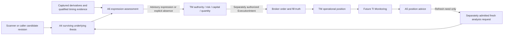
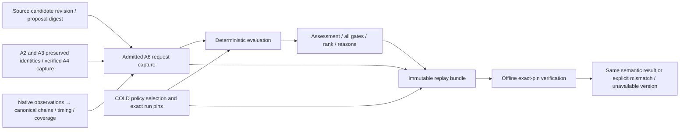

# TIAF A6 — Trade Expression Intelligence Architecture

## Status and authority

2026-09-13, Asia/Kolkata. **ARCHITECTURE ACCEPTED / THESIS ACCEPTED AS
NON-NORMATIVE COMPANION / A6.1 ACTIVE / NEXT. A6 runtime:
NOT_IMPLEMENTED. A5: FROZEN. R1–R5: ACCEPTED / DONE.**

This is a reconciled design proposal, not an implementation acceptance or a
published capability. Inherited system boundaries remain authoritative; the
new A6 choices below were independently accepted in the
[architecture acceptance](TIAF_A6_TRADE_EXPRESSION_INTELLIGENCE_ARCHITECTURE_ACCEPTANCE.md).
The completed
non-normative thesis and all fourteen findings have been reconciled in the
[finding decision record](TIAF_A6_THESIS_ARCHITECTURE_RECONCILIATION.md).
Accepted does not mean implemented or frozen. The gated sequence is now:

```text
architecture accepted → A6.1 contracts/admission/policy foundation
```

See the [source/reconciliation record](TIAF_A6_RECONCILIATION_RECORD.md) and
[bounded roadmap](TIAF_A6_DETAILED_ROADMAP.md). Package version `0.1.0`, existing
contract schema version `1.0`, future A6 schema versions, capability version,
policy version and composition identity are separate concepts. No existing
schema or frozen milestone is changed by this document.

## 1. What A6 means to a trader

Given an admitted thesis and captured market/derivatives evidence, A6 asks:
**“Which supported, non-executable option expression fits this thesis and its
intended duration, if any?”** A positive underlying view can legitimately yield
no option trade. Suitable means satisfying the declared engineering policy
within the captured, bounded universe; it does not mean profitable, cheapest,
globally optimal, authorized to trade, or likely to win.



**THESIS ≠ EXPRESSION ≠ EXECUTION.** A4 owns thesis validity; A6 owns expression
suitability; TM owns permission, account context, risk/capital, final quantity,
action-time validation and execution decisions. A6 never calls a broker.

| Object / decision | Owner | A6 treatment |
| --- | --- | --- |
| Source Candidate revision and optional nested `proposed_expression` | Scanner / originating source | Read-only provenance; preserve revision and proposal digest. |
| A2 benchmark, A3 specialist opinions, A4 primary/counter-thesis | Their existing TI layers | Preserve fingerprints, dissent and vetoes; no recalculation. |
| A6 request / admitted evidence snapshot | Governed application capture boundary | Validate immutable input; no acquisition in evaluator. |
| Analytical TradeExpression candidate and assessment | A6 | New immutable analysis, never an edit to the source proposal. |
| TradeIntent | No mandatory new aggregate in accepted ecosystem | Do not introduce it as a required bridge. |
| ExecutionIntent, sizing, account capital, order tactics | TM | Never emitted by A6. |
| Orders, fills and broker position facts | Broker; TM reconciles operational state | Never synthesized by A6. |
| A5 advice / `EXPRESSION_REFRESH_REQUIRED` | A5 | Optional refresh lineage, not permission to roll or transact. |

TI_REQUIRED requires acceptable, sufficiently fresh TI analysis under TM policy;
TI_OPTIONAL is a separately authorized independent TM strategy route marked
NOT_TI_VALIDATED. Neither converts an unfavorable TI result into an outage nor
bypasses a veto. Manual adoption and non-option workflows need not invoke A6.

## 2. Reconciliation matrix

Source IDs refer to the [inspected-source inventory](TIAF_A6_RECONCILIATION_RECORD.md#inspected-source-inventory).
“Required” means required for the proposed v1, not delivered today.

| Topic | Classification | Prior sources / statement | Compatibility or conflict | Final resolution in this draft | Owner | Required? |
| --- | --- | --- | --- | --- | --- | --- |
| Thesis / expression / execution | ALREADY_DECIDED | S02, S06–S08: separate owners | Compatible | A4 thesis, A6 advisory expression, TM execution | TI / TM | Yes |
| Source proposal vs TI expression | ALREADY_DECIDED | S02: nested source proposal, immutable TI assessment | Compatible | Preserve source revision/digest; no mandatory TradeIntent | Source / A6 | Yes |
| Initial single-leg CE/PE | ALREADY_DECIDED | S02, S03: bounded initial expression | Compatible | Preserve initial single-leg scope | A6 | Yes |
| Long versus short / venue | NEW_A6_DECISION_REQUIRED | S02 leaves exact initial instruments open | New bounded choice | Long CE/PE only, captured eligible NSE equity/index options | A6 | Yes |
| Broad strategy library | NEEDS_RECONCILIATION | S01 capability map places many strategies under option intelligence | Broader than initial scope | Long call/put only in v1; all other templates separately deferred | Future strategy work | No |
| Legacy `OptionExpression` | NEEDS_RECONCILIATION | S12: optional scores, quotes, rationale; no selector | Not an A6 decision contract | Add distinct versioned A6 request/candidate/result; preserve A0 | A6 | Yes |
| SigmaDSL | OUT_OF_SCOPE | S01 DEF-025 historically revisited at A6 closure | Implied prerequisite conflicts with current direction | No DSL dependency, interpreter or compatibility layer; separate future SigmaTrader review | Future separate product | No |
| Eligibility and A4 direction | NEEDS_RECONCILIATION | S06 / S12: A4 direction is string sourced from A2 | Not a CE/PE enum | Closed POSITIVE/NEGATIVE admission mapping; unknown/neutral cannot select | A6 admission | Yes |
| Request and result types | NEW_A6_DECISION_REQUIRED | S02 has conceptual TradeExpression only | Additive detail needed | Typed immutable models and separate operational failure | A6 | Yes |
| Strike geometry | NEEDS_RECONCILIATION | S04: A2.7 nearest listed ATM and symmetric feature window | Feature window is not selection | Reuse factual tie rule; separately bound ATM/ITM1/OTM1 selection | A6 | Yes |
| Exact expiry/horizon fit | NEEDS_RECONCILIATION | S04: date-only expiry and flexible Horizon | Date cannot prove expiration instant | Require explicit target and sourced expiration instant; do not invent time/calendar | Capture / A6 | Yes |
| Quote freshness | NEEDS_RECONCILIATION | S04, DEF-014: Dhan chain time may be acquisition-only | Acquisition is not market event time | Preserve both; conservative default requires qualified quote time | Capture / A6 | Yes |
| Liquidity thresholds and ranking | NEW_A6_DECISION_REQUIRED | S03 lists dimensions, not numeric policy | New engineering baseline | Versioned gates plus lexicographic ranking, no tuned weights | A6 policy | Yes |
| IV, Greeks and premium | NEEDS_RECONCILIATION | S03/S04 mention IV/theta/delta, uncertain source units | Facts do not prove fair value or expected move | Optional qualified context; no Greek calculation, forecast or IV normalization guess | A6 | Yes |
| Event risk | NEW_A6_DECISION_REQUIRED | S05 supplies qualified event/news evidence | Unknown coverage differs from no event | Known material event → wait; unknown explicitly retained | A6 policy | Yes |
| A3 / A4 preservation | ALREADY_DECIDED | S05/S06: specialists do not choose contracts | Compatible | A6 consumes admission, does not become another specialist or arbitrate again | A3 / A4 / A6 | Yes |
| A5 refresh | ALREADY_DECIDED | S07: refresh intent only | Compatible | New governed successor analysis; never automatic roll | A5 / caller / TM | Seam only |
| A7 overlay | EXPLICITLY_DEFERRED | S03: deterministic A6 before forecast-enhanced follow-up | Compatible | No calibrated POP, expected move, utility or required A7 runtime | A7 / later A6 | No |
| Monitoring / sector / qualification | ALREADY_DECIDED | S08: distinct future capabilities | Compatible | Acyclic versioned inputs/consumers, no scheduler in A6 | Future separate layers | Seam only |
| R1 scope / R2 discovery | ALREADY_DECIDED | S09: absence explicit, descriptors honest | Compatible | No silent gate removal; publish only after callable implementation | A6 / facade | Yes |
| R3 composition schema reuse | NEEDS_RECONCILIATION | S09: existing envelope is A3.8-shaped | Not a generic A6 run model | Add A6-specific pins following R3 semantics; preserve upstream envelope | A6 / replay | Yes |
| R4 imports / R5 ownership | ALREADY_DECIDED | S09: lazy optional adapters, one trusted COLD owner | Compatible | Pure core; policy selected by existing owner, not caller | Core / bootstrap | Yes |
| R5 A6 policy config field | NEW_A6_DECISION_REQUIRED | S09: current config has no expression policy selection | Future additive schema needed | Explicit versioned extension only in facade slice; retain legacy config behavior | Bootstrap | Later v1 slice |
| Public capability / Shell | NEW_A6_DECISION_REQUIRED | S10: eight implemented operations, logical artifacts | Ninth operation is not implemented | Recommend `expression.assess`, typed artifact command; no advertised readiness yet | Facade / Shell | Later v1 slice |
| NLP / full Web experience | EXPLICITLY_DEFERRED | S10: interaction above common typed contracts | Compatible | Future translators call same facade, not providers or private evaluator | Interaction layer | No |
| Replay / provenance | ALREADY_DECIDED | S09/S11: exact capture, pinned verification | Compatible | Captured-only replay and explicit version-unavailable refusal | A6 / replay | Yes |

## 3. Bounded v1 and explicit exclusions

The proposed v1 supports one underlying, one admitted directional thesis and
one requested horizon per run. It evaluates **buy-to-open analytical long CE or
long PE expressions** on captured, explicitly eligible NSE equity/index option
contracts. NSE is a deliberate initial venue bound, not a statement that other
venues lack options. Do not hard-code a symbol allowlist or infer eligibility
from a familiar company name. Current instrument metadata must support the
venue, instrument kind, underlying, expiry, strike and option side.

Excluded: option writing, covered/naked shorts, multi-leg spreads, straddles,
strangles, calendars, diagonals, ratios, condors, butterflies, futures/cash
optimization, hedging/rolling actions, margin optimization, strategy synthesis,
account sizing, quantities to trade, targets/stops, order types, limit-price
instructions, routing and execution tactics. A contract lot-size reference is
not a quantity recommendation. A quoted ask is evidence, not an order price.

SigmaDSL is **not part of TI A6 v1**. No parser/compiler/runtime, rule DSL or
SigmaDSL compatibility layer is required. Native typed policies suffice. A
future separate SigmaTrader programmable strategy product may consume TI via
accepted interfaces; it cannot become an implicit dependency of deterministic
A6. Historical DEF-025 entries remain history, not an A6 completion gate.

## 4. Typed boundary and immutable models

These are proposed schemas, not existing Python classes or runnable examples.
All contract collections are tuples internally, accept list/JSON-array input,
and serialize to JSON arrays. Models are frozen, reject unknown fields and
naive datetimes, accept aware input from other zones and normalize using
`ZoneInfo("Asia/Kolkata")`; ISO JSON emits `+05:30`. No naive `datetime.now()`
or manual offset arithmetic. Extensible metadata need not be deeply immutable,
but no gate/rank/identity may depend on untyped mutable metadata.

### 4.1 Request: intent is separate from evidence and policy

| Proposed model / fields | Meaning and constraints |
| --- | --- |
| `TradeExpressionRequest`: schema ID/version, request ID, subject, objective, `as_of`, intent, admitted-input references, optional source/refresh references | One analytical request; no account/order/provider handles or filesystem paths. |
| `ExpressionIntent`: `style` (DAY/POSITIONAL), `direction_constraint`, `Horizon`, `intended_exit_at`, allowed strike preferences, optional per-unit premium cap, optional event-clear requirement | Caller preferences only; cannot establish a thesis, extend upstream validity or weaken policy. Direction constraint is optional BULLISH/BEARISH and must agree with admission. |
| `AdmittedExpressionInputs`: verified A4 capture, retained A2/A3 parent identities, one declared derivative-universe capture, optional admitted events | Supplied facts, not URLs or instructions to fetch them. All subjects, cutoffs and horizons must reconcile. |
| `ExpressionUniverseCapture`: expiry-list evidence, declared expiry chains, exact expiry timing facts, quote-time qualification, instrument metadata and coverage manifest | Additive wrapper; normal evaluation declares one-to-three chains. Explicit confirmed-empty/unavailable variants follow §6.2; no change to A1 or A2.7 semantics. |
| `SelectedExpressionPolicy`: ID/version/content digest, evaluator and normalizer pins | Trusted runtime selection, never a caller-provided policy object. Request can name an allowed profile preference, not arbitrary thresholds. |

The pure evaluator takes admitted request + immutable captured inputs + selected
policy. The future public facade takes one logical request-artifact reference.
Checksums, authority, subject and source relationships are validated before
evaluation. A caller's bullish request cannot manufacture A4 SUPPORTIVE.

The existing `Horizon` is a flexible model (`label`, `min_days`, `max_days`,
`hard_end_at`), not a DAY/POSITIONAL enum. A6 admission adds a closed style
DAY/POSITIONAL plus explicit `intended_exit_at`. Label-only “3w” is insufficient
at the core boundary. An interaction translator may later expand it to exactly
21 calendar days and show the resulting target for confirmation; it may not
silently assume trading days. Explicit duration must satisfy all supplied
bounds and the upstream objective/horizon. `hard_end_at` is an upper bound, not
permission to override an earlier explicit target. DAY additionally requires a
captured, sourced session interval containing `as_of` and the intended exit.
No holiday engine, nearest weekday inference or manufactured session-close time.

Canonical duration is `intended_exit_at - as_of` in exact elapsed units and must
be positive. `Horizon.label` is descriptive, never executable syntax. In this
baseline `min_days`/`max_days` constrain elapsed 24-hour days; the inclusive
90-day bound does not mean 90 market sessions. Intraday maps to DAY only with
the sourced session. BTST, short positional and multi-week labels must resolve
to POSITIONAL plus an explicit target, never a guessed next trading day.
Ambiguous calendar/session language is resolved or refused by the adapter before
invocation. Explicit typed requests need no confirmation inside A6. Inconsistent
typed bounds are validation errors; a well-formed target outside the selected
v1 policy horizon bound yields UNSUPPORTED.

### 4.2 Candidate and evaluation

| Proposed model / fields | Meaning |
| --- | --- |
| `TradeExpressionCandidate`: candidate ID, neutral underlying/exchange/segment/instrument identity, admitted thesis direction, LONG, CE/PE, expiry date and timing reference, strike, ATM/ITM1/OTM1, optional lot-size reference | A supported listed contract, not an executable instruction. Stable ID hashes neutral contract identity, not provider ticker aliases. |
| `ExpressionCandidateEvaluation`: candidate ID, `as_of`, spot/premium snapshot references, optional admitted IV/Greek references, spread, timing fit, gates, reasons, uncertainties, invalidations, eligibility, rank key, policy/evidence refs and semantic fingerprint | Every measured value carries evidence attribution; FAIL and UNKNOWN remain distinct. Candidate-level facts belong here, separate from stable contract identity. |
| Gate assessment | Gate ID, PASS/FAIL/UNKNOWN, measured value + units if any, threshold + policy reference, evidence references and closed reason codes. |

Retain the original provider observation identifiers and provider-native security
IDs in evidence lineage, not as downstream canonical symbols or ranking keys.
Existing A0 `OptionExpression` remains a data-only legacy contract. Its optional
`liquidity_score` / `suitability_score` do not define A6 policy. A source proposal
using it is untrusted candidate input until validated; no retrofit of A0 needed.

### 4.3 Assessment and run

`TradeExpressionAssessment` contains schema/result identity, subject, admitted
direction and resolved horizon, evaluation cutoff, disposition, preferred
candidate ID or absence, up to two eligible alternative IDs, all bounded
candidate evaluations, rejected/not-selected reasons, coverage/gaps,
contradictions, invalidation conditions, original A4 disposition/parent
fingerprints, policy and composition identities, advisory-only boundary and
semantic fingerprint. An eligible but lower-ranked candidate is NOT rejected.

The shortlist is a **normative v1 schema bound**, not freely configurable output
size: exactly one preferred when AVAILABLE, then the next
`min(2, eligible_count - 1)` candidates. Other dispositions have neither preferred
nor alternatives. All bounded evaluations remain captured. A screen may collapse
rows but cannot change the canonical shortlist. Increasing the bound requires a
separately versioned schema/architecture decision.

An `ExpressionRunRecord` wraps request/input digests, assessment, exact pins,
known-zero A6 usage, operational result and capture checksums. Transport denial,
unsupported schema, malformed contracts, tampered capture and verifier-version
unavailability are **operational failures**, not a fabricated market NO_TRADE.
No analysis disposition is returned for failed integrity/admission execution.
Upstream usage remains recorded unchanged; A6's own model/provider usage is zero.

## 5. Admission, disposition and precedence

| Primary disposition | Meaning |
| --- | --- |
| `EXPRESSION_AVAILABLE` | At least one supported candidate passes every required gate, with sufficient scoped coverage to rank. Not approval to enter. |
| `NO_OPTION_TRADE` | Complete scoped facts show none qualifies, or the separately identified upstream prohibition branch prevents evaluation. Never claim the universe was evaluated when admission blocked it. |
| `WAIT_FOR_EXPRESSION` | Known temporary upstream/event constraint; no preferred expression. A future run needs fresh admission, not automatic retry. |
| `INSUFFICIENT_EVIDENCE` | Required facts, timing qualification or scoped coverage are missing/stale/ambiguous. |
| `UNSUPPORTED` | Well-formed request asks for a venue, structure or style outside v1. |

Priority after operational validation: (1) preserve A2 NO_TRADE and A4
NO_TRADE/AVOID as `NO_OPTION_TRADE`; (2) explicit unsupported request shape;
(3) upstream WAIT or CONFLICTED → `WAIT_FOR_EXPRESSION`, retaining the original
state and dissent; (4) A4 ABSTAIN/INSUFFICIENT_EVIDENCE, missing/partial/failed
upstream analysis, stale admission or unresolved direction → insufficient;
(5) known admitted material event in the holding window → wait; (6) any
required unknown in the declared selection window → insufficient;
(7) no eligible candidates with complete facts → no option trade; otherwise
rank eligible candidates → expression available. Preserve all inspected reasons;
never allow a lower-priority condition to erase an upstream prohibition.

Eligible upstream analysis requires intact A4 capture, COMPLETE execution,
SUPPORTIVE disposition, a surviving SUPPORTED primary thesis and resolvable
direction. A4's `directional_interpretation` currently comes from A2's
`original_a2_direction`: exact `POSITIVE` maps to BULLISH/CE, `NEGATIVE` to
BEARISH/PE. `NEUTRAL`, `CONFLICTED`, missing or unrecognized prose cannot be
guessed into a side. No NLP interpretation inside admission. A contradictory
caller direction or incompatible subject/horizon is a request-validation error.

The A4 capture's projection `evidence_as_of`, not merely run `evaluated_at`,
controls age. Individual required upstream evidence must retain its own
qualification; an A4 projection timestamp does not refresh older facts.
A6 never reruns A2 scoring, A3 specialists, A4 challenges or A5 assessment.

WAIT is a recorded known temporary admission/event blocker, never generic data
retry or guaranteed eventual viability. Unknown/stale time yields insufficient,
not WAIT. Retain canonical names EXPRESSION_AVAILABLE and WAIT_FOR_EXPRESSION;
UI shorthand AVAILABLE/WAIT is not a second enum. Upstream veto/wait branches
record `selection_not_run` and the decisive reason, not fabricated candidate
failures. Operational validation still precedes analytical dispositions.

## 6. Deterministic candidate universe and policy baseline

The following are **new, provisional engineering defaults**, not calibrated
trading advice, empirical optimal values, exchange rules or values fitted to
RELIANCE/HDFCBANK/KAYNES. The thesis reviewed their consequences. Any later change
requires policy versioning and recorded comparison, not silent live tuning.

Architecture fixes evidence meanings, gate relationships, inequalities and
ranking order. Concrete ages, cushions, spread cutoffs and horizon limits belong
to the exact COLD-selected versioned policy/profile, not domain-schema literals.
The table retains the **existing draft baseline values unchanged for independent
acceptance**. No thesis number becomes an invariant or empirical safety guarantee.
Unavailable policy pins are operational failures, not permission to use current
defaults. Later reviewed numeric changes within schema bounds require new policy
identity; replacing market-age semantics or adding ranking criteria needs design
review, not just another number. No arbitrary request threshold overrides.

| Draft policy `deterministic-long-option/1.0-draft` | Default and meaning |
| --- | --- |
| Universe | One subject; at most three declared expiry chains, at most 512 listed strikes each; at most nine selected contracts (three per expiry). Over-bound captures are refused, not silently truncated. |
| Scope declaration | Capture identifies considered expiries, exclusion reasons and list coverage. Ranking claims only this declared universe; never “best across all listed options.” |
| Strike selection | Nearest listed ATM; one listed step ITM and OTM for the admitted side. No generated strikes or delta-target search. |
| Holding target | Explicit future instant; DAY must fit supplied session; POSITIONAL maximum 90 calendar days for this bounded baseline. |
| Expiry cushion after target | DAY ≥ 24 hours; POSITIONAL ≥ 72 hours. Excludes zero-day expiry expressions in v1 by policy, not exchange semantics. |
| Upstream maximum evidence age | DAY 15 minutes; POSITIONAL 24 hours, plus retained required-source freshness qualifications. |
| Quotes / underlying reference age | Qualified market observation no older than 60 seconds at request `as_of`; acquisition age alone cannot prove this. No future-dated observation. |
| Quote validity / depth | Finite `ask ≥ bid > 0`, positive captured bid and ask quantities. Missing required values → UNKNOWN; known zero depth → FAIL. |
| Relative spread | `10000 × (ask-bid) / ((ask+bid)/2)` basis points; maximum 500 bps. Zero spread is valid. |
| Spread tier for ranking | Tier 0 ≤ 100 bps; tier 1 > 100 and ≤ 500 bps. Neither tier estimates fill probability. |
| Moneyness preference | ATM, ITM1, OTM1 by default. Caller may restrict or reorder this closed set; cannot admit unsupported strikes. |
| Per-unit premium cap | Optional explicit currency/amount; compare captured ask, not lot/account cost. Absence means no affordability conclusion. |
| Events | Known admitted material event during `(as_of, intended_exit_at]` blocks selection with WAIT. Unknown coverage is disclosed; event-clear request additionally requires complete qualified coverage. |
| Output bound | One preferred + at most two eligible alternatives; preserve evaluations/reasons for all ≤ 9 candidates. |

### 6.1 Strike and coverage algorithm

Validate unique, ordered listed strikes and neutral contract identities before
selection. ATM minimizes absolute distance from the qualified chain underlying
price; exact tie chooses the lower listed strike, matching A2.7's factual rule.
For CE, the lower neighboring strike is ITM1 and higher is OTM1; for PE reverse
them. Irregular spacing uses actual list neighbors, not invented step sizes.
Each expiry uses its own qualified reference; sources and times remain visible.

ATM/ITM1/OTM1 are selection-neighborhood labels. Between listed strikes the ATM
anchor may have nonzero intrinsic moneyness. Economic CE/PE moneyness, if shown,
is a separately attributed spot/strike comparison, never delta. No invented
strike intervals or out-of-window contracts enter through preference labels.

The capture must distinguish a confirmed unlisted neighbor/side from unavailable
data. Proven unlisted slot is a recorded exclusion; an unknown expected slot is
insufficient evidence. A2.7's complete symmetric feature window is unchanged:
A6's selection window is a separate algorithm over captured chain facts. Values
outside the declared three-strike window cannot silently enter ranking.

All considered expiry chains and required selected slots must have complete
hard-gate evidence before announcing a preferred candidate; an unknown rival
could otherwise have outranked it. This deliberately conservative default may
withhold an otherwise valid-looking contract. Record evaluated valid candidates
as provisional only, with no preferred/alternative recommendation. A future
partial-ranking policy would require explicit review/versioning.

**TF-05 decision: DEFER.** A proved horizon failure plus an unknown required
quote still leaves full-window coverage insufficient, even if another expiry
has a valid candidate. This is not the upstream prohibition short-circuit in §5.
Candidate gates have a stable reporting order: identity/membership, timing
qualification/freshness, horizon fit, quote geometry, top depth, spread, requested
premium cap. Record every evaluable gate and UNKNOWN dependency without invented
operands. Applicable admission/event gates precede this stage. Caching or shared
arithmetic is allowed only with identical complete gate/reason output and semantic
fingerprints; omitting evidence is not a semantic-preserving optimization.

### 6.2 Expiry and timing

Validate the captured expiry list and each declared expiry's membership. Select
only from explicitly declared one-to-three expiries; expose every omitted expiry
and scope limitation. A complete empty horizon-fitting scope can yield
NO_OPTION_TRADE; an unavailable list/chain cannot establish absence.

The additive wrapper distinguishes normal, confirmed-empty and unavailable/
partial scope, with completeness, subject, cutoff, source and evidence refs.
Confirmed-empty expiry-list scope may have zero chains/candidates; after prior
admission/event gates it yields NO_OPTION_TRADE / NO_LISTED_EXPIRIES_IN_SCOPE.
Proof must cover the declared supported scope, not just an empty response.
Unavailable scope may also contain zero chains but yields insufficient. Normal
scope declares one-to-three expiry identities; a missing expected chain is an
explicit gap, never dropped from the declaration. Over-bound input is refused.
An empty *fitting* subset of nonempty scope is obtained only by full required-slot
evaluation, not prefiltering failed expiries to avoid missing quotes. Existing A1
`ExpiryListSnapshot` forces an empty list to UNAVAILABLE and cannot prove the
new confirmed-empty variant. Preserve that contract; positive absence needs
separately admitted provider-neutral proof. This additive representation resolves
TF-11 and does not adopt TF-05.

For each expiry, `expiration_at - intended_exit_at` must meet the style cushion.
Expiration instant must be an attributable captured timing fact, not midnight
constructed from `date`, hard-coded exchange close or manual calendar arithmetic.
The current A1 expiry date and A2 calendar days-to-expiry alone are inadequate
for this gate. No calendar engine is added or DEF-007 declared complete.

Expiration instant and last trading cutoff are distinct facts, not aliases.
The retained v1 residual-life gate uses contract expiration; it **does not certify
an executable exit up to that instant**. Preserve a supplied trading cutoff with
its source/scope as context; missing cutoff is disclosed, not filled from expiry.
No new cutoff gate or exchange-hours policy is implied by this reconciliation.
A future exit-tradability screening profile would require a separately accepted
timing gate. TM owns action-time tradability, cutoffs and contract availability.

Nearest/most liquid expiry cannot override this fit test. A thesis requiring
three weeks does not become a one-day thesis because a near-expiry chain looks
better. Earliest expiry is only a later tie-breaker among already suitable ones.
If sufficient facts prove all declared expiries too short, return NO_OPTION_TRADE
with horizon mismatch, not INSUFFICIENT_EVIDENCE and not a substituted horizon.

Weekly/monthly series labels are optional admitted reference metadata, never
guessed from weekdays, spacing or familiar symbols. v1 has no weekly/monthly
ranking bonus: actual expiry instant, liquidity and residual life govern. This
uses time cushion as a declared constraint, not a computed theta-loss model.
BTST/very-short requests need an explicit target under POSITIONAL semantics;
ambiguous labels require resolution before admission. Targets beyond the
90-calendar-day v1 bound produce UNSUPPORTED / HORIZON_OUTSIDE_V1, not a silently
shortened holding period.

### 6.3 Liquidity, freshness and semantic gaps

Keep exchange/market observation time, acquisition time and evaluation cutoff
distinct. Existing Dhan chain `observed_at` may be acquisition-only (DEF-014).
A supplementary typed quote-time qualification must carry source, basis and
evidence reference; merely relabeling existing time is prohibited. **The current
date-only/acquisition-only Dhan capture by itself cannot produce
EXPRESSION_AVAILABLE under this draft strict policy.** It can be assessed as
insufficient. Establishing a real timing source or approving a separately named
acquisition-qualified policy is an explicit later acceptance decision, not
something a connector may guess. The default remains strict in this draft.

| Timing concept | Normative meaning / permitted derivation |
| --- | --- |
| Market observation / event time | Fact-specific qualified instant, source, basis, subject and evidence ref. Never receipt time. A scheduled future event known before cutoff is not a future quote observation. |
| Acquisition / availability time | Evidence was available to TI by cutoff; later serialization cannot backdate knowledge. |
| Quote freshness time | Derived age = cutoff minus qualified market observation, separately for required quote/top-book and spot. No latest-timestamp substitution. |
| Evaluation cutoff | Immutable `as_of`, not renderer/replay wall time. Market observation must not exceed it. |
| Expiry date | Calendar identity, not midnight or exchange-close authority. |
| Expiration / trading cutoff | Distinct source-qualified meanings under §6.2; expiration supports residual life, not inferred exit tradability. |
| Timezone | Aware inputs normalized with ZoneInfo("Asia/Kolkata"), JSON +05:30. Conversion preserves an instant, not source authority. |

Derive only exact age, residual life and cushion excess from qualified operands.
Missing/ambiguous operands are UNKNOWN. Age at the maximum passes; above it is
stale/UNKNOWN. Insufficient residual life from qualified facts is FAIL. Capture
qualification binds to contract/field and records provenance and method/version
for any source-approved derivation. No exchange calendar, new live source or
acquisition-qualified fallback is approved here. Source feasibility is a
data-contract prerequisite, not permission to change frozen A1 time semantics.

Missing/crossed/zero-placeholder quotes, stale time, ambiguous currency or unit
basis, unavailable instrument eligibility and incomplete expected slots remain
explicit. Zero OI and volume are legitimate factual values; neither is treated
as absent. They are contextual in v1, not invented liquidity scores or hidden
thresholds. Positive top quantities only demonstrate observed top-book presence,
not executable depth, lot sufficiency or fill guarantees. Known invalid quote
geometry is FAIL; absent quote evidence is UNKNOWN. A stale existing quote is
UNKNOWN for current suitability, never proof of current illiquidity.

Required baseline evidence: instrument/spot/quote identity and qualified timing,
bid/ask with known currency/units, positive top quantities, expiration fit and
scoped coverage. Spread above the maximum rejects; a worse eligible tier only
changes lexicographic priority, never a weighted penalty. In the retained draft,
100 bps stays tier 0, above 100 through 500 is tier 1. Explain the intentional
discontinuity as policy ordering, not a measured expected-return discontinuity.
Volume, OI, LTP, full-depth ladders and qualified IV/Greeks are optional context;
absence is disclosed, zero retained, none replaces required top-book facts.
Premium cap and complete event-clear coverage are request-dependent requirements.
Any later profile-dependent OI/volume/depth minimum needs explicit versioned
acceptance; it is not a hidden gate in this baseline.

### 6.4 IV, premium, Greeks and events

No A7 forecast, POP, expected move, Black–Scholes calculation, synthetic delta,
theta estimate, fair-value claim or IV surface is required or emitted. Preserve
supplied IV/Greek units, semantics and evidence. Uncertain source semantics stay
PROVIDER_DEFINED/AMBIGUOUS; missing optional IV/Greeks is a disclosed gap, not
an automatic failure. Raw Dhan percentage-like IV is not silently divided by
100. Delta bands, term-structure optimization and IV-percentile regimes remain
deferred. A straddle price is not an expected move.

Already captured, correctly qualified skew, IV rank/percentile or A2 ATR may be
shown as informational evidence with source/method/as-of. v1 neither calculates
these nor ranks on them; ATR is historical range context, not a forecast of
remaining move. Even a separately supplied expected-move forecast is not used
for v1 eligibility or ranking: it belongs to a separately accepted A7-informed
overlay that retains the deterministic A6 result as its visible control.

Premium context reports bid/ask/LTP, currency, spread and optional ask-to-spot
ratio with explicit same-unit provenance. LTP is not a replacement for bid/ask.
No “cheap,” “expensive,” payoff probability or attractiveness score is inferred
from a small premium. A request cap only limits per-unit premium at the captured
ask, not capital allocation. TM rechecks all actionable values later.

Only already admitted, attributable event facts are consumed; A6 performs no
news search or model classification. Preserve event identity, materiality basis,
effective/scheduled time, acquisition time, uncertainty and source authority.
Unknown events are not “no events.” A known blocking event remains visible even
if the caller does not request event-clear screening; complete event coverage
is an additional hard requirement only when that screening is requested.

Materiality and subject relevance must be admitted upstream classifications with
source/rule refs, not A6 judgments over prose. Event-clear proof covers the whole
`(as_of, intended_exit_at]` interval for the declared subject/material categories,
with source scope, availability and completeness basis. No returned events alone
proves no events. An exact material event at exit is inside; at cutoff is outside.
Unresolved timing of an admitted relevant material event that could intersect
the interval is UNKNOWN/insufficient, even in default mode; do not invent an
instant to produce WAIT. Similarly unresolved relevant materiality is insufficient
when it could change the gate. Uncertain time proven wholly outside does not
block. General unknown broad coverage alone remains a disclosed optional gap
in default mode. No pre/post-event adjacency buffer is inferred; any future
buffer requires versioned policy and qualified operands. §5 precedence applies.

## 7. Ranking, explanation and invalidation

Apply hard gates before preferences. For eligible candidates sort ascending by:

```text
(spread_tier, requested_moneyness_rank, expiry_cushion_excess_seconds,
 exact_spread_bps, canonical_contract_key)
```

Canonical key is `(venue, underlying, expiry, normalized strike, option side)`.
It contains no provider display name, dictionary insertion order or runtime ID.
Use finite canonical decimal representations from input strings and exact
duration units; compare spread ratios without display rounding. Specify and
test decimal normalization in A6.1. Display-rounded bps never determine a tie.
No weighted blend, confidence average or hidden “suitability score.”

Every explanation states: admitted thesis/direction, selected universe and its
limits, gate fact versus threshold, passed/failed/unknown reasons, rank tuple,
decisive difference from alternatives, why exclusions/rejections occurred, and
what evidence could change the outcome. Provide stable reason codes plus plain
language; no model-generated embellishment. Do not claim a rejected contract
was safe merely because another contract ranked better.

Validity is a cutoff-bound analytical result, not a tradable lease. Invalidation
conditions include upstream thesis change/veto, quote or underlying expiry of
freshness, new event evidence, universe/instrument revision and changed holding
target. Future action needs separately admitted fresh data and TM validation.

## 8. Adjacent layers and dependency discipline

| Layer | Allowed seam | Prohibited shortcut |
| --- | --- | --- |
| A3 derivatives / risk / opportunity; A4 | Consume preserved evidence and admitted thesis; keep conflict and original benchmark | Recompute/retune A2, rerun specialists, choose side from requested optimism, override A4 |
| A5 | Optional predecessor position/advice reference and refresh reason; new request must independently satisfy A4/evidence gates | Automatic replacement contract, roll, close, sizing or A5→A6 runtime call |
| A7 | Future versioned captured forecast overlay can compare only valid candidates under separately accepted policy | Required A7 dependency, invented probabilities or forecast-validating an invalid contract |
| TI Monitoring | Future consumer of invalidation/refresh metadata; separately admitted successor run | Scheduler, subscriptions, continuous acquisition or trading loop inside A6 |
| Sector Rotation | Optional earlier admitted context, identified version and cutoff | A6 calls sector analysis which calls A6 in the same run |
| Signal Qualification | Optional upstream candidate qualification; A6 still requires A4 admission | Qualification as trade permission or circular self-confirmation |
| TM | Advisory expression IDs, reasons, lineage, validity limitations | ExecutionIntent, account/risk/capital/sizing decisions or broker calls |

These are data dependencies between immutable run versions, not a new cyclic
orchestration framework. A5 refresh may lead the external application to create
a successor A4→A6 run, but no direct A6/A5 import cycle is needed.

The future TM handoff is an allowlisted metadata projection of the assessment,
not a new ExecutionIntent: result/preferred-candidate identity, neutral contract,
source proposal revision, A4 thesis/result reference, `as_of`, timing/freshness
requirements, policy/profile identity, invalidations, fingerprint and
`executable=false`. No preferred candidate means no proposed contract handoff.
TM independently checks account, permissions, capital, risk, final quantity,
current contract availability/quotes, operational position state and action-time
freshness before constructing its own execution intent. A complete A6 result
cannot satisfy those checks by itself.

## 9. R1–R5, facade and interaction

| Baseline | Concrete A6 obligation |
| --- | --- |
| R1 required scope | Required admission/gates independent of available adapters. Missing provider, scope or timing data stays explicit; never shrink required scope to make selection pass. A6 is not a tenth A3 specialist. |
| R2 metadata | Recommend capability `expression.assess`, dedicated future `ASSESS_EXPRESSION` authority scope, request/result schema identities, CAPTURED_READ facade effect, known-zero external cost, bounded inputs and replay metadata. Descriptor is not authority or readiness. Current eight operations remain unchanged until publication. |
| R3 exact pins | New additive A6 run-composition record pins evaluator, selection/ranking policy, normalizer/schema and authority/profile references plus immutable upstream capture identity. Existing A3.8 CompositionEnvelope is not reused as if it already modeled A6. |
| R4 isolation | Core A6 contracts/evaluator import no Dhan/Yahoo/Tapetide/MCP/model/broker SDK or optional adapter. Existing trusted acquisition roots supply captured evidence. Core-only environment must still import and replay A6. |
| R5 COLD owner | Existing ColdRuntimeOwner alone selects reviewed expression policy/catalog at startup. No second composition root, caller policy object, HOT swapping or new environment override. Future explicit-config extension is additive/versioned; legacy 1.0 config remains readable with documented default selection. |

Runtime-selected does not mean authorized. Admission intersects caller grants,
operator policy, profile, subject/artifact entitlement, requested authority,
budget and revocation state. Logical artifacts are reread and rechecked after
admission. Public request carries `expression_request_ref`, never paths, raw
provider/router objects, account selectors, credentials or mutable stores.
`expression.assess` is recommended over `trade_expression.assess` for concise
consistency with `position.assess`; do not publish both aliases in v1.

The proposed descriptor semantic role is `TRADE_EXPRESSION_INTELLIGENCE` and
monitoring eligibility is `MONITORING_FUTURE`, not a running subscription. Required
dependencies describe admitted A4/captured-derivatives contracts and policy pins,
not named providers. Keep readiness `REQUIRES_RUNTIME_CHECK`; descriptor-level
pluggability remains STRUCTURAL unless the later publication slice demonstrates
stronger per-capability semantics. COLD owner selection alone does not rewrite
all descriptors as COLD. These role/scope additions need additive schema support
and tests in A6.3; they are not values already published by the current registry.

COLD-configurable selection is the reviewed policy/profile ID and exact version,
which jointly fix gates, bounds and ranking rules. The default is the sole
accepted baseline once that baseline is approved; no arbitrary numeric threshold
overrides are exposed. Request-level choices are subject, resolved holding
target, a consistent direction constraint, closed moneyness preferences,
per-unit premium cap and stricter event-clear screening. Effective constraints
are the intersection of request restrictions and the selected policy. None
changes the COLD binding or grants capability access.

Moneyness choices are nonempty and duplicate-free; restrictions remove choices
explicitly and ordering supplies preference rank, below hard gates/spread tier.
Cheapest-premium and longest-expiry ranking are unsupported v1 preferences, not
aliases for OTM or a changed target. Language adapters clarify or decline before
invocation; strict typed schemas reject unknown preference fields, never drop
them. A cap is not cheapest-first. A longer holding target requires fresh upstream
admission and is not a trick to implement longest-expiry preference.

Confirmation belongs above A6: preserve original intent plus normalized request
in interaction provenance; resolve ambiguous subject, direction, calendar versus
sessions, target, cap currency/units and unsupported preferences explicitly.
Never substitute strategy/duration. These are future interaction acceptance
requirements, not an NLP dependency or a core confirmation-field requirement.
Explicit typed CLI/API inputs use ordinary schema validation. Intent confirmation
is not execution consent.

The pure function is PURE internally; public capability is CAPTURED_READ because
it resolves trusted artifacts. Proposed effect and authority remain design-only.
Recorded replay needs no live provider/model or current registry discovery;
deterministic verification requires exact locally available pins and otherwise
refuses explicitly. A policy comparison creates a successor record, not a rewrite.

Future Shell command, **not runnable today**:

```text
expression assess --request artifact:admitted-kaynes-expression-request
```

The artifact contains the explicit subject, directional constraint, resolved
horizon, A4 capture and derivative references. A future convenience form such
as `expression assess KAYNES --direction bullish --horizon 3w` must first obtain
that same admitted request; direction/horizon text alone cannot evaluate.
REPL and one-shot share the same parser/facade. Explain/trace/replay expose the
same canonical result, including absence. Completed NO_OPTION_TRADE is a valid
analysis result, not a transport error. Authorization/integrity failures remain
operational failures under the existing facade/Shell error conventions.

Future plain English, Web UI and API integrations translate into this same typed
request and governed facade. No direct provider or evaluator shortcuts. Full NLP,
conversational memory, rich interactive UX and remote hosting are not A6 v1
prerequisites. Bounded Shell exposure contributes to, but does not by itself
complete, the separately governed TI_SHELL v1.0 gate.

## 10. Replay, audit and fingerprints



Capture exact request, A4 and parent identifiers/digests, full declared expiry
list/chain snapshots and qualification facts, source observations or exact
persisted references, coverage, evaluation cutoff, policy content digest,
normalizer/evaluator versions, candidate window, all gates/rank/reasons and
authority/composition metadata. Each derived field references evidence plus
rule identity. Reference-only capture must resolve to locally persisted,
integrity-checked artifacts; replay never fills a missing file via network.

Separate exact byte checksum from semantic fingerprint. Canonical projections
include meaningful input facts, selected scope, as-of, uncertainty, policies,
gate/rank output and provenance identity; exclude transport latency, formatting,
storage paths, trace IDs and self-fingerprint fields. Define request/input digest
first, candidate IDs from contract identity, assessment fingerprint from the
semantic result without itself, then outer run/capture checksum. No hash cycle.
Acquisition times are evidence semantics, not replaceable replay-time timestamps.
Provider swaps produce new provenance/capture identity even if measured facts
match. Replay uses captured `as_of`, never today's time or today's policy.
Facts used in a gate must have been available/acquired by that cutoff; future
market observations or later-acquired event knowledge cannot leak into the run.
Serialization/capture creation may happen later without changing the factual
availability times or original evaluation cutoff.

Also capture resolved horizon/duration, shortlist, rejected and eligible-not-
selected candidates, invalidations, absence proof/scope gaps, timing meanings
and upstream selection-not-run reasons. UNKNOWN and FAIL both participate in
semantic identity. Rounded display and accessible labels are presentation only;
explain exposes exact operands, inequalities and the first unequal rank key.

## 11. Worked semantic cases — illustrative, not live

All symbols, prices, times, contract availability and eligibility below are
teaching fixtures, **not verified listings or trading recommendations**. Cases
assume complete declared coverage, valid authority, qualified quotes and sourced
expiration times unless the case explicitly removes them. Synthetic instants
use Asia/Kolkata offsets. “Strong” means the supplied surviving thesis, not a new
A6 conviction score.

| Case | Supplied facts / gate proof | Output and ownership |
| --- | --- | --- |
| 1. Bullish KAYNES positional | A4 COMPLETE/SUPPORTIVE, primary SUPPORTED, POSITIVE. `as_of=2026-09-14T10:00:00+05:30`; target 21 calendar days later. Illustrative expiry is four days after target, beating 72-hour cushion. ATM CE bid 99.5 / ask 100.5 = 100 bps; positive depth; quote 10 seconds old. Other required slots captured; this one wins rank. | EXPRESSION_AVAILABLE, long ATM CE. Source owns Candidate, A4 thesis, A6 assessment; TM alone decides whether/what quantity to execute. |
| 2. Bearish index DAY | Synthetic NIFTY A4 NEGATIVE/SUPPORTIVE. Explicit sourced session contains 10:00 evaluation and 14:30 exit. Expiration 48 hours after target ≥ 24-hour cushion. Eligible ATM PE spread 80 bps, positive top depth and fresh facts. | EXPRESSION_AVAILABLE, long PE. No inference that PE itself has positive expected return; no broker operation. |
| 3. Expiry mismatch | Same bullish three-week thesis; complete declared chain set expires one day before target. Quotes otherwise valid. | NO_OPTION_TRADE / HORIZON_EXPIRY_MISMATCH. Do not choose a liquid near expiry or shorten the user's target. |
| 4. Illiquid selected window | Every selected contract has complete observed quotes with spreads 700–900 bps or known zero top depth. | NO_OPTION_TRADE / SPREAD_TOO_WIDE or NO_TOP_DEPTH. Not a bearish thesis and not missing evidence. |
| 5. Stale or unqualified chain | Selected quote is 180 seconds old vs 60-second limit; alternatively only acquisition time is known. | INSUFFICIENT_EVIDENCE / QUOTE_STALE or QUOTE_TIME_UNQUALIFIED; no preferred contract. Old numbers remain visible but do not establish current liquidity. |
| 6. Transparent alternatives | Same eligible expiry: ATM CE spread 90 bps (tier 0, preference 0); ITM1 CE 70 bps (tier 0, preference 1); OTM1 CE 180 bps (tier 1, preference 2). All pass hard gates. | ATM preferred, ITM1 then OTM1 alternatives. ATM wins explicit preference within the same spread tier, not because it has tighter spread. Request preference reversal would create a new run/result. |
| 7. A4 NO_TRADE | Complete attractive-looking chain supplied, but upstream A4 disposition is NO_TRADE. | NO_OPTION_TRADE / UPSTREAM_NO_TRADE; selection short-circuited. A6 cannot “rescue” the thesis with cheap options or invoke TI_OPTIONAL. |
| 8. A5 refresh advisory | Existing position has A5 `EXPRESSION_REFRESH_REQUIRED`. Supplied old A4/chain is no longer valid. | Refresh lineage only. Caller must obtain separately admitted current A4/evidence. Without it, insufficient; even a later valid replacement is not a roll instruction. TM owns any position action. |

Known admitted material events lead to WAIT, not invented sentiment; a caller
requiring event-clear analysis with unknown coverage gets insufficient. A4
CONFLICTED remains visible with WAIT. These complement the eight minimum cases.

## 12. Test architecture and acceptance evidence

Future tests must cover the following without depending on live provider success:

| Category | Required assertions |
| --- | --- |
| Contracts | Tuple/list/JSON round-trip; frozen replacement rejection; aware timezone normalization; naive rejection; strict schema; finite units/decimals; subject/expiry consistency. |
| Upstream | Every A4 disposition/status, A2 veto, supported primary/direction mapping, mismatched horizon/direction, missing/tampered capture; no bypass/recalculation. |
| Universe / strike | Listed membership, irregular spacing, geometric ATM versus intrinsic moneyness, lower ATM ties, CE/PE neighbors; normal one-to-three expiry scope versus zero-chain confirmed-empty proof and unavailable gaps; capture limits, neutral keys. |
| Expiry / horizon | Exact positive elapsed duration and inclusive bounds; cushion equality, date-only refusal, sourced DAY session, expiration versus contextual trading cutoff, zero-day exclusion, all complete mismatches versus missing facts, calendar/session honesty. |
| Liquidity / evidence | Missing/zero/crossed quotes, exact 500-bps boundary, zero volume/OI preservation, depth zero vs absent, stale/acquisition-only/future timestamps, unknown units and events. |
| Optional Greeks / premium | Missing Greeks accepted with gaps; ambiguous IV unchanged; no derived delta/POP; per-unit cap not sizing. |
| Dispositions / rank | No-trade versus wait versus insufficient; known/uncertain event time and full event-clear scope; failed horizon plus unknown quote remains insufficient; hard gates before closed preferences, 100/101 bps tier change, exact ties/shuffled order; shortlist schema bound, not-selected versus rejected. |
| Explainability | Every fact/threshold links to evidence/policy; complete reasons and rank-key differences; no fabricated targets, sentiment or probability. |
| Replay / composition | Exact semantic replay, byte-vs-semantic distinction, tamper/missing artifact failures, unavailable pin refusal, no current-registry fallback, legacy R3/config/captures unchanged. |
| Pluggability / facade | Core-only imports; one COLD owner; policy selection frozen; no caller gate weakening; required scope absence; honest discovery; authority/entitlement/revocation and logical-ref checks. |
| Shell / handoff | REPL/one-shot parity, canonical render/explain/replay, valid no-trade result, operational failures distinct, no quantity/order fields or direct acquisition. |
| Frozen regression | A2 benchmark and A3/A4/A5 fingerprints/results preserved; zero A6 provider/model/broker calls, tokens and cost. |

No live-data check is a substitute for deterministic synthetic boundary tests.
Any later live acceptance is separately authorized, read-only, bounded and may
legitimately return insufficient under strict timing policy.

## 13. Architecture acceptance readiness

The completed **non-normative visual handbook** covers these teaching goals;
they remain review criteria, not implementation permission.
Use diagrams for the owner chain, admission/gate state machine, strike ladder,
expiry target/cushion timeline, evidence-age clocks, ranking ladder, source versus
TI objects, A5 refresh loop, replay lineage, R1–R5 boundaries, TI/TM workspaces
and one-shot/REPL/future plain-English convergence. A compact candidate table
should show facts, PASS/FAIL/UNKNOWN, rank, rejection and missing evidence beside
each contract. Illustrative latency/cost charts must label synthetic values;
zero A6 model calls does not erase upstream acquisition cost.

Carry all eight worked cases into the thesis, especially the attractive thesis
with no suitable expression and the inability of acquisition-only timing to
prove freshness. Explain “best within this captured scope,” expiry date versus
expiration instant, quoted premium versus order price, lot size versus quantity,
UNKNOWN versus FAIL, and advisory refresh versus automatic roll in plain English.

All fourteen findings have decisions in the
[thesis/architecture reconciliation](TIAF_A6_THESIS_ARCHITECTURE_RECONCILIATION.md).
Independent acceptance must confirm strict market time despite current source
limitations; retained versioned numeric defaults; full-window coverage and TF-05
deferral; explicit empty-scope representation; context-only trading-cutoff
treatment; event uncertainty and interaction boundaries. A6.1 must specify/test
qualified timing and absence-proof contracts before A6.2 candidate evaluation.
Actual live source availability remains unproven, not an implied capability.

**Decision: READY_TO_IMPLEMENT_A6_1.** Architecture is accepted, not frozen;
runtime remains NOT_IMPLEMENTED. The thesis is accepted as its non-normative
companion. Next: **TIAF A6.1 — CONTRACTS, ADMISSION & POLICY FOUNDATION**.
