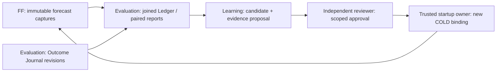

# TIAF A7 — Architecture Acceptance

## 1. Decision and scope

**A7_ARCHITECTURE_ACCEPTED**

Independent review date: **2026-09-15, Asia/Kolkata**.
Verdicts: **31 ACCEPT; seven ACCEPT_WITH_CLARIFICATION; zero HOLD; zero REJECT**.
There is no remaining architecture blocker. This accepts the reconciled design
as the architecture baseline for **implementation sequencing**, not an
implemented milestone, qualified model, approved dataset or deployment.

```text
A6 FROZEN at tiaf-a6-baseline
FF ARCHITECTURE ACCEPTED; FF THESIS RECONCILED
A7 ARCHITECTURE ACCEPTED; A7 THESIS RECONCILED AS NEEDED
A7 / FF IMPLEMENTATION NOT_STARTED; RUNTIME NOT_IMPLEMENTED
FM/LFDE PRESERVED AS ADVANCED FORECASTER FAMILY
NEXT: A7 IMPLEMENTATION SEQUENCING / FF-0 MINIATURE REALIZATION PLAN
```

The acceptance brief supplies this review's scope. Its future implementation,
training, promotion and Git examples are not actions authorized by this pass.
HEAD and `tiaf-a6-baseline^{}` both resolve to
`6dc2ff304aae0e87540260b092919bb91e4d4189`. Entry contained the prior A7/FM/FF
documentation and handbook work, not runtime changes; a fresh 206-file hash
snapshot matched the completed integration pass exactly. No existing work was
discarded. No runtime, training, live/provider/model/broker calls, A8 work,
frozen-A6 change, commit, tag or push occurred.

## 2. Sources and independent method

Abbreviations below: **A** = A7 architecture; **R** = integrated A7 roadmap;
**F** = accepted FF architecture; **D** = FF roadmap; **I** = integration record.
Section references name the stable numbered sections in those documents.

| Source | Review use |
|---|---|
| [A7 architecture](TIAF_A7_FORECASTING_EVALUATION_LEARNING_ARCHITECTURE.md) | Ownership, first target, PIT, truth, splits, calibration, population, promotion, validity, replay and boundaries |
| [A7 roadmap](TIAF_A7_DETAILED_ROADMAP.md) | Canonical FF-0…FF-7, old five-slice crosswalk, miniature, publication and bounded closure gates |
| [A7 integration record](TIAF_A7_FORECASTING_FRAMEWORK_INTEGRATION_RECONCILIATION.md) | All 30 responsibility mappings, 17 thesis dispositions and claimed ownership/clock reconciliation, challenged rather than treated as acceptance |
| [Original A7 reconciliation](TIAF_A7_RECONCILIATION_RECORD.md), [thesis reconciliation](TIAF_A7_THESIS_ARCHITECTURE_RECONCILIATION.md) | Original 30-source decisions and 17 thesis findings remain historical evidence, not a competing stage queue |
| [A7 thesis record](TIAF_A7_FORECASTING_EVALUATION_LEARNING_THESIS_RECORD.md), [DOCX](TI_Forecasting_Evaluation_Learning_Thesis.docx), [PDF](TI_Forecasting_Evaluation_Learning_Thesis.pdf), [authoring source](handbooks/a7_forecasting/handbook.md) | Preserved explanatory edition and actual finding text; dated questions/example numbers do not override reconciled Markdown |
| [FF architecture](TIAF_FORECASTING_FRAMEWORK_ARCHITECTURE.md), [roadmap](TIAF_FORECASTING_FRAMEWORK_DETAILED_ROADMAP.md) | Controlling forecast contracts/operators, modes, shared science, stage entry/exit and optional-family gates |
| [FF decision](TIAF_FORECASTING_FRAMEWORK_DECISION_RECORD.md), [28-finding reconciliation](TIAF_FORECASTING_FRAMEWORK_THESIS_ARCHITECTURE_RECONCILIATION.md) | Existing ownership, lifecycle and scientific decisions retained without reclassification |
| [Original FF HOLD](TIAF_FORECASTING_FRAMEWORK_ARCHITECTURE_ACCEPTANCE.md), [clock correction](TIAF_FORECASTING_FRAMEWORK_HISTORICAL_EVALUATION_CLOCK_SEMANTICS_CORRECTION.md), [repeat acceptance](TIAF_FORECASTING_FRAMEWORK_ARCHITECTURE_ACCEPTANCE_REPEAT.md) | FFA-B01 closure, mode/composition/calibration refinements and C01–C04 carry-forward; no retroactive rewriting |
| [FF thesis record](TIAF_FORECASTING_FRAMEWORK_THESIS_RECORD.md), [DOCX](TI_Forecasting_Framework_Thesis.docx), [PDF](TI_Forecasting_Framework_Thesis.pdf) | Unchanged thesis evidence and accepted reconciliation history |
| [FM/LFDE architecture](TIAF_FM_LFDE_MARKET_STATE_FORECASTING_ARCHITECTURE.md), [roadmap](TIAF_FM_LFDE_DETAILED_ROADMAP.md), [decision](TIAF_FM_LFDE_DECISION_RECORD.md), [research reconciliation](TIAF_FM_LFDE_RESEARCH_RECONCILIATION.md) | Optional advanced family, tensor/K/Z/state/head lineage, K-only controls, nested FM/L gates and stop alternatives |
| [FM thesis record](TIAF_FM_LFDE_THESIS_RECORD.md), [DOCX](TI_FM_LFDE_Market_State_Forecasting_Thesis.docx), [PDF](TI_FM_LFDE_Market_State_Forecasting_Thesis.pdf) | Advanced-family edition retained; no new empirical or layout acceptance |
| [Pluggability](TIAF_PLUGGABILITY_ARCHITECTURE.md), [R1](TIAF_PLUGGABILITY_R1_ACCEPTANCE_AND_A5_FREEZE_READINESS.md), [R2](TIAF_PLUGGABILITY_R2_DISCOVERY_METADATA_ACCEPTANCE.md), [R3](TIAF_PLUGGABILITY_R3_COMPOSITION_ENVELOPE_PINNED_VERIFIER_ACCEPTANCE.md), [R4](TIAF_PLUGGABILITY_R4_OPTIONAL_ADAPTER_IMPORT_ISOLATION_ACCEPTANCE.md), [R5](TIAF_PLUGGABILITY_R5_COLD_OWNERSHIP_CONFIGURATION_ACCEPTANCE.md) | Requiredness, metadata, pinned capture/verifier, adapter isolation and trusted startup ownership; current R5 is not an FF loader |
| [Source/Provenance](TIAF_SOURCE_AUTHORITY_PROVENANCE_CONTRADICTION_ARCHITECTURE.md) §§8–9/14 | Event/availability/acquisition/recording distinctions, revisions, authority versus confidence and recorded replay |
| [Monitoring](TIAF_MONITORING_ARCHITECTURE.md) §§1–3, [Deployment](TIAF_DEPLOYMENT_ARCHITECTURE.md), [TI Shell](TIAF_TI_SHELL_ARCHITECTURE.md) §§1–2 | Separate dispatch, local trust/retention/resource limits and caller-bound presentation, not new scientific or execution authority |
| [A2.9](TIAF_A2_9_DETERMINISTIC_BASELINE.md), [A2.10](TIAF_A2_10_REPLAY_VALIDATION_EVALUATION.md), [A3 closure](TIAF_A3_MAJOR_MILESTONE_CLOSURE_REVIEW.md), [A4 closure](TIAF_A4_MAJOR_MILESTONE_CLOSURE_REVIEW.md), [A5 closure](TIAF_A5_MAJOR_MILESTONE_CLOSURE_REVIEW.md), [A6.4](TIAF_A6_4_FINAL_HARDENING_ACCEPTANCE_CORPUS_FREEZE_READINESS.md) | Frozen deterministic and captured-read boundaries; past test counts are historical, not rerun here |
| [Capability Map](TIAF_CAPABILITY_MAP.md), [milestone ledger](MILESTONES.md), [Deferral Register](TIAF_DEFERRAL_REGISTER.md), [system](TIAF_SYSTEM_ARCHITECTURE.md), [ecosystem](TIAF_TRADING_ECOSYSTEM_ARCHITECTURE.md) | Nine-operation catalog, TI/TM/broker separation, frozen tags, canonical 58 rows and unchanged A8–A10 scope |

Method: inspect current normative ownership/clock/scientific passages against
the accepted FF contract; attempt conflicting writes, false promotions, late
issuance, hindsight evaluation and circular stage dependencies; trace each
counterexample to a specified rejection or an explicitly gated future action.
Supporting sources were checked at the relevant boundaries; this is not a new
exhaustive runtime audit or empirical model review. Local clock assertions are
checks of the documented inequalities, not tests of an implemented FF engine.
No external market claims or literature research are needed for this decision.

Source precedence: current accepted A7/FF Markdown governs design; this record
governs A7 acceptance; dated reconciliation/acceptance records preserve what was
decided then. The unchanged thesis editions explain earlier designs. Historical
A7.x labels resolve through R's crosswalk, not a second active roadmap. F's
project-native Ledger and lifecycle names prevail over shorthand in the brief.

## 3. All 38 dimension verdicts

Every non-ACCEPT cites a clarification in §4 containing its issue, severity,
blocker status and exact correction/destination. ACCEPT_WITH_CLARIFICATION
does not assert that a future implementation gate has already passed.

| # | Dimension | Verdict | Evidence and challenge conclusion |
|---|---|---|---|
| 1 | North-star alignment | ACCEPT | A §§1–2/11: explainable advisory intelligence, independent science and deterministic NO_TRADE remain; no attractive-output optimization |
| 2 | A7 scope | ACCEPT | A §§3/18, R: one initial endpoint event; Forecasting/Evaluation/Learning umbrella, not an autonomous trader or compulsory advanced-model program |
| 3 | A7 Forecasting ownership | ACCEPT | A §2.1: lifecycle domain references FF contracts; no second request/result/run stack |
| 4 | FF ownership | ACCEPT | A §2, F §§2–6: sole seam, DAG semantics, bounded inference and artifact emission; never owns model truth or approval |
| 5 | Evaluation ownership | ACCEPT | A §§2/7–9/13: independent target/truth/population/metric/calibration/drift referee; CandidateEvaluator invokes it, not a rival evaluator |
| 6 | Governed Learning ownership | ACCEPT | A §12: proposal, bounded fit/recalibration/correction and evidence assembly; independent decision and startup binding remain outside automated workflow |
| 7 | Forecast Ledger ownership | ACCEPT_WITH_CLARIFICATION | A §7.2, F §11: forecast-side history is FF captures; native Ledger is the Evaluation joined projection. A7A-C01, resolved terminology |
| 8 | Outcome Journal ownership | ACCEPT | A §7: Evaluation alone appends qualified truth/revisions; new label never patches a forecast or old Ledger snapshot |
| 9 | Benchmark Registry ownership | ACCEPT | A §9, F §10: one Evaluation suite/policy, exact comparator versions fixed before outcomes; FF role membership is not qualification |
| 10 | Calibration artifact ownership | ACCEPT | A §8.1, F §8: Learning fits/stores, FF applies exact wrapper, full dependency/mode pins; no implicit double calibration |
| 11 | Calibration evaluation ownership | ACCEPT | Evaluation qualifies independent held-out support/cohort/validity; neither artifact ID nor model confidence self-certifies |
| 12 | Drift ownership | ACCEPT | A §13: FF emits observables, Evaluation diagnoses, Learning proposes; Monitoring later dispatches, FF enforces current eligibility |
| 13 | Promotion workflow | ACCEPT | A §12: shadow approval before collection and advisory approval after matured shadow are separate; no circular self-certification or HOT activation |
| 14 | Active composition ownership | ACCEPT_WITH_CLARIFICATION | A §2.2, R5: FF owns semantics/sealing; trusted startup owner selects exact active graph. A7A-C02, resolved division of responsibility |
| 15 | Candidate composition ownership | ACCEPT | Learning owns immutable proposal/campaign lineage; shadow is a separately approved COLD configuration, not mutation of active state |
| 16 | ACTUAL/SIMULATED integration | ACCEPT | A §5.2 = F §§3.2–3.3: strict pre-open actual issue, honest later simulated completion, no backdating or mixed-mode composition |
| 17 | Historical research semantics | ACCEPT | All feature/fit/calibration/selection knowledge cutoff-bounded; later fit may support SIMULATED only with qualified historical profile, not old deployment |
| 18 | Replay semantics | ACCEPT_WITH_CLARIFICATION | A §14, F §18.1: recorded, pinned/tolerated verification and new simulation are distinct. A7A-C05 retains capture/rights/verifier prerequisites |
| 19 | Ground Truth ownership | ACCEPT | A §§3/7: Evaluation target/schedule/label provenance and revisions; flat=0, missing≠0; unresolved session/action qualification is not invented truth |
| 20 | Evaluation population identity | ACCEPT | A §9.1, F §§11–12: exact universe/observation/mode/target/cutoff/label/split/filter/weights/arm pins and per-metric dispositions, including zero pairs |
| 21 | Metric ownership | ACCEPT | A §9: Evaluation owns proper-loss/reliability/coverage applicability; class scores secondary, economic claims require separately qualified assumptions |
| 22 | Statistical comparison | ACCEPT | Paired loss sign, session-aware uncertainty, support and preregistration fixed by protocol; no AUC-only win, hindsight control or unsupported significance claim |
| 23 | Regime/context evaluation | ACCEPT | Evaluation owns PIT slices/UNKNOWN/overlap accounting; required-cohort failures cannot be pooled away or turned into hindsight routing |
| 24 | Model/composition registry design | ACCEPT | A §2.2: one typed artifact/lifecycle store plus distinct execution-resolution and scientific catalog views; membership grants nothing |
| 25 | Failure semantics | ACCEPT_WITH_CLARIFICATION | A §13.1 and F operator tables determine behavior; final namespace/fixtures still required. A7A-C03 carries FFA-C01 |
| 26 | Cost/latency evidence | ACCEPT_WITH_CLARIFICATION | A §15, F §18.1: unique attempts/nodes/overhead, real retries and unknown costs visible; A7A-C04 carries FFA-C04 resource-proof limits |
| 27 | Miniature A7 path | ACCEPT | R and D FF-0–2: one target, B0/B2, truth/journal/Ledger, paired evaluation, calibration/lifecycle and replay; no LLM/FM/ensemble prerequisite |
| 28 | FF-0…FF-7 integration | ACCEPT | One canonical stage hierarchy inside A7; five old slices crosswalked, publication separately gated; FF-6 is not prerequisite to FF-2 manual approval |
| 29 | LLM integration | ACCEPT | Optional FF-4 instrument, governed gateway/pinned prompt/observable revision, raw≠calibrated, mode/vintage qualification, costs/failures and no privileged authority |
| 30 | FM/LFDE integration | ACCEPT | Optional FF-5 family preserves tensor/K/Z/state/head/ablation and local gates; shared Evaluation judges it, TI survives rejection of Z or the family |
| 31 | Monitoring seam | ACCEPT | Monitoring invokes admitted capabilities later; owns no truth, promotion, active binding or broker decision; no scheduler introduced |
| 32 | TM/broker authority seam | ACCEPT | A §§2/11: TI advisory; TM risk/capital/action coordination; broker execution/state truth. Forecast approval never grants trade authority |
| 33 | R1–R5 pluggability | ACCEPT | Required scope, metadata≠grant, transitive pins, optional imports and trusted COLD survive; no FF selector falsely claimed in current R5 |
| 34 | Deferral integrity | ACCEPT | All 58 canonical rows retained; routing/MoE, HOT, scale and advanced FM options remain gated, not miniature prerequisites |
| 35 | Testability | ACCEPT | A §17, R and D fixture obligations have observable negative/positive outcomes across owners, modes, replay, population, lifecycle and frozen boundaries |
| 36 | Documentation consistency | ACCEPT_WITH_CLARIFICATION | A7A-C07: current status/navigation updated; dated history and non-normative editions retain their original then-next language explicitly |
| 37 | Incremental implementation readiness | ACCEPT_WITH_CLARIFICATION | Architecture is decomposable, not permission to implement. A7A-C06: scoped plan, concrete contracts/profiles and evidence grants remain prerequisites |
| 38 | Future extensibility | ACCEPT | Stable typed Forecaster and independent scientific/governance contracts admit new families/targets only through qualified versions, without duplicating owners |

## 4. Blockers and non-blocking clarifications

**Blocking issues: none.** No new contradiction warrants reopening accepted
FF. In particular, none remains in ACTUAL/SIMULATED temporal semantics.

| ID | Issue | Severity | Blocks architecture? | Exact correction / owner / gate |
|---|---|---|---|---|
| A7A-C01 | Brief's forecast-side “Ledger” shorthand differs from accepted native joined-view name | LOW | No; resolved in this record | Use §5's explicit three-record mapping in subsequent prompts and FF-0 contract names. FF captures are history; Evaluation Ledger is linkage. Do not rename F §11 or introduce a second journal |
| A7A-C02 | “FF owns active composition” could be read as runtime self-selection | LOW | No; resolved in this record | Preserve §5's two distinct decisions: FF validates/seals graph semantics; trusted startup owner selects approved exact graph/roles. FF-0/2 tests must deny request/latest-registry replacement, including rollback |
| A7A-C03 | Generic prose such as “abstain” is not the final emitted failure namespace | LOW | No; future fixture obligation | Carry FFA-C01 into FF-0 admission/status/reason fixtures and FF-3 operator truth tables: missing required evidence/approval/calibration → UNAVAILABLE, deliberate selectivity → ABSTAINED, invalid execution → FAILED; outer authority/integrity failures stay outer; never survivor-renormalize |
| A7A-C04 | Deadline/import isolation may be mistaken for hard cancellation and known settled cost | MEDIUM | No; blocks unsupported resource claims | Carry FFA-C04: runtime/gateway owner must test held/unknown late work, exact attempt IDs, shared-node accounting and strict unpriced currency denial at FF-0/2/3; FF-4 adds gateway fixtures. Pin bounded fit/simulation resources; stronger containment/recovery needs separate Deployment acceptance |
| A7A-C05 | IDs and pinned verifier names alone do not guarantee retained reconstructable evidence | MEDIUM | No; blocks overbroad replay promises | Carry FFA-C03: FF-0 must pin required capture closure, serializer, access/retention manifest and missing-capture versus missing-verifier results; FF-1/2 verify exact journal/graph closure and separate verifier telemetry. Never repair with a live/current-model call |
| A7A-C06 | Concrete contracts and empirical parameters remain unset; acceptance could be mistaken for implementation/model readiness | MEDIUM | No; blocks affected later work | Next sequencing plan scopes FF-0 and its synthetic corpus; pin schema/feature/serializer/artifact/dependency/resource choices before their implementation/use. Evaluation proposes and independent reviewer approves numerical protocols before protected outcomes; acquire qualified source/fit rights before empirical fitting. Do not copy illustrative thresholds |
| A7A-C07 | Historical records and unchanged thesis editions still show earlier HOLD/acceptance-next/stage labels | LOW | No; current navigation resolved here | Link this dated acceptance from current dashboards/design status and record preambles; preserve historical verdict/findings and binaries. Use R's old-stage crosswalk and this record for current status; §10 validates the scope |

FFA-C02's sequencing clarification is satisfied architecturally by R's FF-0/1/2
and separate publication path; its actual mechanics still need implementation
acceptance. FFR-C05/06's same-mode composition and calibration-population
provenance remain accepted and are carried into fixtures, not reopened findings.

## 5. Accepted ownership and immutable history

| Authoritative object / decision | Single write or decision owner | Boundary |
|---|---|---|
| A7 Forecasting domain | A7 lifecycle architecture | References FF, not an additional runtime owner |
| ForecastRequest / Result / Run, node trace, DAG/operator semantics | FF | Neutral contracts; no model-owned target, truth or privilege |
| Immutable forecast-side history | FF capture write side | New actual, simulated and failed attempts keep distinct identity |
| Target/horizon/schedule qualification and Ground Truth | Evaluation | Evidence suppliers attest facts; forecasts never choose their labels |
| Outcome Journal entries/revisions | Evaluation | Append J2 with provenance/time; never edit J1 or original forecast |
| Forecast Ledger / evaluation linkage | Evaluation | Derived immutable join of FF captures, exact journal revisions and dispositions, not another source journal |
| Population, paired manifest, metric/benchmark/context/calibration/drift reports | Evaluation | Scientific definitions and eligibility independent of Learning/forecaster |
| Model/transform/calibrator/composition artifacts and lifecycle history | Governed Learning's one typed registry | Artifact custodian and candidate workflow, not scientific qualification or live selection |
| Calibrator fit / application / qualification | Learning / FF / Evaluation respectively | Three distinct actions; each has one owner and exact pins |
| Candidate and shadow campaign proposal | Governed Learning | Separate immutable lineage; no mutation of bound active graph |
| PromotionEvidence assembly | Governed Learning | References independent reports; report success is not PromotionDecision |
| Scoped shadow/advisory approval, denial and resumption | Independently authorized reviewer | Explicit policy/scope/time/expiry; automated producer cannot self-approve |
| Active/shadow graph and root-role selection, COLD rollback | Trusted startup owner | Selects exact approved configuration; FF validates and seals it; not “latest” |
| Execution implementation-resolution view | FF trusted startup composition | Reviewed allowlist, not duplicate artifact ownership or dynamic loader |
| Current drift/eligibility enforcement | FF admission under pinned Evaluation policy and trusted time | May deny new work without HOT graph mutation; cannot retrain or approve resumption |
| Future recurring dispatch | Monitoring Runtime | Invokes admitted capabilities, not truth, promotion or execution |
| Trading risk/capital/action coordination | TM | A7/FF publication or model approval grants no trade permission |
| Live fills/execution/state truth | Broker | No A7 simulation or intelligence output substitutes for a fill |

“Forecast Ledger = forecast-side history” in the brief is interpreted by
responsibility, not used to override the accepted project-native F §11 name.
Likewise FF owns the active composition's semantics and runtime enforcement,
while **selection** is the startup owner's decision. These are different
objects/actions, not shared authority over one mutable state.



Append example (illustrative; no run performed): ACTUAL A1 remains unchanged
when Evaluation records J1/L1, then corrected J2/L2. A later research S1 is a
new SIMULATED artifact over the same market observation, not an overwrite or a
second independent outcome. A comparison pins A1/S1, its mode policy and exact
J revision; forecast capture never requires a future comparison hash. One
registry's typed candidate/model/composition/event views and Evaluation's
scientific catalogs can be physically colocated without merging writers.

## 6. Independent counterexample reconciliation

All examples below are document-logic challenges, **not live or empirical
acceptance results**. Times are illustrative qualified-window values, not
assertions about an exchange calendar.

| Challenge | Expected outcome and controlling evidence |
|---|---|
| ACTUAL completes 09:20, issues 09:21, pinned target opens 09:30 | Timing can pass; still needs qualified cutoff-safe inputs, genuine approval/binding and current grants. Future label is not required to issue (A §5.2, F §3.3) |
| ACTUAL completes 18:00 but claims issue 09:20, or computes before open and issues at open | Reject backdating or strict-open violation; compute-start cannot impersonate completion |
| Historical 09:20 as-of, later real computation after target resolves | SIMULATED may qualify; no issued_at, profile/fold/knowledge pins required; not old deployment or current advice |
| Cutoff 09:20, as-of 09:25; a fact becomes available 09:23 | Fact excluded despite legal clock ordering. All acquisition/admission and learned dependencies remain cutoff-bounded |
| Old feature values but future-fold labels, scaler, calibration or selected model | PIT qualification fails in either mode; honest SIMULATED label is not an exemption |
| Old publication acquired/admitted only today | Cannot claim CAPTURED_AS_KNOWN; no historical evidence invented from today's download |
| No empirical historical dataset but a qualified current B0 operation | Can issue within its own approved scope; does not prove B0/B2 comparison or complete miniature qualification |
| A graph mixes retained ACTUAL child with a new SIMULATED child | Reject value-combining edge even if an independent matched mixed-mode research comparison is authorized |
| A SIMULATED run has role=SHADOW or an APPROVED artifact | Still simulated; contributes no prospective ACTUAL shadow sessions and gains no operational authority |
| Calibration fitted on simulations later applied actually | Requires independent applicability, prospective shadow and scoped approval; simulated reliability never relabeled as actual reliability |
| Label arrives the day after its target resolves; a correction arrives later | Preserve target resolution, actual recording/availability and revisions; new comparison pins new label, old evaluation replay stays on old label |
| Two dates supplied without next-session adjacency or unknown action coverage | No qualified empirical label; cannot guess weekday, shift to S2 or treat absence as class zero (A §§3.1/7) |
| Six requests represent three identical supervised observations; one has no outcome | Dedupe per pinned identity, retain all request attempts/costs. Per-metric disposition/coverage reveals missing truth; no denominator mixing or silent dropped row |
| Challenger improves pooled AUC but required regime/calibration fails | No approval from attractive aggregate; proper paired losses/support/coverage/cohort gates control (A §§8–9/12) |
| CandidateEvaluator calls itself the approver; registry's latest wins | Reject authority crossover. Evaluation supplies independent reports, reviewer decides, startup owner separately binds exact approved version |
| A candidate must complete shadow before it may be approved for shadow | No such cycle: scoped shadow approval follows independent offline evidence; advisory approval follows actual matured shadow (A §12) |
| Active graph fails health; a previous model exists | Deny affected new use immediately; rollback needs explicit still-valid approval and a new COLD configuration, never in-flight replacement |
| First FF-0 fixture has no sigmoid, LLM or latent tensor | Valid synthetic contract exercise; FF-1 can score raw B0/B2 research, FF-2 completes calibration/lifecycle; advanced families are optional |
| Recorded model SDK is missing or a new model is installed | Intact authorized capture may replay exactly; missing pinned verifier gives UNVERIFIABLE, never new-model substitution. Fresh research creates new SIMULATED identity |
| Forecast gets stale or updated health is more permissive | Old use-by is not extended; current access/use still rechecks rights/health. Historical replay is not renewal (A §13.2) |
| Shared node counted at both children and inclusive parent; timeout billed as zero | Reject misleading total; count unique attempts plus overhead, distinguish elapsed/work and retain UNKNOWN/held usage (F §18.1) |
| LLM/FM absent, weak or unqualified; A6 has NO_OPTION_TRADE | Keep deterministic baseline unchanged. No optional forecast can rescue failed required evidence or grant execution |

Clock contract independently checked:

```text
ACTUAL: source_close <= cutoff <= as_of <= computed_at <= issued_at < target_open
SIMULATED: source_close <= cutoff <= simulation_as_of < target_open
           simulation_as_of <= computed_at; issued_at NOT_APPLICABLE
```

Target resolution and journal recording are different clocks. Actual completion
is processing time; historical simulation as-of is not issuance. Replay preserves
the captured mode and original times; verifier time/cost belongs to a new
verification record. There is no outstanding temporal ambiguity requiring HOLD.

## 7. Failure, cost and testability acceptance

| Failure class | Required observable result / responsible boundary |
|---|---|
| Unsupported target/horizon or unresolved window | Unsupported admission; no replacement target/session |
| Missing/stale/unqualified required evidence | UNAVAILABLE for affected forecast; preserve missingness, not probability zero |
| Invalid graph or incompatible required branch | Reject graph before dispatch; no invented child execution or survivor repair |
| Model or selected optional dependency unavailable | Affected selected scope fails explicitly; unrelated unselected families do not poison miniature/frozen baseline |
| Missing/expired/unqualified required calibration | No calibrated-advisory result; raw research only under a separately permitted raw operation |
| Deliberate selective abstention | ABSTAINED with policy/reason; unlike dependency failure, not silently counted as a valid vote |
| Invalid output or child execution failure/timeout | FAILED/explicit dependency failure under operator policy; stop further dispatch, preserve attempted work and unsettled usage |
| Authority/integrity/temporal violation | Existing outer denial or scoped qualification failure; caller cannot redate or expand rights |
| Ground Truth unavailable or invalid outcome | Pending/censored/unobservable journal facets and per-metric NOT_EVALUABLE; no fabricated label or loss |
| Insufficient eligible pairs/support | NOT_EVALUABLE/INCONCLUSIVE with full dispositions, not empty PASS |
| Simulation leakage or unauthorized cross-mode use | Deny affected qualification/composition; preserve diagnostic research identity without operational claim |
| Insufficient promotion evidence | HOLD/REJECT candidate evidence; no model approval/activation and no rewrite of failed trials |
| Missing capture versus missing verifier | Capture absence may prevent recorded replay; intact capture with unavailable recomputation remains explicitly UNVERIFIABLE for that operation |

Per-node attempted/completed/failed work, overhead, provider/model calls/tokens,
local fit/simulation work, critical-path elapsed and summed work are separate.
Each shared executed node/attempt is charged once; retries are real work.
Unknown monetary rates or unacknowledged work are not zero. Strict currency caps
cannot claim compliance with unknown pricing. Evaluation can compare complexity
against incremental value without asserting every cost is already measurable.

Future tests are concretely specifiable; none was implemented or claimed run:

| Fixture group | Observable assertion / stage |
|---|---|
| Ownership / contracts | One writer per capture/journal/report; tuple/list/JSON round trips; naive-time rejection and Asia/Kolkata normalization; FF-0 |
| Ground Truth | Exact up/down/flat, missing endpoints, schedule adjacency, revisions/action unknowns and qualified label-availability cutoff; FF-0/1 |
| Modes | Strict-open/backdating/late simulation, cutoff before as-of, learned leakage, unsupported mode and unchanged original replay clocks; FF-0/1 |
| Ledger / population | Immutable J1/L1 versus J2/L2; per-metric partition/counts, dedupe/coverage, zero pairs and mode identity; FF-1 |
| Science | Pinned Brier/log-loss conventions, sparse bins/cohorts, correlated sessions, worse control, untouched holdout and all trial history; FF-1/2 |
| Calibration / drift | Wrong pipeline/scope/mode, stale assessment, suspended/resumed state and bounded pending-label grace; FF-2 |
| Candidate / promotion / rollback | Shadow approval versus final approval, no self-certification, exact COLD binding and denied expired rollback; FF-2/6 |
| Graph / resource failure | Required failure versus ABSTAIN, no renormalization, duplicate influence, unique shared cost, held timeout; FF-0/2/3 |
| Optional families | No SDK imports on absent/replay path; LLM malformed/vintage/cost and FM K/Z ablations only when separately implemented; FF-4/5 |
| Authority / frozen baselines | Discovery grants nothing; no request loader/config mutations, no TM/broker effects and unchanged A2–A6 results/fingerprints; each stage |

## 8. Accepted invariants, non-goals and deferrals

Accepted invariants:

- Forecasting is replaceable through FF; Evaluation owns truth/qualification;
  Learning proposes artifacts; reviewer approval and startup activation are
  separate. No duplicate registry writer or self-certification.
- One exact versioned initial event and qualified session window, no fabricated
  label/fill/profit/option probability. Source, knowledge, issuance, simulation,
  computation and evaluation clocks retain their distinct meanings.
- All learned/selected dependencies are PIT-bounded; populations, controls,
  metrics, cohorts and decision protocols are pinned before protected outcomes.
  Negative, abstained, inconclusive, rejected and untraded evidence remains.
- Actual history, simulations, truth revisions and reports are immutable and
  linked; replay neither creates historical facts nor refreshes use authority.
- Component evidence, disagreement, calibration states, failures and unique
  usage survive composition; no automatic survivor or probability adjustment.
- Only reviewed exact COLD configurations may be selected; optional adapters do
  not leak into domain/consumer/replay paths. Required semantic scope never shrinks.
- Aware Asia/Kolkata normalization, immutable semantic collections/JSON arrays,
  package `0.1.0` versus A0 schema `1.0`, and the nine current capabilities remain.
- Frozen A2–A6 advice/fingerprints and TI/TM/broker authority boundaries remain;
  forecasts cannot lift NO_TRADE, NO_OPTION_TRADE or mandatory restrictions.

Explicit non-goals: implementation authorization/readiness, training or dataset
approval, numeric threshold tuning, live validation, public forecast/train/
promote/config interfaces, automatic A4/A5/A6 influence, pricing/profitability
claims, scheduler/service/storage rollout, HOT loading, A8 start, or Git writes.
No LLM, FM/LFDE, ensemble, router or broad target is mandatory to the miniature.

All **58 canonical deferral rows** remain unchanged; the entire Deferral Register
is preserved this pass. Calendar/action/PIT/outcome-source gates (DEF-007/013/
049/051), scale (050), reasoning/pricing (052/055), HOT (057), later publication
(058) and other registered obligations are not closed by design acceptance.
FFT-08 ranking and FFT-28 routing/MoE remain deferred/gated; FF-7 needs useful
experts, PIT context support and independent walk-forward evidence. Transfer
learning, multimodal/graph and Monte Carlo remain future FM/LFDE options.
No new canonical deferral or mandatory advanced dependency is introduced.

All 17 A7 findings retain their original classifications and subsequent
integration dispositions (eight STILL_VALID, five REFRAMED_UNDER_FF, three
NEEDS_CLARIFICATION resolved by the integration, one DEFERRED). TF-09 remains
ADOPT_WITH_CONSTRAINTS; TF-16 remains deferred. All 28 FF decisions remain
15 NO_CHANGE, nine CLARIFICATION_ADOPTED, two IMPLEMENTATION_DETAIL and two
DEFER. Acceptance does not rewrite those historical axes or their evidence.

## 9. Residual prerequisites and precise next step

Implementation prerequisites, **not waived by acceptance**:

1. Separately authorize the next sequencing/planning prompt, then a bounded
   FF-0 implementation request with exact scope and acceptance corpus. Plan
   FF-0 alone first; FF-1/2 and optional tracks are not implicitly authorized.
2. Pin concrete versioned contracts, field/feature allowlist, declarative
   artifact format, serializer/fingerprint projection, trusted resolver/owner
   extension and bounded local resource profiles. Current R5 lacks FF selectors.
3. Carry C01–C06 and FFT-15/16 obligations into stage prompts: precise failures,
   required capture/rights/retention closure, numeric verification and held-cost
   behavior. Import isolation is not a security sandbox or hard timeout proof.
4. Review FF-0 synthetic contracts/admission/replay independently before FF-1;
   empirical data/fit grants are additional, not inferred from fixture success.
5. Keep consumer projection and facade/Shell discovery separately accepted after
   FF-2; no lossy legacy ForecastEvidence coercion or new public capability now.

Research prerequisites, **not assertions of available evidence**:

1. Qualified source/schedule/action/dated-universe and retention/training rights;
   provable historical availability/admission for any PIT claim.
2. Predeclared features, chronological whole-session splits, dependency purge/
   embargo, label maturity, all trial lineage and untouched holdout.
3. Evaluation-owned, independently approved numerical metric/support/cohort/
   uncertainty/calibration/health/shadow/budget protocols before protected
   outcomes; no parameters fitted to named examples or inspected final tests.
4. B0/B2 matched proper-loss/coverage evidence, separately held-out calibration
   and prospective ACTUAL shadow before approved scoped advisory use. Model
   rejection is a valid result of a correct engineering implementation.
5. Optional LLM/FM/ensemble/routing experiments need independent hypotheses,
   qualified inputs, finite budgets and controls. No advanced family is deemed
   validated by architecture acceptance or by illustrative thesis figures.

Exact next prompt:

**TIAF A7 — IMPLEMENTATION SEQUENCING AND FF-0 MINIATURE REALIZATION PLAN**

That prompt produces a bounded plan, not automatic implementation or A8 work.

## 10. Changed files and validation

Exact delta from this review's entry: **24 existing Markdown files updated;
one acceptance record added; zero files removed**. The other **182** files in
the 206-file README/docs entry snapshot are unchanged. `git diff --stat` alone
also includes earlier user-owned documentation work and excludes untracked
files; it is not this pass's file inventory.

| # | File | This pass's change |
|---|---|---|
| 1 | [README.md](../README.md) | Current dashboard, next plan and acceptance navigation |
| 2 | [ARCHITECTURE.md](ARCHITECTURE.md) | Architecture index and current status |
| 3 | [IMPLEMENTATION_ROADMAP.md](IMPLEMENTATION_ROADMAP.md) | Forward planning gate and current status |
| 4 | [MILESTONES.md](MILESTONES.md) | A7 acceptance status/history navigation; no tag invented |
| 5 | [README_TBD_DESIGN_NOTES.md](README_TBD_DESIGN_NOTES.md) | Accepted-design navigation, residual TBDs retained |
| 6 | [TIAF_CAPABILITY_MAP.md](TIAF_CAPABILITY_MAP.md) | Architecture status only; catalog remains nine |
| 7 | [TIAF_IMPLEMENTATION_TARGETS.md](TIAF_IMPLEMENTATION_TARGETS.md) | A7 status/next plan; existing delivery scope retained |
| 8 | [TIAF_SYSTEM_ARCHITECTURE.md](TIAF_SYSTEM_ARCHITECTURE.md) | Current A7 acceptance navigation |
| 9 | [TIAF_THESIS.md](TIAF_THESIS.md) | Current accepted-design navigation, not thesis regeneration |
| 10 | [TIAF_TRADING_ECOSYSTEM_ARCHITECTURE.md](TIAF_TRADING_ECOSYSTEM_ARCHITECTURE.md) | Current A7 status; ownership unchanged |
| 11 | [TRADINGINTELLIGENCE_ROADMAP.md](TRADINGINTELLIGENCE_ROADMAP.md) | A7 status/next gate, major order unchanged |
| 12 | [TIAF_A7_FORECASTING_EVALUATION_LEARNING_ARCHITECTURE.md](TIAF_A7_FORECASTING_EVALUATION_LEARNING_ARCHITECTURE.md) | Accepted status and next gate only |
| 13 | [TIAF_A7_DETAILED_ROADMAP.md](TIAF_A7_DETAILED_ROADMAP.md) | Accepted status and sequencing-plan navigation only |
| 14 | [TIAF_A7_RECONCILIATION_RECORD.md](TIAF_A7_RECONCILIATION_RECORD.md) | Current-navigation preamble only; historical body unchanged |
| 15 | [TIAF_A7_THESIS_ARCHITECTURE_RECONCILIATION.md](TIAF_A7_THESIS_ARCHITECTURE_RECONCILIATION.md) | Current-navigation preamble only; 17 findings unchanged |
| 16 | [TIAF_A7_FORECASTING_EVALUATION_LEARNING_THESIS_RECORD.md](TIAF_A7_FORECASTING_EVALUATION_LEARNING_THESIS_RECORD.md) | Current-navigation preamble only; creation record unchanged |
| 17 | [TIAF_FORECASTING_FRAMEWORK_ARCHITECTURE.md](TIAF_FORECASTING_FRAMEWORK_ARCHITECTURE.md) | A7 acceptance/next gate links; FF semantics unchanged |
| 18 | [TIAF_FORECASTING_FRAMEWORK_DETAILED_ROADMAP.md](TIAF_FORECASTING_FRAMEWORK_DETAILED_ROADMAP.md) | Current status/next gate; stage contracts unchanged |
| 19 | [TIAF_FM_LFDE_MARKET_STATE_FORECASTING_ARCHITECTURE.md](TIAF_FM_LFDE_MARKET_STATE_FORECASTING_ARCHITECTURE.md) | Umbrella acceptance navigation only; family internals unchanged |
| 20 | [TIAF_FM_LFDE_DETAILED_ROADMAP.md](TIAF_FM_LFDE_DETAILED_ROADMAP.md) | Umbrella acceptance navigation only; family gates unchanged |
| 21 | [TIAF_FM_LFDE_DECISION_RECORD.md](TIAF_FM_LFDE_DECISION_RECORD.md) | Current-navigation preamble only; prior decisions unchanged |
| 22 | [TIAF_FM_LFDE_RESEARCH_RECONCILIATION.md](TIAF_FM_LFDE_RESEARCH_RECONCILIATION.md) | Current-navigation preamble only; research record unchanged |
| 23 | [TIAF_FM_LFDE_THESIS_RECORD.md](TIAF_FM_LFDE_THESIS_RECORD.md) | Current-navigation preamble only; creation findings unchanged |
| 24 | [TIAF_A7_FORECASTING_FRAMEWORK_INTEGRATION_RECONCILIATION.md](TIAF_A7_FORECASTING_FRAMEWORK_INTEGRATION_RECONCILIATION.md) | Added acceptance pointer before the unchanged integration record |
| 25 | TIAF_A7_ARCHITECTURE_ACCEPTANCE.md | New independent review, decisions and complete handoff |

Validation performed on the final documentation set:

| Check | Result / measured scope |
|---|---|
| `git diff --check` | PASS; tracked changes have no whitespace errors |
| Local docs-link validator | PASS; 1,379 local links across 36 Markdown files |
| Untracked Markdown whitespace | PASS; 23 files checked with `git diff --no-index --check -- /dev/null PATH`; ordinary difference exit 1 without diagnostics is not an error |
| Status/navigation consistency | PASS; 17 current design/navigation files name this acceptance, NOT_IMPLEMENTED and the exact next planning title; seven historical preambles point forward without rewriting bodies |
| Ownership uniqueness | PASS by independent object/write/decision trace in §§3/5/6; no forecaster truth, Learning approval or request-selected active graph |
| Temporal semantics | PASS; 16 standalone aware-time assertions of the documented actual/simulated inequalities, including equality, late computation, backdating and invalid ordering. Not FF runtime tests |
| Review completeness | PASS; 38 consecutive dimension rows (31/7/0/0) and 49 consecutive final-report rows |
| A7 findings | PASS; all 17 IDs in actual thesis XML and integration matrix; counts 8/5/3/1. Original reconciliation body unchanged, TF-09 constrained and TF-16 deferred |
| FF findings/history | PASS; all 28 IDs and 15/9/2/2 dispositions retained; six FF history/decision/reconciliation/creation files byte-identical to entry, including original HOLD, correction and repeat acceptance |
| Normative design preservation | PASS; A7 science from §2 through §18 before its decision, A7 roadmap's stage/crosswalk/gate body, FF architecture §§2–18 and roadmap §§2–10, FM architecture §§2–19 and roadmap §§2–10 unchanged |
| Deferrals | PASS; all 58 canonical rows and the entire register byte-identical to entry; no new mandatory deferred feature |
| Thesis artifacts | PASS; six DOCX/PDF SHA-256 digests unchanged, 37 authoring/assets files unchanged; three DOCX CRC/XML and three PDF text-readability checks passed. No regeneration or new visual-layout claim |
| Frozen A6 / future major scope | PASS; 15 A6 reference/artifact files unchanged, A8/A9/A10 sections in both major roadmap and milestone ledger byte-identical |
| Runtime / public operations | PASS; no changes under src/tests/scripts or package/lock files; static catalog check finds exactly nine operations, no forecast capability |
| Git / total scope | PASS; HEAD and resolved A6 tag unchanged; 206 → 207 documentation snapshot files, 24 updated + one added + 182 unchanged, none removed |

Runtime tests were **not run**, as requested for this documentation-only review.
Historical suite counts in earlier records are not new test results. No training,
live validation, model qualification or empirical forecasting performance was
measured. All checks above are documentation, source-boundary or artifact checks.

## 11. Git checkpoint recommendation

The accumulated documentation tree is ready for a **meaningful documentation
checkpoint**, subject to the user's review and explicit Git authorization.
It includes the earlier A7/FM/FF designs, reconciliations and illustrated thesis
artifacts as well as this acceptance; committing only the final record would
leave its untracked source documents/artifacts outside the checkpoint.
Recommend explicitly reviewing/staging that documentation set, not a broad
uninspected workspace add.

Suggested message:

`docs(a7): accept FF-integrated forecasting evaluation and learning architecture`

Recommend **no tag in this pass and no A7 baseline tag yet**. The project has
historical architecture tags, so a separately authorized architecture-only tag
is possible, but not required for this checkpoint and not runtime acceptance.
Reserve an A7 baseline freeze tag for implemented, tested, explicitly accepted
scope. No commit, staging, tag or push was performed.

## 12. Complete requested final report

| # | Requested item | Result |
|---|---|---|
| 1 | Exact decision | A7_ARCHITECTURE_ACCEPTED |
| 2 | Acceptance record created | This document |
| 3 | Files changed | Exact scope and evidence in §10; documentation/status only |
| 4 | Sources reviewed | §2; current primary design plus relevant boundary/history/artifact checks |
| 5 | Overall A7 verdict | 31 ACCEPT, seven ACCEPT_WITH_CLARIFICATION, zero HOLD/REJECT; architecture baseline for sequencing only |
| 6 | Blocking issues | None |
| 7 | Non-blocking clarifications | A7A-C01…C07, §4; resolved naming/status plus explicit later implementation/research gates |
| 8 | North-star alignment | ACCEPT; transparent advisory science preserves deterministic controls and non-action |
| 9 | A7 scope | ACCEPT; three-owner umbrella and bounded first target, not compulsory advanced research |
| 10 | Forecasting ownership | ACCEPT; A7 domain, FF execution/contracts |
| 11 | FF ownership | ACCEPT; one seam/DAG/runtime/capture owner |
| 12 | Evaluation ownership | ACCEPT; independent scientific referee |
| 13 | Governed Learning ownership | ACCEPT; candidate/artifact/evidence workflow, no self-activation |
| 14 | Forecast Ledger | ACCEPT_WITH_CLARIFICATION C01; native Evaluation joined projection over FF history |
| 15 | Outcome Journal | ACCEPT; qualified append-only Evaluation truth/revisions |
| 16 | Benchmark Registry | ACCEPT; Evaluation suite/policy, no hindsight selection |
| 17 | Calibration artifact | ACCEPT; Learning fits/stores, FF applies exact wrapper |
| 18 | Calibration evaluation | ACCEPT; independent Evaluation scope/support/mode/validity |
| 19 | Drift ownership | ACCEPT; Evaluation diagnoses, FF enforces, Learning proposes |
| 20 | Promotion workflow | ACCEPT; independent reports, shadow, explicit reviewer decision, future COLD activation |
| 21 | Active/candidate/shadow compositions | ACCEPT_WITH_CLARIFICATION C02 for active selection; candidate/shadow ownership ACCEPT; §5 |
| 22 | ACTUAL/SIMULATED | ACCEPT; accepted clocks and anti-backdating unchanged |
| 23 | Historical research | ACCEPT; new simulated artifacts, never retroactive issuance |
| 24 | Replay | ACCEPT_WITH_CLARIFICATION C05; original semantics preserved, capture/verifier/rights promises bounded |
| 25 | Ground Truth | ACCEPT; Evaluation-owned target, schedule, outcome provenance/revisions |
| 26 | Evaluation population | ACCEPT; complete identity, mode policy and per-metric denominator integrity |
| 27 | Metric ownership | ACCEPT; Evaluation owns applicability and definitions |
| 28 | Statistical comparison | ACCEPT; paired/time-aware preregistered protocols, no invented significance |
| 29 | Regime/context | ACCEPT; PIT slices, UNKNOWN and required support, no hindsight routing |
| 30 | Registry taxonomy | ACCEPT; one typed artifact/lifecycle registry, distinct scientific/resolution views |
| 31 | Failure semantics | ACCEPT_WITH_CLARIFICATION C03; typed absence and exact future namespace fixtures |
| 32 | Cost/latency evidence | ACCEPT_WITH_CLARIFICATION C04; attributable unique work, unknowns and containment limits |
| 33 | Miniature A7 path | ACCEPT; FF-0/1 useful before FF-2 completes calibrated/lifecycle miniature |
| 34 | FF-0…FF-7 integration | ACCEPT; single hierarchy, optional branches and separate publication/closure |
| 35 | LLM integration | ACCEPT; optional governed instrument, not calibrated or privileged by default |
| 36 | FM/LFDE integration | ACCEPT; optional advanced family, scientific internals and controls retained |
| 37 | Monitoring seam | ACCEPT; future admitted recurring consumer, not truth/approval/active-state owner |
| 38 | TM/broker authority | ACCEPT; no execution authority or fabricated fills from forecasting |
| 39 | R1–R5 pluggability | ACCEPT; requiredness/discovery/pins/isolation/COLD retained, HOT deferred |
| 40 | Deferral integrity | ACCEPT; all 58 rows and optional-family gates unchanged |
| 41 | Testability | ACCEPT; §7 maps future fixtures to explicit outcomes/stages; no runtime tests claimed |
| 42 | Documentation consistency | ACCEPT_WITH_CLARIFICATION C07; current navigation versus preserved dated history explicit |
| 43 | Accepted invariants | §8 ownership/PIT/mode/immutability/science/authority/resource/frozen-contract invariants |
| 44 | Explicit non-goals | §8; no implementation, empirical approval, live work, A8 or Git writes |
| 45 | Residual implementation prerequisites | §9; bounded authorization, contracts/capture/resource profiles, corpus and later publication |
| 46 | Residual research prerequisites | §9; qualified data/rights, preregistration, matched controls, calibration/shadow and optional-family proof |
| 47 | Git checkpoint recommendation | Documentation checkpoint appropriate after user review/authorization; message in §11 |
| 48 | Tag recommendation | No A7 baseline tag yet; architecture-only tag optional only by separate authorization |
| 49 | Exact next prompt title | TIAF A7 — IMPLEMENTATION SEQUENCING AND FF-0 MINIATURE REALIZATION PLAN |
