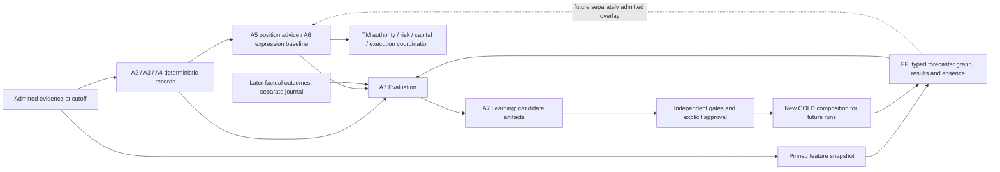
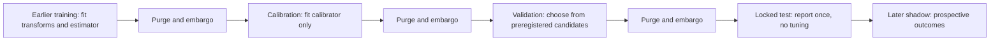
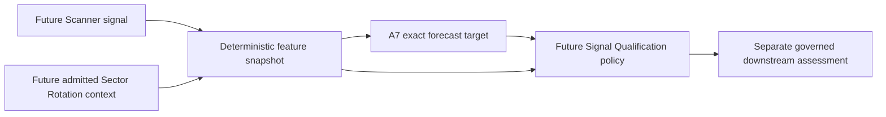
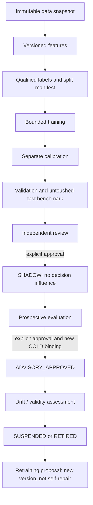
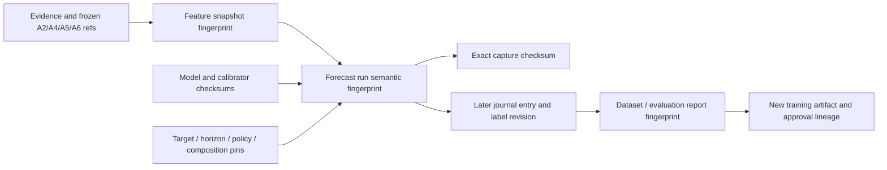

# TIAF A7 — Forecasting, Evaluation & Learning Architecture

**Current checkpoint — 2026-09-22 (Asia/Kolkata):** FF-0 COMPLETE / FROZEN at
`tiaf-a7-ff0-baseline`; FF-1 COMPLETE / FROZEN at `tiaf-a7-ff1-baseline`
(`21783ea31d4ce3b54fbcc6fcce6ef7e641bd5bec`). FF-1 scientific outcome remains
**INSUFFICIENT_EVIDENCE / CONFIDENCE_NONDECISIVE**; infrastructure accepted,
Logistic CHALLENGER / EXPERIMENTAL, promotion eligible NO; BaseRate BENCHMARK.
2025 is CONSUMED, executions used 1, post-holdout refit allowed NO.

**FLC — Forecaster Lifecycle Completion is CURRENT**: architecture/gap plan
complete; FLC-1 inference seams implemented. Logistic is the sole learned reference;
no additional families or FF-0 behavior change. **FF-2 is intentionally
DEFERRED / NOT_STARTED until FLC closure**, then only a separately approved new
research proposal with new validation evidence. Eligibility is not a fit grant.
A7 overall remains IN_PROGRESS; no public forecasting capability or A4/A5/A6 influence.

See [FF lifecycle architecture](TIAF_FORECASTING_FRAMEWORK_ARCHITECTURE.md#22-forecaster-lifecycle-completion-flc)
and [FLC gaps/packages](TIAF_A7_FLC_FORECASTER_LIFECYCLE_COMPLETION_PLAN.md).
See the [FLC-1 implementation and validation](TIAF_A7_FLC_1_FORECASTER_CONTRACT_AND_LIFECYCLE_SEAM_NORMALIZATION.md).
Exact next task: **TIAF A7 / FLC-2 — TRAINING, MODEL IDENTITY, PERSISTENCE AND LIFECYCLE NORMALIZATION**, separately requested.

The dated architecture checkpoints below preserve their then-current state;
FF §22 adds the current lifecycle direction without reopening their acceptance.

Historical FF-0 planning checkpoint:

The [bounded FF-0 implementation plan](TIAF_A7_IMPLEMENTATION_SEQUENCING_FF0_MINIATURE_PLAN.md) is complete
(**READY_FOR_FF0_IMPLEMENTATION**, planning only). It chooses synthetic captured-input
BaseRate mechanics, four FF-0 steps and a 28-case acceptance corpus. FF-0.1 is
next only under a separate implementation request; calibration stays at FF-2,
public capability publication stays separate, and runtime remains NOT_IMPLEMENTED.

## 1. Status, authority and decision

**2026-09-15 (Asia/Kolkata): A7 ARCHITECTURE ACCEPTED;
A7 THESIS RECONCILED AS NEEDED; FF ARCHITECTURE ACCEPTED;
A7 / FF IMPLEMENTATION NOT_STARTED; RUNTIME NOT_IMPLEMENTED.**
The [independent acceptance](TIAF_A7_ARCHITECTURE_ACCEPTANCE.md) accepts this
canonical reconciled design, subordinate to accepted TI ownership and contracts.
It is an architecture baseline for sequencing, neither an accepted implementation
nor an empirical model result.
The [reconciliation record](TIAF_A7_RECONCILIATION_RECORD.md) identifies inherited
decisions, corrections and new proposals. The [detailed roadmap](TIAF_A7_DETAILED_ROADMAP.md)
owns the integrated crosswalk: A7 contains FF-0–FF-7 unchanged, not a competing
A7.1–A7.5 implementation sequence. The FF-0 miniature plan is complete; FF-0.1 implementation needs separate authorization. The [thesis reconciliation](TIAF_A7_THESIS_ARCHITECTURE_RECONCILIATION.md)
dispositions all seventeen thesis findings. The current
[FF integration reconciliation](TIAF_A7_FORECASTING_FRAMEWORK_INTEGRATION_RECONCILIATION.md)
maps every A7 section and affected thesis claim. The
[accepted FF design](TIAF_FORECASTING_FRAMEWORK_ARCHITECTURE.md) controls forecasting
contracts, graph, modes and generation statuses; A7 owns the scientific/lifecycle
umbrella and retained first-target policy. Historical model/stage names do not
define a second platform. Normative requirements below govern
the proposed A7 implementation; this pass does not authorize that implementation.

Historical architecture-pass entry: clean worktree; HEAD and `tiaf-a6-baseline^{}` both
`6dc2ff304aae0e87540260b092919bb91e4d4189`; A5 remains frozen at
`tiaf-a5-baseline` (`167c51d40985e70e422df14af4a67531f8f66a65`). R1–R5 are
accepted/done. The facade catalog remains **nine** operations, including
`expression.assess`; none is LIVE_READ. No model, dataset qualification, training,
live validation, promotion, capability publication or trading authority is
created by this document.

User-facing definition: **A7 estimates precisely defined future outcomes,
measures predictions and decisions against later evidence, and governs proposed
improvements—while keeping deterministic TI visible and operational authority
outside the model.** It is not an autonomous trader or a promise of accuracy.

## 2. Three layers, three authorities

| Layer | Question / immutable product | Lifecycle owner | Cannot do |
|---|---|---|---|
| Forecasting | What typed forecast or absence can the selected instrument produce? FF `ForecastRequest` / `ForecastResult` / `ForecastRun`; separately admitted consumer projection | A7 lifecycle domain; FF contracts, graph and bounded runtime | Train on the request, acquire arbitrary data, change A4/A5/A6, place orders |
| Evaluation | What occurred, and how did frozen forecasts/decisions compare with controls? `OutcomeJournalEntry` / `EvaluationReport` | TI evaluation policy | Authorize promotion, rewrite the original decision or declare an unobserved counterfactual true |
| Governed Learning | Does a new candidate earn bounded future use? `TrainingRun`, artifact registry and recorded approval events | Learning custodian; independent reviewer decides, trusted startup owner binds | Self-promote, edit a frozen policy, replace a model during a run |



The dashed edge is **not A7 v1 behavior**. A4 remains arbitration owner, A5
position-intelligence owner and A6 candidate/selection owner. A7 is optional to
all frozen paths. A2 `NO_TRADE`, A4 restrictions, A5 insufficient evidence and A6
`NO_OPTION_TRADE` cannot be lifted by a probability. Absence of A7 returns the
unaltered deterministic result with an explicit overlay status, never a neutral
or positive fabricated forecast. Recorded lower-layer fingerprints stay intact.

### 2.1 Single-owner integration map

A7 Forecasting owns the **lifecycle domain**; FF owns forecasting contracts,
runtime and composition. “FF platform” may describe the cooperating system,
but does not move the scientific referee or approval authority into a forecaster.

| Object / decision | Single authoritative owner | Other participants |
|---|---|---|
| ForecastRequest / ForecastResult / ForecastRun / descriptors / node traces | FF within A7 Forecasting | A7 references these contracts; no parallel one-model request/run API |
| Primitive/composite seam, typed DAG definition and execution semantics | FF | Optional LLM and FMLFDEForecaster obey the same seam |
| Forecaster execution registry / provider-model-plugin metadata | FF startup-bound resolution view | R2 descriptions are not approval, dynamic loading or a second artifact registry |
| Target/horizon, QualifiedSessionSchedule qualification, Ground Truth and labels | A7 Evaluation | Evidence owners supply qualified neutral facts; FF references definitions, not future outcomes |
| Forecast captures | FF write side | Immutable result/run artifacts; Evaluation links them later |
| Outcome Journal, Forecast Ledger, population dispositions and paired comparisons | A7 Evaluation | One truth journal and evaluation linkage; §7.2 |
| Benchmark Registry and metric definitions | A7 Evaluation | Versioned scientific reference views; FF executes benchmark-capable instruments |
| Model / transform / calibrator / composition artifacts and candidate/shadow/lifecycle events | A7 Governed Learning | One typed content-addressed registry with append-only history |
| Calibration qualification, drift and promotion-evidence inputs | A7 Evaluation | FF supplies observables; Learning consumes reports without changing verdicts |
| PromotionDecision | Independently authorized reviewer/operator | Learning records approval/hold/rejection; automated fit/evaluation cannot approve |
| Active graph/root roles/resource-profile selection | Trusted startup owner | FF validates and seals the COLD binding; requests cannot replace it |

### 2.2 Registry and active-composition boundaries

Use **one governed artifact/lifecycle registry**, with typed model/calibrator/
composition manifests and candidate/shadow/promotion event views. The Forecaster
Registry is FF's implementation-resolution view, the Benchmark Registry is
Evaluation's scientific suite view, and the metric registry is Evaluation's
definition catalog. These are distinct contracts, not six services or six
competing writers. Membership never grants authority.

Learning owns candidate graph proposals and shadow-campaign lineage; FF owns
graph semantics. A shadow graph is a separate immutable candidate configuration
bound by the trusted startup owner within explicit shadow approval. The active
graph is the exact startup-selected version, not the newest entry. At most one
PRIMARY root per subject/target/horizon/profile; zero is legal in research.
Benchmark, challenger and shadow assignments are independent of lifecycle.

Adopt [FF §9.1](TIAF_FORECASTING_FRAMEWORK_ARCHITECTURE.md#91-qualified-names-and-lossless-a7-mapping-fft-10):
REGISTERED/TRAINED/CALIBRATION_FITTED retain EXPERIMENTAL stage events; EVALUATED
is not automatically VALIDATED; SHADOW_APPROVED maps to scoped lifecycle=SHADOW,
not an automatic role assignment; ADVISORY_APPROVED maps to scoped
lifecycle=APPROVED, not PRIMARY selection. Retain rejections, denied resumptions,
suspension, retirement, old schema/ID, effective/recorded times, predecessor,
authority, scope and expiry. Unknown mappings deny new use. Role=SHADOW and
lifecycle=SHADOW are never bare aliases. This is a contract design mapping, not
a migration of implemented runtime records.

COLD activation and rollback each create a new trusted startup configuration
within still-valid approval, with full graph/artifact/policy/version closure.
No in-flight graph mutation, target change, automatic scope widening or HOT
replacement. Current R5 has no FF selectors; later versioned extension and tests
are prerequisites, not features delivered by this document.

## 3. Selected first target and exact horizon

Select **one** initial family: binary underlying endpoint price-return
probability for qualified NSE cash equities. This is a modest diagnostic of
underlying direction; it is not proven to improve decisions. It tests the entire
PIT/calibration/evaluation/replay chain before expensive expression/path models.

Proposed target ID `equity.next_session_close.return_gt_zero`, version `1.0`:

```text
r = terminal_close / reference_close - 1       # dimensionless simple price return
y = 1 if terminal_close > reference_close else 0
forecast = P(y = 1 | the eligible feature snapshot at cutoff)
```

The strict `>` comparison is part of the target. Equal prices are class zero,
not an excluded tie. Missing prices are no label, not class zero. Persist exact
decimal source prices/units for deterministic comparisons; rounded displayed
returns must not determine the label. This is **price return**, not total return,
cash P&L, a bearish probability, or the probability a trade profits. The
complement includes unchanged prices. One directional probability cannot yield
expected return magnitude, drawdown, option POP, or expected monetary utility.

| Proposed typed concept | Required meaning |
|---|---|
| `ForecastTargetSpec` | ID/version, subject asset class/venue, endpoint event, strict comparator and threshold zero, reference/terminal price basis, return unit, labeler and corporate-action policy pins |
| `ForecastHorizonSpec` | `NEXT_TRADING_SESSION_CLOSE`, exactly one supplied next session; source session ID, target session ID, calendar/schedule version and fingerprint, explicit reference observation instant, decision `cutoff_at`, target open/close instants |
| FF `ForecastRequest` reference | Neutral subject, Evaluation-owned target/horizon, immutable features/parent refs, permitted COLD profile, realization mode, as-of/cutoff and simulation-profile pin when applicable; FF resolves exact artifacts; no caller loader path or grant |
| Validity | FF mode-specific clocks (§5.2): source close completed/available by cutoff; decision before target open; ACTUAL production/issue before open; SIMULATED may be computed later but has no actual issuance or current-use window |

The schedule is a **supplied, qualified, versioned artifact**, not a new calendar
engine, a weekday guess, `timedelta(days=1)` or a promise that DEF-007 is closed.
Resolve the next actual session from that artifact, including exceptional
closures; unknown or changed schedule makes the request unsupported or its
outcome censored under the captured policy, not silently shifted to another day.
The reference close must be the source session's qualified completed close,
not a latest quote or a guessed prior close. Price source selection is pinned;
conflicting or ambiguous endpoints do not become a silent provider preference.

The binary observation window ends exactly at target close. A supplied terminal
close can label it without pretending a complete intraday path exists. A daily
bar covering time before the decision may not be attached as a later path.
Record the reference observation separately from the future observation window.

Illustrative time semantics (not an exchange-calendar assertion): supplied
session S0 closes at 15:30, cutoff is 16:00, issue is 16:01; supplied next
session S1 opens at 09:15 and closes at 15:30. The result estimates S1 close
relative to S0 close. S0 is a known reference, **not a fill obtainable at issue**.
Any investable evaluation needs its own post-issue entry/fill convention.

All instants use aware `zoneinfo.ZoneInfo("Asia/Kolkata")`, accept other aware
zones via normalization, reject naive values and emit `+05:30` JSON. No naive
`datetime.now()` or manual offset arithmetic. Calendar IDs/dates are not instants.

### 3.1 Qualified session schedule and revisions

Require an A7 Evaluation-owned immutable `QualifiedSessionSchedule` input, not a calendar
service. Its minimum contract is venue/segment, timezone, source/target session
IDs and exact open/close instants, effective coverage interval, an ordered
complete session list over that interval, exceptional closure/opening notices,
source publication/availability/acquisition/admission times, source document
versions/digests, qualification-policy ID/version and decision, schedule
revision/predecessor and semantic fingerprint. Coverage must prove **no
intervening eligible session** between S0 and S1; two supplied dates alone do not.
Origin-session membership, subject trading eligibility and endpoint source/basis
are separately qualified. A suspended subject cannot borrow another subject's close.

The evidence owner must qualify the exchange's official session schedule and
relevant exception/correction notices for the specific venue, segment and period.
An approved redistributed capture is acceptable only if its official origin,
exact version, authenticity and completeness are resolvable under that same
policy. Brand prestige, an unsourced hand-entered timetable, a broker's current
holiday list or a generic library alone is insufficient. This is a source
acceptance requirement, not a certification or procurement of any current feed.
The endpoint price needs its own accepted market-data authority/coverage policy.

Existing A6 `SessionWindow` supplies opens/closes and a qualification reference;
it does **not** encode adjacent-session completeness, dated calendar revisions
or A7's historical horizon resolution. A2's previous-close fallback also cannot
prove the next session. Reuse compatible referenced facts, not their schemas as
an A7 schedule alias. The calendar/session engine and live qualified source stay
deferred under DEF-007; FF-0 adds only bounded input/admission contracts.

| Situation | New forecast admission | Label and history |
|---|---|---|
| S1 cannot be resolved uniquely | UNSUPPORTED, no estimate | AMBIGUOUS/ineligible for supervised use; no weekday inference |
| Known S1 but required source/coverage/PIT proof absent | UNAVAILABLE, qualified-calendar reason | No eligible label until required proof exists; never class zero |
| Qualified captured schedule unchanged | Other gates still apply | Label only the exact captured S1 completed close |
| Material revision before issue/admission changes S0, S1 or its window | Reject use of superseded schedule; a new request must independently qualify | Do not silently rewrite the request's horizon |
| Material revision discovered after issue cancels/changes the captured target window | Original run retained; new use of the invalidated forecast is inadmissible | Append journal revision: window CENSORED, label INELIGIBLE, schedule-change reason; no shift to S2 |
| Revision changes provenance but not the qualified target/window | Requalification under captured policy; no inferred equality | Explicit comparison/revision link; old capture/report stays pinned |

Thus missing calendar qualification blocks **both** real forecast admission and
supervised label eligibility, not inspection of recorded absence or synthetic
mechanics. Later proof can support a new outcome evaluation at its true
availability time; it cannot retroactively legitimize an earlier issued forecast
or training fold. The source's actual completed-close observation and finality
basis are required; an incomplete bar, latest quote, conflicting close or invalid
price cannot substitute. v1 endpoint prices must be finite and positive in their
declared unit; malformed/nonpositive prices produce INELIGIBLE, not class zero.

### Consumer alignment and later families

The initial application cohort is **POSITIONAL, one-next-session cash-equity
context**. Broad DAY/POSITIONAL labels or A0 `Horizon.max_days` cannot establish
exact compatibility. A later consumer must match subject, price basis, target,
cutoff, target window and applicability; mismatch is explicit. The v1 forecast
may be displayed beside a longer-horizon thesis as a labeled short-horizon
diagnostic, never treated as a forecast over that thesis's entire horizon.

The permitted initial success claim is improved held-out prediction of this
specific endpoint event on its qualified population. Even passing that test is
not demonstrated improvement to A4 decisions, A5 advice or A6 expression
selection; each stronger claim needs its own matched consumer evaluation.

A5 option/future outcomes and A6 expiry/strike ranking are not forecast by this
target. Future return distributions, target-before-stop, volatility, option
outcomes, position deterioration and cross-sectional ranking require separate
target/horizon/label/calibration policies and acceptance. No intraday, index,
custom-duration or multiple-horizon model is implied by a generic contract seam.

## 4. Contracts and compatibility

These are **proposed** additive contracts, not new Python classes in this pass.
FF owns request/result/run/graph schemas. Evaluation owns feature eligibility,
datasets, targets, schedules, journals and report schemas; Learning owns training
and registry records. Evidence owners retain original observations.
All semantic collections are tuples accepting list/JSON input and emitting JSON
arrays; contracts are frozen. Extensible metadata stays simple but cannot hide
target, time, label, permission, model or calibration semantics. Package `0.1.0`,
A0 schema `1.0`, existing child schemas and fingerprints remain independent.

| Contract | Minimum captured content |
|---|---|
| `FeatureSnapshot` | Ordered feature schema, typed values/missingness, units, lineage, cutoff, complete required scope, parent evidence/assessment fingerprints, universe/schedule/vintage refs, projection code/policy pin |
| `DatasetManifest` | Immutable row refs, eligibility/exclusions, universe history, outcome revisions, rights, splits/folds, feature/target/label pins, build time and checksum |
| `OutcomeJournalEntry` | Parent identities, window, observed facts, completeness by measure, label status/version, treatment/selection state, provenance and immutable revision links (§7) |
| `ForecastEvidenceV2` | Proposed lossless consumer projection of an unchanged FF result, not a second inference output: target, mode/clocks/profile, value OR absence, calibration/applicability/validity, graph/child lineage and no-action authority; independently versioned mapper/publication gate |
| FF `ForecastRun` reference | Full declared graph/roots, expected and attempted participants, unchanged node/root results, all gaps/failures and unique usage; no A7 duplicate singular-model envelope |
| `EvaluationReport` | Manifest and compared run refs, cohort definitions, metrics/uncertainty, control comparisons, coverage and exclusions, policy/version; validated population-disposition report fingerprint (§9.1); immutable report revision |
| `EvaluationPopulationDispositionReport` | Separate immutable Evaluation-owned projection: preregistered population, request-to-observation mapping, per-metric disposition/reasons, source journal/forecast revisions and denominator counts; fingerprint referenced by `EvaluationReport` (§9.1) |
| `TrainingRun` | Dataset/split/config/code/dependency/seed pins, all tried configurations, budgets/usage, model artifact and logs; no promotion authority |
| `ModelRegistryEntry` / `ModelLifecycleEvent` | Immutable model manifest and append-only approvals, deployment intent, suspension, retirement and rollback lineage (§12) |

Existing `tiaf.agents.models.ForecastEvidence` is an A3.1 **consumer placeholder**,
not a trained forecaster. It validates numeric outputs and calibration metadata
but uses broad `Horizon`, a string snapshot reference, and threshold language
that does not disambiguate terminal return versus touching a threshold along a
path. Its quantile/calibration tests prove validation, not empirical calibration.

Do not retrofit that frozen contract or stuff the new event into its metadata.
Retain the proposed name `ForecastEvidenceV2` only for a separately versioned,
lossless FF-to-consumer projection, never an alias for the old draft shape. If
it cannot preserve mode, graph, output/absence, clocks or lineage, design a new
additive projection version at the publication checkpoint; deny unsupported
conversion. The A3/A4 consumer policy remains a separate future acceptance. There is **no automatic V1↔V2
conversion**: existing records keep existing meaning; missing target/schedule/PIT
proof prevents their use for v1 training/admission. A future mapping may preserve
an explicitly compatible record only with a reviewed conversion policy. R3
composition types scoped to A3.8 likewise are not generic model registries; use
their pinning principles in FF-owned envelopes without changing old captures.

## 5. PIT eligibility and feature governance

Captured replay proves what TI stored, not what could have been known on an
arbitrary date. **Dataset qualification is an independent gate** (DEF-049).

For every feature retain event/effective time, publication time where applicable,
source availability/basis, actual acquisition/first-capture time, TI admission
time, source revision and data vintage. Under the v1 **CAPTURED_AS_KNOWN** policy,
all relevant availability, acquisition and admission times must be at or before
the row cutoff; unknown, date-only or acquisition-only substitutes cannot prove
an exact earlier eligibility claim. Later restatements/normalizations remain
new evidence with new lineage, not replacements for old feature values.

New projections computed today from an immutable older eligible capture may
support **retrospective research** if every dependency was captured by cutoff,
the transform is time-local, and transform selection belongs entirely to the
training process. Persist computation time separately. Never relabel these as
forecasts actually issued then. Late-acquired historical OHLCV can be stored for
research but is not retrospectively CAPTURED_AS_KNOWN evidence. A separately
accepted historical-vintage policy would be required to admit that dataset.

Initial feature allowlist: a small, pinned subset of existing completed-bar A2
return/trend/volatility/participation facts, identified by exact source field,
unit, lookback and projector version. A7 does not recalculate or optimize A2.
The FF-0 schema must freeze the concrete ordered list before fitting. Finite
numeric zero stays factual; missing is an explicit mask. Initial required
features cannot be imputed to create eligibility. Any later optional imputation,
scaling or category vocabulary is fitted on training rows only and serialized.

A3 admitted evidence/A4 thesis projections may later be added with matching
availability and versioned lineage. Disagreement and source uncertainty are
features with declared semantics, not majority-vote truth. No raw Yahoo/Dhan/MCP
fields, provider-specific tickers, quoted future estimates presented as outcomes,
LLM prose embeddings, A7-influenced A4 outputs or post-outcome risk state enter
the initial feature schema. Parent capture refs retain individual evidence and
contradictions even when v1 does not model them.

Universe selection is a dated, versioned eligibility snapshot. Preserve
delisted/suspended/inactive subjects and missing outcomes in the denominator;
today's listed securities or today's F&O membership are not a historical
universe. Deduplicate the same subject/target/cutoff across repeated requests;
retain all request lineage so an often-inspected symbol does not gain hidden
training weight. Asset identity changes require captured mapping, not string
matching. Universe/subscriber/selection policy must be known at cutoff.

Corporate actions: v1 uses same-basis **unadjusted price** endpoints and excludes
windows affected by splits, bonuses, dividends or other price-basis changes
under an explicit sourced action-coverage policy. No magnitude-based guessed
adjustment and no retrospective latest-adjusted series. Unknown action coverage
prevents supervised eligibility. An action discovered after issue can censor
the label, never alter the historical forecast; report this informative
missingness and possible selection bias. This restricted cohort is not a
solution to DEF-013, and a captured empty event list is not complete coverage.

Options are excluded from v1 training. Future expression labels require actual
historical listed-contract universe, expiry/session qualification, timestamped
bid/ask/depth/underlying observations, units, and action/settlement semantics.
Rolling expired-options OHLC or a live chain alone cannot reconstruct historical
orderability, quotes or a realizable option result (DEF-014/040–044/049).

### 5.1 Distinct knowledge and validity clocks

| Clock | Normative use; not interchangeable with |
|---|---|
| Event/observation time | When an observed fact occurred; a past event timestamp alone does not prove past knowledge |
| Publication and feature availability | When this exact source revision and every required feature dependency became available; not the period described by a filing |
| Acquisition/first capture and TI admission | When TI actually captured and admitted that version; late historical acquisition is not CAPTURED_AS_KNOWN |
| Feature cutoff / forecast issue | The closed information boundary / actual publication of the estimate; feature computation time is separately retained |
| Model fit cutoff / fit completion | Latest knowledge admitted to fitting / when the immutable artifact became usable; never the forecast's outcome time |
| Outcome event / label availability | Exact target-close observation / when all label evidence and coverage checks were available; training uses the latter |
| Corporate-action effective time | When a change affects the instrument/price basis; preserve announcement/availability separately even if the event is future |
| Universe membership validity | Interval for the captured member mapping; retain when that mapping became known, so later survival cannot determine an earlier universe |

Observed feature facts and their admitted dependency versions must satisfy the
cutoff. A future effective date in a previously announced schedule/action can be
qualification evidence; it is not an already realized outcome or an allowlisted
v1 predictive feature. Do not equate future effective time with future knowledge,
or use that distinction to admit an 11:00 observed high at 10:00.

Prospective issuance requires the actual model/calibrator artifact and approved
binding to exist before issuance, with fit inputs available by their recorded
fit cutoffs. All fit, calibration and model-selection knowledge used by that
artifact must also be no later than the forecast's information cutoff; a delayed
issue cannot import a later label through the model while freezing only features.
Actual fit completion is a separate clock, not permission to expand knowledge.
Historical research records simulated fit/forecast cutoffs and its
actual later computation time; it cannot claim the artifact was deployed then.
Incomplete lineage, future survivor selection or hindsight action knowledge
fails the affected qualification. A discovery of leakage invalidates the affected
experiment's readiness claim; repair creates a new manifest/report lineage,
not a passing score after deleting inconvenient rows.

PIT-safe adjustment would require an explicitly accepted adjustment formula,
source/action vintage, effective interval and availability of every factor by
the relevant information cutoff. **v1 does not adopt that adjusted-price path**.
Known action-affected or unknown-coverage windows remain excluded from supervised
eligibility; later action discoveries append label invalidation/revision. Report
their selection/censoring bias; do not fabricate negative outcomes or quietly
rewrite reference prices. DEF-013 and DEF-049 remain open.

### 5.2 Accepted FF realization modes in A7

[FF §§3.2–3.3](TIAF_FORECASTING_FRAMEWORK_ARCHITECTURE.md#32-realization-modes-and-canonical-clocks-ffa-b01-correction)
is the authoritative clock contract, adopted without redefining the target:

```text
ACTUAL_ISSUANCE:
 source_close <= cutoff <= as_of <= computed_at <= issued_at < target_open_time
SIMULATED_ISSUANCE:
 source_close <= cutoff <= simulation_as_of < target_open_time
 simulation_as_of <= computed_at; issued_at = NOT_APPLICABLE
 computed_at may follow target_open_time and target_resolve_time
```

The nine meanings are observation_event_time, information_available_time,
information_cutoff, simulation_as_of, issued_at, computed_at, target_open_time,
target_resolve_time and outcome_recorded_at. Retain publication, acquisition/
admission, actual fit completion and label availability separately. Request
`as_of` carries simulation-as-of meaning only in SIMULATED mode, not a second
editable clock. Real completion is not compute-start. Equality at target open
fails the strict first-target rule; never backdate actual issuance.

All fitting, calibration, selection, preprocessing, universe and label knowledge
is cutoff-bounded in either mode. A SIMULATED artifact can be fitted today on
qualified earlier knowledge without pretending it existed then. Late-acquired
history does not become CAPTURED_AS_KNOWN. ACTUAL requires a genuinely existing,
approved artifact/binding before timely issuance. Forecast generation does not
require its future label; scoring later does.

Historical research → new SIMULATED artifact → Evaluation → candidate evidence,
**never retroactive operational issuance**. Identity preserves mode, original
real computation, applicable issue/as-of, graph/artifact and simulation profile.
Replay reconstructs either original mode; pinned verification records its own
new time/cost separately. New historical generation is not replay even when it
uses the same model and returns the same number.

Evaluation pins a preregistered realization-mode policy for benchmark,
calibration, drift and promotion-evidence populations. ACTUAL/ACTUAL and
SIMULATED/SIMULATED still require exact comparison compatibility. Mixed-mode
pairing is default-excluded; only explicit matched mixed-mode research policy
can admit it. Show per-mode counts/limits; no silent pooling, extra independent
observations from repeated simulations, or transfer of simulated reliability
to ACTUAL history. Prospective shadow and operational-drift claims require
actual prospective evidence. SIMULATED diagnostics may inform proposals, not
replace that evidence. A calibrator fitted on SIMULATED predictions may later
be used on ACTUAL only after independent applicability, prospective shadow and
approval gates.

Mixed research comparison permission never permits mixed-mode value-combining
edges in FF. Contributing children/intermediates/root keep the request mode;
a retained ACTUAL control is not relabeled as a SIMULATED graph child.

## 6. Dataset partitions and walk-forward evaluation



Use expanding-window walk-forward by default. Each fold has chronological,
disjoint train/calibration/validation/test blocks; later folds may use earlier
outcomes only after their label-availability time, under the frozen fold plan.
Previously tested rows are never reported a second time as new independent
test evidence. Keep a final untouched holdout beyond model-selection folds.
Repeated holdout inspection exhausts it; revision requires a new later holdout.
No random row split or cross-symbol mixing of the same decision date across
partitions. Partition by whole origin-session groups; cluster uncertainty by
session to address correlated equities and overlapping exposure.

The splitter uses actual label dependency intervals and `label_available_at`,
not just row dates. Purge earlier rows whose label information intersects a
later partition's decision interval or was not available by the simulated fit
cutoff. Put at least one full target-session span between successive blocks for
v1; the splitter records removed row IDs and schedule-based boundaries. Longer
future targets require longer dependency-aware gaps. Historical feature lookback
may read earlier eligible observations; it must not fit preprocessing on later
rows. All fit inputs, including calibration outcomes, must precede the forecast
being scored. Randomness is only seeded within an admitted training operation,
not used to erase chronology.

Separate dataset purposes:

| Purpose | Can change a fitted artifact? | Reporting rule |
|---|---|---|
| Training | Estimator and preprocessing only | In-sample results never count as OOS proof |
| Calibration | Calibrator only over frozen model scores | Not a test set |
| Validation | Bounded model/profile selection and abstention threshold | All trials recorded; no final-test tuning |
| Test / walk-forward test | No | Matched cohorts, forecast-time availability, unique scored row identity |
| Shadow | No automatic updates | Prospective issue recorded before observation; all failures included |
| Rejected/abstained candidates | Only when separately eligible and assigned to an appropriate training block | Selection state retained; not traded does not mean negative label |

A local content-addressed JSON/JSONL corpus suffices initially. Large-store,
distributed-training and scheduled acquisition remain DEF-050/051. An existing
synthetic golden manifest is a test recipe, not a persisted replay/training
corpus. Synthetic data can prove mechanics, **not market predictability**.

### 6.1 Split-definition identity

Persist a canonical versioned split-definition fingerprint binding the dataset
manifest, ordered unique observation IDs, origin-session groups, exact calendar
revision and partition boundaries, simulated fit cutoffs, label-dependency and
availability rules, embargo policy, removed IDs/reasons, fold ordering, final
holdout identity and splitter implementation/policy versions. The preregistered
split plan and its realized membership/removal manifest have separate linked
identities: realizing a plan cannot change its selection rules. Any changed rule
creates a new plan/report and invalidates use of an inspected holdout as untouched.

Require disjoint row IDs **and origin-session groups within each fold**. Purging
is mandatory whenever dependencies cross a boundary or labels were unavailable
at fit; v1's full-target-session embargo remains mandatory between partitions.
A zero-removal result must retain proof of the interval checks, not omit them.
Cross-fold reuse is allowed only forward after maturity as specified above;
test-score aggregation counts an observation only once under a pinned rule.
Random-shuffle splits are not an alternate default. Rolling windows may be
chosen by a preregistered policy, not after inspecting which folds look best.

## 7. Immutable outcome journal and labels

Append outcomes beside, never inside, original decisions. Link existing A2.10
`BaselineRunRecord` / `OutcomePath` / `BaselineOutcome` and A3.10 package refs
where their meanings match; do not migrate their schemas or treat their raw
excursions as ready-made supervised labels. Existing A2.10 calculates observed
movement even for an incomplete supplied path. A7 independently gates eligibility
and must not silently alter A2.10 behavior.

Each journal entry identifies request/candidate/thesis/assessment/run/forecast
IDs where applicable, source fingerprints and policies, subject, reference
mark, cutoff/issue/window, expected observations, actual observation refs,
event/availability/acquisition times, raw ending price return, path extrema,
direction-specific MFE/MAE only where defined, target/stop outcome only where
defined, end state, quality/completeness by measure, label version, eligibility
and reasons. Also record source licensing/vintage and journal `recorded_at`.

Keep three independent axes:

- Window: OPEN, CLOSED, CENSORED, or UNOBSERVABLE, with reasons.
- Selection/operation: PROPOSED, REJECTED (reason and decision owner), NOT_TAKEN,
  TAKEN (external execution reference), or UNKNOWN. A6 rejection, TM rejection,
  forecast abstention and actual fill are distinct fields, not aliases.
- Label: ELIGIBLE, PENDING, INELIGIBLE or AMBIGUOUS, scoped by label specification.

A binary endpoint label needs qualified endpoints and coverage/action checks;
it does not need a complete intraday path. MFE/MAE does need explicitly complete
path coverage to claim full-window extrema; partial observed extrema may be
reported as partial only and are not substituted for full labels. A2.10's
NO_TRADE directional MFE/MAE remains absent. Independent hypothetical directions
must have separately identified evaluation conventions, not alter those fields.

| Label issue | Deterministic rule |
|---|---|
| Endpoint return | Compare exact same-basis terminal/reference prices; zero-return tie is class 0; no probability label generated from a TI recommendation |
| Missing terminal / delayed release | Pending until the policy's observation deadline; then censored/unobservable, never last-price carry-forward or loss |
| Incomplete path | Mark metric-specific coverage; no full-window excursion/target ordering claim |
| Future target/stop labels | Levels fixed at decision, comparator and window pinned; earliest qualified event wins; both hit in one unordered bar is AMBIGUOUS, not assumed favorable |
| Corporate action / session revision | Apply captured action/calendar policy; unresolved basis/order is ineligible; never infer adjustment or extend the horizon silently |
| Correction | Append a new entry referencing the previous entry and changed source/label version; old dataset pins the old revision |

Label availability is no earlier than the latest required observation,
availability/ingestion proof and completeness/action checks. A later correction
is not available to an earlier training fold. The labeler has no route back
into decision-time feature storage. Schema validation and integrity do not
establish source truth.

Rejected candidates retain factual market paths where obtainable. Report
unobserved/censored cases and selection rates separately. An unexecuted option
does not have an actual fill or P&L. Outcome comparison is observational, not
proof that adopting A5 advice or a different A6 contract would cause a return.
No automatic monitoring, wait loop or provider backfill belongs in the journal.

### 7.1 Generation, operation, observability and revisions

Forecast generation is recorded independently by the exact `ForecastRun` or
explicit no-run/absence reference. Preserve ABSTAINED/UNAVAILABLE/UNSUPPORTED and
failed-attempt provenance without pretending a probability was generated. An
ignored proposal is NOT_TAKEN with an ignored/no-response reason, not REJECTED
unless its owner actually rejected it. UNKNOWN operation state is not a fill.
Journal label eligibility does not imply forecast admission or a downstream trade.

Observability is scoped by measure: factual endpoint, full path, actual execution
and explicitly hypothetical execution are separate. Record OBSERVABLE,
NOT_OBSERVABLE, UNKNOWN or NOT_REQUESTED with evidence/assumption refs for each
requested measure. An untraded underlying endpoint may be factual and observable;
the rejected option's fill/P&L usually remains not observable without a separately
accepted counterfactual method and sufficient historical evidence. Do not derive
counterfactual availability from the presence of a terminal price. v1 does not
implement a counterfactual execution engine.

For the initial label, eligible above-reference = 1 and eligible equal/below = 0.
Missing/delayed observations are PENDING until the pinned observation deadline;
unavailable beyond it is censored/unobservable, without a numeric label. Invalid
identity, basis or price is INELIGIBLE. Unresolved session/action ambiguity is
AMBIGUOUS and barred from supervised metrics. These are not additional classes.
REVISED is a relationship between immutable entries, **not** a competing label
status: a revised entry can independently be ELIGIBLE, PENDING or INELIGIBLE.

Never delete an earlier label or report to apply a correction. Append the new
source/journal revision, predecessor and reason, later `label_available_at` and
labeler/policy pin. A new evaluation specifies its own as-known cutoff and exact
revision; the old dataset/report still resolves the old revision. Later detection
of invalid evidence can disqualify future use/approval, but does not alter what
the original forecast or report recorded. Datasets may not silently select the
latest available revision at replay time.

### 7.2 Forecast write side, Outcome Journal and Evaluation linkage

Keep the project-native meaning in
[accepted FF §11](TIAF_FORECASTING_FRAMEWORK_ARCHITECTURE.md#11-forecast-ledger-without-mutable-historical-cells).
The **Forecast Ledger is an Evaluation-owned immutable joined projection**, not
a new forecast-side journal. FF's immutable ForecastResult/ForecastRun captures
are the forecast-side artifact records intended by that shorthand.

| Record | Write / append owner | Revision / linkage / eligibility |
|---|---|---|
| ForecastResult / ForecastRun capture | FF produces and appends a new immutable artifact per run, including absence/failure | Never patched with outcomes; repaired runs and fresh simulations have new identity and predecessor/control refs |
| OutcomeJournalEntry | Evaluation admits qualified external outcomes and appends entries | Corrections retain predecessor, label availability and actual recorded time; no change to original forecast |
| EvaluationPopulationDispositionReport | Evaluation writes a derived immutable report | Exact scope, dedupe, per-metric arms/reasons and source revisions; no second truth/approval owner |
| Forecast Ledger snapshot | Evaluation writes a joined projection over exact captures, journal revisions and dispositions | Pending stays pending in old snapshot; J2 creates L2 linked to L1, not mutable historical cells |
| PairedComparisonManifest / EvaluationReport | Evaluation joins observations, exact arms and protocol | Owns evaluation eligibility and new report revisions; not forecaster-selected truth or auto-approval |

```text
FF: actual A1 + later simulated S1 ──────────┐
Evaluation: qualified outcome J1 → J2 ──────┼→ dispositions → Ledger L1 → L2
Evaluation: preregistered population/policy ┘                  ↓
                                              paired manifest / report
```

A1 and S1 remain separate artifacts of one observation; S1 never overwrites A1.
Outcome revisions retain real recording/availability; target resolution stays
fixed. Forecast-time captures cannot require future comparison IDs or journal
fingerprints. New Evaluation records link backwards only, avoiding hash cycles.
Physical JSON/JSONL co-location is optional, not merged authority.

## 8. Models, calibration and uncertainty

Initial FF-1 candidate instrument: **regularized logistic regression** on the small pinned A2
feature schema, plus an intercept-only historical-base-rate control. Freeze
preprocessing, regularization, solver, feature order, seed and numeric runtime.
A bounded candidate grid is permitted only inside the training/validation plan;
no symbol-specific thresholds tuned to RELIANCE, HDFCBANK, KAYNES or ATHERENERG.
It is B2 behind the stable FF Forecaster seam, not a hard-wired A7 engine or
the only permitted family. FF-0 starts with a singleton B0 fixture/runtime;
FF-1 compares B0/B2 raw research; once qualified, B2 is a later complexity control.

At FF-2, the initial calibrator is a separate held-out **sigmoid calibration** fit over frozen raw
scores from the calibration block. It is not fitted on training predictions
or on test outcomes. If data cannot support independent calibration, abstain
from user-facing probabilities; do not silently use the raw logistic output.
Isotonic, tree models and other alternatives require an explicit later experiment
with adequate data, complexity budget and the same controls. No mandatory
LLM, neural/time-series foundation model, RL or ensemble in v1.

```text
fit estimator on TRAIN
  → score CALIBRATION with frozen estimator
  → fit calibrator on CALIBRATION only
  → select permitted candidate using VALIDATION
  → lock all artifacts and report untouched TEST
  → independently approve SHADOW collection
```

Separate statuses: raw score, calibration-fitted, validation-passed, and
admission-eligible calibrated evidence. Having a `calibration_id` alone satisfies
none of the statistical gates. For a calibrated probability of 0.6, the claim
is about long-run frequency in the documented eligible cohort, **not certainty
for this equity, model self-confidence, or a 60% chance of trade profit**.

Reports include reliability bins (fixed edges/policy, count, mean forecast,
observed frequency and uncertainty), Brier score, log loss and ECE. Disclose
empty/sparse bins, class balance and uncertainty method. Brier is mean
`(p-y)^2`; log loss uses a pinned numerical endpoint-clipping policy for metric
calculation only, never silently changes captured probabilities. ECE alone
cannot establish calibration: it depends on bins and can hide subgroup errors.
Use session-block uncertainty intervals for panel comparisons rather than
pretend all symbols on the same day are independent.

Stratify reports by exact target/horizon and asset class; predeclare broad
regime/sector cohorts only with PIT mappings and sufficient effective samples.
Sparse cohorts are UNKNOWN, not reassuringly pooled away. v1 has no per-symbol
calibrator. If a claimed required deployment regime is unsupported, restrict
approved applicability or withhold admission; do not generalize silently.

### 8.1 Calibration admission and policy responsibility

Governed Learning fits and stores the calibrator artifact; FF applies the exact
wrapper/pipeline; Evaluation alone qualifies calibration for the exact target,
population and validity profile. Reviewer approval and trusted binding remain
separate. Fit/qualification records retain ACTUAL/SIMULATED population modes and
simulation profiles (§5.2). Raw B0/B2 research remains valid FF-1 output without
a calibrated-advisory claim; FF-2 completes held-out calibration and lifecycle.

Calling a stored field an admitted calibrated probability requires all of:
the exact target/window and qualified inputs; a frozen model plus independently
fitted calibrator; passing held-out calibration/benchmark evidence for the stated
cohort; sufficient sample/uncertainty support; explicit approval for the stated
shadow or advisory use; current calibration/model/health validity; and complete
replayable provenance. A raw logistic number remains an engineering score until
these gates pass. An approved shadow estimate remains explicitly experimental,
not permission to affect a decision. A calibration version is pinned to the
estimator checksum, transforms, feature/target schema, calibration dataset/split,
fit method/configuration, metrics/report and approval scope. Replacing any of
these dependencies requires new evaluation, not reuse of a calibration badge.

| Concern | Classification / owner |
|---|---|
| Independent calibration, mandatory support checks, visible reliability and fail-closed absence | ARCHITECTURE; required in every conforming implementation |
| Minimum rows/sessions/class/bin counts, uncertainty method/level/width, ECE bins/weights/bounds and calibration review lifetime | VERSIONED POLICY; evaluation owner proposes, authorized reviewer approves before protected outcomes are inspected; FF-0/FF-1 pin values/rationale before empirical work |
| Formatting bins/intervals and rendering actual contributions | IMPLEMENTATION DETAIL; cannot alter the pinned metric or omit sparse/failed bins |

For initial ECE, use a policy-declared finite ordered edge list covering [0,1],
left-closed/right-open bins except the last bin includes 1. Count each eligible
scored observation once with declared dataset weights; weights cannot reflect
future profit or inspection frequency. ECE is the sum of bin-weighted absolute
mean-probability versus observed-frequency gaps. Empty bins have zero metric
weight and UNKNOWN reliability, not perfect calibration. Sparse required bins
remain insufficient even if aggregate ECE is small. No post-test merging,
rebinning or edge selection is permitted. Numerical edges/counts are **policy**,
not values chosen in this pass or copied from the thesis's 1,000-row example.

Reliability evidence is required beside Brier/log loss, not inferred from them.
Session-block uncertainty and required regime support apply to calibration as
well as control improvement. Missing, stale, invalidated or drift-suspended
calibration makes new probability admission fail under §13; reducing the number
or presenting an unqualified raw score to the user is not a fallback.

## 9. Controls, metrics and evidence of incremental value

Evaluation is the independent scientific referee: one Benchmark Registry view
pins comparator configurations and qualification/metric/population obligations.
FF exposes benchmark-capable instruments; a role or model name does not qualify
one. Preserve [FF B0–B6](TIAF_FORECASTING_FRAMEWORK_ARCHITECTURE.md#10-benchmark-registry-and-common-ground-truth):
B0 BaseRate at FF-0/1; B2 Logistic candidate at FF-1, calibrated at FF-2 and later
a retained control; B1 Persistence optional when qualified; B3 one conventional
ML challenger and optional B4 kNN/B5 simple calibrated ensemble at FF-3; B6
K-only before LFDE claims in FF-5. LLM and advanced challengers are optional,
not compulsory benchmarks or FF-0 prerequisites. Fixed 0.5 stays a diagnostic.

Evaluation owns metric applicability/definitions, calibration qualification,
paired loss differences, time-aware uncertainty/statistical tests and regime
slices. Forecasters cannot choose the metric that judges them. Bind subject
universe, observation/date set, mode policy, exact target/horizon/reference,
cutoff policy, label version/revisions, splits/folds, eligibility filters,
weighting and request-to-observation mapping in the population identity.
Use FF's `PairedComparisonManifest`, not a second A7 comparison schema.
Paired loss uses the eligible intersection while coverage shows the intended
population/union. Zero pairs are NOT_EVALUABLE, never zero-loss success.

Pin `d_i = L(challenger_i,y_i) - L(benchmark_i,y_i)` (negative favors challenger).
FM's Delta_Z has the opposite declared sign; never mix them. Session/time-block
resampling and comparison tests need supported assumptions and preregistered
methods; no new statistical default is selected here. Evaluation also owns PIT
regime/context memberships, UNKNOWN buckets and overlapping-slice accounting.
Post-hoc or future-smoothed regimes cannot justify specialization or automatic
routing promotion; FF-7 needs independent walk-forward qualification.

| Level | Control / comparison | Permitted conclusion |
|---|---|---|
| 0 | Historical positive-label base rate fitted only on preceding training data; fixed 0.5 diagnostic | Does the model add predictive information beyond a simple prior? |
| 1 | Declared direction-persistence heuristic and simple logistic reference | Direction metrics for hard labels; persistence requires its own qualified probability mapping for probability metrics. FF-1 B2 raw research probabilities may be properly scored without a calibrated-advisory claim |
| 2 | Frozen A2 direction/class/score and A4 dispositions on matched captured inputs | Coverage, conditional observed outcomes, disagreement and non-action rates; scores are not probabilities |
| 3 | Frozen A5 advice / A6 rank, candidate gates and alternatives | Descriptive later outcomes where observable; future overlay-versus-control evaluation requires exact same valid candidate set and economic assumptions |
| 4 | Human/expert or executed decisions with qualified timestamps/rights | Separately labeled observational comparison; no fabricated expert label or causal attribution |

Initial logistic must improve on the historical base rate on untouched matched
rows; future models must also beat the pinned simple logistic. Report all
controls, failures and omitted comparisons with reasons. Binary sign forecast
cannot be compared to A6 contract-selection performance as if both predicted
the same event. No universal mixed-unit leaderboard or learned A4 voting weights.

| Task | Primary metrics | Secondary / limitations |
|---|---|---|
| v1 binary probability | Brier, log loss, reliability and calibrated-cohort coverage | ECE, precision/recall by predeclared threshold, ROC-AUC secondary; report prevalence and class counts |
| Future numeric return | MAE/RMSE with declared units/window | Not computed for the v1 binary target |
| Future distribution | Pinball loss, CRPS, interval coverage and width | Quantile crossing/missingness explicit; no invented v1 distribution |
| Decision comparison | Matched coverage, risk-adjusted utility under explicit outcome/cost assumptions, downside and drawdown where defined | Hit/win rate descriptive; hypothetical returns separate from actual execution |
| A3 incremental context | Matched outcomes/cost under predeclared contribution or ablation study | A3.10 added context is not demonstrated value; absence of a comparable control is NOT_EVALUABLE |

Publish count of requested/eligible/scored/abstained/failed/labeled/censored
rows and exclusion reasons before metrics. Never remove poor predictions after
seeing their result. Preserve NO_TRADE and rejected populations in scorecards.
Selection effects, small samples and regime uncertainty accompany every lift
claim. Observational comparisons do not establish causal uplift or profitability.

Mandatory v1 controls are the training-fitted historical base rate and the fixed
0.5 diagnostic on exactly matched evaluable rows. The initial logistic is the
candidate, not a requirement to beat a duplicate of itself; it becomes a required
reference for later complex-model promotion. Persistence is a contextual,
predeclared diagnostic when the required prior observations are qualified; its
absence is reported, and any probability-scored variant needs its own calibration.
A2/A4 controls are mandatory preserved references where supplied/meaningful;
A5/A6 and human/actual-execution comparisons remain contextual and can be
NOT_EVALUABLE. No missing contextual control excuses failure of a mandatory gate.

“Beat baseline” for v1 means the preregistered paired Brier improvement and its
session-clustered uncertainty bound pass, log loss satisfies the pinned
non-inferiority margin, and all separate calibration/coverage/stability gates
pass. A point estimate or AUC alone is insufficient. The uncertainty method,
confidence level, margins and multiple-trial/cohort decision rule must be pinned;
no universal p-value or new numerical significance threshold is adopted here.

### 9.1 Evaluation-population disposition report — ADOPT_WITH_CONSTRAINTS

Adopt `EvaluationPopulationDispositionReport` as a separately identifiable,
immutable **Evaluation-owned derived report**, emitted alongside every empirical
scorecard, including zero-evaluable-row and partial/failed-scorecard attempts.
It is not a second outcome journal, mutable state service, approval system or
new public capability. It references source forecast/operation/journal statuses
instead of inventing independent versions of them. FF-0 defines its contract;
FF-1 emits/replays it; the post-FF-2 publication checkpoint renders it through
admitted report access.

Pin the population manifest before looking at outcomes or selecting successful
model calls: intended requests/candidates, scope and comparison arms, stable
subject/target/window/cutoff observation keys, expected record refs, grouping,
dedupe/selection and weighting rules. Preserve all original request IDs. Exact
duplicate requests map to one supervised observation without hiding request-level
failure/usage counts; conflicting captures cannot be merged by symbol or by
choosing the most favorable prediction. Different model arms remain distinct
with their own run refs on the same comparison observation.

For each unique observation and requested metric/comparison arm, emit **exactly
one** disposition from this deliberately minimal, non-overlapping taxonomy:

| Disposition | Meaning |
|---|---|
| INCLUDED | All prerequisites for this particular metric pass; row contributes under its pinned weighting/denominator rule |
| EXCLUDED | A predeclared scope/cohort rule places the observation outside this metric; rule/reason retained, not chosen from the outcome |
| NOT_EVALUABLE | Within intended metric scope, but required estimate, qualified outcome, integrity/eligibility or supported method is missing/invalid |

The primary reason is chosen by the pinned projection policy: scope exclusion
first, then blocking identity/PIT/basis/session/action qualification, missing
forecast/failed/abstained generation, missing qualified outcome, unsupported
metric, and finally included. Evaluate only relevant predicates; preserve **all
known contributing reasons** and unevaluated checks. Missing source bytes or
unresolvable identity must be recorded against the expected population ID; if
even that mapping cannot be established, report population-integrity failure
and no complete denominator/approval claim, not silent omission.

ABSTAINED comes from forecast participation; INELIGIBLE from label/dataset
qualification; MISSING_OUTCOME is a reason; REVISED is a pinned revision link.
They are **facets, not competing disposition buckets**. A rejected trade with a
valid forecast and market label can be INCLUDED for Brier; an abstained request
can be INCLUDED in the coverage metric but NOT_EVALUABLE for Brier. A revised
qualified label can be INCLUDED under the new report's as-known cutoff. None
of these is counted twice within a metric. Policy exclusions do not remove
requests from the total requested-population coverage denominator.

Required content: report ID/schema, manifest and split/target/label/metric-policy
fingerprints, compared model/run refs, evaluation as-known cutoff, exact journal
revision refs, request-to-observation map, per-metric dispositions/reasons and
source facets, weighting rules, requested/unique/included/excluded/not-evaluable
counts, forecast availability and label-maturity counts, unresolved references,
and canonical semantic fingerprint. Reconcile counts **per metric and per
counting unit**; facet counts may overlap and must not be summed as a partition.
Publish both request coverage and deduped observation coverage, never divide
one counting unit by another. Inclusion is deterministic under these pins.

`EvaluationReport` must reference and validate this report's fingerprint before
advertising metrics or promotion eligibility; disagreement fails report integrity.
The disposition report references inputs/policy, not the enclosing scorecard's
fingerprint, avoiding a hash cycle. Corrected inputs/policy create new linked
reports; recorded replay needs no current registry, journal-latest lookup or
live repair. No copied market facts, per-row lifecycle mutation, catch-all
success bucket, duplicate approval state or separate monitoring service is added.

## 10. Abstention, precision/coverage and economic objective

Adopt FF generation statuses GENERATED, ABSTAINED, UNAVAILABLE, UNSUPPORTED and
FAILED with typed reasons. The old A7 FORECAST_AVAILABLE spelling is superseded
as a generation status: GENERATED does not imply calibrated/admissible output.
Consumer admission is a separate result, preserving the underlying FF status.
NOT_SELECTED/DISABLED are trace-only states. Missing required model/calibrator/
evidence is UNAVAILABLE; legitimate supported selectivity is ABSTAINED; invalid
produced output or execution failure is FAILED. No absence is encoded as p=0,
p=0.5 or a short recommendation. Outer authority/integrity errors stay outer.

Hard non-admission includes missing required input/PIT proof, target/horizon mismatch,
unqualified calendar/action coverage, unsupported regime, missing calibration required for the requested use,
stale/suspended/unapproved model, artifact mismatch or budget exhaustion.
Use §13.1 for ABSTAINED/UNAVAILABLE/UNSUPPORTED distinctions; integrity,
authority and execution-budget failures retain their outer error contracts,
not a statistical abstention or market opinion.
Validation-selected uncertainty thresholds may add soft abstention; they must
be frozen before test. Publish precision/coverage curves over fixed validation
thresholds and the locked test operating point, including all hard failures.
Coverage denominators cannot shrink with installed bindings or successful labels.
No production threshold is chosen from a live example in this pass.

The economic objective remains **risk-adjusted expected utility**, not win rate.
A future `EvaluationUtilityProfile` must pin horizon, unit exposure, entry/exit
convention after issuance, costs/spread/slippage assumptions, downside aversion,
holding constraints and benchmark. For example a later distribution could
support `E[u(R_net)]` under a stated utility function; a binary direction
probability alone cannot. v1 therefore reports utility as NOT_ESTIMABLE from
the forecast, rather than multiplying probability by an invented payoff.

Realized evaluation may report a clearly hypothetical unit-exposure utility
only with complete paths and a separately accepted fixed convention; otherwise
NOT_EVALUABLE. Actual fill-based P&L requires supplied authorized TM/broker
facts. Risk preferences can choose a future approved evaluation profile, but
cannot alter model facts, grants or frozen A4/A5/A6 policy. TM alone decides
capital, account risk, quantity, operational action and execution coordination.

## 11. Integration seams without recursion

| Consumer | Future admitted seam | v1 boundary / prohibited shortcut |
|---|---|---|
| A3 / A4 | `ForecastEvidenceV2` projection with exact subject, target, window, calibration, applicability, model and source lineage | Separate future consumer policy; no new specialist now, no rewriting ordinal support or lifting NO_TRADE |
| A5 | Optional forecast ref tied to current position snapshot and assessment cutoff; target/path forecasts only when independently supported | v1 endpoint direction is not thesis-survival or stop-hit probability; no position mutation, auto-exit, refresh or forecast dependency |
| A6 | Separate comparison record linking deterministic eligible candidate IDs/ranks and independently admitted expression forecasts | No v1 rerank; cannot rescue rejected contracts, ignore quote/expiry/coverage gates, infer POP from direction, or hide baseline rank |
| Scanner / Signal Qualification | Scanner signal → frozen deterministic qualification features → A7 exact meta-label evidence → future qualification decision | Qualification owns its decision; current v1 is not a meta-labeler; no current signal qualifies its own input or feeds back into its forecast |
| Sector Rotation | Separate PIT context snapshot or separately defined future sector-relative target | A7 does not compute sector rotation; no automatic classification/mapping or mandatory dependency |
| Monitoring Runtime | Later invokes bounded refresh/evaluation and submits retraining proposals | A7 owns semantics, not schedules/subscriptions/durable jobs; A5 intent is not a running monitor |
| TM / Broker | TM can later read advisory evidence through approved integration | No A7 broker connection, operational truth, order, capital or execution permission |



No edge returns the current qualification or A7-enriched thesis to the same
forecast. Later training joins outcomes to frozen upstream versions; learning
does not train on TI's conclusions as ground truth. Sector Rotation and Signal
Qualification placement relative to A7/A8 remains a separate roadmap decision.

Any future A4/A5/A6 admission policy must independently require approved
model/calibrator **and consumer policy**, compatible neutral subject, exact
target/horizon/reference basis, qualified provenance and calibration, complete
replay refs, current validity/health and sufficient underlying feature freshness.
An existing A3 forecast placeholder or a discoverable model is not that policy.
All requirements intersect; disagreement does not justify widening permissions.
No automatic v1 consumer integration is adopted. A4 still owns arbitration;
A5 still requires current position truth and A4 evidence; A6 still owns its
valid candidate set and deterministic rank. Initial direction probability is
neither position path/deterioration risk nor option POP/expected option return.
Unavailable A7 leaves a valid frozen result unchanged; it cannot make that
result valid if the lower layer itself lacks mandatory evidence.

## 12. Governed learning, registry and promotion

Learning owns CandidateTrainer, CandidateRecalibrator and CorrectionPlanner
workflows under explicit grants. CandidateEvaluator is orchestration of the
independent Evaluation contract, not a second evaluator. ShadowRegistry,
CandidateRegistry and PromotionRegistry denote typed views/events in §2.2's
single registry, not new stores. Learning assembles PromotionEvidence from exact
Evaluation reports; the reviewer, not that bundle, owns PromotionDecision.

```text
Evaluation: degradation/opportunity evidence
 → Learning: proposal + bounded fit grant → new candidate/train/recalibrate
 → Evaluation: PIT-safe paired/calibration/coverage/cost reports
 → reviewer: shadow approval → startup owner: separate COLD shadow binding
 → FF: ACTUAL non-influencing shadow → Evaluation: matured shadow reports
 → Learning: evidence bundle → independent reviewer: approve/hold/reject
 → trusted startup owner: next approved COLD configuration → FF enforcement
```

FLC now brings forward reusable lifecycle/event contracts and synthetic denial
fixtures per [FF §22](TIAF_FORECASTING_FRAMEWORK_ARCHITECTURE.md#22-forecaster-lifecycle-completion-flc).
Actual scoped manual shadow/advisory approval remains part of deferred FF-2;
FF-6 expands bounded correction
workflows. Neither may auto-activate, mutate an active graph, change targets or
widen authority. Trigger policy belongs to Learning governance; drift detection
belongs to Evaluation and recurring dispatch remains Monitoring/A10.



Candidate states distinguish REGISTERED, TRAINED, CALIBRATION_FITTED,
EVALUATED, REJECTED, SHADOW_APPROVED, ADVISORY_APPROVED, SUSPENDED and RETIRED.
Artifact state, assessment result and deployment binding are separate.
Training/evaluation may produce artifacts; **only an authorized human/operator
approval event permits a transition into shadow/advisory use**. No v1
DECISION_ACTIVE state. Even a promoted v1 artifact cannot affect frozen policy.

The local registry is a content-addressed manifest plus append-only events,
with a rebuildable index, not an MLflow service or mutable `latest.pkl`.
Entry fields include model ID/version, target/horizon/cohort, feature schema,
training/calibration/validation/test dataset and fold fingerprints, label and
preprocessor identities, calibrator ID/version/checksum, metrics and control
report refs, code revision, dependency lock/environment, seed, owner, artifact
checksum, format/schema, promotion state/event refs, approval scope, validity
window, drift-policy ref, permitted runtime/verifier and signature/attestation
where available. Checksum is integrity, not authority or authenticity.

Each promotion record pins the reviewed report, artifact and **promotion policy**,
reviewer/authority ref, time, cohort, approved use and expiry. Rollback selects
an explicitly approved exact prior artifact in a new COLD composition; it does
not edit history or hot-swap in-flight runs. Retired/revoked artifacts may remain
available to entitled recorded replay, not newly admitted forecasting.

### Minimum promotion gate contract

No arbitrary universal sample size or tuned accuracy hurdle is declared proven
here. FF-0/FF-1 must freeze a **pre-registered numerical evaluation/promotion profile
before FF-1 experiments see protected validation/test results**. Missing fields fail closed; a schema
or a synthetic pass cannot approve a real model. The profile must specify:

| Gate | Required recorded test |
|---|---|
| Sample adequacy | Minimum rows **and distinct origin sessions**, both class counts per split and required cohort, minimum reliability-bin counts, and a session-clustered uncertainty-width criterion |
| PIT / labels | Zero admitted leakage violations; qualified universe, vintage, calendar, actions and label completeness; exclusions explicitly accounted |
| OOS improvement | Predeclared primary Brier improvement over base rate on paired rows, uncertainty bound demonstrating improvement; log-loss non-inferiority margin; future complex model also versus simple logistic |
| Calibration | Reliability/ECE bounds and minimum supported bin/cohort sizes with uncertainty; no pooled-average concealment of required subgroup failure |
| Stability | Predeclared regime coverage and acceptable worst-cohort degradation; missing required regime evidence cannot pass |
| Reproducibility | Exact stored replay plus pinned inference/fit verification under declared tolerance; artifact and data integrity checks |
| Shadow / safety | Required prospective duration, distinct sessions and mature labels; all abstentions/failures visible; zero lower-layer mutation or action authority |
| Governance | Review/sign-off, rights/privacy, budgets, approved applicability, validity and rollback plan all pinned |

Sample and performance parameters are **an empirical protocol decision**, not
values to extract from the final holdout. The thesis/acceptance review must
approve how they will be set; FF-0/FF-1 freeze concrete values and rationale or
blocks real-data training/promotion. Contract/test mechanics can proceed on
synthetic fixtures, explicitly marked. This architecture does not claim an
available dataset meets any gate, and model rejection is a valid A7 result.

### 12.1 Protocol ownership, applicability and shadow exit

The trusted evaluation owner specifies the protocol and data/feature scope;
an explicitly authorized reviewer approves that protocol independently of the
automated fit/metric producers. Record the reviewer, authority and rationale
before protected holdout inspection. A local human may hold operator and
reviewer roles, but a training/evaluation result cannot exercise either role
or self-approve. Architecture acceptance approves the **parameter-setting
process**; FF-0/FF-1 pin concrete values with statistical precision, intended use,
risk and bounded-resource rationale before real-data experiments. No example
cohort, desirable live output or convenient final-test result supplies defaults.

Protocol changes require a new version and explicit approval. If motivated by
an inspected validation/test result, record selection history and use a new
untouched later holdout for the changed claim. Required applicability regimes
and minimum cohort support are fixed before inspection. Exploratory subgroups
are labeled exploratory, not retrospective pass/fail gates. Failure of a
required regime rejects broad approval; post-hoc narrowing requires a new
scope/protocol, independent test evidence and prospective shadow coverage for
that scope. Unknown PIT regime classification cannot assume the favorable group.

Shadow observes prospectively recorded requests, captured inputs/controls,
forecasts **and absence/failure**, model/calibrator/approval pins, actual issue
times, subsequent qualified label revisions, drift, coverage, calibration,
matched benchmark results and resource usage. Both SHADOW_APPROVED and
ADVISORY_APPROVED v1 remain non-authorizing for A4/A5/A6 or TM/broker action.
Shadow exit requires a separate reviewer/operator approval event tied to the
same exact artifact and all gate reports, including population disposition.

Duration, distinct sessions, mature labels, required cohorts and acceptable
interruption/coverage conditions are versioned policy, not architecture constants.
An interruption or delayed label remains in the accounting; it cannot be removed
or counted as completed shadow evidence. Under the pinned rule it may extend
collection or fail the campaign. Replayed captures do not satisfy prospective
issuance. A changed model/calibrator starts its own shadow lineage; a warmup
period is not advisory approval. Monitoring Runtime and automatic acquisition
remain separate, unimplemented operational work.

## 13. Drift and degradation

| Condition | Evidence / distinction | Admission and follow-up |
|---|---|---|
| Feature drift | Shift in pinned feature distribution or missingness relative to reference cohort | Warn or abstain at predeclared boundaries; no silent online scaler refit |
| Calibration drift | Mature labeled reliability/Brier deterioration with adequate samples | Suspend qualified-probability admission under policy; preserve raw diagnostics engineering-only |
| Performance drift | Matched forecast/control or separately qualified utility degradation | Review/suspend and propose retraining; do not redefine baseline |
| Regime shift | Out-of-applicability PIT regime, or required classification unavailable | Abstain for that scope; absent regime is not favorable |
| Coverage drift | Increase in missing inputs, abstention or censored outcomes | Report full denominator and affected population; lower throughput cannot masquerade as better accuracy |
| Stale validity / health | Expired artifact approval, expired calibration review or missing required current health assessment | Unavailable; deterministic baseline continues unchanged |

Thresholds, reference windows, minimum mature samples and action precedence are
part of a pinned drift policy, frozen before prospective use. Pending labels
mean performance UNKNOWN; they are not losses or proof of health. Predictive
uncertainty, sample uncertainty, feature quality and drift status stay separate.
Do not numerically lower a probability as a substitute for recalibration.

A7 Evaluation owns pure drift assessment over admitted FF input/output/coverage
observables and independent mature labels. Governed Learning consumes findings
and proposes corrections; forecasters cannot certify their own drift. Monitoring Runtime
later owns recurring collection/evaluation. In v1 an operator supplies bounded
health evidence and an admission cutoff; absent required current health
assessment makes model admission UNAVAILABLE (§13.1). Suspension/expiry can
deny new work without replacing any binding.
Trusted admission time for a new assessment cannot be backdated by the caller
to evade suspension; historical requests use the separately labeled offline
evaluation/replay mode. New model activation always needs approval and COLD
startup. No hidden scheduler or automatic retraining/promotion is introduced.

### 13.1 Denial precedence and pending-label health

Current authority/integrity and exact artifact resolution are prerequisites,
not statistical warnings. Denied authority or corrupt capture uses the existing
outer admission/error contract. For a valid visible request, unsupported exact
target/horizon is UNSUPPORTED; absent/unapproved/revoked/suspended/expired
model or required calibration, absent/expired required health, or missing/stale/
unqualified required evidence is UNAVAILABLE. A supported deliberate selective
abstention is ABSTAINED. Invalid outputs and execution failures are FAILED;
unsupported exact domain/target is UNSUPPORTED. Retain namespaced reasons and all
known blockers; an operational failure is never a bearish opinion. No numerical
estimate may be admitted after any mandatory gate fails.

Predeclared warning-only drift may coexist with a forecast only while **all**
hard eligibility/validity checks still pass. A suspension condition denies new
admission immediately under its existing pinned policy and records a scoped
drift decision; it need not wait for an operator to append a registry event.
This is policy enforcement, not HOT model replacement or authority to train.
Only a separately authorized lifecycle review can resume an eligible binding.

Unmatured labels give UNKNOWN performance/calibration drift, not a measured pass
or failure. A current approved health assessment may explicitly permit a bounded
pending-label interval based on still-valid prior support and the preregistered
minimum-sample/expiry policy. It cannot invent a new healthy score. Missing that
current assessment, expired prior support, or exhausted permitted interval denies
new admission. No indefinite carry-forward or automatic favorable default.
Feature/coverage drift can independently trigger denial before outcomes mature.

### 13.2 Forecast validity and stale consumption

For ACTUAL results admitted for use, use a finite half-open admission window
`[issued_at, valid_until)`. SIMULATED captures retain historical/hypothetical
validity with no actual `issued_at`, and cannot be admitted as current advice. Its end is
no later than the earliest pinned forecast TTL, applicable input-freshness
expiry, model-approval expiry, calibration-review expiry, health-evidence expiry
and exact target-session close. Require a nonempty interval. The policy may
end use earlier, including before session open; the target endpoint is not a
promise of validity until that endpoint. Required freshness is field-specific
and versioned, not a manual timezone offset or universal wall-clock guess.

Initial v1 **issuance** remains after cutoff and strictly before target open.
Delay cannot backdate `issued_at`, reset feature age or move S1. Later use within
an explicitly approved window still refers to the original cutoff; it is not
a refreshed forecast. New consumer admission rechecks current authority,
revocation/suspension, applicable health, input freshness and the captured
use-by boundary using trusted time. Renewal of a model/health approval does not
extend an already issued forecast's validity. After expiry or target completion,
the record may be shown as historical/replayed evidence but not a current
admissible probability. Future A4/A5/A6 reject stale/incompatible evidence
without rewriting either the forecast or their otherwise valid baseline.

## 14. Explainability, replay and reproducibility

FF owns capture/graph/node replay identity and its pinned verifier seam;
Evaluation owns ledger/journal/comparison replay; Learning owns fit reproduction.
[FF §18.1](TIAF_FORECASTING_FRAMEWORK_ARCHITECTURE.md#181-verification-promises-and-immutable-pins-fft-24)
controls exact/tolerated/new-simulation distinctions. Original mode/clocks survive
replay; verifier telemetry is separate, never a new issuance. Missing exact
closure is UNVERIFIABLE, not current-model substitution. Evaluation cannot alter
original forecasts to add future outcomes or comparison IDs.

Every available result explains the exact event in plain words, target window
and reference price, probability and applicability, model/calibrator versions,
historical held-out calibration and sample scope, which control it beats (or
that this is not established), feature values/lineage and material contributions,
missing evidence, drift/validity and abstention conditions. Initial logistic
contributions are feature-wise standardized coefficient contributions to the
raw logit; calibration is a separate transform. They are not causal effects,
probability-point attributions, or a justification for trading.



Define canonical serialization/versioned hash payload before implementation.
Semantic identity includes the full feature/target/horizon/model/calibration/
admission/composition result, gaps and abstention; evidence times and validity
that affect eligibility remain semantic. Archive write time and measured elapsed
time may be excluded only by the explicit schema; all remain in exact capture.
Do not recompute or normalize child fingerprints under a new parent algorithm.

| Mode | Behavior / result |
|---|---|
| Recorded replay | Validate embedded captures/references/checksums; reconstruct stored estimate, reasons, controls and fingerprint exactly. No model execution, trainer, registry-current lookup, network or SDK required |
| Pinned inference verification | Exact captured feature/target/model/calibrator/numeric-runtime/policy versions only. Missing artifact/verifier returns unavailable, never substitutes current model |
| Comparative evaluation | New report over same qualified rows/labels; retains both artifacts and controls; not recorded replay |
| Training reproduction | Explicit engineering operation with original data, split, all seeds, code, dependencies and solver/thread settings; not replay or an inference side effect |

For the proposed native logistic/sigmoid runtime, the supported pinned verifier
must reproduce the canonical output exactly on its declared environment. Across
environments, if bitwise equality is unavailable, a separate verification report
may use proposed absolute tolerance `1e-10` for probability and `1e-8` for scalar
metrics, with finite-value/range and decision/status equality checks. It **must
not report exact replay or reuse a changed result's semantic fingerprint**.
These are engineering tolerances to qualify in FF-0/FF-2 fixtures, not calibration
allowances. Classification/abstention boundary changes always fail verification.

Training reproduction pins a root integer seed, deterministic derived fold/trial
seeds, sorted row/feature order, solver convergence rules, threads, Python/OS/
architecture and dependency lock. Persist RNG algorithm and all trial configs.
Prefer deterministic CPU/native export. If coefficients are not bitwise equal,
report the different artifact checksum, verify bounded coefficients/predictions/
metrics with an approved reproduction profile, and create a new artifact—not a
replacement under the old version. Unsupported nondeterministic methods remain
RECORDED_ONLY until separately accepted. Exact replay never depends on fit luck.

The reproduction profile distinguishes same-environment exact verification from
cross-environment numerical comparison and refit reproduction. Keep the proposed
probability/metric tolerances above as engineering bounds awaiting FF-0/FF-2 fixture
qualification, not newly justified empirical constants. Relative/absolute
coefficient tolerances must specify the exact standardized feature basis and
near-zero handling; no universal coefficient tolerance is selected now.
Compare all relevant statuses, applicability, class and abstention predicates
without tolerance: a boundary flip fails even for a tiny numeric difference.
Log actual environment/library/hardware differences and RNG/thread settings;
unsupported nondeterminism or missing qualification is explicit unverifiable,
not a universal promise of bitwise-identical retraining.

For initial explanation, retain intercept and each coefficient × actual
train-transformed feature contribution to the raw logit, followed by the separate
calibration transform. These are sufficient for v1 numerical trace, not additive
probability points or causal effects. Renderer fixtures must reconcile them to
the captured raw score and final probability under the pinned runtime. Missing
required features cannot receive invented contributions. SHAP/heavy explainers
remain deferred pending a concrete need and separate acceptance; rendering is
an FF-2 trace / later publication implementation detail, not permission to introduce an explanation model.

## 15. Cost, privacy and supply chain

FF records per-node attempts, latency, model/provider usage, operator/calibrator
overhead and total unique work. Shared nodes are charged once; parent inclusive
totals are not added again. Critical-path elapsed time is not summed node work.
Learning records training/simulation-build/search costs; Evaluation owns paired
cost/latency/failure trade-off reports and preserves all attempted work. UNKNOWN/
UNPRICED and unsettled reservations remain distinct from zero; strict monetary
caps cannot admit unpriceable work. Import isolation is not hard process
containment or proof that timed-out work stopped. FFA-C03/C04 remain future
capture/retention/accounting implementation gates, not closed infrastructure.

Tier 0: deterministic controls and recorded replay. Tier 1: small local CPU
logistic/sigmoid training and bounded inference (v1). Tier 2: optional trees,
ensembles or larger searches after demonstrated incremental OOS value. Tier 3:
deep/sequence/foundation models or distributed compute, explicitly deferred.

Every engineering run needs finite limits on rows/features, folds/trials, fit
iterations, wall time, memory, artifact bytes and total evaluation operations.
Every forecast needs limits on subjects (one in v1), feature count, inference
time and output size. Abort with typed partial/budget result; partial training
cannot publish an artifact as complete. Concrete machine-sized limits belong
to the preapproved profile, not a claim that architecture has measured latency.
No unbounded AutoML/search or expensive fallback when a simple model fails.

Capture actual training/inference/evaluation counts and resource usage
separately. The initial FF-0–FF-2 path uses zero external model calls/tokens, but local CPU inference is
still model execution and has compute cost. Known-zero external billing is not
zero total cost; unpriced hardware/data cost is UNKNOWN/UNPRICED (DEF-055).
Recorded replay performs no new model inference; historical usage is preserved.

Default: local data and artifacts; no egress, telemetry upload, hosted training
or paid APIs. Source rights must explicitly cover retention, derivation,
training and intended redistribution; operational read permission alone is not
training permission. Keep secrets, account IDs and portfolio context out of
shared training. Future personalized training requires separate consent,
tenant isolation, entitlement/retention/deletion policy and evaluated cohort
handling. Immutable audit does not waive retention/erasure obligations: record
authorized tombstones and explicit replay unavailability where deletion is due.

Use allowlisted declarative coefficient/preprocessor/calibrator formats rather
than loading arbitrary pickle, executable modules or caller-provided paths.
Validate schemas, sizes, hashes and trusted origins before use. Pin optional
training dependencies and software provenance; no import-time network, install,
credential read or model download. A registry manifest grants no execution or
filesystem rights. Treat source text/model artifacts as untrusted data.

## 16. R1–R5 pluggability and capability surface

Requiredness is scoped by operation; lifecycle level is an independent axis.
All proposed COLD seams include STRUCTURAL separation. **No HOT seam is needed.**

| Component | Required where? / optional where? | Proposed lifecycle / failure |
|---|---|---|
| Feature projector/provider | Required for selected forecast schema; optional to frozen TI | STRUCTURAL protocol, COLD version binding; required absence is UNAVAILABLE |
| Labeler | Required for supervised training and outcome evaluation; absent from inference | STRUCTURAL/COLD pinned target implementation; ambiguous label ineligible |
| Dataset splitter | Required when constructing supervised experiment partitions; optional to inference/recorded replay | STRUCTURAL/COLD exact splitter and split-policy binding; missing definition blocks training/evaluation qualification, never falls back to random shuffle |
| Trainer | Required only for an explicitly authorized training job | Optional adapter, COLD selection; missing dependency blocks training only |
| Calibrator | Required for selected calibration work or calibrated admission, not raw research; fitting code absent from recorded replay | STRUCTURAL/COLD fit adapter and pinned declarative runtime; never omit on failure |
| Evaluator | Required for evaluation/promotion | STRUCTURAL/COLD metric/policy pin; missing comparison prevents approval |
| Model runtime | Required for new inference; unnecessary for recorded replay | STRUCTURAL/COLD exact artifact and implementation pin; no latest-model fallback |
| Registry | Required manifest/approval resolution for new admission; replay embeds exact necessary records | STRUCTURAL/COLD local backend first; no dynamic plugin discovery or grant |

R1: model/feature availability cannot shrink required scope. R2: discovery
describes dependencies and requires runtime checks, never asserts calibration
or readiness. R3: per-run composition captures all selected/absent participants,
exact artifacts, policies and usages; recorded replay remains independent of
current bindings. R4: training/model-framework SDKs remain optional behind
adapters; importing Core, specialists, A5/A6, Shell help or replay needs none.
R5: a later explicitly versioned trusted startup configuration may select FF
bindings; current R5 has no forecast/model selector and must not be portrayed
as already supporting it. Requests/Shell cannot mutate owner configuration.
DEF-058 remains open until specific publication/projection acceptance; a model
registry alone does not publish a peer specialist or facade capability.

Proposed minimum future surface, **not registered now**:

| Name | Proposed interface | Bound |
|---|---|---|
| `forecast.assess` | PUBLIC candidate at the post-FF-2 publication checkpoint | One supplied feature/target capture plus approved local artifact; shadow/advisory, no training/acquisition |
| `forecast.evaluate` | ENGINEERING candidate | Bounded persisted run/outcome corpus and pinned report policy; no live history repair |
| `model.list` / `model.describe` | ENGINEERING-only registry inspection initially, not separate public operations | Caller-filtered manifests/approval state, no secret paths or grant; defer facade IDs until a concrete need |
| Existing `replay.recorded` / `replay.verify` | Possible additive supported A7 artifact kind under separate acceptance | Recorded and pinned execution modes remain distinct; do not change old kinds |

The current catalog stays **9**. Even later publication of the first two names
requires authority/entitlement/effect/schema/discovery review and tests; the
table is not permission to publish four new capabilities or claim LIVE_READ.
No training/promotion operation is public in v1. Native inference over local
captured inputs still requires explicit model-supported admission metadata.

Future Shell grammar could expose `forecast assess --input QUALIFIED_ID`,
`forecast evaluate --input QUALIFIED_ID` to engineering callers, and existing
`explain`/`trace` projections for the captured result. Registry inspection may
remain an engineering API/report until separately justified. Exact grammar is
a post-FF-2 publication acceptance item. Reuse parser → typed command → caller-bound facade →
allowlisted renderer; Shell imports no model, trainer, registry backend or
provider. No arbitrary paths, `train`, `promote`, Python evaluation, NLP or Web.

## 17. Test architecture and future acceptance corpus

No tests are executed by this document. Future tests must distinguish contract
mechanics, empirical data/model qualification and consumer publication.

| Area | Required tests |
|---|---|
| Contracts/time | Frozen tuples/list/JSON reconstruction, zero prices where field permits, finite probabilities, naive rejection, aware normalization, exact target comparator and nontrading-session horizon |
| Label correctness | Up/down/flat, missing terminal, duplicate observations, delayed availability, corporate action, revised calendar, partial path, future both-hit ambiguity, immutable corrections |
| PIT/leakage | Future event/publication/acquisition/admission, later restatement, hindsight universe, adjusted history, latest chain, post-outcome fields, current A7-enriched A4 as feature all rejected |
| Splits | Disjoint IDs/session groups, label-interval purge, availability cutoff, embargo, train-only preprocessing, chronological calibrator fit, final test never selected on |
| Calibration/controls | Raw score not accepted probability; held-out fit; reliability counts, Brier/log-loss/ECE fixtures, constant predictor, one-class/sparse cohort, matching control rows and confidence intervals |
| Journal/evaluation | Pending/censored not losses; rejected not failed trades; denominators preserved; no partial full-path metrics or fake fills/utility |
| Population disposition | Exact request/unique-observation mapping; one disposition per metric/arm; facet overlap not double-counted; zero-label/abstained/failed/corrected cases; scorecard counts and report fingerprint agree; broken population integrity prevents approval |
| Replay/registry | Exact recorded offline replay, tamper/missing pin rejection, no current-model substitution, numeric tolerance distinct from equality, approval and artifact identity checks |
| Governance | Missing/failed gate prevents promotion, budgets stop work, no self-promotion, stale/shifted admission denied with §13.1 classification, shadow does not influence policy |
| Reconciliation edges | Material schedule revision censors without S2 substitution; inspected regime narrowing needs fresh test; interrupted shadow is not complete; pending-label grace is bounded; input/model/calibration/health expiry minimum and equality boundary; no classification flip accepted by tolerance |
| Boundaries | Unchanged A2/A4/A5/A6 fixtures/fingerprints/results with A7 absent or failed; no provider/SDK leakage; R1 scope, R2 metadata, R3 pinning, R4 lean imports, R5 sealed ownership |

Planned corpus cases (stable IDs begin in FF-0 and grow at each accepted stage):

| Case | Expected outcome |
|---|---|
| Well-calibrated synthetic probabilities | Numeric/calibration mechanics pass; SYNTHETIC_ONLY, never empirical promotion |
| Overfit estimator | Training fit cannot compensate for OOS failure; rejected |
| Leaked feature | Dataset ineligible before fitting |
| Bad calibration despite high accuracy/AUC | Probability admission rejected |
| Worse than base rate / simple control | Promotion rejected |
| Pooled success, required regime failure | Reject broad applicability; post-hoc restriction needs new scope/protocol, independent test and shadow (§12.1); no silent pooling |
| Insufficient sessions/classes/bin counts | UNKNOWN/inadequate, no approval |
| Drifted/expired/suspended model | Abstain/unavailable; deterministic baseline retained |
| Missing required feature or calibrator | Explicit required absence; no denominator shrink |
| Exact replay after newer model installation | Captured probability/reasons/fingerprint identical; zero inference |
| Missing pinned verifier | Recorded replay can succeed; verification explicitly unavailable |
| Rejected/untraded and censored outcomes | Correct selection/eligibility counts; no invented negative label |
| A7 unavailable beside A4/A5/A6 | Original decisions/ranks/fingerprints identical |

Real-data acceptance must separately demonstrate permitted qualified datasets,
chronological tests and prospectively matured shadow results. It is acceptable
to implement the pipeline and reject every candidate model; report engineering
readiness and empirical deployment readiness separately. Do not train or call
providers merely to produce an attractive architecture illustration.

## 18. Bounded v1, deferrals and next gate

“v1” below denotes the bounded FF-0–FF-2 miniature, not all of A7. A7 contains
the canonical FF stages; the old five-slice plan is superseded by the
[explicit delivery crosswalk](TIAF_A7_DETAILED_ROADMAP.md). FF-0 singleton and
FF-1 raw paired research are useful before FF-2 calibration. A qualified ACTUAL
operation does not require prior successful historical simulation/backfill;
both mode contracts and negative fixtures still begin at FF-0. The complete
miniature retains evaluator/calibrator/shadow/replay gates, and later governed
publication requires separate acceptance. Rejection of every candidate is valid.

FM/LFDE is an optional advanced FMLFDEForecaster inside FF-5, not A7 Forecasting
itself. Preserve tensor/K/Z/state/dynamics/heads, K/Z/K+Z ablations and local FM/L
gates. A7 Evaluation judges it against common truth and controls; Learning may
fit/recalibrate/shadow candidates but owns no generic truth via the family.
The optional LLMForecaster at FF-4 uses the governed gateway, with exact prompt/
observable model lineage, failure/usage records, separate calibration and
ACTUAL/SIMULATED qualification. Unknown training vintage or revision is not PIT
proof; no privileged vote, truth, approval or exact-recompute promise. Neither
family is required for a simple useful TI path.

v1 is one exact binary equity target, a small captured A2 feature schema,
deterministic outcome labels, chronological walk-forward controls, logistic and
separate sigmoid calibration, local versioned registry, governed shadow/advisory
inference, replay and explanation. It is **not** a policy optimizer, automated
A4/A5/A6 overlay, option POP engine, production training service or scheduler.

Ensembles are not required for the FF-0–FF-2 miniature; FF-3 conditionally adds
simple composition. Stacking/routing/MoE remain gated at FF-7, not blanket v1 scope. A later ensemble must preserve every
component artifact/output/weight, fit weights only on eligible development
data, pin composition and calibrate the combined score on a separate block.
Dynamic weights, online learning and HOT replacement require new governance;
simple-model controls stay visible.

Carry forward DEF-007/013/049/051 for calendar/action/PIT/outcome acquisition,
DEF-024 for broader parameter optimization, DEF-040–044 for options models,
DEF-050 for scale, DEF-052/055 for model-backed reasoning/pricing, DEF-053 for
cross-candidate ranking and DEF-057/058 for HOT/new peer publication. The
[reconciliation](TIAF_A7_RECONCILIATION_RECORD.md) and
[register](TIAF_DEFERRAL_REGISTER.md#a7-architecture-disposition) clarify scope
without declaring those obligations implemented. TM (A8), Scanner integration
(A9), Monitoring operations (A10), Sector Rotation, Signal Qualification,
SigmaDSL, Web and broker execution remain outside this pass.

The [39-page non-normative thesis](TIAF_A7_FORECASTING_EVALUATION_LEARNING_THESIS_RECORD.md)
is created and all seventeen findings are reconciled in the
[finding decision record](TIAF_A7_THESIS_ARCHITECTURE_RECONCILIATION.md).
The DOCX/PDF remain the unchanged creation edition, including dated status and
then-open questions; this reconciled Markdown controls the resolved design.
No trained model, measured performance or runtime acceptance is implied.

Historical architecture-acceptance checkpoint (superseded queue, not new authority):

**Decision: A7_ARCHITECTURE_ACCEPTED.** Then-next prompt title:
**TIAF A7 / FF-0.1 — CONTRACTS, TARGET AND CLOCK FOUNDATION IMPLEMENTATION**.
The [acceptance record](TIAF_A7_ARCHITECTURE_ACCEPTANCE.md) retains the review and
clarifications. The FF-0 plan is complete; a separately authorized bounded
FF-0.1 request is next under the integrated A7 roadmap. Residual source qualification, concrete feature/protocol values,
dependency and publication choices retain their explicit blocking gates in the
roadmap. No implementation readiness is asserted.
