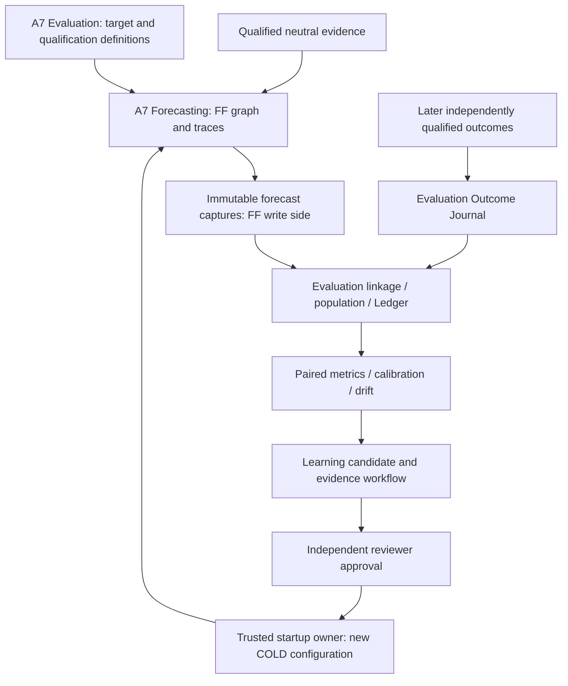

# TIAF A7 — Forecasting Framework Integration Reconciliation

## Current navigation — independent acceptance completed

**2026-09-15 (Asia/Kolkata): A7_ARCHITECTURE_ACCEPTED.** See the
[independent acceptance record](TIAF_A7_ARCHITECTURE_ACCEPTANCE.md).
A6 remains FROZEN, FF architecture ACCEPTED, A7 / FF implementation NOT_STARTED
and runtime NOT_IMPLEMENTED. FM/LFDE remains an optional advanced family.

The [bounded FF-0 implementation plan](TIAF_A7_IMPLEMENTATION_SEQUENCING_FF0_MINIATURE_PLAN.md) is complete
(**READY_FOR_FF0_IMPLEMENTATION**, planning only). It chooses synthetic captured-input
BaseRate mechanics, four FF-0 steps and a 28-case acceptance corpus. FF-0.1 is
next only under a separate implementation request; calibration stays at FF-2,
public capability publication stays separate, and runtime remains NOT_IMPLEMENTED.

Exact next prompt: **TIAF A7 / FF-0.1 — CONTRACTS, TARGET AND CLOCK FOUNDATION IMPLEMENTATION**.
The integration decision, findings, validation counts and then-next request below
are the unchanged historical reconciliation checkpoint, not today's queue.
No implementation, training, live work or A8 is authorized by acceptance.


## 1. Decision, scope and authority

**READY_FOR_A7_ARCHITECTURE_ACCEPTANCE**

Review date: **2026-09-14, Asia/Kolkata**. This is documentation/architecture
reconciliation, not independent A7 acceptance, runtime implementation, empirical
qualification, training or permission to publish a forecast.

```text
A6 FROZEN at tiaf-a6-baseline
FF ARCHITECTURE ACCEPTED; FF THESIS RECONCILED
A7 ARCHITECTURE RECONCILED AROUND FF
A7 THESIS RECONCILED AS NEEDED
A7 ARCHITECTURE ACCEPTANCE NEXT
FF IMPLEMENTATION NOT_STARTED / RUNTIME NOT_IMPLEMENTED
FM/LFDE PRESERVED AS ADVANCED FORECASTER FAMILY
```

HEAD and `tiaf-a6-baseline^{}` both resolve to
`6dc2ff304aae0e87540260b092919bb91e4d4189`. Entry was already dirty with
the earlier A7/FM/FF documentation and handbook artifacts. A fresh file-hash and
58-row deferral snapshot was taken before this pass; pre-existing work is
preserved. The attached integration brief supplies this task's documentation
scope, not authorization to execute its future training, promotion or service
examples. No runtime, A8 work, frozen-A6 change, live/provider/model/broker calls,
commit, tag or push occurs.

A7 is the **Forecasting / Evaluation / Governed Learning lifecycle umbrella**.
FF is its accepted forecasting platform. FM/LFDE remains one optional advanced
Forecaster family. No accepted FF contradiction requiring reopening was found;
the old A7 proposal needed explicit contract/status/ownership/stage alignment.

## 2. Evidence and review method

| Source | Inspection and use |
|---|---|
| [FF architecture](TIAF_FORECASTING_FRAMEWORK_ARCHITECTURE.md), [roadmap](TIAF_FORECASTING_FRAMEWORK_DETAILED_ROADMAP.md) | Accepted contract, graph, calibration, registry, clocks, journal/ledger, paired comparison, lifecycle and FF-0…FF-7 constraints |
| [FF decision](TIAF_FORECASTING_FRAMEWORK_DECISION_RECORD.md), [28-finding reconciliation](TIAF_FORECASTING_FRAMEWORK_THESIS_ARCHITECTURE_RECONCILIATION.md) | Single-owner decisions and original dispositions, not a new scientific mechanism |
| [Original FF HOLD](TIAF_FORECASTING_FRAMEWORK_ARCHITECTURE_ACCEPTANCE.md), [clock correction](TIAF_FORECASTING_FRAMEWORK_HISTORICAL_EVALUATION_CLOCK_SEMANTICS_CORRECTION.md), [repeat acceptance](TIAF_FORECASTING_FRAMEWORK_ARCHITECTURE_ACCEPTANCE_REPEAT.md) | FFA-B01 closure; mode/composition/calibration refinements and retained FFA-C01…C04 prerequisites |
| [A7 architecture](TIAF_A7_FORECASTING_EVALUATION_LEARNING_ARCHITECTURE.md), [roadmap](TIAF_A7_DETAILED_ROADMAP.md), [original reconciliation](TIAF_A7_RECONCILIATION_RECORD.md), [thesis reconciliation](TIAF_A7_THESIS_ARCHITECTURE_RECONCILIATION.md) | Every numbered architecture section, old five-slice scope, original 30 source findings and all 17 thesis findings |
| [A7 DOCX](TI_Forecasting_Evaluation_Learning_Thesis.docx), [PDF](TI_Forecasting_Evaluation_Learning_Thesis.pdf), [authoring source](handbooks/a7_forecasting/handbook.md), [record](TIAF_A7_FORECASTING_EVALUATION_LEARNING_THESIS_RECORD.md) | Actual TF-01…17 text in DOCX XML and PDF pp.36–38; model/calibration/benchmark/registry/shadow/drift/learning chapters; no regeneration or new layout acceptance |
| [FM architecture](TIAF_FM_LFDE_MARKET_STATE_FORECASTING_ARCHITECTURE.md), [roadmap](TIAF_FM_LFDE_DETAILED_ROADMAP.md), [decision](TIAF_FM_LFDE_DECISION_RECORD.md), [research](TIAF_FM_LFDE_RESEARCH_RECONCILIATION.md), [thesis record](TIAF_FM_LFDE_THESIS_RECORD.md) | Advanced-family relationship; tensor/K/Z/state/head/ablation and nested FM/L gates preserved, not generalized into a new mandatory platform |
| [R1–R5 pluggability](TIAF_PLUGGABILITY_ARCHITECTURE.md), [Source/Provenance](TIAF_SOURCE_AUTHORITY_PROVENANCE_CONTRADICTION_ARCHITECTURE.md) | Required scope, descriptive metadata, exact pins, optional adapters, trusted COLD owner, provenance/revisions and no confidence-as-truth shortcut |
| [Monitoring](TIAF_MONITORING_ARCHITECTURE.md), [Deployment](TIAF_DEPLOYMENT_ARCHITECTURE.md), [TI Shell](TIAF_TI_SHELL_ARCHITECTURE.md) | Separate scheduling/dispatch, current rights/retention and timeout/resource limits, caller-bound projection rather than SDK or execution access |
| [Capability Map](TIAF_CAPABILITY_MAP.md), [deferrals](TIAF_DEFERRAL_REGISTER.md), [milestones](MILESTONES.md), [system](TIAF_SYSTEM_ARCHITECTURE.md), [ecosystem](TIAF_TRADING_ECOSYSTEM_ARCHITECTURE.md) | Nine existing operations; A2–A6 ownership/freeze and A8/A9/A10 order; canonical deferrals unchanged |

Method: compare legacy responsibility and state names against exact accepted FF
owners; trace writes/revisions/linkage, compare mode clocks and qualification,
map every delivery obligation and thesis finding, then validate local links,
status, protected source regions, artifacts and scope. Supporting sources were
inspected at relevant ownership sections; this is not an exhaustive runtime
audit or a re-run of historical acceptance. No external literature or market
claims were needed.

## 3. Complete A7 old-to-new responsibility mapping

Legend: **A** = [A7 architecture](TIAF_A7_FORECASTING_EVALUATION_LEARNING_ARCHITECTURE.md);
**R** = [integrated roadmap](TIAF_A7_DETAILED_ROADMAP.md); **I** = this record.
Source section numbers refer to the entry architecture and remain stable.
“Normative change” distinguishes A7 alignment from changing accepted FF:
**no FF scientific/operator/clock policy is changed**.

| ID / A7 section | Classification | Old responsibility | New owner | Reason | Normative change? | Files updated |
|---|---|---|---|---|---|---|---|
| IM-01 / §1 | CLARIFY | Earlier reconciled draft and acceptance-next checkpoint | A7 umbrella status | FF interlude is accepted and integration now complete | Status/precedence only | A, R, I; navigation |
| IM-02 / §2 | MOVE_UNDER_FF | A7 forecast assessment policy and pinned model runtime | FF within A7 Forecasting | One stable primitive/composite execution seam | A7 ownership alignment | A §2.1–2.2, I |
| IM-03 / §3 + consumer alignment | KEEP_AS_IS | Binary next-session equity target and consumer limits | A7 Evaluation target policy | FF adopts this unchanged scientific event | No target/metric expansion | A, I |
| IM-04 / §3.1 | CLARIFY | A7-owned qualified calendar input and admission/label gates | Evaluation qualification; FF admission | One target/schedule policy, no calendar engine; absence follows FF | Owner and UNAVAILABLE alignment | A, R, I |
| IM-05 / §4 forecast rows | MOVE_UNDER_FF | A7 ForecastRequest and singular ForecastRun | FF contracts/run/graph closure | No duplicate forecast envelope or model-selected API | A7 adopts accepted FF contracts | A, R, I |
| IM-06 / §4 ForecastEvidenceV2 | CLARIFY | Proposed new A7 evidence result | Later lossless FF-to-consumer projection | Keep name as proposal, not alias to an insufficient old shape | Additive mapper/version gate; no A3 migration | A, R, I |
| IM-07 / §4 feature/dataset/journal/reports | MOVE_TO_EVALUATION | A7-wide data and scorecard artifacts | Evaluation qualification/contracts | Independent truth and population identity | Owner explicit; semantics retained | A, I |
| IM-08 / §4 training/registry rows | MOVE_TO_GOVERNED_LEARNING | TrainingRun and model events | Learning artifact/lifecycle custodian | One typed registry for all FF families/compositions | Ownership clarified | A §2.2/12, I |
| IM-09 / §5 + §5.1 | CLARIFY | PIT/feature governance and simulated fit clocks | Evaluation eligibility; Learning fit lineage; FF mode admission | All-dependency cutoff and accepted actual/simulated clocks | A7 adopts FF §3.2, not a new time policy | A §5.2, R, I |
| IM-10 / §6 + §6.1 | KEEP_AS_IS | Dataset partitions, walk-forward, split fingerprints | Evaluation protocol; Learning executes authorized fits | Keep chronology, whole sessions, purge/embargo/holdout | No scientific relaxation; stage refs updated | A, R, I |
| IM-11 / §7 + §7.1 | MOVE_TO_EVALUATION | Immutable journal/labels/facets/revisions | Evaluation single truth side | Models cannot own their labels | Owner explicit; no duplicate journal | A §7.2, I |
| IM-12 / §8 estimator | MOVE_UNDER_FF | Initial logistic as A7's direct forecast stack | B2 Logistic Forecaster at FF-1 | Conservative candidate, not the platform definition | Initial algorithm retained; seam/stage clarified | A, R, I |
| IM-13 / §8 calibrator fit | MOVE_TO_GOVERNED_LEARNING | Separately fitted sigmoid calibrator | Learning fit/store; FF wrapper application | Fit, application and qualification are distinct | No new calibrator; staged at FF-2 | A, R, I |
| IM-14 / §8 reliability + §8.1 | MOVE_TO_EVALUATION | Calibration admission evidence and policy | Evaluation qualification; reviewer approval; FF enforcement | No self-certification; population/mode/validity pins | Ownership/provenance explicit | A, R, I |
| IM-15 / §9 + §9.1 | MOVE_TO_EVALUATION | Controls, metrics, population-disposition report | Evaluation Benchmark/metric views, Ledger and paired manifest | One referee; full population and exact arms | FF comparison identity adopted; old report retained | A, R, I |
| IM-16 / §10 result status | DUPLICATE_REMOVE | FORECAST_AVAILABLE could mix generation and admission | FF generation plus separate consumer admission | GENERATED is not qualified probability; preserve non-success | Old draft generation alias superseded, no runtime migration | A §10/13.1, I |
| IM-17 / §10 economics | KEEP_AS_IS | Precision/coverage and future expected utility | Evaluation objective policy; TM operational decisions | Binary sign is not P&L, option POP or causal value | No | A, I |
| IM-18 / §11 | CLARIFY | Future A3/A4/A5/A6/Scanner/Monitoring seams | Separate consumers through approved FF projection | No recursion, automatic overlay or authority drift | Forecast seam reference only | A, I; navigation |
| IM-19 / §12 registry | MOVE_TO_GOVERNED_LEARNING | Model-only local registry/state sequence | Single typed artifact/events registry and candidate/shadow views | Model/composition/calibrator identity, not redundant registries | Adopt FF lifecycle/role mapping losslessly | A §2.2/12, R, I |
| IM-20 / §12 gates + §12.1 | CLARIFY | Fit/evaluate/shadow/advisory promotion flow | Learning proposes, Evaluation judges, reviewer approves, startup activates | Approval is not binding or trade permission | Explicit separation; numeric gates retained | A, R, I |
| IM-21 / §13 + §13.1 | MOVE_TO_EVALUATION | A7 pure drift assessment/admission precedence | Evaluation detects; FF enforces; Learning proposes correction | Missing evidence differs from deliberate abstention; no self-health | A7 status alignment to FF; fail-closed unchanged | A, R, I |
| IM-22 / §13.2 | CLARIFY | Issued-at validity window implicitly universal | FF ACTUAL validity; SIMULATED historical-only semantics | No simulated actual issuance or refreshed historical use-by | Mode-scoped adoption of accepted clocks | A, I |
| IM-23 / §14 | CLARIFY | A7 inference/replay/reproduction and logistic trace | FF capture/verifier; Evaluation report replay; Learning refit | Exact replay ≠ simulation ≠ tolerated numeric verification | Transitive graph/mode pins; tolerances not retuned | A, R, I |
| IM-24 / §15 | CLARIFY | Model training/inference/resource tiers | FF attempts/node usage; Learning jobs; Evaluation comparison | Unique shared work, unknown cost and timeout accountability | Accounting ownership explicit, no pricing/containment service | A, R, I |
| IM-25 / §16 | MOVE_UNDER_FF | A7 model-runtime/pluggability binding | FF reviewed COLD resolution, future versioned startup extension | R1–R5 survive; no generic plugin loader | Owner/stage alignment, no selectors implemented | A, R, I |
| IM-26 / §16 public surface | KEEP_AS_IS | Proposed assess/evaluate and replay kinds | Future caller-bound facade/Shell projection | No public train/promote/config edits; catalog nine | IDs remain proposals; post-FF-2 checkpoint | A, R, I |
| IM-27 / §17 | CLARIFY | Final A7 failure/replay corpus | Incremental FF stages plus scoped closure | Add graph/mode/unique-cost obligations without delaying old safety gates | Architecture-only fixture obligations | A, R, I |
| IM-28 / §18 advanced scope | DEFER | Ensembles, broad targets, optimization and operations outside v1 | Conditional FF-3…7 / nested FM gates / existing deferrals | Not all model families required; no silent activation | Scope placement clarified, no deferred runtime activated | A, R, I |
| IM-29 / roadmap five slices | DUPLICATE_REMOVE | A7.1…A7.5 would compete with FF-0…7 | FF stages inside A7 | Least duplicative hierarchy with complete old-obligation crosswalk | Delivery notation superseded | R, FF roadmap, I; navigation |
| IM-30 / unsafe inference from §12/18 | REJECT | Possible reading that a learned winner may activate or redefine target | Independent reviewer/startup authority only | Not an adopted old policy: explicitly reject authority crossover | Existing prohibition preserved | A, R, I |

No whole scientific requirement is rejected. IM-30 rejects an unsafe
interpretation, not a claim that legacy A7 authorized it. Changes to FF documents
are status, integration references and delivery notation only. Sections 2–18 of
accepted FF architecture remain unchanged.

## 4. Three owners and the record boundary



### Ledger terminology decision

The brief permits project-native terminology. Accepted FF §11 already defines
Forecast Ledger as an **Evaluation-owned immutable joined projection**. Retain
that; do not redefine it as a second writable forecast source-of-truth.
The forecast-side immutable artifact record is FF's ForecastResult/ForecastRun.
A7 §7.2 now specifies the write/append/revision/linkage/eligibility owner for
each record. Evaluation writes journal revisions and ledger snapshots; FF writes
forecast captures. No party overwrites actual issuance with a simulation.

Example (illustrative identities, no run performed): FF writes ACTUAL A1.
Evaluation later records J1 and produces L1. A corrected outcome yields J2/L2,
not mutation of A1/J1/L1. Learning may build candidate C2 and FF may compute
historical SIMULATED S2; Evaluation links S2 to the same observation and permitted
label revision, not a second independent market outcome. Comparison M2 declares
its mode policy and exact arms. Forecast A1 never receives future M2/J2 hashes.

### Benchmark, calibration and registry decision

Evaluation is the sole Benchmark Registry qualification/policy owner. That
registry is a versioned curated view over exact forecaster configurations in
Learning's one immutable artifact/lifecycle registry. FF has a startup resolution
view, not a second scientific registry. Model/Composition/Candidate/Shadow/
Promotion “registries” are typed manifests or event views, not distinct stores.

Learning fits and stores calibrator artifacts; FF applies exact wrappers;
Evaluation owns qualification/report/validity profiles. Reviewed scope, expiry,
health, target, population, mode and all transitive pipeline pins govern use.
A calibration ID is not qualification. Raw research remains visible without
claiming calibrated admission. Model/internal/outer calibration cannot be
silently replaced or applied twice.

## 5. Scientific referee, clocks and candidate governance

A7 Evaluation owns Ground Truth and label qualification, journal revisions,
observation and evaluation-population identity, paired manifests, metric
applicability, calibration evaluation, statistics, PIT context slices,
drift/degradation and promotion-evidence inputs. No forecaster judges itself.

Population identity binds **subject universe; observation/date set; realization-
mode policy; exact target/horizon/reference; cutoff policy; label definition and
revision; split/fold identity; eligibility filters; weighting/deduplication; exact
request/arm/artifact mapping**. Paired loss uses the eligible intersection but
coverage retains the intended population and union of outcomes. No silent
survivor selection or ambiguous merge by symbol.

Brier/log loss, reliability/calibration, coverage and abstention are primary
binary diagnostics; class/accuracy metrics are secondary. Economics requires
separate investable target/execution assumptions. Evaluation owns paired loss
differences, uncertainty intervals and time/session-aware comparison protocols;
test assumptions, minimum support and multiplicity remain preregistered policy.
UNKNOWN context stays visible; hindsight slices cannot qualify routing/MoE.

### Mode-specific evidence use

| Use | ACTUAL | SIMULATED | Cross-mode rule |
|---|---|---|---|
| Benchmark evaluation | Timely original issuance with qualified later outcome | PIT-qualified research with pinned historical as-of, real computation and profile | Only explicit preregistered matched mixed-mode research; no silent pooling |
| Calibration | Genuine actual-population reliability evidence | Fit/qualification provenance remains simulated | Simulated fit may later be applied actually only after independent applicability, shadow and approval; no reliability relabel |
| Promotion evidence | Required prospective shadow and operational reliability | Supporting historical candidate experiments | Simulated gains cannot substitute for required ACTUAL shadow |
| Drift | Actual input/forecast/coverage; mature labels for performance | Research sensitivity or simulated degradation diagnostics | Not evidence of actual operational health or permission to auto-correct |
| Replay | Preserve original actual clocks/result | Preserve original simulated clocks/result | Replay is an operation, not a realization mode or new issuance |

A7 §5.2 adopts the accepted nine clocks and strict pre-open rules verbatim in
meaning. Anti-backdating protects ACTUAL; SIMULATED records later real
`computed_at` with historical `simulation_as_of` and no `issued_at`.
Target resolution, source label availability and journal recording remain
distinct. A forecast needs qualified inputs and target timing, not future
outcomes; scoring needs qualified outcomes later. Learned/selected knowledge,
not just features, must be cutoff-safe. A new simulated fit need not have
physically existed at the historical cutoff.

### Promotion and active composition

1. Evaluation reports degradation/opportunity and independent evidence.
2. Learning proposes a candidate and obtains a bounded build/fit/recalibration grant.
3. Evaluation independently tests the exact candidate on PIT-safe paired data.
4. An authorized reviewer may approve scoped prospective shadow.
5. The startup owner binds a separate COLD shadow configuration; FF captures
   ACTUAL shadow with no decision influence.
6. Evaluation reports matured shadow/calibration/coverage/cost evidence.
7. Learning packages PromotionEvidence; an independent reviewer records
   approve/hold/reject PromotionDecision.
8. The trusted startup owner may select a new exact approved COLD binding.

Role, lifecycle, approval and binding are independent. Learning owns candidate
and shadow-campaign artifacts; FF owns graph semantics; the startup owner owns
the active selection. Rollback is another approved exact COLD configuration,
not a hot replacement or history rewrite. Trigger policy cannot self-activate,
change the target or widen authority. One human may hold reviewer/startup roles,
but the separate records and permissions remain mandatory.

### Optional families

FMLFDEForecaster is FF-5's advanced family, with tensor/K/Z/state/dynamics/
head/calibration and K/Z/K+Z ablations preserved. A7 Evaluation uses common truth,
controls and proper-loss/cost criteria; Learning trains/recalibrates candidates,
shadows and prepares evidence. No family-owned generic referee or ground truth.

LLMForecaster is optional FF-4 through the governed gateway. Evaluation checks
calibration, mode/vintage provenance, failure rate, cost/latency and paired value;
Learning can propose prompt/model/calibration versions or composition membership.
Unknown revision/training vintage is explicit. A current LLM historical query
would be current-model SIMULATED research, never proof of a historical response;
unqualified vintage/rights/overlap cannot support PIT claims. No call occurs here,
no privilege is granted, and captured replay need not imply exact recomputation.

## 6. Failure ownership and cost evidence

| Condition | Classifier / preserved result | Consequence |
|---|---|---|
| Unsupported exact target/horizon/domain | FF admission → UNSUPPORTED | No value; Evaluation reports the intended request |
| Missing/unapproved/expired model or required calibration | FF admission from registry/qualification → UNAVAILABLE | No fabricated neutral probability or latest-model fallback |
| Missing/stale/unqualified required evidence | Evidence qualification + FF admission → UNAVAILABLE | Legacy A7 missing-input ABSTAINED wording is superseded |
| Legitimate selective abstention or qualified vote tie/quorum shortfall | FF instrument/operator → ABSTAINED with exact reason | Preserve fixed electorate and accepted §7.2 voting truth table |
| Child timeout/invalid response/execution failure | Child FAILED with attempt cause/usage; required parent UNAVAILABLE | Not a legitimate abstention vote; no repaired topology/renormalization |
| No qualified child | FF operator admission with original reasons | UNAVAILABLE for failed required dependencies; legitimate all-abstain voting follows accepted ABSTAINED rule |
| Ground Truth pending/unavailable | Evaluation journal label/window facets | No supervised score, no invented zero; original forecast still exists |
| Invalid/ambiguous outcome | Evaluation → INELIGIBLE/AMBIGUOUS for affected label | No binary class fabricated; revisions append |
| Insufficient paired/sample/cohort population | Evaluation → NOT_EVALUABLE or protocol-inconclusive report | No PASS from zero rows, narrow successful subsets or pooled regimes |
| Simulated feature/fit/selection leakage | Evaluation qualification; FF request admission if known before generation | Ineligible study/no qualified output; later discovery invalidates use without rewriting the original capture |
| Corrupt capture, denied caller or budget admission | Owning outer integrity/authority/budget contract | Preserve outer cause; never a market opinion |
| Missing exact verifier/artifact closure | FF/Evaluation replay owner → UNVERIFIABLE verification | No current execution fallback; recorded replay succeeds only if its own capture is intact and permitted |

This applies accepted FF categories to unimplemented A7, not a runtime enum
migration. Final namespaced reason codes remain FF-0/FF-3 fixtures (FFA-C01).
Do not use generic “unavailable/abstain” prose to override operator truth tables.

FF emits per-node attempt counts, latency, provider/model/token/cost records and
operator/calibration overhead. Learning emits fit/simulation-build/trial usage.
Evaluation compares complexity versus paired value, with all failures retained.
Charge shared nodes once and retries separately; never add parent-inclusive
totals to child work. Elapsed critical path differs from summed work.
UNKNOWN/UNPRICED and held unsettled usage are not zero; a strict monetary cap
cannot admit unknown pricing. No cost optimization, live pricing or hard process
containment is delivered.

## 7. Miniature and stage reconciliation

Canonical notation is **A7 contains FF-0…FF-7 unchanged**.
The [complete five-slice crosswalk](TIAF_A7_DETAILED_ROADMAP.md#historical-five-slice-crosswalk)
removes the duplicate old A7.1…A7.5 delivery queue. No new A7.x numbers are created.

| Milestone of understanding | Bounded result | Does not establish |
|---|---|---|
| FF-0 | One target, qualified truth/journal contracts, B0 singleton mechanics, both mode contracts, capture/replay boundary | Empirical comparative value, trained logistic or calibration |
| FF-1 | B0 + B2 logistic, raw research, exact population/labels, Ledger and paired evaluation/replay | Calibrated advisory admission or production PRIMARY |
| FF-2 | Held-out sigmoid, independent qualification, registry/lifecycle/shadow/approval and full miniature replay | Public facade/Shell publication or automatic A4/A5/A6 influence |
| Post-FF-2 publication checkpoint | Separately accepted caller-bound lossless projection and explain/trace | Public training/promotion/config-edit or broker authority |
| Conditional FF-3…7 | Bounded additional families/composites/correction/routing when justified | Mandatory completion of every rung or autonomous activation |

The first otherwise-qualified ACTUAL inference need not await successful
historical simulation/backfill. Both mode contracts and negative fixtures begin
in FF-0; full miniature evaluation/calibration/shadow/replay obligations remain.
FF-1 can compare qualified ACTUAL pairs or qualified SIMULATED pairs. Calibration
completion stays at FF-2. This resolves FFA-C02's integration sequencing request,
not its future empirical or implementation obligations.

Benchmark ladder stays bounded: B0 required, B2 initial candidate and later
control, B1 optional persistence, B3 one conventional challenger, optional B4
kNN/B5 simple calibrated ensemble, B6 K-only before LFDE claims. Not all belong
in FF-0, and an advanced challenger is never primary by reputation.

## 8. A7 thesis reconciliation

The unchanged 39-page creation edition is a non-normative historical handbook.
Original TF-01…TF-17 titles/classifications/dispositions are preserved in the
[earlier record](TIAF_A7_THESIS_ARCHITECTURE_RECONCILIATION.md). The following
**integration classifications are a separate axis**, not revised old verdicts.

| Finding | Integration classification | Current interpretation / destination |
|---|---|---|
| TF-01 Binary target usefulness | STILL_VALID | Exact underlying diagnostic remains; no claimed A6/option/utility improvement |
| TF-02 Next-session calendar dependency | STILL_VALID | Evaluation owns qualified schedule/label policy; FF references it, no engine |
| TF-03 Calibration sample adequacy | REFRAMED_UNDER_FF | Evaluation protocol across FF pipelines/populations; concrete gates before FF-1 work and FF-2 qualification |
| TF-04 ECE binning and uncertainty | REFRAMED_UNDER_FF | One Evaluation metric catalog/protocol, not a per-model self-certification rule |
| TF-05 Promotion thresholds/review independence | STILL_VALID | Independent reviewer, predeclared evidence, fresh test after result-driven change |
| TF-06 Regime stability | STILL_VALID | Required PIT cohorts/UNKNOWN support; no hindsight narrowing or auto-routing |
| TF-07 Shadow duration/information | NEEDS_CLARIFICATION | Clarified by A §5.2/12: prospective ACTUAL, not simulated role=SHADOW; FF-2 owns internal campaign gates |
| TF-08 Drift and delayed labels | REFRAMED_UNDER_FF | Evaluation detects; FF enforces health; Learning proposes, Monitoring later dispatches |
| TF-09 First-class outcome-availability report | STILL_VALID | Keep constrained EvaluationPopulationDispositionReport; Ledger references it, not a replacement journal |
| TF-10 Actions/selection | STILL_VALID | Unadjusted same-basis exclusion and availability/revision/selection bias preserved |
| TF-11 Reproduction tolerance | NEEDS_CLARIFICATION | Clarified by A §5.2/14: graph/mode/original clocks preserved, verifier time separate, new simulation distinct |
| TF-12 Model registry scope | REFRAMED_UNDER_FF | One typed artifact/lifecycle registry for models/compositions/calibrators; separate resolution/benchmark views |
| TF-13 Attribution presentation | REFRAMED_UNDER_FF | Logistic remains raw-logit explanation inside FF trace; other families retain their own attributable trace; no heavy explainer |
| TF-14 A4/A5/A6 admission | STILL_VALID | No automatic overlay or inherited forecast permission |
| TF-15 Staleness | NEEDS_CLARIFICATION | Clarified by A §13.2: actual use-by versus hypothetical simulated validity; no actual issuance fabricated |
| TF-16 Advanced families/targets | DEFERRED | Conditional FF/FM scope and existing gates, not mandatory miniature or new canonical deferrals |
| TF-17 Deterministic independence | STILL_VALID | Both valid-baseline preservation and invalid-baseline non-rescue remain required |

Totals: **8 STILL_VALID, 5 REFRAMED_UNDER_FF, 3 NEEDS_CLARIFICATION (resolved in
this pass), 1 DEFERRED**. No unresolved thesis blocker remains; original 11/1/1/3/1
finding-classification totals and their historical decisions remain intact.

### Other affected handbook claims, including stage assumptions

| Chapters / claim | Integration classification | Resolution |
|---|---|---|
| Ch.1–5: A7 forecasting and exact target | REFRAMED_UNDER_FF | A7 umbrella, FF seam, Evaluation target; exact event unchanged |
| Ch.14–16: direct logistic/sigmoid initial stack | REFRAMED_UNDER_FF | B0/B2 scientific choice retained; FF-1 raw / FF-2 calibrated stages, not all-family mandate |
| Ch.19–23: model/shadow registry and learning flow | REFRAMED_UNDER_FF | Shared typed registry; separate role/lifecycle/approval/COLD binding |
| Ch.17/32: generic absence/FORECAST_AVAILABLE wording | SUPERSEDED | FF generation statuses and separate consumer eligibility; missing required evidence UNAVAILABLE |
| Ch.5/21/29: unqualified issue-before-outcome or replay language | NEEDS_CLARIFICATION | Applies to ACTUAL/prospective claims; SIMULATED and verifier clocks explicitly distinct |
| Ch.24–28: consumer, Scanner, Monitoring | STILL_VALID | Advisory, acyclic, separately published seams; no scheduling/operational authority here |
| Ch.31/35: complexity tiers and deferred advanced models | REFRAMED_UNDER_FF | Conditional FF/FM stages; no advanced family prerequisite |
| Ch.35 and A7.x references throughout | SUPERSEDED | Canonical FF stages within A7; historical five-slice crosswalk retains all obligations |

No DOCX/PDF rewrite is necessary. Their creation-era status, examples and then-
open findings are preserved; current record preambles link this resolved reading.

## 9. Boundaries, deferrals and remaining prerequisites

No canonical deferral change is needed or made. The **entire Deferral Register
file remains byte-for-byte unchanged**, not just its 58 canonical rows. Its dated
A7.x/FF-integration-next notes are historical locators superseded by this record
and the current forward queue, not an alternative active roadmap.

| Retained scope | Destination / guard |
|---|---|
| Qualified schedules, action policy, arbitrary historical PIT | DEF-007/013/049; source supply not established by contract design |
| Indicator optimization, option/path/PoP and cross-candidate rank | DEF-024/040–044/053; binary endpoint cannot silently answer those objectives; FFT-08 remains separately gated |
| Durable monitoring/acquisition, stores and scale | DEF-010/050/051; no daemon/queue/backfill from Evaluation |
| LLM production/pricing | DEF-052/055; optional FF-4 does not close broader runtime or pricing obligations |
| HOT / new peers/publication | DEF-057/058; COLD only and separate facade/consumer acceptance |
| Transfer learning, multimodal/graph, state dynamics, Monte Carlo, new targets | Nested FM/L research gates and independently qualified hypotheses; not moved into FF-0/1/2 |
| Advanced routing/stacking/MoE | Conditional FF-7; FFT-28 retained, no hindsight specialization or automatic activation |

TI Monitoring may later request an admitted forecast or reevaluation and carry
typed evidence/outcome needs, but does not own Ground Truth, labels, benchmark
policy, promotion or active graph. A7 supplies pure semantics; Monitoring/A10
owns separately authorized recurring dispatch/recovery. TM retains operational
governance/risk/capital/action coordination; the broker retains live execution
truth. Forecast promotion is not trade authorization.

No capability metadata/runtime publication occurs. Nine current operations
remain unchanged. Proposed assess/evaluate/replay support remains subject to
separate exact projection/discovery/authority tests; no new `forecast.compare`
or public training/promotion operation is invented.

Residual implementation prerequisites: qualified datasets and rights; concrete
feature/native schema/serializer/dependency pins; preregistered numeric
metric/support/uncertainty/health/shadow/resource profiles; lossless event/role/
projection fixtures; capture/retention/current access and exact verifier closure;
unique-attempt/unknown-cost/timeout accounting; later facade/Shell acceptance.
FFA-C01, C03 and C04 remain their bounded implementation follow-ups; C02's stage
mapping is now explicit. None is claimed implemented or empirically satisfied.

## 10. Exact files and validation

Changes relative to this pass's entry, not the entire pre-existing dirty worktree:

| File | Change |
|---|---|
| `docs/TIAF_A7_FORECASTING_FRAMEWORK_INTEGRATION_RECONCILIATION.md` | New complete ownership, thesis, stages, boundaries and validation record |
| `docs/TIAF_A7_FORECASTING_EVALUATION_LEARNING_ARCHITECTURE.md` | FF ownership/contract/status/mode integration; shared Evaluation/Learning registry and write-side seams; scientific baseline retained |
| `docs/TIAF_A7_DETAILED_ROADMAP.md` | Canonical FF-0…FF-7 under A7, full legacy crosswalk, publication/closure checkpoints and retained gates |
| `docs/TIAF_A7_RECONCILIATION_RECORD.md` | Current navigation preamble; original 30 findings/body retained |
| `docs/TIAF_A7_THESIS_ARCHITECTURE_RECONCILIATION.md` | Current preamble; original 17 finding decisions/body retained |
| `docs/TIAF_A7_FORECASTING_EVALUATION_LEARNING_THESIS_RECORD.md` | Current preamble; unchanged creation/artifact history |
| `docs/TIAF_FORECASTING_FRAMEWORK_ARCHITECTURE.md` | Current status and §20 integration references; accepted §§2–18 unchanged |
| `docs/TIAF_FORECASTING_FRAMEWORK_DETAILED_ROADMAP.md` | Integrated stage notation/current gate; no stage scope or scientific gate change |
| `docs/TIAF_FM_LFDE_MARKET_STATE_FORECASTING_ARCHITECTURE.md` | Relationship/current-gate clarification only; scientific internals unchanged |
| `docs/TIAF_FM_LFDE_DETAILED_ROADMAP.md` | Nested FF-5 relationship/current sequence, no research-gate change |
| `docs/TIAF_FM_LFDE_DECISION_RECORD.md` | Current relationship/navigation preamble; original body retained |
| `docs/TIAF_FM_LFDE_RESEARCH_RECONCILIATION.md` | Current relationship/navigation preamble; research decisions/source body retained |
| `docs/TIAF_FM_LFDE_THESIS_RECORD.md` | Current relationship/navigation preamble; original creation/body/artifacts retained |
| `README.md` | Dashboard, active path and next steps |
| `docs/ARCHITECTURE.md` | Architecture index and current integration navigation |
| `docs/IMPLEMENTATION_ROADMAP.md` | Independent A7 architecture acceptance next; one stage hierarchy |
| `docs/MILESTONES.md` | Current milestone/status and integrated stage crosswalk, no new tag |
| `docs/README_TBD_DESIGN_NOTES.md` | Current idea-to-normative navigation |
| `docs/TIAF_CAPABILITY_MAP.md` | Design status; no published/runtime capability changes |
| `docs/TIAF_IMPLEMENTATION_TARGETS.md` | Replace current five-slice queue with canonical FF-stage references |
| `docs/TIAF_SYSTEM_ARCHITECTURE.md` | Umbrella/FF ownership and next gate |
| `docs/TIAF_THESIS.md` | Current reference/navigation, not binary thesis regeneration |
| `docs/TIAF_TRADING_ECOSYSTEM_ARCHITECTURE.md` | Current FF/A7 status; operational authority unchanged |
| `docs/TRADINGINTELLIGENCE_ROADMAP.md` | Current major-to-local sequence; A8/A9/A10 unchanged |

### Fresh validation results

| Check | Result |
|---|---|
| `git diff --check` | PASS; tracked patch has no whitespace errors |
| Additional untracked Markdown whitespace | PASS for all 13 in-scope untracked Markdown files via `git diff --no-index --check -- /dev/null <file>` |
| Existing local-link validator, worktree mode | PASS: **1,277 local links across 35 Markdown files**, including local heading anchors; no network |
| Status/navigation and hierarchy | PASS: 17 current design/navigation documents, including 11 navigation files, point to exact A7 architecture acceptance title; eight canonical FF stage headings, no active numbered A7.x hierarchy |
| Ownership/claim/report accounting | PASS: 30 responsibility rows, all 18 original architecture sections covered, 17 unique thesis rows (8/5/3/1), 38 complete handoff rows |
| Original findings | PASS: original 30 A7 source findings and 17 A7 thesis decisions retained in unchanged record bodies; all 17 original classifications matched against actual DOCX XML; 28 FF findings retained |
| Historical body integrity | PASS: six A7/FM record bodies unchanged after newly inserted current-navigation preambles |
| Accepted science integrity | PASS: FF architecture §§2–18 and FM architecture §§2–19 byte-for-byte equal to entry; FM roadmap scientific gates §§4–10 unchanged |
| Clock boundary logic | PASS: **12 standalone documentation assertions**, including timely/late/backdated/equal-open actual, later simulation/no actual issue, cutoff/as-of/completion ordering, learned-label knowledge boundary and aware `+05:30`; not FF runtime tests |
| Deferral integrity | PASS: all 58 canonical rows and entire register file byte-for-byte unchanged; no new or closed deferral |
| Thesis/artifact integrity | PASS: all six A7/FM/FF DOCX/PDF hashes unchanged; three DOCX package CRC/XML checks and three PDF text extractions readable; all 37 associated source/build/chart/page-map files unchanged; no new visual-layout acceptance claimed |
| Frozen scope and A8 | PASS: 15 A6 architecture/reference files unchanged; A8–A10 sections in milestone/major roadmaps unchanged; no runtime/source/tests/scripts/dependency edits |
| Catalog and Git identity | PASS: static AST confirms nine facade operation IDs, no forecast publication; HEAD and A6 tag targets unchanged |
| Scope relative to entry | PASS: **23 existing Markdown files updated + one new record**; 205 → 206 README/docs files, 182 entry files unchanged, zero removed |

The link check initially found the old roadmap's `unresolved-choices-and-gates`
anchor missing after restructuring; the stable heading was restored. An extra
EOF blank line in this new record was removed. A whole-file whitespace probe
also surfaced pre-existing Markdown hard-break spaces in the tracked major
roadmap; those unrelated lines were preserved. The tracked diff check and the
13-file untracked check pass. No runtime defect was found or fixed.

Local validation used `.venv/bin/python -B` to import
`docs/handbooks/forecasting_framework/validate_handbook.py` and invoke
`validate_links(True)`, plus read-only hash, table, clock, AST, DOCX/PDF and
status assertions. No validator, authoring script or test file was edited.
Runtime tests are not required for this documentation-only pass and were not
run; historical runtime test counts are not presented as fresh results.

## 11. Complete 38-item handoff

| # | Requested report item | Result / location |
|---|---|---|
| 1 | Decision | READY_FOR_A7_ARCHITECTURE_ACCEPTANCE |
| 2 | Files changed | §10 exact list, one new plus 23 updated Markdown files |
| 3 | Old-to-new mapping | §3, all 18 original architecture sections and roadmap/surface assumptions, 30 rows |
| 4 | FF ownership inside A7 | §§3–4; inference contracts/DAG/runtime/write-side capture |
| 5 | Evaluation ownership | §5; independent truth/qualification/comparison/referee |
| 6 | Governed Learning ownership | §5; proposals, authorized fits, candidate/shadow/registry and evidence packaging |
| 7 | Forecast Ledger | §4; project-native Evaluation-owned immutable joined projection; FF owns underlying captures |
| 8 | Outcome Journal | §§4–5; Evaluation append/revision owner, later independent truth |
| 9 | Benchmark Registry | §4; Evaluation curated authoritative view, no duplicate artifact registry |
| 10 | Calibration | §4; Learning artifact, FF application, Evaluation qualification, reviewer approval |
| 11 | Drift | §§5–6; Evaluation detects, FF enforces, Learning consumes, Monitoring dispatches later |
| 12 | Promotion | §5 eight-step actor-separated pipeline |
| 13 | Active composition | §5; trusted startup selection, candidate graphs Learning-owned, FF semantics, COLD rollback |
| 14 | ACTUAL/SIMULATED | §5; accepted clocks, mode-specific evidence and no silent pooling |
| 15 | Historical research | §5; new SIMULATED artifact, not retroactive issuance |
| 16 | FM/LFDE | §5; optional advanced FF family, shared science and retained internals |
| 17 | LLM | §5; optional governed primitive, no privilege or invented vintage/calibration |
| 18 | Benchmark ladder | §7; B0/B2 first, other rungs conditional |
| 19 | Population identity | §5 exact fields and per-arm/mode lineage |
| 20 | Metrics | §5 Evaluation applicability/definitions; proper scores, coverage, qualified economics later |
| 21 | Statistics | §5 paired loss/uncertainty/time-aware protocols; no retuned thresholds |
| 22 | Regime/context | §5 PIT membership, UNKNOWN and no hindsight routing |
| 23 | Registry simplification | §4 one typed artifact/lifecycle store with views |
| 24 | Failures | §6 actor/classification matrix, no numerical absence |
| 25 | Cost/latency | §6 per-node unique attempts, jobs, totals and Evaluation trade-offs |
| 26 | Miniature | §7 FF-0/1 raw mechanics and FF-2 calibrated/lifecycle completion |
| 27 | Stage model | §7 A7 contains FF-0…FF-7; no second A7.x hierarchy |
| 28 | Thesis reconciliation | §8 all 17 findings plus eight affected claim groups; artifacts unchanged |
| 29 | A7 architecture changes | §3 explicit contracts/owners/clocks/status/stages, no target or numeric tuning |
| 30 | FM relationship | §§5/10 relationship text only, family science preserved |
| 31 | Deferrals | §9 entire register unchanged, all 58 rows retained |
| 32 | Capability consequences | §9 proposed-only surface; current nine operations unchanged |
| 33 | Monitoring | §9 future invocation/dispatch, no truth/promotion ownership |
| 34 | TM/broker | §9 operational authority/live execution truth outside TI |
| 35 | Validation | §10 fresh documentation/integrity checks, no runtime test claim |
| 36 | Residual blockers | None for independent architecture-review readiness; no empirical readiness implied |
| 37 | Implementation prerequisites | §9 qualified data/profiles/schema/runtime/capture/publication gates remain |
| 38 | Exact next prompt | TIAF A7 — ARCHITECTURE ACCEPTANCE |

Independent A7 acceptance must still challenge the contract/owner crosswalk,
first operation versus complete miniature, population/mode/label lineage,
failure mapping and the no-authority-crossover boundary. This reconciliation
does not accept itself as the final A7 architecture or authorize implementation.
No commit, tag or push.
