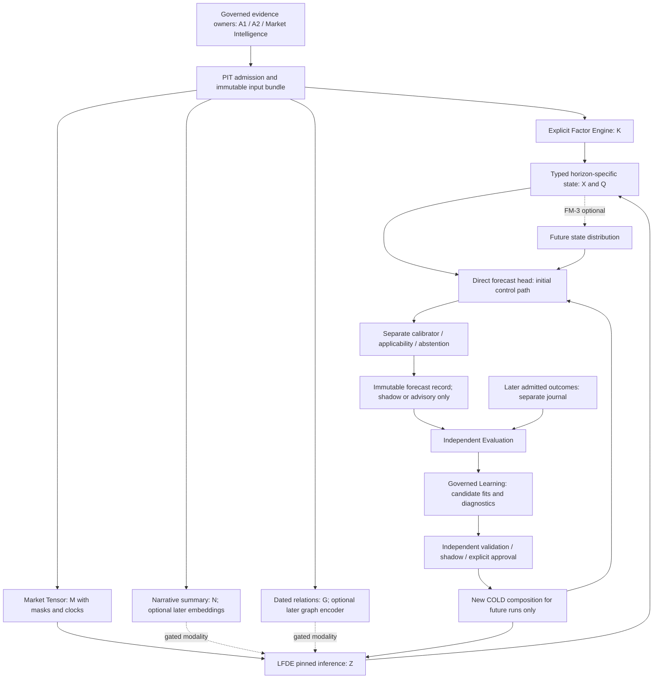
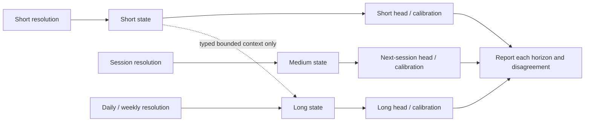
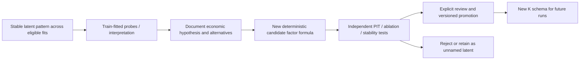
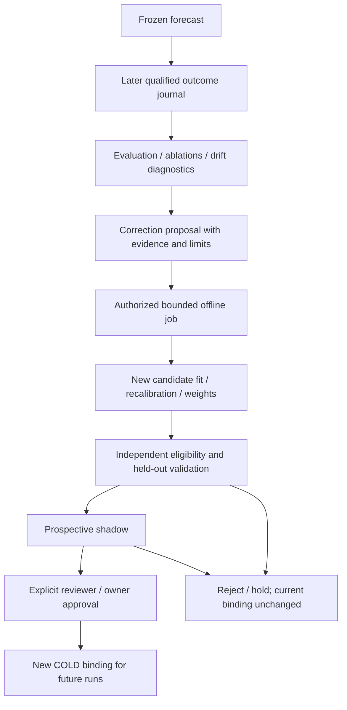
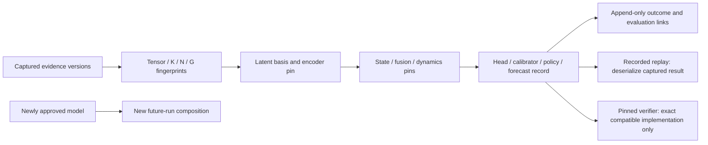

# FM / LFDE — Market-State Forecasting Architecture

## 1. Status, decision and limits

**2026-09-15 (Asia/Kolkata): ARCHITECTURE DRAFT;
FM/LFDE REPOSITIONED AS ADVANCED FORECASTER FAMILY; RUNTIME NOT_IMPLEMENTED.**
Alignment: **ALIGNED_WITH_CONSTRAINTS**. FM is the **Forecasting Module**;
LFDE is the **Latent Factor Discovery Engine**. Neither name denotes a deployed
service or a foundation-model purchase. This document proposes a bounded
scientific design; it does not approve implementation, models or datasets.

The [Forecasting Framework (FF)](TIAF_FORECASTING_FRAMEWORK_ARCHITECTURE.md)
is now the stable forecasting platform. This document defines the scientific
internals of **FMLFDEForecaster**, one replaceable advanced family inside FF,
not forecasting as a whole. Tensor/K/Z/state/dynamics/head/uncertainty work is
retained. Other FF forecasters need not adopt those internals. Shared targets,
ground truth, comparison, composition and lifecycle follow FF and A7-wide
Evaluation/Learning ownership; this family does not create competing services.

A6 remains frozen at `tiaf-a6-baseline`. The
[A7 integration reconciliation](TIAF_A7_FORECASTING_FRAMEWORK_INTEGRATION_RECONCILIATION.md)
now places this family in **A7 → Forecasting → FF → FMLFDEForecaster**.
A7 is [ARCHITECTURE ACCEPTED](TIAF_A7_ARCHITECTURE_ACCEPTANCE.md);
implementation sequencing / FF-0 miniature realization planning is NEXT.
This accepts the platform/umbrella boundary, not this family's empirical readiness.
This relationship update changes no tensor/K/Z/state/dynamics/head, ablation,
transfer-learning, graph, Monte Carlo or family stop gate. Generic truth,
benchmarking, calibration qualification and drift remain A7 Evaluation-owned;
candidate fits/recalibration/shadow/registry remain A7 Governed Learning-owned.
The [FM/LFDE thesis](TIAF_FM_LFDE_THESIS_RECORD.md) is already CREATED and retained
unchanged as its historical advanced-forecaster edition. Its 24 findings are
dispositioned in the [FF decision record](TIAF_FORECASTING_FRAMEWORK_DECISION_RECORD.md).

Companions: [research and primary sources](TIAF_FM_LFDE_RESEARCH_RECONCILIATION.md),
[staged roadmap](TIAF_FM_LFDE_DETAILED_ROADMAP.md),
[decision record](TIAF_FM_LFDE_DECISION_RECORD.md).
Requirements here govern the **proposed** design, subordinate to accepted
[system ownership](TIAF_SYSTEM_ARCHITECTURE.md),
[source authority](TIAF_SOURCE_AUTHORITY_PROVENANCE_CONTRADICTION_ARCHITECTURE.md)
and [pluggability](TIAF_PLUGGABILITY_ARCHITECTURE.md). They add no runtime contract.

### Scope guardrails

1. Structured numerical/categorical market evidence only; **no chart images**.
   CV-inspired masking/encoding may operate on numeric tensors, not screenshots.
2. No initial RL, autonomous trading, model self-activation or live self-rewriting.
3. One initial target, small qualified population, classical controls and one
   nonlinear representation hypothesis. No mandatory model zoo.
4. Keep A2/A4/A5/A6 visible, callable and unchanged without FM/LFDE. A2 scores
   are deterministic benchmark outputs, **not probability labels**.
5. No automatic A4/A5/A6 overlay, scanner ranking, position action or A6 POP.
   TM retains risk/capital/action authority; broker execution remains external.
6. Every added model/modality pays its PIT, ablation, calibration, reproducibility
   and measured-resource costs. Rejecting LFDE is a successful scientific result.
7. Offline learning needs separately authorized bounded jobs; this pass runs none.
   No provider/model/broker call or runtime scheduler is introduced.

## 2. Architecture and ownership



Solid arrows show proposed data dependencies, not running services. Dashed
arrows are conditional later scope. The minimal direct head does **not** require
a state-dynamics model. Training lives outside the inference graph.
The inference portion is internal to the FF **FMLFDEForecaster** node; the
Evaluation, Learning and COLD-binding boxes are shared infrastructure, not
family-owned replicas. An FF run may select this node alone, as CHALLENGER or
SHADOW, later as an approved PRIMARY/BENCHMARK, an ensemble member or a routed
expert. “Standalone” never bypasses the common request/result and truth contracts.

| Object / decision | Owner | Boundary |
|---|---|---|
| Native observations, canonical facts, revisions, contradictions | Existing provider-neutral evidence owners | Models cannot manufacture or silently resolve canonical facts |
| Tensor admission/schema and deterministic K transforms | Future FM input/feature policy | Consume captured facts; do not retune/recalculate frozen A2 |
| Encoder weights, latent basis, training data/fit manifest | Governed Learning | New artifact only; no inference-time training |
| Latent snapshot, state and forecast | FM pinned inference | Estimate under a named model; no semantic ownership of market truth |
| Outcome label, matched scorecard, ablation and diagnosis | Independent Evaluation | Cannot change an old prediction, choose a trade or approve its own candidate |
| Candidate proposal and promotion report | Governed Learning | Eligibility report is not activation |
| Approval, denial and COLD binding | Trusted owner / explicit independent reviewer | Approved versions affect new runs only |
| Position advice / expression candidate | A5 / A6 respectively | Future consumer policy requires separate acceptance |
| Operational action / actual fills | TM / broker respectively | No FM/LFDE authority |

## 3. Mathematical contract

### 3.1 Information set and current state

Let `t` be a **decision cutoff instant**, not just a bar's event date. For an
observation version `o`, distinguish event time, publication time, provider
availability, local acquisition/admission and revision identity. Define:

```text
O_t = {versioned observations eligible under the pinned PIT/admission policy at t}
K_t^(vK) = g_vK(O_<=t)
M_t = Tensor_vM(O_<=t; universe, resolutions, channels, masks, scaler)
N_t = Narrative_vN(admitted intelligence_<=t)
G_t = (V_t, E_t^explicit, E_t^learned)
Z_t^(phi) = E_phi(M_t, N_t, G_t)                 # unavailable modalities explicit
X_t^r = F_psi^r(K_t^r, Z_t^r, Q_t^r)           # r = short / medium / long
```

`O_<=t` denotes the eligible history, not all retrospectively downloadable data.
For an actual historical-system replay, data must have been captured/admitted
and the bound model usable by that decision cutoff. A retrospective experiment
may have later acquisition but needs independently qualified historical
availability and must label that distinction. Without it, the experiment is
not evidence of exact historical knowability. Model fit eligibility has its own
cutoff, covering feature preprocessing, encoder pretraining and label maturity.

`K` is explicit because its formula is specified—not because it is causally
true. `Z` is a learned representation in a version-specific basis, not an
identified economic factor vector. `Q` is a typed envelope of quality,
freshness, uncertainty and lineage, not a probability or a learned authority
score. Admission uses Q. Predictive use of any Q-derived mask/age feature must
be separately allowlisted and tested; operator decisions, later corrections
and future label status are never inputs.

### 3.2 State estimation is not future-state knowledge

The initial fusion is deterministic typed concatenation/projection. Its
uncertainty is **not** automatically a posterior distribution. A later explicit
probabilistic state model may define `q_eta(x_t | O_<=t)`. Current-state
uncertainty and future process uncertainty then enter prediction separately:

```text
q_eta(x_t | O_<=t)                       current filtered state distribution
p_theta(x_(t+h) | x_t, O_<=t)            state dynamics
p_beta(y_(t+h) | x_t, x_(t+h), H, B)     outcome head, horizon H and price basis B

P_raw(y | O_<=t, H, B)
  = integral integral p_beta(y | x_t, x_future, H, B)
                      p_theta(x_future | x_t, O_<=t)
                      q_eta(x_t | O_<=t) dx_future dx_t

P_hat = Cal_kappa(P_raw; exact target and calibration population)
Y*_(t+h) = Label_vY(later qualified observations; exact target/window/basis)
loss = L(P_hat, Y*_(t+h))
Delta_Z = mean_pair[L(P_hat_K, Y*) - L(P_hat_KZ, Y*)]
```

For the initial direct head, use `P_raw(y | K_t, Z_t, Q_allowed, H, B)` instead
of these state integrals. That is a declared modeling simplification, not a
claim that X is the true sufficient Markov state. A deterministic-state model
can use a point mass but must not report missing state uncertainty as zero.

Actual `X_(t+h)` is **not available at inference**. Training state reconstruction,
smoothed HMM labels or variational posteriors conditioned on realized outcomes
must not enter forecast features. Dynamics may retain eligible history if X
is not sufficient; a Markov restriction requires an explicit assumption/test.
Latent states lack direct ground truth: evaluate observable proxies and
downstream proper loss rather than asserting exact “state accuracy.”

Each head can estimate a marginal distribution independently. Multiple heads
or horizons do not automatically define a coherent **joint path distribution**.
Such dependence needs its own model and validation before path simulation.

## 4. Market Tensor and PIT assembly

Use a logical **multi-resolution tensor bundle**, not a giant indiscriminate
feature cube:

```text
MarketTensorBundle(t)
  short:  M_s in R^(A_s x T_s x C_s), observation / padding / masking arrays
  medium: M_m in R^(A_m x T_m x C_m), observation / padding / masking arrays
  long:   M_l in R^(A_l x T_l x C_l), observation / padding / masking arrays
  axis manifests + clocks + schema/scaler versions + evidence references
  optional N_t and G_t references (not raw text pasted into numeric channels)
```

The initial experiment selects **one resolution bundle and bounded universe**
sufficient for the next-session target. The architecture permits more; it does
not require building all resolutions, modalities or an all-market universe.
The scientific profile must choose and identify either one target asset plus
separately qualified context or a bounded multi-asset panel; neither implies
an all-market tensor requirement. The axis manifest distinguishes targets from
context members. Asset count, lookback and dimensions remain profile choices,
not public request knobs or newly fixed numerical defaults.

| Contract aspect | Proposed invariant |
|---|---|
| Subject / asset axis | Provider-neutral stable instrument IDs, venue and class; ordered dated membership; distinguish stock/sector/index/FX rather than pretend equal economic units |
| Asset ordering | Explicit manifest and stable ID mapping; order alone is not economic proximity; new/missing/delisted members have membership masks, not silently shifted columns |
| Time axis | Ordered completed observations mapped to supplied qualified sessions; event interval and actual eligible availability both retained |
| Channel ordering | Versioned feature ID, formula owner, unit, source family, transformation and validity requirement per channel |
| Initial channels | Small captured A2 trend/momentum/volatility/participation projections and qualified return/volume transforms; exact allowlist selected before fitting |
| Later channels | Breadth, sector/relative, derivatives, macro/global and admitted intelligence summaries only after coverage and incremental-value gates |
| Three masks | Missing factual observation, padding/nonmembership, and artificial training mask are distinct; no reconstruction loss on padding or truly missing values |
| Zero | Zero return/OI/volume is data when supplied; never a missing-value proxy; NaN/Infinity are not admissible serialized facts |
| Normalization | Unit-aware per-channel transform; scaler/imputer/clip thresholds fitted on eligible training data only, frozen for calibration/test; window-local transforms use only that row's eligible past |
| Missingness | Persist reason, coverage and age; train-fitted bounded imputation only where policy permits; do not invent candles or silently forward-fill beyond freshness |
| Corporate actions | Pin adjusted/unadjusted basis and vintage; no retrospective current adjusted series passed off as historical truth; exclude/censor ambiguous windows pending DEF-013 qualification |
| Calendars | Supplied qualified venue/segment schedule and exception versions; no weekday guess or implied closure of DEF-007 |
| Global / macro alignment | Use the latest **available** observation at t; an overseas same-date close may be in the future locally; macro revised values require their dated vintage |
| Join rule | As-of joins by accepted availability, not merely publication date/event time; no interpolation using a later observation |
| Serialization | Pin numeric dtype, precision, shape, byte/JSON encoding and canonical order; arrays have explicit masks; semantic collections immutable in future contracts |
| Identity | Schema + channel/axis manifest + data versions/masks + scaler + cutoff + admission/adjustment/calendar pins determine content identity |

All timestamp **instants** remain aware, normalized with
`zoneinfo.ZoneInfo("Asia/Kolkata")`, rejecting naive inputs and serializing
`+05:30`. Source-zone information can remain provenance; dates/session IDs are
not fabricated midnight instants. Never use naive `datetime.now()` or manual
offset arithmetic.

Mask clarification from thesis finding FF-03: structural padding/nonmembership
and declared non-applicability are not factual missing observations. Artificial
masking can select only structurally applicable, genuinely observed fit values.
Reconstruction targets are that selected valid set, never imputed/padded truth.
An empty target set has no numeric mean loss: record a skipped batch/reason and
exclude it from the loss denominator; a fit with no valid target batches is
invalid, not zero-loss success. Exact encoding, batching and sufficient-support
rules must be pinned and tested before implementation/empirical acceptance.

Illustrative as-of join, not market data: a local cutoff is
`2026-09-14T16:00:00+05:30`. An observation with an earlier event date but first
availability at `16:05` is **excluded**. A previous overseas close available
before cutoff may be included with its actual age; the coming overseas close
is unavailable even if its displayed calendar date is the same. A subsequent
correction creates a new version, not an edit to the old tensor.

Tensor size is bounded by `sum_r(A_r * T_r * C_r)` plus masks/metadata. Transformer
attention cost depends on tokenization and attention pattern, not only this
size. Pin limits on assets, channels, lookback, tokens, dimensions and output
bytes before a future job. No measured latency/memory saving is claimed here.

## 5. Explicit Factor Engine: K

The engine projects admitted facts into independently testable, versioned
features. A feature specification records inputs, formula, units, horizon,
missingness/freshness rule and lineage. It must not call a provider or silently
rerun an A2 calculator with new parameters. A proposed new deterministic
factor is an FM-owned versioned transform until separately accepted elsewhere.

| Factor family | Eligible evidence / interpretable output | Boundary |
|---|---|---|
| Trend | Captured MA distances/slopes and structure direction | Preserve disagreement; do not replace A2 trend policy |
| Momentum | Captured RSI/MACD/returns with named windows | No sign from a missing value; no score-to-probability conversion |
| Breadth | Dated eligible universe numerator/denominator and coverage | Current survivors cannot stand in for historical constituents |
| Sector tailwind / relative strength | Supplied A2.8/sector evidence and benchmark basis | Context, not a new Sector Rotation engine |
| Volatility stress | Qualified realized measures and comparable historical scale | Historical volatility is not future volatility or expected move |
| Risk-on/off | Small disclosed combination of qualified cross-market facts | A constructed descriptor, not an observed universal regime |
| Derivatives pressure | Supplied OI/volume/IV and time/expiry basis | Zero factual values retained; do not infer positioning intent or POP |
| Narrative impulse | Admitted event type/direction/novelty where supported | Unknown sentiment remains unknown; not popularity-weighted truth |
| Macro context | Available-vintage releases, surprises only against supplied dated expectations | Release date alone is insufficient; revisions/conflicts preserved |

Initial K uses only the small qualified allowlist. Other rows are a vocabulary
for staged evidence admission, not mandatory v1 fields.

Bounded fuzzy memberships may describe, for example, **degree of volatility
stress** under a pinned piecewise-linear curve. The membership is not the
probability of a crash, confidence in the source or a trade recommendation.
Treat a small membership transform as a later ablated alternative to the raw
factor. Reject recursive expert-rule inference, large hand-tuned rule tables
and thresholds fitted to attractive live examples.

## 6. LFDE contract and smallest experiment

LFDE learns representations whose utility is **not assumed**. Its offline fit
produces immutable encoder artifacts; its inference component consumes the
captured tensor and emits a `LatentSnapshot` concept. This is a design name,
not a new exported Python class or facade capability.

| Latent snapshot element | Required semantics |
|---|---|
| Representation identity | Family, encoder architecture/version, weights checksum, latent-basis ID and dimension |
| Value | Typed vector or subspace representation, axis ordering and precision; no unnamed incompatible mixing across versions |
| Uncertainty | Explicit kind/method/units: modeled posterior, ensemble/seed diagnostic or NOT_ESTIMATED; never an invented scalar |
| Quality | Coverage, missingness, OOD/validity diagnostics and reason codes separately from uncertainty |
| Training provenance | Immutable fit manifest, training/selection cutoffs, dataset/split/scaler/objective/seed pins, allowed use and approval reference |
| Input lineage | Tensor, optional narrative/graph, admission-policy and source fingerprint references |
| Time and scope | Cutoff, issue/validity instants, horizon applicability, subject/universe and freshness constraints |
| Replay identity | Snapshot semantic fingerprint plus exact artifact/composition references; missing dependency gives explicit unverifiable status |

First nonlinear hypothesis: **a small shared temporal patch Transformer trained
with masked reconstruction**, followed by a simple downstream head. It sees
numeric historical patches for the target asset; a small separately typed
context projection may supply qualified market/sector information. No image
convolutions across adjacent asset IDs; no graph attention initially. Match
parameter/dimension/trial budgets to controls. A TCN is a later alternative,
not a second mandatory initial encoder.

Within a fully historical eligible window, attention can be bidirectional;
each forecast window must end at its own cutoff. Training examples must not
cross into calibration/test/outcome windows. Mask only observed training
values; report the mask policy and reconstruction loss denominator. SSL on
unlabeled **future test dates** still leaks. Train the encoder inside each
eligible walk-forward fit window, freeze it before fitting/calibrating heads,
and version every learned transform. No retrieval from future embeddings.

### Family decisions

| Family | Classification | Reason / gate |
|---|---|---|
| PCA | CONTROL | Small linear compression comparator; always test downstream rather than explained variance alone |
| PPCA | CONTROL | Optional Gaussian uncertainty control; no requirement to run alongside every other linear variant |
| Dynamic factor / linear state-space factors | CONTROL | Chosen dynamic linear comparison when temporal-state hypothesis is introduced |
| Plain autoencoder | LATER_EXPERIMENT | Alternative objective, not another default arm |
| Supervised autoencoder | LATER_EXPERIMENT | Target-aware representation requires nested training/selection and independent evaluation |
| Masked temporal patch Transformer | INITIAL_EXPERIMENT | Single bounded SSL candidate after classical controls and PIT gates |
| Contrastive temporal encoder | LATER_EXPERIMENT | Separate augmentation hypothesis and stability tests |
| Temporal CNN | LATER_EXPERIMENT | Bounded replacement candidate if patch hypothesis/cost warrants it |
| Larger Transformer | DEFER | No evidence yet for increased capacity |
| Selective SSM / Mamba-like encoder | DEFER | Revisit only with measured sequence-cost need; not a Kalman posterior |
| Graph embeddings / GNN / learned inter-asset structure | LATER_EXPERIMENT | FM-5 only after dated relations, controls and graph ablation |
| Numeric market encoder | INITIAL_EXPERIMENT | The masked encoder above, not an additional family |
| Narrative semantic encoder | LATER_EXPERIMENT | Qualified text, extraction/embedding versions, privacy and modality value |
| Separate macro / derivatives encoder | DEFER | Start with qualified explicit channels; separate deep encoders must justify their complexity |
| Learned multimodal fusion | LATER_EXPERIMENT | Requires independently useful modalities and missing-modality robustness |
| External financial/time-series pretrained encoder | DEFER | Exact checkpoint, training-overlap/PIT, rights and resource qualification |
| Chart-image model | REJECT | Outside the selected structured-data architecture |
| RL / live self-modifying model | REJECT for initial FM/LFDE | No accepted reward/action/activation authority; not part of this roadmap |

Family classifications identify future options, not authorizations. Literature
support and limitations are in the [prior-art matrix](TIAF_FM_LFDE_RESEARCH_RECONCILIATION.md#2-prior-art-decision-matrix).

## 7. Market Intelligence and narrative state

`N_t = E_news(Intelligence_<=t)` is a separate typed representation. Initially
`E_news` is a bounded deterministic projection of already admitted intelligence,
not a new LLM request. It may carry event type, company/sector/global scope,
supported direction or sentiment, novelty/dedup group, explicit decay/age and
unknown fields. Sentiment is included only when an admitted source/extractor
actually supplies it with its definition; a title alone does not imply it.

Preserve source/observation IDs, original publication and acquisition/availability
times, exact cutoff, revision, authority assessment, admission status and
extractor/model versions. The model does not upgrade an unverified source.
Several publishers repeating the same report are one provenance-related event
family, not independent confirming votes. Conflicting qualified reports remain
separately attributable; aggregation must disclose the conflict and missingness.

Later semantic embeddings require governed text access, permitted retention,
exact encoder/tokenizer/truncation pins and separate text-to-feature lineage.
Raw text never becomes an arbitrary numeric tensor channel. Source authority
controls admission; it is not automatically a learned probability weight or
permission to ignore a minority contradiction. A missing narrative branch is
explicit absence, not a neutral event or fabricated sentiment.

## 8. Relational graph

Use `G_t = (V_t, E_t^explicit, E_t^learned)` with versioned node IDs and dated
edges. Stock, sector, index, commodity, FX and macro nodes have different types.

| Edge family | Required qualification |
|---|---|
| Sector / index membership | Effective interval plus known/available vintage; corporate identity changes retained |
| Supply chain / ownership | Actual dated evidence and confidence semantics; do not reuse today's graph for old cutoffs |
| Rolling correlation | Training/history window, price/return basis, estimator and minimum overlap; not causality |
| Lead/lag | Past-only estimation and independent test; many-pair search counted in trial budget |
| Common-factor exposure | Exact factor/basis/model pins; exposure changes are versioned |
| News/event relation | Attributed event IDs, scope, dedup and availability; uncertain inferred relation labeled |
| Learned adjacency | Separate parameter artifact with fit cutoff, sparsity policy and uncertainty/limitations |

No graph initially. First future comparison is a simple dated sector/context
control against the same model plus relations. GNN complexity is conditional
on stable incremental value, coverage, cost and edge-perturbation tests. A
learned edge is an association under an estimator, not a causal mechanism.

## 9. Multi-horizon state ownership

| State | Resolution bias / allowable context | Head and validity ownership |
|---|---|---|
| Short | Qualified intraday history; slower context only as an explicit branch | Future intraday target-specific head, label window, calibration and short freshness budget |
| Medium | Completed daily/session history with bounded intraday summaries where justified | Initial next-session endpoint experiment; exact source/target session and validity |
| Long | Daily/weekly aggregation and appropriately dated macro/company context | Later multi-session/week head with independent labels, calibration and TTL |

`short/medium/long` are conceptual families; exact windows are COLD profile
choices, not synonyms for existing DAY/POSITIONAL horizons. Do not silently map
one into another. A target explicitly declares its applicable state resolutions.



A long-horizon model must not be dominated by five-minute features merely
because they contribute more tokens. Separate encoders/projections, explicit
branch capacity limits and resolution ablations test this restriction. Do not
flatten all frequencies into one unweighted sequence. Conflicting horizons
remain separate claims; there is no majority vote or forced consensus.

## 10. State fusion and dynamics

**Initial fusion:** deterministic typed assembly of K, a pinned Z where admitted,
and the Q envelope. Scaling is fit/versioned; missing-branch flags are explicit.
Control `K only` has no dependence on LFDE availability. `K+Z` cannot silently
fall back to K unless a separately evaluated/bound K-only model is selected and
recorded as such. No arbitrary average of factor confidence values.

**Later fusion options:** small learned gating/projection, an explicit Bayesian
measurement/state-space model, or uncertainty-aware combination with specified
noise assumptions. Each requires a distinct fit artifact, modality ablation and
calibration assessment. Attention weights and gates are not causal explanations.

**Dynamics:** begin with persistence/lagged linear predictions and one linear
state-space control. A bounded HMM/regime-switching alternative is justified
only by a preregistered hypothesis. Filtering uses information up to cutoff;
future smoothing is not inference. Regime state numbering is version-specific;
regime probabilities are model-conditional, not market truth. They are one
possible state component, never the entire outcome forecast.

Temporal neural, Transformer or selective-SSM dynamics are later replacements
only after a control comparison. A neural selective SSM is not interchangeable
with a probabilistic state-space covariance model. FM-3 must show an advantage
over the **same state with a direct head**; otherwise retain the bypass.

## 11. Forecast heads and abstention

One initial head preserves the existing A7 proposal rather than creating a
different target: `P(qualified next-session close > qualified reference close)`.
The comparator is strict; ties belong to class zero. Missing endpoints are
unlabeled, not zero. The source completed close is known before cutoff, the
issue is before target-session open, and the qualified supplied schedule proves
next-session adjacency. This is underlying **price return**, not total return,
entry P&L, bearish probability or probability that an option trade profits.

| Head | Target / units / loss | Calibration, control and admissibility |
|---|---|---|
| Initial direction | Binary strict next-session-close return > 0; Brier primary, log loss secondary | Regularized logistic + training-window base rate; A7's separate held-out sigmoid calibrator; exact qualified schedule/price/action basis; missing prerequisites abstain |
| Later return bucket / distribution | Declared endpoint simple/log return, fixed horizon/basis and bucket thresholds or CDF; proper distribution loss (e.g. CRPS), bucket Brier or log loss | Training-only empirical/linear controls; horizon-specific distribution calibration; no arbitrary probability from A2 score |
| Later realized volatility | Precisely defined later-window return sampling, overnight treatment and annualized/nonannualized unit; squared-return variation versus square-root volatility distinguished | Persistence/EWMA-style control pinned before testing; quantile/probabilistic evaluation if a distribution is emitted, point loss if point-only; qualified path coverage mandatory |
| Drawdown / path risk | Exact entry/reference, path order/window, sampling and censored outcomes | DEFER until path data and joint dependence are qualified; endpoint bars do not establish barrier order |

Head acceptance includes target/horizon/label/model/calibration IDs, training
population, applicability, support count, OOD/calibration health, costs and
explicit abstention. Effective validity is the earliest of input freshness,
head/model approval, calibrator validity, health restriction and target validity.
Do not turn exhausted budget, stale data or unsupported scope into `0.5`.
Quality exclusions and abstention reasons remain visible in population reports.

Proper scoring and calibration have established methodological support, but
neither establishes profitability or stability after a distribution shift.[^1]

## 12. Monte Carlo and ensembles

**Monte Carlo: DEFER.** It may later sample a qualified joint state/return/
volatility process for a precisely defined path-dependent quantity. It is not
an extra model vote and does not validate the dynamics it samples. Marginal
direction/volatility heads are insufficient for joint paths or option POP.
Pin dependency assumptions, innovations, discretization, seed/PRNG algorithm,
sample budget and simulation error separately from model uncertainty. Persist
outputs for exact replay. Synthetic paths are never admitted as observed facts.

**Ensemble/MoE: later only for this family's research program.** Shared operator,
typed DAG, calibration-placement and cross-family admission semantics are owned
by [FF](TIAF_FORECASTING_FRAMEWORK_ARCHITECTURE.md#7-voting-probability-ensembles-and-ranking),
not a second FM composition platform. FF may qualify a simple conventional
ensemble before FM/LFDE exists; that does not accelerate local latent/graph gates.
Independently qualify each member. Matching target
ID alone is insufficient: horizon, cutoff/information eligibility, subject,
label/price basis and probability meaning must be compatible. Compare a simple
average before weighted averaging/stacking/regime-aware mixture-of-experts.
Weights and routing are trained/versioned model parameters; fit from valid
out-of-fold historical predictions, not final-test labels. Assess and, where
needed, separately calibrate the combined output. Missing members cannot
silently renormalize an untested ensemble. No dynamic ensemble initially; no
combining A2 scores, memberships and probabilities as votes.

## 13. Evaluation and first-class ablation

Every LFDE candidate is compared with **K only, Z only, K+Z** under the same
exact target, eligible dates/subjects, observation vintages and downstream
evaluation protocol. Separately report classical Z and learned Z variants.
Positive paired `Delta_Z` means reduced loss, not proven causal discovery.
Use the shared Evaluation-owned
[PairedComparisonManifest](TIAF_FORECASTING_FRAMEWORK_ARCHITECTURE.md#12-paired-comparison-engine-and-identity)
to pin K/Z/K+Z and ablation arms, target/populations, split/label revisions,
metric denominators and per-arm budgets. This dispositions thesis FF-24 at
design level; it adds no independent service, journal, scheduler or public API.
FM's positive `Delta_Z` has the opposite sign to FF's challenger-minus-benchmark
loss difference; reports must state which convention they use.

| Evaluation dimension | Required comparison / caution |
|---|---|
| Predictive contribution | Paired out-of-sample proper loss against K and base-rate controls; preserve failed/abstaining cases |
| Calibration | Predeclared reliability bins/diagnostics and proper scores; separate calibration fit; no tuning on final reliability plots |
| Regime robustness | Dated predefined slices and, separately, model-state slices; counts/uncertainty visible; no ex-post cherry-picked regime labels |
| Representation stability | Seeds, successive fit windows, subspace/probe agreement; raw coordinate equality is not required |
| Redundancy | Conditional K+Z improvement, K-to-Z probe predictability and dimensional ablation; decorrelation alone proves nothing |
| Efficiency | Gain per dimension/compute, training and inference resources, failure rate and required evidence footprint |
| Missingness / applicability | Matched common population **and** union coverage/exclusion report; no apparent improvement through dropping difficult rows |

Temporal split order is fit → selection (if used) → calibration → test; every
future walk-forward fit uses only eligible matured data. Overlapping labels
are purged across boundaries with an explicit embargo where the dependency
design requires it. Split **by dates across correlated assets**, not random
rows. Imputation, scaling, PCA, SSL, graph learning, probe fitting, hyperparameter
selection and ensemble fitting are all part of fitting. Freeze a final untouched
test; inspecting it for redesign spends that test and requires a new assessment.

Confidence intervals use predeclared session/block grouping suitable for serial
and cross-asset dependence; thousands of stock rows on one date are not
thousands of independent observations. Report effective session/cohort support,
failed fits, selection budget and uncertainty. No universal significance or
minimum sample number is invented here: the future scientific profile must
preregister its value floor, noninferiority margins, confidence method, support
rules and resource ceilings **before** evaluating outcomes.

### Ablation plan

| Arm | Meaning |
|---|---|
| Full admitted model | All **currently qualified** groups; not all possible future modalities |
| Minus sector | Remove sector/relative group, including its latent/graph routes where testing total family value |
| Minus narrative | Remove narrative summary/embedding routes |
| Minus derivatives | Remove derivatives channels and derived relations |
| Minus latent temporal | Keep K; remove learned numeric Z contribution |
| Minus graph | Keep non-graph inputs; remove all explicit/learned graph routes |
| Minus macro | Remove macro/global features and dependent routes |

Preregister whether an ablation removes an **input family everywhere** or only
one representation branch. Otherwise a “minus sector” arm can retain the same
information through Z and mislead. Retrain the complete affected pipeline,
including preprocessing, encoder, head and calibration, within the same
protocol and bounded comparable search budget. Reuse identical split and
eligible-data manifests, not the fitted full-model encoder that already saw
the removed modality. Hold capacity rules explicit; report unequal resources.

Inference-time occlusion is a separate robustness diagnostic, often OOD, not
a substitute for retrained ablation. Removing one family may change coverage;
report paired intersections, union exclusions and per-metric denominators in
the existing proposed A7 Evaluation-owned population-report seam. Preserve
interactions: marginal group gains are not additive and negative ablation
does not identify causality. Unqualified absent groups are **NOT_TESTED**, not
“no contribution.” Reconstruction/clustering/attractive plots alone fail acceptance.

## 14. Latent identifiability and promotion into K

Latent vectors may rotate, permute, change sign/scale or reorganize between fits.
No downstream contract binds “momentum” to `z_3`, and a new dimension or basis
invalidates any old head expecting the previous one. Pin compatible encoder,
basis, fusion and head together. Representation identifiability needs assumptions
beyond a visually separated embedding.[^2]

Compare subspaces using principal angles, bounded CCA/CKA and train-fitted
alignment on a fixed **eligible** anchor set; disclose rank/sample constraints.
Keep held-out anchors for evaluation. Assess seed/retraining and regime/cluster
stability, separately from downstream outcome performance. A probe can suggest
association with an explicit factor, not prove an economic cause. Do not rotate
historical persisted vectors or rewrite their fingerprints for comparability.
The stability protocol must pin row/column convention, permitted basis transforms,
rank/sample constraints, anchor membership/availability, alignment fit partition,
held-out anchor partition and metric/tolerance policy. No universal stability
threshold is implied by CCA/CKA/Procrustes names. Report harmless coordinate
changes separately from predictive or applicability failure.



Promotion is optional and never automatic. A formula proposed after seeing a
test requires independent data to validate it. Promoting an FM factor does not
authorize editing frozen A2; any such change is a separately accepted version.
The promotion report must preserve probe-training/data boundaries, the economic
hypothesis and alternatives, exact deterministic formula/units/input clocks,
discovery evidence and a distinct independent validation opportunity. It changes
only a new FM K schema unless another owner separately accepts a change.

## 15. Uncertainty-aware factor semantics

Represent a factor conceptually as
`(estimate, uncertainty_kind/value, freshness, quality, provenance)`.

| Kind | What can be claimed | What cannot be inferred |
|---|---|---|
| Explicit factor | Measurement ambiguity, sample/estimator uncertainty if actually computed; otherwise NOT_ESTIMATED | A deterministic formula's confidence is not automatically 100% |
| Latent representation | Model-conditional posterior covariance for a qualified probabilistic encoder; seed/retraining dispersion labeled as a diagnostic | Dispersion is not calibrated event probability or proof of Bayesian uncertainty |
| Regime | Probability under named states/transition/emission assumptions | Universal economic regime truth or probability a trade succeeds |
| Narrative | Source uncertainty, contradiction, extraction uncertainty and embedding validity kept separate | Source prestige or repeated publication is not predictive confidence |
| Outcome forecast | Distribution for exact target plus calibration evidence/support | Guarantee of the realized outcome, causal account or calibrated behavior after any shift |

Freshness is an age/validity property. Quality is coverage/admission information.
Neither is interchangeable with statistical uncertainty. Do not multiply a
source score, model confidence and freshness ratio into a fictitious certainty.
State approximation, process noise, parameter uncertainty and Monte Carlo error
must remain distinguishable if those components are actually modeled.
Uncertainty kind and NOT_ESTIMATED must be machine-readable in the eventual
snapshot contract; no value is required when its method/support is absent.
Q-derived predictive fields require the explicit allowlist in §3.1; metadata
such as future label status or reviewer approval is never a predictor.

## 16. Governed self-correction



The original forecast remains immutable throughout this flow; no new binding
feeds back into that historical record. Future governed automation may detect
drift, run pre-authorized diagnostics/ablations, propose retraining and produce candidate models and
promotion reports. Each job needs a bounded dataset, allowed operations, trial/
resource ceilings and immutable outputs. A proposal itself grants no compute,
provider access or activation permission. No autonomous production promotion,
unbounded search or request-time fit; no such automation is implemented here.

### Minimal diagnosis taxonomy

| Reason family | Suspected components / examples | Evidence required before proposing correction |
|---|---|---|
| DATA_INTEGRITY | Stale/missing data, provider/feature drift, schema/label defect | Version/mask/availability/label audit; quarantine or new evidence version |
| STATE_REPRESENTATION | Explicit-state error, latent degradation, wrong regime estimate | Matched factor/latent/control comparisons; representation/coverage diagnostics |
| DYNAMICS_OR_HEAD | State-evolution mismatch versus outcome-head failure | Direct-head versus dynamics comparison and conditional residuals |
| CALIBRATION | Probability reliability drift with support | Independent eligible reliability/proper-score evidence, not a single miss |
| SCOPE_OR_EVENT | OOD state, unmodeled event or population shift | Applicability evidence and event lineage; unknown cause allowed |
| INCONCLUSIVE | Too few outcomes or inseparable candidate explanations | Explicit insufficient support; collect qualified evidence, do not invent a cause |

Reports retain the more specific suspected component code, alternatives,
population, evidence, confidence in the diagnosis and proposed test. These are
**diagnostic hypotheses**, not causal labels automatically inferred from error.

### Correction timescales

| Conceptual speed | Candidate changes | Activation rule |
|---|---|---|
| Fast | Recalibration, uncertainty mapping, abstention thresholds | New artifact/policy, independent validation, shadow/review and explicit COLD binding |
| Medium | Factor/model weights, bounded ensemble composition, regime routing | Same gates plus compatibility and contribution tests |
| Slow | Encoder retraining, dimensions, family, new factor promotion | Full data/representation/consumer compatibility and cost review |

There are no hard cadences. “Fast” does not mean HOT or automatically safe.
These labels classify change depth/review burden, not elapsed-time promises.
Any later schedule belongs to a separately governed job/runtime policy, not
the forecaster's inference contract. FF/A7 share the correction and approval
workflow; an internal FM diagnosis cannot independently activate a model.
Drift can cause an already authorized policy to deny/abstain immediately; that
is not permission to replace weights. Recalibration cannot repair bad labels,
ineligible data, an unsupported target or a broken provider schema.

## 17. Historical replay and pluggability



No edge from the new model to the historical record. Replay must distinguish:

| Operation | Rule |
|---|---|
| Recorded replay | Deserialize immutable captured results and verify canonical/semantic integrity; no model SDK, provider, current registry lookup or retraining |
| Pinned recomputation | Resolve exact input/artifact/composition versions and compatible numeric runtime; verify under a predeclared exact/tolerance policy; absence is UNVERIFIABLE, not substituted |
| Counterfactual re-evaluation | New run ID/composition under a new model, linked to but never replacing the original; visibly labeled retrospective |

Pin FM version; LFDE family/basis/weights; tensor/channel/axis schema; explicit
factor schema; narrative/graph transforms; fusion/dynamics/head/calibrator;
admission, target, label, health, drift and resource policies; universe/schedule/
corporate-action/scaler/data fingerprints; fit/split/seed/trial manifests; and
serializer/numeric execution versions. Material numeric nondeterminism is
reported rather than hidden by a loose tolerance. A tolerant numerical check
is not equality of historical serialized bytes or semantic fingerprints.
Include the outer FF graph/request/role/calibration closure and, when replaying
an evaluation, its paired-comparison and ledger identity. Diagnostic alignment
is a separate pinned artifact; never replace the original latent basis with it.

Persist sample outputs and PRNG algorithm/seed/state if stochastic inference is
ever admitted. A later revision of an outcome is append-only and creates a new
evaluation version; it cannot retroactively correct the issued forecast.
Models, source evidence and audit trails have separate rights/retention gates.

Optional ML libraries belong behind provider-neutral ports and explicit COLD
selection. Core contracts, deterministic specialists and recorded replay must
remain importable without them. Decoder identity cannot be replaced by a
generic current-model registry lookup. No module path, model URL or authority
grant is accepted as a request-level tuning parameter.

## 18. Configuration and cost discipline

| Setting class | Examples | Owner / fingerprint rule |
|---|---|---|
| Architecture invariant | PIT/no future labels; immutable replay; no execution; no initial RL/images; no self-promotion | Independent architecture acceptance; never user-overridable |
| COLD profile/config | Qualified universe, channel allowlist, lookbacks, required modalities, target/horizon allowlist, admission/staleness/abstention/drift limits, resource ceilings | Trusted startup owner; full immutable profile identity |
| Model artifact | Encoder family/dimension, normalization, weights, regularization, regime count, fusion/head/calibration method and parameters | Governed Learning output with exact fit/checksum pins |
| Experiment config | Mask ratio, loss, seed list, candidate dimensions, trial cap, split/embargo, ablation groups, minimum support and decision thresholds | Preregistered research owner; candidate/result/trial ledger, no test-driven edits |
| Request-level parameter | Subject, supported target/horizon, supplied cutoff and captured input references, within admitted scope | Select among preapproved behavior only; cannot set weights, dimensions or loader paths |
| Future adaptive correction | Proposal to change calibration/routing/encoder or policy | New version and explicit COLD approval; no unlogged mutable state |

An experiment's selected hyperparameters become part of its immutable artifact;
startup binds that artifact. Material configuration, including preprocessing
and inference-time thresholds, participates in semantic/composition identity.
Defaults are engineering hypotheses, not optimized trading truths. Numeric
defaults and resource ceilings must be chosen in the future scientific profile
before data-driven selection; no fabricated benchmark numbers are supplied now.

Measure local CPU/GPU time, wall latency, peak memory, model/tensor size, energy
or monetary estimates only when defensible, and expected usage frequency.
Zero external model calls does not establish zero local compute cost. Unknown
monetary cost is **UNKNOWN**, not zero. On budget exhaustion return explicit
absence/failure, never silently swap a model or omit a required evidence branch.

## 19. Scientific failure and stop criteria

The preregistered profile must define its smallest useful paired improvement,
calibration/stability noninferiority margins, uncertainty method, support and
resource ceilings. Without those, an experiment may explore but cannot claim
acceptance. Generic scientific gates replace symbol-specific tuning:

- Reject/hold LFDE if paired out-of-sample improvement is absent or its interval
  fails the preregistered usefulness criterion; inconclusive is not success.
- Reject results whose gains disappear with correct PIT, fit cutoffs, dated
  membership, adjusted-price or leakage controls; repair data before re-testing.
- Reject unacceptable seed/retraining/regime instability or worse calibration
  despite better average accuracy; retain explicit/classical controls.
- Drop an unhelpful modality/graph if its retrained ablation cannot justify
  coverage, complexity and resource cost. NOT_TESTED is not a negative result.
- Reject a dynamics layer that cannot justify itself against the direct head.
- Reject a correction candidate that fails held-out/shadow criteria; preserve
  the current approved binding or abstain under an existing health policy.
- Stop the search when its authorized budget is spent. Do not keep trying
  families until RELIANCE/HDFCBANK/KAYNES examples look attractive.

No success metric is calibrated to a desired number of trade recommendations.
Neutral, contradictory and absent forecasts remain legitimate outcomes.

## 20. Future A7 seam and next artifact

```text
A7 (documentation integrated around FF; runtime NOT_IMPLEMENTED)
├─ Forecasting
│  └─ Forecasting Framework: common Forecaster boundary and typed DAG
│     ├─ benchmarks / ML / optional LLM / composite forecasters
│     └─ FMLFDEForecaster
│        ├─ PIT tensor + Explicit Factor Engine + pinned LFDE inference
│        ├─ horizon-specific state fusion + optional state dynamics
│        └─ heads + calibration/uncertainty + abstention
├─ Independent Evaluation
│  ├─ existing proposed outcome journal / population report
│  └─ proper scores, ablation, stability, calibration and drift
└─ Governed Learning
   ├─ bounded encoder/head/calibrator training jobs
   ├─ correction proposals and validation reports
   └─ registry, explicit promotion and COLD binding
```

FM is not a new fourth authority and LFDE is not an autonomous training service.
FM-0 reuses the FF miniature and shared A7 scientific-control infrastructure
**once separately implemented and accepted**, not a competing journal, target,
registry, calibrator fitter or composition engine. FM-1–FM-6 are
conditional research stages, **not newly numbered A7 milestones**. The current
A7 miniature is FF-0–FF-2 with B0/B2 and separate held-out calibration;
A7 architecture acceptance is complete and sequencing/planning is next. The integrated roadmap
retains all nested family gates without making them miniature prerequisites.

The dedicated [FM/LFDE thesis](TIAF_FM_LFDE_THESIS_RECORD.md) already teaches
these internals with illustrative traces and remains unchanged. Its top-level
FM framing and earlier next-step wording are historical, not a competing FF
platform definition. The separate FF platform thesis is now created/reconciled;
do not rename the advanced handbook or claim its examples are empirical validation.
Paper 1/2 remain about FM/LFDE evaluated within FF, not generic platform software.

Exact next prompt:
**TIAF A7 — IMPLEMENTATION SEQUENCING AND FF-0 MINIATURE REALIZATION PLAN**.

## Sources

Architectural choices above are TI design proposals/inferences. The complete
method-family evidence and its limitations are in the
[research reconciliation](TIAF_FM_LFDE_RESEARCH_RECONCILIATION.md); two especially
important methodological foundations are cited directly here.

[^1]: Tilmann Gneiting and Adrian E. Raftery (2007), [*Strictly Proper Scoring Rules, Prediction, and Estimation*](https://sites.stat.washington.edu/people/raftery/Research/PDF/Gneiting2007jasa.pdf); Yaniv Ovadia et al. (2019), [*Can You Trust Your Model's Uncertainty?*](https://papers.neurips.cc/paper_files/paper/2019/hash/8558cb408c1d76621371888657d2eb1d-Abstract.html). These support scoring/shift caution, not empirical TI readiness.
[^2]: Francesco Locatello et al. (2019), [*Challenging Common Assumptions in the Unsupervised Learning of Disentangled Representations*](https://proceedings.mlr.press/v97/locatello19a.html). No claim that all factor models are unidentifiable under all possible identifying assumptions.
