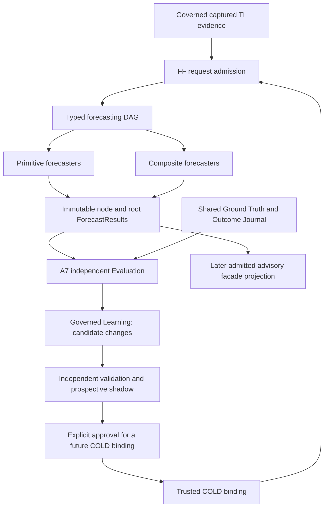
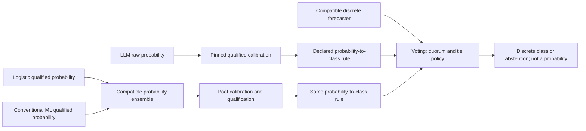

# Forecasting Framework — Platform Architecture

The [bounded FF-0 implementation plan](TIAF_A7_IMPLEMENTATION_SEQUENCING_FF0_MINIATURE_PLAN.md) is complete
(**READY_FOR_FF0_IMPLEMENTATION**, planning only). It chooses synthetic captured-input
BaseRate mechanics, four FF-0 steps and a 28-case acceptance corpus. FF-0.1 is
next only under a separate implementation request; calibration stays at FF-2,
public capability publication stays separate, and runtime remains NOT_IMPLEMENTED.

## 1. Status, principle and authority

**2026-09-15 (Asia/Kolkata): FF ARCHITECTURE ACCEPTED;
FF THESIS RECONCILED; IMPLEMENTATION NOT_STARTED; RUNTIME NOT_IMPLEMENTED.** A6 remains FROZEN
at `tiaf-a6-baseline`; [A7 architecture is ACCEPTED](TIAF_A7_ARCHITECTURE_ACCEPTANCE.md).
The FF-0 plan is complete; separately authorized FF-0.1 is NEXT. This is normative direction
for the **accepted architecture**, not implementation or model-approval authority.

> Forecasting is a platform capability; forecasters are replaceable scientific instruments.

> FF hosts one or many primitive or composite forecasters, evaluates them against
> common ground truth, preserves component observability, and supports safe
> composition, calibration, lifecycle, replay, benchmarking and governed self-correction.

The [repeat acceptance](TIAF_FORECASTING_FRAMEWORK_ARCHITECTURE_ACCEPTANCE_REPEAT.md)
closes FFA-B01 and accepts the architecture. The [original review](TIAF_FORECASTING_FRAMEWORK_ARCHITECTURE_ACCEPTANCE.md)
retains its historical HOLD; the [clock correction](TIAF_FORECASTING_FRAMEWORK_HISTORICAL_EVALUATION_CLOCK_SEMANTICS_CORRECTION.md)
retains the substantive resolution. Four prior non-blocking follow-ups remain;
local mode-composition/calibration clarifications are recorded in the repeat review.
No implementation is authorized. The subsequent
[A7 integration reconciliation](TIAF_A7_FORECASTING_FRAMEWORK_INTEGRATION_RECONCILIATION.md)
applies these accepted seams; independent A7 acceptance is now complete.
The [28-finding reconciliation](TIAF_FORECASTING_FRAMEWORK_THESIS_ARCHITECTURE_RECONCILIATION.md)
and thesis editions remain historical evidence; no finding is silently erased.

**Forecasting Framework (FF)** supplies the stable forecasting boundary and
bounded composition machinery. A model family does not define that boundary.
Logistic regression, conventional ML, LLMs, composites and **FMLFDEForecaster**
all satisfy the same conceptual `ForecastRequest → Forecaster → ForecastResult`
contract. Consumers depend on the meaning and admissibility of the result,
not on a family-specific API. They may inspect provenance and limitations;
family-neutral does not mean provenance-blind or scientifically interchangeable.

FF is optional to frozen TI. Missing FF never removes A2/A4/A5/A6 controls,
restrictions, NO_TRADE, insufficient evidence or NO_OPTION_TRADE. There is no
automatic consumer overlay, scanner ranking, option PoP or execution authority.
TM retains authority/risk/capital/action decisions; the broker retains execution
truth. No runtime, model training, provider/model/broker calls, A8 work, package
version change, public operation or commit/tag/push is introduced here.

Companions: [staged roadmap](TIAF_FORECASTING_FRAMEWORK_DETAILED_ROADMAP.md),
[decision and reconciliation](TIAF_FORECASTING_FRAMEWORK_DECISION_RECORD.md),
[advanced FM/LFDE design](TIAF_FM_LFDE_MARKET_STATE_FORECASTING_ARCHITECTURE.md).
Inherited constraints: [system ownership](TIAF_SYSTEM_ARCHITECTURE.md),
[source authority](TIAF_SOURCE_AUTHORITY_PROVENANCE_CONTRADICTION_ARCHITECTURE.md)
and [R1–R5 pluggability](TIAF_PLUGGABILITY_ARCHITECTURE.md).
The [existing A7 design](TIAF_A7_FORECASTING_EVALUATION_LEARNING_ARCHITECTURE.md)
now integrates the accepted platform at documentation level; §20 links the
explicit ownership/stage crosswalk. This is not FF or A7 runtime implementation.

## 2. Platform boundary and shared infrastructure



The diagram describes future ownership, not deployed services. Learning is not
an inference-graph node. Evaluation's later outcomes cannot feed back into the
original request. FF consumes shared evaluation and registry services instead
of creating a second journal or model-approval system.

| Concern | Owning layer | FF responsibility / excluded authority |
|---|---|---|
| Canonical source observations, contradictions, admission | Existing evidence owners | Consume captured neutral evidence; no arbitrary acquisition |
| Target/horizon, ground-truth specification and deterministic labeler | A7 independent Evaluation | Reference identical shared definitions, not model-specific labels |
| Request/result semantics, DAG admission, bounded inference and traces | A7 Forecasting / FF | Produce advisory records or explicit absence; never fit/promote |
| Outcome Journal, population dispositions, Forecast Ledger, paired comparison, metrics and drift reports | A7 independent Evaluation | Supply immutable forecast records; cannot rewrite a scorecard or label |
| Calibration fitting, candidate training, learned weights and correction proposals | A7 Governed Learning under bounded grants | FF may execute an exactly pinned admitted calibrator; no request-time fit |
| Calibration evaluation / candidate acceptance evidence | Independent Evaluation | Test each actual pipeline and population; not self-certification |
| Model/composition/calibrator artifact registry and lifecycle history | Governed Learning is the single registry custodian | Immutable typed artifacts and append-only events; no registry write grants approval |
| PromotionDecision | Explicitly authorized human/operator reviewer, independent of automated fit/metric production | Approve/hold/reject exact artifact, use, cohort, validity and promotion-policy/report pins; Learning records the decision, FF enforces it |
| Benchmark Registry | Evaluation-owned curated view of exact forecaster configurations | Not a competing artifact registry or a permission grant |
| Active root selection and resource profile | Trusted startup owner | COLD selection; no mid-run replacement by shadow or request |

“FF platform” includes these cooperating seams from a user perspective; it
does not transfer Evaluation or Learning authority into an inference engine.
An evaluator cannot approve its own candidate. A forecast needs no matured
outcome at inference; ground truth becomes available later under independent clocks.

The FF execution registry is a startup-bound resolution view of registered exact
implementations, not another model/composition lifecycle registry. Calibration
artifacts live alongside models/compositions in the one governed artifact registry;
Evaluation owns their qualification reports, not their fitting or activation.
One local person may hold reviewer and startup-owner roles, but the distinct
decision and binding records remain mandatory; automated outputs exercise neither.

## 3. Stable conceptual contracts

All names in this document are proposed contracts, not classes added to the
repository. Reuse project-native/Pydantic typed schemas when separately
authorized. Semantic collections are immutable tuples, accepting list/JSON
input and emitting JSON arrays. Contracts are frozen; extensible metadata must
not conceal target, calibration, authority, identity or failure semantics.
Package version `0.1.0`, A0 contract schema `1.0` and future FF schema versions
are separate concepts; existing schemas/fingerprints are not changed.

| Concept | Minimum semantic content |
|---|---|
| ForecastRequest | Request ID; neutral subject/domain; target/version and exact horizon/window/reference; realization mode, as-of and cutoff; simulation profile when applicable; immutable governed evidence refs/fingerprints; typed permitted context; preapproved profile/policy/binding refs; bounded purpose; no model URL, loader path, weights or authority grant |
| ForecasterDescriptor | Primitive/composite family; supported input/output contracts and target scope; dependencies and requiredness; cost envelope and version; descriptive, not calibrated/approved status |
| ForecasterArtifact | Exact implementation/model/transform pins, fit/selection history, output semantics and calibration dependencies; typed declarative content or trusted isolated adapter |
| ForecastResult | Request and observation identity; node/root and composition refs; discriminated output OR explicit absence; realization mode, actual computation and mode-specific issuance/simulation clocks, target window and validity; evidence refs; simulation profile where applicable; all limitations/conflicts; calibration state; usage and semantic/capture fingerprints |
| NodeRunRecord | Node instance, child refs, status, selected/unselected routes, inputs, output, reasons, elapsed/usage, artifact and policy pins; attempted failures preserved |
| ForecastRun | Complete requested scope, expected nodes, execution trace, root results by role, failures/skips and total unique usage; no hidden best-child substitution |

Use a discriminated output union, not optional numeric fields whose meaning is
guessed. Conceptual kinds are `BINARY_PROBABILITY`, `DISCRETE_CLASS`, later
`RANK_SCORE`, and separately qualified distribution/volatility heads. Each has
its target, units/class dictionary and applicability. A2 scores, fuzzy factor
memberships and regime probabilities are not aliases for a binary outcome
probability. The initial admitted consumer kind is the exact binary target below.

Generation status is independent: `GENERATED`, `ABSTAINED`, `UNSUPPORTED`,
`UNAVAILABLE` or `FAILED`, with typed reasons. Trace-only `NOT_SELECTED` or
`DISABLED` means no attempted forecast, not a zero probability. A generated
research estimate can still be ineligible for an advisory consumer. Numeric
probability must be finite in [0,1]; raw versus independently qualified
calibration state remains explicit. Absence cannot carry a fabricated estimate.

All timestamp instants are aware, normalized with
`zoneinfo.ZoneInfo("Asia/Kolkata")`; reject naive values and emit `+05:30` JSON.
No naive `datetime.now()` or manual offset arithmetic. Session IDs/dates do not
become fabricated instants. Source-local time representations remain provenance.

### 3.1 Field-level meaning and requiredness (FFT-01)

The request's `as_of` is the declared decision/reference instant; `cutoff` is the
latest permitted information availability. Normally they coincide, but they are
not aliases. Apply the mode-specific inequalities in §3.2, not an unconditional
comparison between actual computation/issuance and a historical target open.
For simulation, `as_of` is the historical `simulation_as_of` meaning, not an
issuance timestamp. Permitted context has typed identities,
availability and purpose restrictions; an allowlist does not invent absent data.
This slice uses captured evidence only. Any later acquisition would require an
explicit capability contract/grant and independently bounded gateway, never a
hidden read by the Forecaster or a metadata URL.

| Required result semantics | Unavailable / abstained / failed | Generated raw research | Qualified advisory projection |
|---|---|---|---|
| Identity | Request, neutral subject, exact target/horizon/reference, realization mode and applicable clocks/profile, node/root, composition and descriptor/version refs | Same, plus exact producing artifact/version | Same; consumer projection links the unchanged full result and never drops actual/simulated provenance |
| Value / output type | Declared expected kind; typed absence and reasons; no numeric payload | Discriminated probability/category/etc. with exact event/units; raw status | Only independently qualified kind/scope admitted by separate consumer policy |
| Uncertainty | Explicit NOT_ESTIMATED or NOT_APPLICABLE with reason | Kind, method/protocol and basis, or NOT_ESTIMATED; no invented interval | Same; policy requiring an estimate denies admission if absent |
| Validity / staleness | Actual attempt/completion facts; mode-specific clocks only when applicable, no invented issuance; NOT_APPLICABLE or known expiry/staleness and reasons | Explicit original/hypothetical validity window or UNKNOWN with reason; later simulation computation does not refresh it | Known validity covering use time, permitted freshness/health and calibration applicability; UNKNOWN fails admission; simulated results cannot become actual current advice or shadow issuance |
| Calibration | NOT_APPLICABLE or unavailable required-calibration state | RAW/UNQUALIFIED or explicit qualified stage with calibrator/version and report refs | Required pipeline/target/population qualification; never inferred from a model name |
| Provenance / replay | Supplied input lineage, expected scope, failure/attempt trace and capture/semantic fingerprints | Raw/transformed lineage, model/composition/calibrator refs, limits/conflicts and fingerprints | Same; no lineage discarded by facade projection |
| Authority / usage | ADVISORY_ONLY / NO_ACTION_AUTHORITY; attempted usage or explicit unknown | Same, plus RESEARCH_ONLY admission | Same no-action authority; scoped publication is not A4/A5/A6 influence or TM permission |

These are architecture-level field obligations, not a new Python enum/schema.
Non-applicable composition/calibrator/model-instance refs have a typed absence
(for example, admission failed before an artifact was selected), not invented IDs.
A valid FF run, including a primitive root, still has a graph identity. Examples:
missing required evidence → UNAVAILABLE with no probability; raw p=0.60 with
UNKNOWN validity → research capture only; qualified p=0.60 with valid pipeline
and use-scope approval → potentially admitted advisory projection, never an order.
Both numbers are illustrative, not measured performance. A type/schema check
alone cannot convert the second case into the third.

### 3.2 Realization modes and canonical clocks (FFA-B01 correction)

Two top-level realization modes are normative: `ACTUAL_ISSUANCE` and
`SIMULATED_ISSUANCE`. They are independent of generation status, lifecycle/role,
calibration, and replay operation. The caller may select only a permitted mode;
claiming ACTUAL is not proof of timely issuance or an authority grant.

| Canonical meaning | Clock class | Meaning and requiredness |
|---|---|---|
| `observation_event_time` | Event-time | When each supplied fact occurred or took effect; retain per-evidence provenance, not one invented run-wide observation time |
| `information_available_time` | Event-time / knowledge availability | Exact source/input revision availability under the pinned policy, including fit/calibration/selection inputs; not event time, ingestion time or model artifact production time |
| `information_cutoff` (`cutoff`) | Event-time decision boundary | Latest knowledge permitted for this decision, in both modes; includes learned/selected dependencies, not just input features |
| `simulation_as_of` | Simulation-time | Historical decision/reference instant, SIMULATED only; project-native request `as_of` carries this meaning, not a second independently editable timestamp |
| `issued_at` | Issuance-time | Real publication/issuance of a generated ACTUAL forecast, no earlier than its actual production; absent/NOT_APPLICABLE for SIMULATED and for attempts that emitted no forecast |
| `computed_at` | Processing-time | Real completion/production time of this newly computed result; not compute-start, issue, cutoff or simulated time; actual attempt completion is retained for failures, no value for an unexecuted node |
| `target_open_time` | Event-time | Exact opening boundary of the qualified target window from its pinned schedule; not guessed from a date |
| `target_resolve_time` | Event-time | Qualified target's resolution/terminal boundary; a scheduled boundary does not prove an outcome occurred or is available |
| `outcome_recorded_at` | Evaluation processing-time | Actual recording time of each Outcome Journal entry/revision; later ingestion does not move the target's resolution boundary |

These are semantic obligations, not a Python schema added here. Actual requests
also retain their ordinary decision `as_of`; the simulation-only name labels its
meaning only in SIMULATED mode. Do not store two independently authoritative
as-of values. Keep A7's distinct source publication, acquisition/first-capture,
TI admission, fit completion and label-availability provenance in their owning
records; this compact table neither aliases nor deletes those clocks. Planned
and observed resolution facts are distinguishable in the journal, with typed
absence when no valid observation exists. All instants use the aware Asia/Kolkata
policy above; timezone normalization never repairs missing knowledge provenance.

**Anti-backdating invariant:** A forecast artifact may never claim an issuance
timestamp earlier than the time at which it was actually produced. Historical
research must use explicit simulation semantics rather than backdating issuance.
A simulated forecast may represent what the system would have known at historical
time `t`, but remains visibly a later computation over a historical cutoff.

For a generated forecast on the initial next-session target, retain the strict
pre-open boundary (a failed/rejected late attempt stays diagnostic, not issuance):

```text
ACTUAL_ISSUANCE:
  source_close <= cutoff <= as_of <= computed_at <= issued_at < target_open_time
SIMULATED_ISSUANCE:
  source_close <= cutoff <= simulation_as_of < target_open_time
  simulation_as_of <= computed_at; issued_at = NOT_APPLICABLE
  computed_at may be after target_open_time and target_resolve_time
```

Source close must already be completed and available at cutoff. Equality at
target open is rejected: the brief's `issued_at <= target_open_time` is a
necessary bound, not a relaxation of the retained **before-open** target rule.
Evidence available exactly at cutoff is eligible only if its required provenance
establishes that availability. If timestamp precision cannot prove pre-open
ordering, do not invent extra precision. Other targets require separately
qualified timing rules; no new target is introduced here.

### 3.3 Result identity, admission and evaluation eligibility

Request identity binds its declared mode, cutoff, as-of, target open/resolve,
schedule and evidence/profile references. Result identity additionally binds
real actual computation, applicable issuance, exact producing forecaster/
composition/artifact closure and the simulation profile/version when applicable;
the request never invents future completion/issuance facts. The pinned fingerprint
projection preserves all those result semantics and request linkage. Multiple fresh
simulations retain distinct run identities even if their numerical forecasts
match; no mode/clock removal from an identity projection merely to obtain equality.
Node traces retain their own real attempted/completed work, not fabricated root
or historical timestamps. Replay verification telemetry is separate (§18.1).

Forecast-time admission requires a supported valid target, qualified PIT evidence,
mode-appropriate clocks, full model/calibrator/selection lineage and the scoped
operation grant. ACTUAL additionally requires genuine timely production/issuance
and an actual existing approved artifact/binding before issuance; all fitting,
calibration and selection knowledge remains bounded by the information cutoff,
as in A7 §5.1. SIMULATED additionally requires a reproducible simulation profile
pinning historical cutoffs, fold/fit/selection rules, data vintages/universe,
artifact policy and permitted research purpose (§10.1). A retrospective artifact
need not have existed then, but its research lineage must not pretend it did.

Later **supervised evaluation** of either mode additionally needs qualified
target/outcome evidence, exact label revision/as-known time, full eligibility
dispositions and an admitted comparison protocol. Future outcome availability
is **not** a precondition for issuing a forecast: pending/invalid outcomes prevent
its supervised score, not retroactively its existence. Outcomes never enter the
forecast's input cutoff. SIMULATED can be legitimate research/evaluation, but
cannot count as operational issuance, prospective shadow evidence, proof of
historical deployment or current advisory issuance. A research report may expose
it as simulated; no consumer projection may drop that provenance or renew its
historical validity using today's computation time.

## 4. Primitive and composite forecasters

```text
Forecaster
├─ PrimitiveForecaster
│  ├─ BaseRate / Persistence / LogisticRegression
│  ├─ XGBoost (or one qualified conventional ML alternative) / kNN / NeuralNet
│  ├─ optional LLMForecaster
│  └─ advanced FMLFDEForecaster
└─ CompositeForecaster (also a Forecaster)
   ├─ Ensemble / WeightedEnsemble / Voting
   ├─ CalibratedForecaster
   ├─ RegimeRouter / Stacking
   └─ later MixtureOfExperts
```

Primitive means one instrument at the FF substitution boundary, not one
mathematical operation or a ban on internal complexity. XGBoost contains trees;
FM/LFDE contains factors, encoders and heads. Their own internal audit is retained
without exposing a different consumer contract. kNN is primarily a primitive:
its train-fitted distance/scaling, neighbors, labels and aggregation belong to
its artifact. It is not an ensemble-composition operator.

Composites consume explicitly compatible child results and emit the same
ForecastResult shape. Recursive composition is permitted only as a finite
validated DAG. A runtime may initially register one primitive; the schema has
bounded collections and named roots from the outset, not singular fields later
replaced by an incompatible plural contract.

## 5. Typed DAG and deterministic execution

Conceptual expressions such as `ENSEMBLE(XGBOOST)` or
`VOTING(LLM, ENSEMBLE(LOGISTIC, ADABOOST))` illustrate composition, not an executable
DSL or an assertion that these nodes are implemented/compatible. No string
evaluation, arbitrary Python, model loader path or new forecasting language is
introduced. Use typed graph/node/edge/root/config objects later.

The following expanded, **illustrative** graph makes type conversion explicit:



| Graph rule | Required behavior |
|---|---|
| Definition | Unique node IDs, typed ports/edges, exact implementation/operator versions, immutable parameters and role-bound roots; reject dangling refs and incompatible edges |
| Cycles / size | Reject cycles, including nested and self-reference; finite limits on nodes, depth, fan-in, evidence/output bytes and work before starting |
| Traversal | Stable topological ordering with declared tie-break (node ID); child order canonical where commutative, explicitly ordered where not; serial first |
| Shared nodes | Same node + request/input pins executes once per run; reference its result from multiple parents, not duplicate its cost or count it as independent evidence |
| Duplicate influence | Reject repeated equivalent child/voter identities within one operator; express intended weighting once, not by cloning votes. Shared ancestry is disclosed, not assumed independence |
| Failure | Preserve every expected node; default required-child failure makes that composite unavailable/abstain. Optionality is explicit in the bound profile; no silent denominator or weight renormalization |
| Router | Later deterministic routing uses only eligible context and a frozen policy. Unselected children are NOT_SELECTED, not failed and not retrospectively evaluated as if run |
| Cancellation / budget | Bound total unique-node cost and attempts, including retries and failed calls; record unfinished nodes. No unbounded recursion, opportunistic search or undeclared provider/model retry |
| Identity | Definition fingerprint covers graph structure, roles/roots, operator/model/calibration/weight pins, parameters, ordering and policy; run fingerprint additionally covers request/input and actual node records |
| Introspection | Show complete declared graph, executed graph, child ancestry, raw/calibrated output stages, reasons, versions, cost and root selection |

A singleton probability mean is legal under §7.1; it provides no diversification
or evidence gain. Undeclared adapters and topology repairs are rejected, not
inferred from algorithm names.

### 5.1 Semantic identity, ordering and replication (FFT-03)

Distinguish stable **node-instance ID** for trace references from **semantic
execution identity** for reuse/duplicate-influence checks. The latter binds exact
implementation/model/transform/calibrator versions, typed parameters and input
port meanings, upstream semantic identities, request observation/cutoff/evidence
pins, caller/approval scope, numeric/seed policy and declared replicate identity.
Display aliases and incidental traversal labels are not independent instruments.
The captured graph retains its exact node IDs for audit, so an alias rename may
change the definition/capture fingerprint without creating a distinct voter.

Ordering is **operator-specific** and pinned by operator version:

- Mean and voting canonicalize member records by semantic identity. Weighted
  mean canonicalizes `(child identity, weight)` pairs, never weights alone.
  Declare deterministic numeric accumulation, so permutation cannot silently
  change a supposedly commutative result.
- Stacking/other ordered ports retain the exact port-to-child order. Calibrator
  application order and future router priority/selection rules are semantic.
- Reject unknown ordering conventions; stable topological traversal does not
  redefine an operator's input semantics.

| Identity fixture to retain | Required outcome |
|---|---|
| Shared A feeds two ancestors with identical request/input/artifact/scope pins | One attempted execution sequence, one result ref, one charged work record; both ancestry paths exposed |
| A is renamed A-copy and placed beside A in a vote/mean | Equivalent-child rejection, not two votes; intended influence belongs in one explicit weight |
| Different model artifacts both return 0.60 | Not equivalent merely because values match |
| Permute a mean, or weighted pairs together | Same operator semantics; swapping weights between different children changes semantics |
| Swap ordered meta-model input ports or change evidence/cutoff | Different execution identity; no cache reuse |
| Explicit independent stochastic replicate under a preregistered grant | Distinct replicate trace/cost, same market observation; retries are attempts, not replicate voters |

Stochastic replication is not enabled as an initial mean/voting diversity
loophole. Any later replicate aggregator needs its own qualified operator/protocol,
preserves common instrument ancestry and never increases independent outcome count.

## 6. Compatibility and admission

Validate the graph at COLD composition time and the actual child records on
every run. Before a value-combining edge, require:

1. Same subject/domain and instrument/venue/basis where the operator requires it.
2. Exact target ID/version, event/comparator/class definition and output units.
3. Exact horizon/reference and terminal window, not just DAY/POSITIONAL wording.
4. Compatible decision cutoff, information eligibility and issue/validity clocks;
   a stale forecast issued for another cutoff is not silently updated.
5. Correct output type and probability event; `P(up)` cannot substitute for a
   volatility estimate or regime membership. No unlabeled complement conversion.
6. Calibration compatibility: child state, calibrator/pipeline identity and
   qualified scope. Combining calibrated children does not certify the parent.
7. Required application/calibration support populations and common evaluation
   observation key. Different admitted feature families may differ intentionally;
   identical evidence bytes are not required, but target/cutoff/eligibility are.
8. All required branches, dependencies, entitlements, integrity, health and
   resource limits satisfied; cannot shrink required scope to fit availability.

The mode bound to the request in §3.3 also binds every contributing child,
intermediate and root of a new composite run. Reject ACTUAL/SIMULATED mixtures
at a value-combining edge, even if target and probabilities otherwise match.
Match the parent's mode and admitted as-of/cutoff/profile semantics; preserve
each node's own real processing facts. A historical control remains its original
artifact for Evaluation comparison; recomputing that instrument for a new
historical composite creates a new SIMULATED child. §12's explicit cross-mode
comparison policy authorizes comparison of arms, never mixed-mode composition,
mode relabeling or cross-mode execution-cache reuse. This makes the existing
request/compatibility boundary explicit, without adding an operator or converter.

Initial mean/weighted probability composition admits independently qualified
calibrated probabilities for the same event. A future raw-score stacking model
would require a separately typed meta-model specification and qualification,
not a loophole in the probability-mean operator. A probability-to-class adapter
has an explicit target, threshold/tie rule and version; it is never automatic.
Ranking has different population rules (§7) and is not enabled by binary compatibility.

| Check layer | Responsibility |
|---|---|
| STRUCTURAL | Immutable typed contracts, status/value exclusivity, declared ports, unique IDs, cycles, valid parameter forms and operator input/output kinds |
| COLD/profile | Exact registered implementations/artifacts, target/window/basis contracts, permitted roots/roles, calibration/applicability declarations, fixed electorate/weight/conversion/ordering policy and finite scope/budgets |
| Runtime validation | Actual subject/window/cutoff/availability, lineage/integrity, freshness/health, value finiteness, calibration applicability, expected child status and consumed resource limits |

All three layers are required; COLD declaration never excuses a mismatching
child record. Some checks recur at more than one layer as concrete evidence
becomes available. No layer grants execution/trading authority.

## 7. Voting, probability ensembles and ranking

| Operation | Input and output meaning | Essential boundary |
|---|---|---|
| Voting | Shared discrete class dictionary plus ABSTAIN → discrete class/ABSTAIN | Versioned majority/supermajority/quorum and tie rules; vote fraction is not event probability |
| Probability mean | Same-event qualified probabilities → arithmetic mean candidate | Nonempty set, finite values; parent needs independent calibration/evaluation |
| Weighted mean | Same-event probabilities with frozen nonnegative weights summing to one | Learned weights require eligible fitting; no negative or missing-member renormalization by default |
| Stacking | Typed child predictions → independently trained meta-forecaster | Train on leakage-safe out-of-fold predictions; extra search/calibration/selection cost |
| Ranking | Scores proven compatible within an exact dated candidate universe → ordinal ordering | Preserve score orientation, ties, universe and ranking metric; not a probability or A3/A6 ranking override |

Voting distinguishes ABSTAIN from a failed/unavailable required child. Minimum
quorum is measured against the fixed declared electorate, not whichever nodes
returned. Ties and insufficient quorum abstain in the simplest policy. Other
rules require a separately pinned and evaluated operator. For the initial strict
binary event, safe class names are ABOVE_REFERENCE and NOT_ABOVE_REFERENCE;
UP/DOWN aliases must explicitly map a flat close to the latter. Strict DOWN
meaning a negative return is a different target and cannot use that complement.

For illustrative compatible probabilities 0.72, 0.70 and 0.69, the unweighted
mean is approximately 0.7033. This arithmetic establishes neither calibration,
independence nor alpha. A parent calibrator may change it; a discrete vote over
thresholded versions has a different output type and must not be compared via
Brier as if the class were a calibrated probability. Classification metrics may
compare it under a predeclared policy, including abstention/coverage.

### 7.1 Singleton and failure decisions

`ENSEMBLE(XGBOOST)` is a legal **probability identity mean** only when that exact
child already satisfies §6. A one-child weighted mean requires weight exactly
one. It retains a distinct composition/node record, child admission/calibration
lineage and real wrapper cost; the child's execution is charged once. It supports
a stable wrapper contract, uniform instrumentation and reviewed future COLD
configuration, not automatic future member addition or diversification. No new
calibration qualification is inferred; applicability must explicitly cover the
identity pipeline. A singleton vote is legal only with the pinned identity-vote
policy (one declared voter, quorum one, compatible discrete class); child ABSTAIN
remains ABSTAIN. Other quorum configurations can reject a singleton. One-child
ranking is **not admitted** now: ranking itself remains deferred, and any future
wrapper needs a separately specified universe/operator contract.

The initial mean uses all declared qualified children. Weighted means require
finite nonnegative weights whose declared normalized values sum to one under the
pinned numeric validation convention; no runtime repair of a bad weight vector.
Even a zero-weight declared required child is still required; removing it is a
new reviewed graph. A child's ABSTAIN provides no probability to average; required
missing, failed, abstained or unqualified input produces no parent estimate with
typed dependency reasons, not zero, null-as-zero or survivor renormalization.
Never reinterpret a failed multi-child composition as a legal singleton.
Learned stacking, adaptive/regime-specific weights and MoE remain FF-7 scope.

### 7.2 Voting truth table (FFT-06)

The bound operator pins fixed electorate N, quorum, aggregation/majority rule,
threshold conversion (if any), tie policy and requiredness **before execution**.
Quorum is a count against N (or a pinned fraction converted by an explicit
rounding rule), not against only returned children. The simple policy uses a
majority of valid non-abstaining votes after quorum, with ties abstaining.
This is a documented initial policy; alternative supermajority/abstention rules
need a distinct COLD policy and evaluation, not hard-coded universal tuning.

| Supplied condition | Simple-policy parent result / accounting |
|---|---|
| All required executions valid; enough same-dictionary non-abstaining votes; unique majority | GENERATED discrete class; retain N, valid-vote and ABSTAIN counts; fraction is not probability |
| Legitimate child ABSTAIN; remaining votes meet fixed quorum | Child contributes no class; retain it in N and absence trace; apply the declared majority rule |
| No valid votes, including all ABSTAIN | ABSTAINED / NO_VALID_VOTES |
| Some votes but fewer than fixed quorum | ABSTAINED / INSUFFICIENT_QUORUM |
| Quorum met, tied top classes | ABSTAINED / TIE |
| Required child unavailable/missing or execution failed | UNAVAILABLE parent / REQUIRED_DEPENDENCY_NOT_SATISFIED; retain child FAILED/UNAVAILABLE reason, not a legitimate ABSTAIN vote |
| Required child unqualified/stale or wrong target/type | Deny parent estimate with explicit admission reason; never count that child as a valid class |
| Later explicitly optional branch absent | Only a separately admitted policy may proceed; declared N and all gaps remain visible, no implicit shrinkage |

For the illustrative N=3, quorum=2 policy: `[ABOVE, ABOVE, ABSTAIN]` emits ABOVE;
`[ABOVE, NOT_ABOVE, ABSTAIN]` ties; `[ABOVE, ABSTAIN, ABSTAIN]` lacks quorum;
`[ABOVE, ABOVE, FAILED-required]` is unavailable, not a two-vote win. ABOVE and
NOT_ABOVE here abbreviate the exact class names defined above; flat maps only
to NOT_ABOVE_REFERENCE. No probability, new authority or tuned threshold follows.

## 8. Calibration is a versioned transformation and scientific claim

`CALIBRATE(A)`, `MEAN(CALIBRATE(A), CALIBRATE(B))` and
`CALIBRATE(MEAN(A,B))` are generally different pipelines. Capture raw and
transformed outputs at every stage; their artifacts and qualification scopes
are not interchangeable. Parent identity includes all nested calibrators.
These expressions compare mathematical placement, not blanket admission:
every MEAN must still satisfy §6's qualified probability-child rule. A raw-score
combination needs its own explicitly admitted composite specification; an outer
calibrator cannot legitimize an otherwise incompatible child graph.

Calibrator fitting belongs to authorized Governed Learning; qualification belongs
to independent Evaluation; application belongs to the FF graph. Chronological
fit/selection/calibration/final-test splits must isolate all learned stages.
For multiple learned wrappers, specify independent or leakage-safe out-of-fold
stage inputs; never fit an outer calibrator on in-sample child predictions and
report that same data as independent validation. Any refit of a dependency
requires renewed downstream compatibility and calibration qualification.

Calibration fit and qualification reports retain their input-population
realization modes, simulation profiles where relevant, and §12's evaluation-mode
policy. Fitting or evaluating on SIMULATED predictions does not establish
validation on ACTUAL issuance. Such a fitted artifact is not forbidden from
future ACTUAL application, but still needs the existing independent target/
population applicability, prospective shadow and approval gates. Do not silently
transfer a simulated-population reliability claim to actual operational history;
no new calibration method or numeric transfer threshold is introduced here.

The miniature starts with the existing A7 proposal: regularized logistic output
and a separately held-out sigmoid calibrator. A base-rate control remains a
probabilistic benchmark, not “calibrated” merely because it is simple. Report its
raw reliability and losses; it cannot enter a calibrated-child ensemble until
that specific configuration meets the ensemble's qualification requirement.
An optional justified identity calibrator still needs explicit qualification,
not a no-op used to conceal missing support. Missing calibration blocks a claim
of calibrated advisory output, not capture of labeled raw research diagnostics.

## 9. Roles and lifecycle are independent

| Role in a bound observation/profile | Meaning |
|---|---|
| BENCHMARK | Fixed declared comparator for this experiment/application scope |
| PRIMARY | Selected root for prospective eligible advisory output |
| CHALLENGER | Candidate compared against retained controls/current primary |
| SHADOW | Prospective, non-influencing forecast collection purpose |
| DISABLED | Configured but not executed; descriptor/history retained |

Roles attach to assignments, not algorithm names. One artifact may be PRIMARY
in one profile and BENCHMARK in another. There is at most one PRIMARY root per
subject/target/horizon/profile; other roots are explicitly auxiliary. During
research there may be none. DISABLED assignment does not retire the artifact.

Lifecycle describes evidence and permitted use: `EXPERIMENTAL → VALIDATED →
SHADOW → APPROVED`, with explicitly approved transitions, rejection/hold and
`SUSPENDED`/`RETIRED` events retained. SHADOW lifecycle means authorized prospective
qualification; SHADOW role means the purpose of this particular run. Neither
is permission for advisory influence. APPROVED remains scope- and health-limited,
not a grant to trade or automatic selection as PRIMARY. Suspension can deny
new use under pinned health policy; resumption requires authorized evidence and
future binding, not deletion of the suspension history.

This conceptual split is a **proposed A7 integration refinement**, not replacement
of existing A7 registry state names now. Later mapping must preserve all old
events/approval scopes (including SHADOW_APPROVED and ADVISORY_APPROVED), record
the distinction explicitly and reject any mapping that would broaden authority.

### 9.1 Qualified names and lossless A7 mapping (FFT-10)

Keep both spellings, but require qualified fields/names in contracts and displays:
`role=SHADOW` versus `lifecycle=SHADOW`. Bare SHADOW is insufficient for a state
transition or permission check. Lifecycle records evidence/use status; assignment
records run purpose. A role alone neither transitions lifecycle nor grants use.

| Existing A7 §12 event | FF integration interpretation; retain original event and refs |
|---|---|
| REGISTERED / TRAINED / CALIBRATION_FITTED | EXPERIMENTAL with exact stage events/artifacts; none implies independent validation |
| EVALUATED | Retain report/outcome. VALIDATED only if independent required gates and authorized transition passed; a failed evaluation is not validation |
| REJECTED (or a denied transition) | Append rejection/denial with reason and requested scope; preserve previous lifecycle, but grant no rejected new use. Do not manufacture a successful transition |
| SHADOW_APPROVED | Scoped lifecycle=SHADOW approval plus an explicit role=SHADOW assignment only when that prospective run is bound; no PRIMARY influence |
| ADVISORY_APPROVED | Scoped lifecycle=APPROVED with unchanged expiry, cohort, health and no-action restrictions; PRIMARY assignment is a separate future COLD decision, never inferred |
| SUSPENDED | lifecycle=SUSPENDED with denial/health and predecessor refs; block new affected use, preserve entitled historical replay |
| RETIRED | lifecycle=RETIRED; no new inference grant; retain history and entitled recorded replay |

Store source event ID/name/schema, effective and recorded time, predecessor,
artifact, reviewed reports, authority/reviewer, exact scope/expiry and old/new
policy refs. Preserve a denial even when it leaves lifecycle unchanged. A denied
wider scope cannot overwrite an earlier narrower approval; a suspension cannot
be lost by mapping only the latest successful event. Missing/unknown mapping
data fails new admission; it is not filled with defaults. Fixtures must cover
approval → suspension → denied resumption, rejected candidates and expired scopes.
This is the normative **future mapping**, not a migration of current A7 files.

## 10. Benchmark Registry and common ground truth

The Evaluation-owned Benchmark Registry is a versioned curated mapping from
scientific target/profile to exact forecaster/composition artifact references,
metric obligations and admissible comparison populations. It reuses Governed
Learning's immutable artifact/lifecycle records; being named BENCHMARK grants
neither training rights nor production approval. Lower-layer deterministic TI
controls remain visible separately: their scores are not probability forecasters.

Pin the Benchmark Registry suite version and exact comparator artifacts for each
evaluation period/protocol before protected outcomes are inspected. Retiring or
replacing a current benchmark never rewrites an older comparison. A control
chosen after seeing results needs a new experiment with disclosed selection
history and fresh independent evidence for a new qualification claim.

| Ladder label | Candidate benchmark | Initial obligation |
|---|---|---|
| B0 | Training-window historical base rate | Required miniature comparison |
| B1 | Precisely defined persistence/naive event predictor | Small optional diagnostic; class/probability semantics declared |
| B2 | Regularized logistic regression | Miniature candidate; later retained comparator once qualified |
| B3 | XGBoost OR one justified conventional ML alternative | Later single challenger, not a package/model tournament |
| B4 | kNN with train-only distance/scaler/neighbor conventions | Optional hypothesis |
| B5 | Simple independently calibrated ensemble | Only after compatible useful components exist |
| B6 | Explicit-factor K-only head | Required comparator before claiming LFDE contribution |

B0–B6 are comparison labels, not seven implementation gates or an instruction to
train everything. K-only may be a logistic head over a distinct factor schema;
different labels do not require duplicate code or duplicate observations.
FM/LFDE begins as a CHALLENGER, never PRIMARY by architectural prestige.

Ground truth is common and Evaluation-owned. Adopt the **unchanged semantic
definition** from A7 §3 for the first FF target:

```text
equity.next_session_close.return_gt_zero / 1.0
y = 1 if qualified_terminal_close > qualified_reference_close else 0
```

Use qualified NSE cash equities; the reference is the source session's completed
positive finite close, available at cutoff. Resolve exactly the next eligible
trading session from a supplied qualified versioned schedule proving adjacency.
Apply §3.2: cutoff and decision as-of follow the source close and precede target
open; ACTUAL issuance also precedes open, whereas SIMULATED actual computation
may be later and has no `issued_at`. In either mode do not
pretend the known reference is an executable fill. Retain exact decimal prices,
venue, units, action-adjustment basis, source authority and schedule revisions.
Ties are class zero; missing/invalid/unqualified endpoints are **no eligible
label**, never zero. No weekend arithmetic, latest-quote substitution or implicit
closure of DEF-007/013/049. The label is price return, not total return/P&L/PoP.

Outcome Journal preserves separate window, label, operation and observability
facets from A7 §7. Late data is pending under its pinned deadline; changed or
canceled windows are censored, not moved to a more convenient session. Revisions
append new entries/label availability and predecessor links. Every study pins
the exact label revision/as-known cutoff; no forecaster owns or repairs its own
ground truth, and later labels cannot leak into earlier fitting or prediction.

`target_resolve_time` fixes the qualified terminal boundary. Actual outcome event
time, label-evidence availability and each revision's `outcome_recorded_at` remain
separate. Ingestion delay never shifts target resolution; a canceled/missing
terminal event stays explicitly unqualified. A forecast pins the target window,
not a future journal recording timestamp. Only later ledger/evaluation artifacts
link journal entries, label availability and the evaluation's as-known cutoff.

### 10.1 Historical simulation and walk-forward eligibility

```text
historical eligible capture + historical cutoff + pinned forecaster/composition
  + versioned simulation profile / fold protocol
    → new SIMULATED ForecastResult
       real computed_at + historical simulation_as_of + no issued_at
```

Inherit A7 §§5–6 unchanged. Under the initial CAPTURED_AS_KNOWN policy, source
availability, first acquisition and TI admission of feature evidence must all
be no later than the historical cutoff. An old event timestamp on data fetched
today does not qualify that evidence. A different historical-vintage policy would
need independent acceptance; this correction closes neither DEF-049 nor data gates.

Each walk-forward fold pins historical fit/selection/calibration/forecast cutoffs,
eligible universe, source revisions and split membership. Every label used for
fit/calibration/selection must have been available by its permitted historical
knowledge boundary, itself no later than the simulated forecast cutoff. Train-only
transforms and bounded selection cannot see future folds, the forecast's own
outcome or the locked holdout. Respect purge/embargo and sample/support rules.

The simulation profile states whether it evaluates a retained historical artifact
or a newly fitted/current artifact under a qualified retrospective protocol.
The latter may actually be fitted/computed today from eligible earlier data;
retain real fit completion and computation, simulated fit cutoffs, all model/
transform/calibrator/selection dependencies and experiment lineage. It is not
proof that this instrument existed, was selected or was deployed then. Merely
freezing historical features while using later-outcome-trained weights is leakage,
not a valid walk-forward study. Later-fold labels may inform later folds only
after availability under the pinned plan; actual computation order does not
grant access to future knowledge. All trials and invalid/inconclusive runs stay
in the population report. Repairs create new manifests, not edited history.

Thus a new retrospective model's actual artifact-creation/fit-completion time
may follow the simulated cutoff; the inputs and knowledge used to fit and select
it may not. Do not misclassify actual artifact production as historical source
availability, or demand that a simulated model file already existed then. This
research permission is not the actual-issuance artifact/binding gate in §3.3.

## 11. Forecast Ledger without mutable historical cells

The Forecast Ledger is an **Evaluation-owned immutable joined projection** over
existing forecast captures, the Outcome Journal and population-disposition
reports, not another writable source-of-truth journal. Its conceptual table is:

| observation_id | subject / cutoff / target / horizon | artifact / mode / clocks | forecaster/node version + role | output / calibration | outcome ref | eligibility |
|---|---|---|---|---|---|---|
| illustrative O1 | neutral S; exact t/T/H | A1 ACTUAL; original compute/issue | logistic v1, CHALLENGER | p=0.60, calibrator C1 | pending J1 | no Brier yet |
| illustrative O1 | same comparison observation | S1 SIMULATED; historical as-of, later compute, profile SP1 | base-rate v1, BENCHMARK | p=0.52, raw | same J1 | research; no Brier yet |
| illustrative O1 | same comparison observation | S2 SIMULATED; historical as-of, later compute, profile SP2 | composite E1, SHADOW role | abstained, quorum reason | later J2 ref | simulated coverage yes; Brier no; not prospective shadow |

The illustrative rows are not produced runs. A snapshot pins observation ID,
all request IDs, input/source refs, target/horizon/as-of, outputs by exact root
and node, composition/calibration versions, role assignment, regime/context
definitions, eligible ground truth when available and per-metric dispositions.
A pending snapshot stays pending; later truth creates a **new ledger snapshot**
referencing J2 and its predecessor, not a mutation of J1 or the old forecast.

The ledger retains realization mode, real computation, actual issuance OR
simulated as-of, target boundaries and simulation-profile lineage for every
artifact. One target observation/outcome can support an ACTUAL capture and many
SIMULATED versions: all remain distinct and none overwrites or impersonates A1.
Role SHADOW alone does not turn a simulated artifact into prospective history.
Mode belongs to the artifact/arm and comparison policy, not a fabricated second
market outcome. Any mixed-mode score requires §12's explicit policy; the table
above shows retained artifacts, not permission to pool them or rank a winner.

Observation keys are Evaluation-owned, independent of forecaster identity.
They include subject/venue, target/window/reference, cutoff and source-basis
policy. Feature sets may differ by declared experimental arm. Exact duplicate
requests map to one supervised observation under a pinned dedupe rule while
request-level failures/costs remain visible. Conflicting input/reference captures
are not merged by symbol or by selecting the favorable prediction. Stochastic
replicates are experiment replicates, not extra independent market outcomes.

The journal and ledger have **logically separate contracts**; the ledger is a
derived immutable view, not a duplicate truth writer. A local content-addressed
JSON/JSONL store may hold both as separate record types. Physical co-location is
optional and does not merge their ownership or authorize a database service.

```text
FF immutable forecast observation ───────────────┐
Evaluation: later qualified outcome → Journal ──┼→ per-metric eligibility
                                               └→ new Ledger snapshot
                                                   → PairedComparisonManifest
```

## 12. Paired Comparison Engine and identity

Adopt the thesis's comparison-manifest concept at **FF design level**, as
Evaluation-owned `PairedComparisonManifest`. No new service or public API is
required. Reuse A7's population-disposition projection and journal references.

```text
comparison_id + schema/version + semantic fingerprint
baseline_forecaster_id + exact run/composition versions
challenger_forecaster_id + exact run/composition versions
target_id/version + horizon/reference/basis
population_id + requested/common/union population fingerprints
observation/request/run mapping + dates + cutoff_policy
realization_mode_policy/version + per-arm modes + simulation_profile refs
label_definition/version + exact outcome revisions + evaluation_as_known_at
split_id + realized fold membership + fit/calibration/test cutoffs
metric_set/version + weighting/denominator/uncertainty policies
per-arm fit/search/resource budgets + actual usage
protocol preregistration + parent ledger/population-report fingerprints
```

An opaque ID alone is insufficient; a semantic fingerprint binds the content.
Multiple challengers use explicitly identified paired arms against the same
frozen population, not post-hoc “best available” subsets. Compare the same target,
horizon, subjects, dates, observation keys, cutoff semantics, label revision,
split and metric policy. A compatibility mismatch is a failed comparison, not
an invitation to average incomparable metrics.

Realization-mode policy is mandatory comparison identity, fixed before protected
outcomes and included in the manifest fingerprint:

| Paired arms | Eligibility and reporting rule |
|---|---|
| ACTUAL versus ACTUAL | Both genuinely issued on time; otherwise identical target/horizon/cutoff-policy/population/label and split/metric requirements |
| SIMULATED versus SIMULATED | Both qualified PIT simulations, aligned historical as-of/cutoffs and reproducible per-arm profiles/folds; later compute times may differ |
| ACTUAL versus SIMULATED | Default excluded from pooled comparison. Allowed only by an explicit preregistered mixed-mode research policy, with aligned target/horizon/cutoff policy, exact comparison observations/population and outcome/split/metric semantics; each arm's mode, actual clocks and simulation limits stay visible |

Compatible profiles need not have identical model artifacts; all differences and
knowledge/selection eligibility must be declared. Never silently pool modes or
present a mixed historical study as prospective shadow/live operational evidence.
Show per-mode counts, matched coverage, exclusions and pairing; multiple
simulations of O1 do not create multiple independent outcomes. Changed mode policy
or simulation profile creates a new comparison identity, not a rewritten score.

Keep the intended population and the union of arm outcomes, including absence
and failures. For each observation/metric/arm retain exactly one A7 disposition:
INCLUDED, EXCLUDED or NOT_EVALUABLE, with all reasons/facets. Compute paired loss
on the eligible intersection but show exclusions and coverage against the full
intended population. Zero paired rows means NOT_EVALUABLE, not zero loss/PASS.
Missing population identity prevents a complete denominator claim.

Do not require a future comparison ID or ground-truth value inside an already
issued forecast. New evaluation manifests link the immutable forecast IDs and
their own comparison identity later. Replay of a comparison pins those links;
forecast replay never mutates itself to add outcomes or evaluation versions.

## 13. Metrics, paired statistics and regimes

| Metric family | Reporting rule |
|---|---|
| Primary binary losses | Brier and log loss on eligible probabilities and labels; declared numeric log/clipping policy, not a hidden change to issued p |
| Reliability/calibration | Fixed protocol bins/weights, support and uncertainty; calibration evidence is population-dependent, not certified by schema validation |
| Coverage / abstention | Full requested population; separate unsupported/unavailable/failed generation and policy exclusions; abstention is not a negative label |
| Secondary | Direction accuracy, precision/recall only with a pinned class/threshold rule and class support; retain zero-denominator cases as undefined |
| Later economics | Risk-adjusted utility only for separately defined investable targets/execution assumptions; profit or win rate alone is insufficient |

Evaluation owns a versioned metric-definition registry (a contract/reference
catalog, not a service requirement). Each metric declares eligible target/output
kinds, numeric and denominator conventions, weights, direction and undefined
results. Pin its version in the comparison protocol; no universal metric set
applies to every distribution, category, volatility or future rank target.
FFT-15/16's numerical and statistical choices remain implementation/protocol
details in the roadmap, not defaults or claims of empirical qualification here.

Use paired loss differences, with the sign convention explicit:

```text
d_i = L(challenger_i, y_i) - L(benchmark_i, y_i)  # negative favors challenger
mean_d = paired weighted mean under the pinned population policy
Delta_Z = L(K) - L(K+Z)                       # FM's opposite sign convention
```

Report sample/session support, mean difference and a preregistered uncertainty
interval. Session/time-block resampling must preserve serial dependence and
cross-asset clustering where applicable. The block scheme/length and treatment
of unequal panels belong to the protocol, not choices made to obtain significance.
Forecast-comparison tests are optional only when their assumptions fit; small,
nonstationary or overlapping samples may support an inconclusive result rather
than a trustworthy test. No universal confidence level, sample floor or block
length is invented here. Freeze those engineering/scientific profile values
before holdout inspection, including trial/selection multiplicity treatment.

Holdout isolation covers preprocessing, neighbor selection, tree/NN/LLM prompt
selection, graph learning, ensemble fitting and calibrators. Report all bounded
trials, failures and seeds. Later label vintages cannot enter earlier folds;
overlapping horizons require explicit purge/embargo. Pretraining on future
unlabeled data is not exempt from PIT requirements.

Global metrics accompany predefined sector, horizon, event-heavy/normal and
regime slices with support and confidence limits. Different horizons are scored
separately, not pooled as identical events. Regime/context assignment has its
own eligible cutoff and definition; future-smoothed regimes cannot justify
historical decision-time routing. Model-relative regimes are labeled as such,
not universal truth. Subgroup wins generate hypotheses, not automatic routers.

### 13.1 Context membership and denominators (FFT-17)

Pin cohort-definition/version, assignment source/availability, rule/model and
context artifact, observation IDs and membership in the population report.
Represent UNKNOWN/unavailable context explicitly. It stays in the global intended
population and an unknown-context support bucket; it cannot be imputed into a
favorable cohort or silently disappear. If a required applicability cohort cannot
be evidenced, do not claim its qualification or broaden approval.

Overlapping memberships are legal when declared (for example sector plus event);
report per-slice support and overlap, never sum overlapping slice counts as
independent observations. A partition-only protocol must validate exclusivity.
Global and cohort comparisons retain paired arm identity, exact label vintages
and full coverage dispositions; unknown context is not an absent forecast value.

Illustrative loss-difference example: 80 observations in context A average −0.02
and 20 in B average +0.03, so the equal-row-weight global difference is −0.01.
The candidate wins globally but degrades B. These are invented arithmetic, not
evidence for a router or a numeric acceptance rule. Report both scopes; a required
B gate cannot be rescued by global improvement. Post-hoc slices are exploratory
and require a new predeclared independent test for a specialization claim.

## 14. Component observability, contribution and disagreement

> Composition must never destroy component observability.

For `VOTING(A, ENSEMBLE(B,C), D)`, retain A, B, C, the ensemble, D, any explicit
conversion/calibration nodes and the final vote, including raw/transformed
values, absence, reasons, weights, dependency ancestry and all versions. A root
score cannot replace its components in a persisted trace or ledger.

Persist node results/absence in the run capture with unique run+node identities
and resolvable child refs for at least the enclosing replay retention period.
Composite results have their own identity and link raw, transformed and child
stages. Partial composition can only occur under a separately admitted policy
that records the full declared graph, every gap and actual participating set;
the initial required-child rule never quietly emits a partial numeric result.

Every empirical composite report includes each major component, a relevant
simple control and the best component comparison. Distinguish **best selected
using eligible validation only** from an ex-post best-on-test oracle. The latter
may be a labeled diagnostic upper comparator, not a selection policy or proof
that it could have been chosen in advance. Report compatible metrics; voting
and probability outputs cannot share Brier without an independently specified
probabilistic model for the former.
For a routed composite, unexecuted experts remain NOT_SELECTED/NOT_EVALUABLE
on those observations. Comparisons requiring their outputs need separately
authorized, captured evaluation runs over the matched eligible inputs; never
invent their predictions or call them during recorded replay to fill a ledger.

Optional leave-one-component-out experiments compare E, E−A, E−B and E−C on
matched observations. Define `contribution_A = loss(E−A) − loss(E)`; negative
means the specified removal variant performs better. A removal is a **new
composition**, not a runtime missing-child fallback. Declare whether weights
are fixed/normalized by a preapproved experiment rule or refitted; refit affected
calibrators/routers with eligible data, separate from final evaluation. Preserve
union coverage, resource differences, uncertainty and interactions; marginal
contributions need not sum to total gain or establish causation.

### 14.1 Bounded leave-one-out protocol (FFT-19)

Leave-one-out is **optional by default**, not required per inference or for every
singleton/simple ensemble. Before promoting a complex learned composite or a
claim that additional components earn their cost, the independent promotion
protocol must preregister a bounded set of relevant removal/control experiments
and why those are sufficient. Complexity/applicability and finite fit/run budgets
are protocol choices, not a universal numerical threshold. Required evidence
that cannot fit the authorized budget means hold the claim/use the simpler
qualified binding, not waive the comparison after seeing results. Exhaustive
removal of every leaf is never automatically required.

Each selected E-minus-member arm pins: new graph, surviving weight rule, exact
downstream fit/calibration changes or justified unchanged applicability, fold
membership/fit vintages, variant qualification and actual training/inference
costs. The `PairedComparisonManifest` links that immutable protocol and compares
matched observations with full union coverage. Two illustrative variants:

| Variant of equal-weight E(A,B,C) | Required distinct identity and meaning |
|---|---|
| Remove A; fixed-rule E-fixed(B,C) | Predeclared weights (1/2,1/2), not execution-time renormalization; unchanged eligible child artifacts; renew/justify parent calibration for this graph |
| Remove A; E-refit(B,C) | Independently fit new allowed weights/downstream stages on eligible fit/calibration folds; record all search cost and separate untouched comparison |

Neither variant inherits E's parent qualification automatically; one cannot be
substituted for the other in a reported contribution. Raw research diagnostics
may be captured with explicit unqualified state but cannot support a calibrated
advisory/promotion claim until its required qualifications pass.

For illustrative compatible probabilities, [0.72, 0.70, 0.69] has range 0.03;
[0.71, 0.42, 0.76] has range 0.34. Capture dispersion definition, included members,
agreement/abstention counts and shared ancestry. These are diagnostics, **not**
a confidence probability or a fixed abstention rule. Disagreement may later
inform a separately learned/validated policy, with its own versions and gates.

## 15. Governed correction and promotion

FF feeds a shared A7 correction process; it does not own self-approval:

```text
frozen forecasts → qualified outcomes / paired diagnostics
  → proposal with suspected cause, evidence, alternatives and bounded grant
  → new calibration / fit / weights / graph / routing / candidate selection
  → leakage-safe walk-forward + independent calibration/coverage/cost checks
  → approved prospective SHADOW → independent promotion recommendation
  → explicit owner approval → future COLD binding (or reject/hold)
```

Example, not an experiment performed here: negative kNN contribution in
`MEAN(XGB,kNN,FMLFDE)` can motivate a candidate `MEAN(XGB,FMLFDE)`. It does not
remove kNN from the current run. Evaluation must separate noise, target/data
defects, calibration failure and missing scope before proposing a model fix.
The old composition, forecasts, cost and outcome revisions remain available.

Proposals include recalibration, retraining, member removal/addition, weight
changes, routing and challenger promotion. No automatic activation initially;
bounded automation later may generate candidates, not grant its own access,
training budget or deployment permission. Drift-triggered denial under an
existing health policy is distinct from a new learned policy. Backtest gains
that fail prospective shadow do not earn promotion. Explicit rollback chooses
a previously qualified binding for future runs; it never rewrites history.

`PromotionDecision` is the independently authorized reviewer/operator's immutable
approve/hold/reject decision, not the metric engine's recommendation. It pins
candidate model/composition/calibrator closure, report/protocol, approved use,
cohort/expiry/health, reviewer authority and predecessor. Governed Learning
records it in the shared lifecycle history. The trusted startup owner separately
selects a future COLD binding within that approval. Neither decision changes an
active run or target definition. Training/recalibration proposals require explicit
fit grants; inference, diagnostics and resource grants are not activation grants.

## 16. FM/LFDE and LLM forecaster placement

`FMLFDEForecaster` remains the advanced family containing Market Tensor,
Explicit Factor Engine, LFDE, Market State Fusion, optional State Dynamics,
Forecast Heads and Calibration/Uncertainty. Its factor/latent traces and
K/Z/K+Z ablations survive the FF wrapper. Internal calibration and any outer FF
calibrator are distinct pinned stages, never silently doubled or replaced.
FF consumes its typed output and enforces common evaluation; it does not require
other primitives to build a tensor or latent state. FM still means Forecasting
Module within this family, not the platform itself or a foundation model.

It may be the only selected forecaster in an FF run, a benchmark after useful
qualification, an initial challenger, a shadow instrument, an ensemble component
or a later routed specialist. “Standalone” means one instrument through the
same shared contracts/ground truth/replay, not bypassing FF governance. Its
ambitious research program is retained; no learned Z is required before a
simple forecast can be useful. See the [family design](TIAF_FM_LFDE_MARKET_STATE_FORECASTING_ARCHITECTURE.md).

`LLMForecaster` is an optional primitive over captured deterministic TI state,
governed Market Intelligence, admitted sector/macro/derivatives context and an
exact target/horizon. It returns a schema-checked forecast or abstention,
evidence refs, conflicts/uncertainty and exact model/prompt/version lineage.
Raw generated probabilities are not automatically calibrated. Evaluate and
calibrate it against the same ground truth and controls with no privileged vote,
source authority, production role or permission to repair missing evidence.

Route all future model use through the existing governed budget/model gateway;
no direct SDK or provider import in domain contracts, specialists or Shell.
No unbounded tool loop or narrative prompt instruction can change the target,
permissions, calibration, caller scope or active graph. Pin rendered prompt/input,
response, model/deployment revision where observable, decoding parameters,
gateway policy, attempts/tokens/cost and supported provenance. Unknown provider
revision or monetary cost is explicit, not invented. A remotely mutable model
may make exact recomputation unavailable even if recorded replay works.
Pretraining vintage/rights/overlap must be qualified before historical PIT
claims; otherwise use separately qualified prospective shadow. This pass calls
no LLM and approves no prompt/provider/model.

A separately granted query made today over a historical cutoff is
SIMULATED_ISSUANCE, with real `computed_at`, historical `simulation_as_of`, no
`issued_at`, and the current observable provider/model/prompt version and
simulation profile pinned. Unknown revision stays UNKNOWN. It is a
**current-model historical simulation**, not evidence of a provider's historical
issuance or deployment. Historical-version existence alone does not prove an
actual past response: that claim needs the original contemporaneous capture.
Calling the mode SIMULATED does not qualify pretraining vintage, post-cutoff
facts memorized in weights, rights or overlap. Unqualified historical use remains
an explicitly unqualified diagnostic only if the study grant permits capture,
otherwise rejected; never count it in PIT-qualified walk-forward or shadow
evidence. Separately qualified prospective-only use stays governed by §16.1.

### 16.1 LLM qualification axes and failure (FFT-21)

| Axis, separately recorded | What it does and does not prove |
|---|---|
| Exact observable model/deployment revision | May identify a response producer; does not prove training-data vintage or calibration |
| Historical training-vintage / rights / overlap qualification | Required for historical PIT claims, alongside request evidence eligibility; a known model name is insufficient |
| Prospective-only qualification | Permits only a separately granted forward capture/study with contemporaneous inputs, later common labels and limitations; not retrospective historical qualification |
| Recorded replay availability | Captured prompt/response/typed result can be checked offline even if revision is UNKNOWN |
| Exact recomputation availability | Requires exact reproducible model/dependency closure and numeric policy; remotely mutable or unavailable models may remain UNVERIFIABLE |
| Monetary cost knowledge | UNKNOWN/UNPRICED stays distinct from zero; a strict monetary-cap policy cannot admit unpriceable work merely because token bounds exist |

The COLD study/admission profile declares required axes and unknown-handling,
including whether limited prospective-only research is allowed. A persuasive
raw output that fails calibration remains unqualified even with complete lineage.
No unknown field is silently upgraded after later provider discovery; new evidence
adds a new qualified view/event, not a historical claim of knowability.

Schema-invalid response is FAILED with its captured diagnostic; missing required
access/evidence is UNAVAILABLE; supported explicit abstention is ABSTAINED.
Timeout/exhausted attempts retain typed reasons and known incurred usage, with
unknown billed work explicit. Retries stay within the bound grant; no invented
response, backup model switch or acquisition is implied. These are neutral failure
semantics, not a provider-specific implementation or permission for a live call.

## 17. Miniature FF and pluggability

The smallest useful scientific loop is **one target, one shared journal, one
base-rate benchmark, one candidate logistic root, one evaluator, one held-out
calibration path and one immutable recorded/pinned replay path**. After approval
the calibrated logistic root can be PRIMARY and base rate BENCHMARK. The initial
influencing/primary count is at most one; the complete benchmarked miniature
normally has two primitive instruments, not a misleading total N=1. A one-node
FF-0 fixture/inspection mode is valid but is not comparative model acceptance.

Initial output is shadow/research until empirical and lifecycle gates pass;
advisory publication still needs later facade/Shell acceptance. The architecture
supports finite 1..N nodes from day one while implementation activates only the
bounded set needed for the current stage. It does not require a plugin loader,
remote API, scheduler, model zoo, ensemble, LLM or FM/LFDE to be useful first.

| Component | REQUIRED / OPTIONAL by operation | STRUCTURAL / COLD / HOT target |
|---|---|---|
| PrimitiveForecaster | Required if selected for new inference; each family optional to TI | STRUCTURAL + COLD exact binding; no HOT |
| CompositeForecaster | Optional; required if selected root/ancestor | STRUCTURAL + COLD validated operator/config; no HOT |
| Calibrator | Required for a pipeline claiming calibrated output; absent from recorded replay execution | STRUCTURAL + COLD artifact; fit only under separate grant |
| Evaluator | Required for evaluation/qualification/promotion, not every inference | STRUCTURAL + COLD metric/protocol binding |
| GroundTruthProvider / labeler | Required for qualified labels; not forecast-time live acquisition | STRUCTURAL + COLD source/label policies; no model-owned labels |
| BenchmarkRegistry | Required for a benchmarked comparison/admission claim; not a dependency of recorded read | STRUCTURAL + COLD curated versioned references |
| CompositionEngine | Required for new FF run, including validating a singleton graph | STRUCTURAL + COLD graph/operator implementations |
| OutcomeJournal | Required for outcomes/evaluation; inference can precede labels | STRUCTURAL + COLD local immutable backend first |
| CorrectionPlanner | Optional; required only for authorized correction workflow | STRUCTURAL + COLD proposal policy; never activation authority |

R1 required absence stays explicit; a missing optional family is not a degraded
required role by default. R2 discovery describes shape/dependencies, not empirical
readiness or grants. R3-inspired per-run envelopes pin participants/absences and
exact verifiers; no reuse of A3-scoped schemas as generic FF schemas. R4 keeps
optional ML/LLM adapters out of Core, deterministic imports and recorded replay.
R5 future trusted startup configuration selects registered reviewed components;
the existing R5 implementation is **not claimed to support FF selectors today**.
No HOT model/weight/composition change, dynamic plugin installation or capability
publication is added. Frozen facade catalog remains nine.

## 18. Replay, cost and tunability

Pin request and observation identity; target/horizon/reference/ground-truth
definition; realization mode and original computation/issuance/simulation clocks,
simulation profile/fold pins where applicable; evidence/data/availability fingerprints; graph and all child model,
transform, weight, routing and calibrator versions; lifecycle/role approvals;
admission/health/budget/profile policies; serializer/numeric runtime/seed pins;
and all node outputs/reasons/cost. Calibration fit/selection, tensor/factor/latent
basis and training manifests are transitive dependencies when selected.

Recorded replay deserializes captured results and checks canonical/semantic
integrity **without** current registry, model SDK, Yahoo/MCP/provider or LLM
execution. Exact recomputation needs the exact qualified graph/verifier/artifact
closure; missing implementation or nondeterministic remote reproduction is
UNVERIFIABLE, not a current-model call. A tolerated numeric check is not exact
serialized/fingerprint equality. New-model historical counterfactual evaluation
creates a new SIMULATED artifact under §3.2/§10.1 and cannot replace the original
run. Evaluation replay additionally
pins ledger, journal revisions, split/population/metric policy and comparison ID.

### 18.1 Verification promises and immutable pins (FFT-24)

**Replay verifies or reconstructs a historical artifact; simulation creates a
new explicitly simulated artifact.** Replay is an operation over either captured
realization mode, not a third realization mode or a synonym for backtest generation.

| Operation (not realization mode) | Required proof and honest failure |
|---|---|
| Recorded replay | Parse captured schema; validate typed relations; reconstruct canonical semantic content under the pinned serializer/fingerprint version; require identical canonical content and semantic fingerprint. Check original blob integrity separately; file whitespace/container bytes need not equal canonical bytes |
| Pinned recomputation | Resolve exact graph/implementation, all transforms/calibrators/bases, request inputs and numeric/seed policy. Compare under the declared deterministic semantic projection; missing closure or unreproducible remote model is UNVERIFIABLE, not a fallback to current code/model |
| Tolerance-based numeric verification | Separate declared verifier/mode with finite tolerance/metric and field projection pinned before comparison; a within-tolerance value is not exact canonical/fingerprint equality |
| Historical simulation / counterfactual generation | New SIMULATED request/run/result, real computation, historical as-of/cutoff, simulation profile, graph/artifact and comparison identity, permissions and cost. Link any old capture as a control; do not overwrite it or claim original replay |
| Evaluation replay | Pin exact forecast IDs, ledger/population/split, target/label definition, journal revisions/as-known time, metrics/protocol and comparison manifest; do not refresh to latest truth |

Capture identity includes original mode, computation, applicable issue/simulation
and attempt/usage facts. Recorded replay preserves them, including when the
original itself was simulated. Pinned recomputation has a separate verification
record and real verification completion/cost; it does not reissue the original
forecast, backdate today's verifier, or convert a simulated capture to ACTUAL.
Compare the original semantic projection using original captured clocks, while
retaining new execution telemetry outside that original artifact. Do not promise that newly measured
wall-clock timings match the original capture. The pinned semantic projection must
explicitly separate those facts from the forecast fields tested for equality;
there are no ad-hoc exclusions introduced after a mismatch. Hostnames, temporary
paths and irrelevant environment noise are not semantic dependencies; numeric
libraries/runtime versions are included only where they affect the verifier.

Illustrative outcomes: saved LLM response + matching canonical result → recorded
PASS, missing immutable remote revision → recomputation UNVERIFIABLE. Comparison
M1 pins journal revision J1 even after J2 exists; a J2 comparison becomes M2.
Neither example authorizes a live call or changes the original forecast. Raw,
calibrated and final fields plus transitive FM basis/head/outer-calibrator closure
remain checkable, not hidden behind a root-only fingerprint.

Usage accounting charges each unique executed node once, all real retries and
failed attempts, plus operator/calibration overhead. Parent inclusive usage is
not summed again with child usage. Report elapsed critical-path wall time
separately from summed work; model/token/cost unknowns stay UNKNOWN. Shared-node
reuse is valid only under identical input/artifact pins and compatible scope;
no global cache may mix observations, callers or model revisions.

| Tunable class | Examples | User visibility / ownership |
|---|---|---|
| Architecture invariant | PIT, typed compatibility, frozen replay, no execution or self-promotion | Explained; never request-overridable |
| COLD profile | Required roots/families, approved roles, scope, admission, limits and registry pins | Trusted owner; safe display only |
| Composition configuration | Edges/operator types, electorate/quorum, declared threshold/weight refs | Reviewed immutable config, not Shell expressions |
| Forecaster/model artifact | Scaler, neighbors, coefficients, trees, neural/latent basis, prompt and fitted calibrator | Exact pinned artifact; no consumer edit |
| Experiment configuration | Splits, trials/seeds, fit budgets, metrics/cohorts, support and acceptance thresholds | Research owner preregistration before final outcomes |
| Request parameter | Subject, admitted target/horizon, cutoff, captured inputs, supported mode/profile | Caller-scoped selection only; no privilege expansion |
| Future correction candidate | New weights/member set/prompt/fit/calibrator/routing | Proposal and independent approval for future binding |

## 19. Documentation, thesis and paper strategy

**Strategy A is complete:** a separate [Forecasting Framework Thesis](TIAF_FORECASTING_FRAMEWORK_THESIS_RECORD.md)
explains platform/composition/evaluation/ownership; the existing FM/LFDE thesis
remains the advanced-research forecaster handbook. Do not rename or regenerate
the existing editions. Their historical top-level FM framing is explained
by a record addendum and this design; it is not current FF normative ownership.

FF architecture owns shared interfaces, DAG semantics and cross-family comparison.
FM/LFDE architecture owns that family's scientific internals and local FM/L gates.
The research reconciliation and thesis source hashes remain historical evidence;
the [decision record](TIAF_FORECASTING_FRAMEWORK_DECISION_RECORD.md) dispositions
the 24 FM thesis findings without treating a thesis as implementation authority.

Paper 1 and Paper 2 remain about FM/LFDE, not generic FF infrastructure. Paper 1's
working title remains **FM-LFDE: A Multimodal Market-State Forecasting Framework
with Latent Factor Discovery and Governed Self-Correction**; clarify its evaluation
inside FF in any later manuscript. Paper 2 still requires qualified empirical
protocols/results. No novelty, alpha or publication-readiness claim is made;
neither paper is authored here. The FF thesis's 28 findings are now dispositioned
in the [reconciliation record](TIAF_FORECASTING_FRAMEWORK_THESIS_ARCHITECTURE_RECONCILIATION.md);
its original DOCX/PDF and authoring assets are unchanged, including their dated
unapplied-finding/next-step wording. The record supplies current status.

## 20. Precise future A7 integration plan

The heading is retained for stable historical links; its documentation integration
is now complete as described below, while runtime remains unimplemented.

The [A7 integration record](TIAF_A7_FORECASTING_FRAMEWORK_INTEGRATION_RECONCILIATION.md)
has applied the previously proposed integration map to the A7 architecture,
roadmap and thesis-record navigation. FF's accepted contracts, operator rules,
clocks and scientific/authority boundaries are unchanged.

```text
A7
├─ Forecasting → FF contracts, typed DAG, primitives/composites and traces
├─ Evaluation → common truth/journal, ledger, benchmarks, metrics and drift
└─ Governed Learning → candidate fits/registry/shadow/evidence workflow
                         → independent approval → trusted COLD selection
```

Canonical delivery notation: **A7 contains FF-0…FF-7 unchanged**, not a second
A7.1…A7.5 queue. Old A7 slice references are historical locators resolved by the
[A7 roadmap crosswalk](TIAF_A7_DETAILED_ROADMAP.md#historical-five-slice-crosswalk).
FF-0/1 can produce bounded raw research/comparison; FF-2 completes calibrated
miniature/lifecycle. Later facade/Shell publication is a separately authorized
post-FF-2 checkpoint, not dependent on FF-3 or optional LLM/FM. Scoped closure
does not require every advanced stage. A8/A9/A10 order and all deferrals remain.

### 20.1 Contract and event integration boundary (FFT-27)

| Existing / proposed object | Single owner and integration rule |
|---|---|
| A7 target/session/clock and Outcome Journal contracts | Evaluation retains exact definitions, availability and facets; FF requests reference them, not duplicate label logic |
| ForecastEvidenceV2 / consumer evidence projection | Later explicit mapper from FF result: subject, target/window/cutoff, realization mode and applicable actual/simulated clocks/profile, kind/value or absence, calibration, validity, lineage and authority. If the old shape cannot express them losslessly, use a separately versioned additive projection; do not coerce, strip mode or alias |
| FF request/result/descriptor/artifact/DAG/node/run | Forecasting owns typed inference contracts; model/composition/calibrator artifact payloads reference Learning's shared immutable registry records |
| Population dispositions / Ledger / PairedComparisonManifest / metric definitions | Evaluation-owned shared contracts; full requested scope and label versions, not a second FF journal or evaluator-specific truth |
| A7 registry event → FF lifecycle and role assignment | Apply §9.1 field/event mapping, original history retained; approval is not selection; unknown or denied mappings fail new use |
| Calibration artifact / qualification report | Learning fits and stores artifact; Evaluation owns report; FF executes exact admitted transform, including transitive dependencies |
| PromotionDecision / active root binding | Authorized reviewer owns decision; Learning records it; trusted startup owner separately chooses within the grant; FF cannot self-promote |

Independent FF architecture acceptance has accepted these mappings and the
parameter-setting process. The section-by-section A7 documentation integration
is now recorded and independently accepted. Any future runtime/schema
migration still requires an explicit bounded implementation request and tests. Existing A7/A3/R3 contracts are not silently
reinterpreted; no public train/promote/config-edit operation is introduced.

## 21. Acceptance questions and next gate

Before implementation, independently review contract schemas/absence taxonomy,
graph limits/operator rules, a small evidence allowlist, label qualification,
fit/split/support/calibration/shadow/resource profiles and facade exposure scope.
Before each additional family, require a hypothesis, bounded budget, compatible
data, independent paired evidence and stop criteria. Unsupported data, sparse
support or no incremental value can stop the program at the simpler forecaster.

The [roadmap](TIAF_FORECASTING_FRAMEWORK_DETAILED_ROADMAP.md) records every stage's
entry, deliverables, tests, success, stop/fallback and next-stage gate. All existing
[58 canonical deferrals](TIAF_DEFERRAL_REGISTER.md) remain unchanged; no scheduler,
historical data qualification, production LLM readiness, HOT loading or consumer
publication is closed by a diagram.

Exact next prompt: **TIAF A7 / FF-0.1 — CONTRACTS, TARGET AND CLOCK FOUNDATION IMPLEMENTATION**.
The [repeat review](TIAF_FORECASTING_FRAMEWORK_ARCHITECTURE_ACCEPTANCE_REPEAT.md)
records closure of all five prior HOLD dimensions; original HOLD/correction
history is preserved. A7 integration is reconciled and independently accepted;
FF-0 planning is complete; separately authorized FF-0.1 is next and implementation requires separate authorization.
No trained model or runtime success is claimed.
