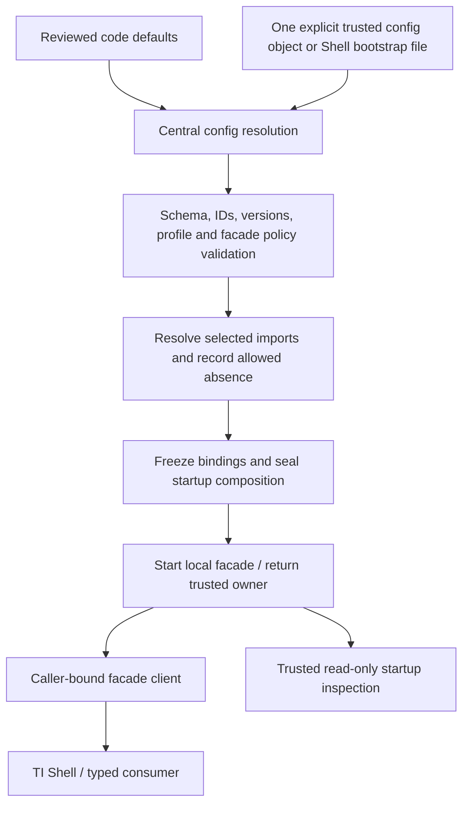
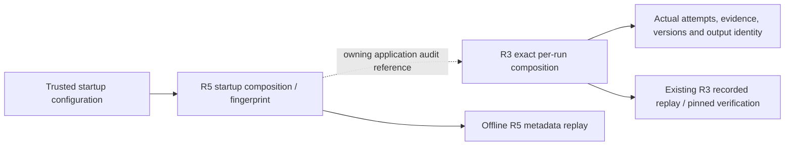

# TIAF Pluggability R5 — COLD Ownership / Configuration

## Status and scope

R5 ACCEPTED / DONE. Entry was the clean R4-accepted commit
`5fce47c`; A5 remains frozen at `tiaf-a5-baseline`. Package version `0.1.0`,
A0 contract schema `1.0`, R2 discovery and R3 captures keep their existing meanings.
The R5 startup configuration and composition each have their own schema `1.0`.

Implementation decision: **READY_TO_ACCEPT_PLUGGABILITY_R5**. The subsequent
[independent acceptance](TIAF_PLUGGABILITY_R5_COLD_OWNERSHIP_CONFIGURATION_ACCEPTANCE.md)
returned **READY_TO_CLOSE_PLUGGABILITY_R5**.

```text
A5 FROZEN
R1 ACCEPTED
R2 ACCEPTED
R3 ACCEPTED
R4 ACCEPTED
R5 ACCEPTED / DONE
A6 ACTIVE / NEXT — NOT_IMPLEMENTED
```

R5 implements trusted startup selection and binding freeze under
`HOT ⇒ COLD ⇒ STRUCTURAL`. No HOT transition, remote control plane, monitoring
runtime, Scanner, Sector Rotation, Signal Qualification, Web, A6 or broker
operation is added. The acceptance pass is recorded separately and adds no runtime scope.

## Owner, sources and freeze

Scoped follow-up (2026-09-20): the offline FF-1 qualifier now has a separate
trusted `ResearchQualificationRuntime` / `ResearchRightsConfig` bootstrap.
It follows this same code-defaults < explicit-config and immutable-owner rule;
it does **not** add a field to R5 facade/Shell composition or a request override.
Default `WARN_ONLY`, explicit-denial handling and configuration fingerprints are
documented in the [FF-1.1A configuration example](TIAF_A7_FF1_1A_RIGHTS_POLICY_REVISION_AND_DATA_PROVISIONING.md#3-cold-configuration-and-replay).
R5's accepted runtime and historical validation below remain unchanged.

The trusted application bootstrap calls `create_cold_runtime(facade_config,
explicit=...)`. It validates composition and existing facade policy, resolves
only selected registered implementations, seals immutable startup metadata,
pins the specialist binding map, then constructs/starts the existing facade.
It returns a `ColdRuntimeOwner`. Only `owner.client(caller_id)` is passed to the
Shell or a consumer. Clients receive no factory, registry, configuration setter
or startup owner.



Exactly two source levels are supported: **code defaults < explicit trusted
configuration**. Omitted fields retain defaults. A supplied field replaces that
whole field; a supplied selection array replaces the whole array, including an
explicit empty array. No union, per-element merge or order-dependent overlay is
performed. Selections are sorted by component ID after duplicate validation.

The existing Shell `--config PATH` is the sole file bootstrap path; its optional
`cold_startup` object is the explicit configuration. Old files without that field
use code defaults. Tests pass fixture-local typed objects or temporary files.
No environment variable, implicit file search, deployment overlay, CLI component
override, request payload or Shell command configures composition. Existing
adapter credential mechanisms are unchanged and reached only by explicit later
trusted construction/use. They cannot override the selected implementation IDs.

`LOCAL_CAPTURED` defaults to serial orchestration, nine registered built-in
specialists, and no optional adapters. `LOCAL_ENGINEERING` additionally permits
selecting optional factories and the pinned LangGraph workflow. These profiles
describe startup choices and grant no live, model, entitlement or execution
authority. They do not select market interpretation thresholds or A5 policies.

## Configuration and supported choices

| Field | Meaning / validation |
|---|---|
| `schema_version` | Exactly `1.0`. |
| `runtime_profile` | `LOCAL_CAPTURED` or `LOCAL_ENGINEERING`; unknown profiles fail. |
| `selected_adapters` | Tuple of registered optional adapter selections; default empty. |
| `selected_specialists` | Tuple of the nine implemented specialist IDs/versions; default all nine. Exclusion preserves R1-required absence in later runs. |
| `selected_workflow` | Exactly one required workflow: `workflow.serial` version `1.0`, or `workflow.langgraph` version `1.2.11`. |

Each `ComponentSelection` contains `component_id`, `implementation_version`,
strict boolean `required`, and `on_missing` (`FAIL_STARTUP` by default or explicit
`RECORD_UNAVAILABLE`). Lists are accepted as input and JSON output remains arrays;
semantic collections and nested models are immutable after construction.

The code-owned allowlist exposes pure `registered_components()` metadata:

| Category | Selectable implementations |
|---|---|
| Optional factory / adapter | `provider.market-data.dhan`, `provider.market-intelligence.authoritative-http`, `provider.market-intelligence.tapetide-mcp`, `provider.market-intelligence.yahoo-mcp` |
| Specialist | `specialist:technical`, `specialist:fundamental`, `specialist:news-event`, `specialist:relative-strength`, `specialist:sector`, `specialist:macro`, `specialist:derivatives-context`, `specialist:opportunity-quality`, `specialist:opportunity-risk` |
| Workflow | `workflow.serial`, `workflow.langgraph` |

Adapter registration version `1.0` identifies the reviewed TIAF implementation
binding, not the external SDK distribution version. Specialist versions are
checked against the actual selected implementation. LangGraph is checked against
installed distribution version `1.2.11` as well as the configured pin. Dependency
versions for other SDKs remain governed by packaging and `uv.lock`; R5 does not
claim a complete environment/software-bill-of-materials fingerprint.

There is no configuration field for model providers, monitoring profiles, generic
feature flags, A2/A4/A5 policy replacement, public capability replacement, module
paths or class names. Such fields fail schema validation. The facade retains its
fixed eight operations; existing operator/caller grants remain separately owned
and intersected by admission. Unknown capability IDs in trusted policy fail at
R5 startup. R2 metadata is used for ID validation and never auto-enables authority.

Example trusted engineering selection:

```json
{
  "schema_version": "1.0",
  "runtime_profile": "LOCAL_ENGINEERING",
  "selected_adapters": [{
    "component_id": "provider.market-intelligence.yahoo-mcp",
    "implementation_version": "1.0",
    "required": false,
    "on_missing": "RECORD_UNAVAILABLE"
  }]
}
```

Import resolution makes a selected constructor available through the trusted
`owner.implementation(component_id)` handle. It never constructs a network
session, retrieves credentials, launches MCP or calls a provider. Existing
engineering composition roots retain provider-neutral adapters/routing, service
admission and transport lifecycles. This is a selected-factory boundary, not a new
public live-provider operation or automatic service assembler.

The owner's `run_workflow(request, services=None)` uses its frozen selected
workflow/specialist set. Optional supplied services may carry captured/prior
evidence. Live routers, acquisitions, confirmation and research callbacks are
rejected by this entry point. Live engineering flows continue through their
existing explicitly authorized roots, which now pin registry/service bindings.

## Requiredness, failure and degradation

| Condition | Startup result |
|---|---|
| Unknown ID, duplicate ID, wrong category, invalid profile/schema, incompatible version | Fail before optional imports or facade construction. |
| Required selected SDK missing | `REQUIRED_COMPONENT_UNAVAILABLE`; no runtime returned. |
| Optional SDK missing with `FAIL_STARTUP` | Same explicit startup failure. |
| Optional SDK missing with `RECORD_UNAVAILABLE` | Return a degraded composition with `UNAVAILABLE` and `OPTIONAL_DEPENDENCY_MISSING`; keep selected ID, omit factory, never substitute another provider. |
| Broken installed export | `COMPONENT_IMPORT_FAILED`; optional policy cannot conceal it. |
| Unrelated internal `ModuleNotFoundError` | Propagate the coding defect; never relabel it as missing optional SDK. |

Startup requiredness means a selected implementation must import successfully.
It does not change R1's policy-owned required specialist scope. A missing or
excluded Fundamental binding remains required and explicitly absent in its R3
run; an import-required Macro can still be an optional role in that run.

The safe `StartupError.failure` taxonomy is `CONFIG_SCHEMA_INVALID`,
`UNKNOWN_COMPONENT_ID`, `REQUIRED_COMPONENT_UNAVAILABLE`,
`CONFIGURATION_CONFLICT`, `INCOMPATIBLE_COMPONENT_VERSION`,
`UNSUPPORTED_COMPOSITION`, `SECRET_CONFIGURATION_INVALID` and
`COMPONENT_IMPORT_FAILED`. Rejected input values are never interpolated into
startup errors. Internal coding errors remain visible to the trusted programmer.

## Existing registry and service boundaries

| Existing seam | Freeze / compatibility behavior |
|---|---|
| Agent registry | `frozen_copy()` pins membership. Coordinator construction and R5 owner startup use the copy. Pre-start registration still rejects duplicates. |
| Market-intelligence registry | Router construction snapshots provider/normalizer pairs. Later additions to the source registry affect only a subsequently constructed router. Duplicate provider IDs remain rejected. |
| Instrument resolver registry | Pre-start `register` retains explicit replacement semantics. `frozen_copy()` gives a separate pinned owner; first `resolve` freezes direct use. Subsequent registration fails. |
| Feature and indicator registries | Engine construction snapshots calculator membership. Source builders remain usable for another engine. No formulas, definitions or baseline policies change. |
| Controlled services | Coordinator construction snapshots service references/configuration. Source configuration changes cannot replace the admitted references. Existing cache/lock ownership remains shared as before; evidence, graph and adapter operational state retain their existing ownership. |
| Facade | Existing startup artifact freeze, fixed operation dispatch, caller admission, revocation and shutdown remain in force. |

Frozen copies reject registration through the supported API with
`FrozenBindingsError`. This pins bindings, not the mutable operational internals
of a trusted provider/cache. Python private-member access is not a hostile-code
sandbox. No generic deep copy of SDK clients, locks, caches or sockets is used.
Active owner workflows prevent shutdown until they finish; new work fails after
shutdown. Changing a selected binding requires a new bootstrap/runtime.

## Startup identity, secrets and replay

R5 records two distinct hashes in immutable `StartupComposition`:

- `configuration_fingerprint`: namespaced schema, canonical requested config and
  an authority fingerprint of the existing operator/caller policy. Selection,
  implementation version, requiredness, profile, budget or authority-policy
  changes affect it. Non-secret policy/profile references remain policy inputs.
- `startup_fingerprint`: configuration fingerprint plus exact recorded import
  resolution/absence. The same requested config with a now-missing optional SDK
  has a different startup fingerprint and the same configuration fingerprint.

Neither includes credentials, environment values, timestamps, artifact content,
physical storage paths or run outputs. Secret-bearing configuration fields are
rejected, not silently removed or hashed. Credential rotation outside this
metadata does not change either identity. Snapshot serialization includes no
operator/caller payload, only its fingerprint.



R3 captures are unchanged; R5 does not inject new fields into historical records
or claim that startup importability means run participation. Applications may
store the startup fingerprint alongside an existing run ID in their audit
record. Automatic persistence and a new cross-record audit schema are not added.
`replay_startup_composition(json)` validates recorded content/fingerprints with
no optional import, service lookup or runtime construction. It is structural
integrity verification, not a signature or a claim about today's environment.

## Shell inspection and deployment

The trusted bootstrap can inspect `owner.composition`, serialize it with
`model_dump_json()`, or read `degraded` and the recorded resolutions. No Shell
grammar change is needed: runtime enable/disable/config mutation commands remain
unsupported. The optional Shell bootstrap-file `cold_startup` field enters the
same owner path; absent fields preserve old files. Startup failures are rendered
as safe input errors with a typed startup code.

This fits one trusted local Python runtime, same-process facade and existing
filesystem replay. No package dependency, service, distributed registry, config
server, network connection or credentials are needed for captured startup.

## Compatibility, validation and residual boundary

R1 required scope, R2 eight-operation descriptive discovery, R3 per-run pinned
composition, and R4 import isolation remain compatible. A2 benchmark logic and
A4/A5 semantic sources are unchanged. A5 remains at `tiaf-a5-baseline`.

| Validation | Result |
|---|---:|
| Dedicated R5 | 44 passed |
| Facade | 71 passed |
| Shell | 89 passed |
| Workflows | 62 passed |
| Agents | 270 passed |
| A4 | 37 passed |
| A5 | 52 passed |
| R1 required-scope regression | 8 passed |
| R2 discovery/catalog parity | 14 passed |
| R3 composition/replay | 12 passed |
| R4 import isolation | 15 passed |
| Additional provider/resolver/feature/indicator/workflow sweep | 857 passed |
| Full suite | 2,320 passed in 203.58s |
| `python -m compileall src scripts` | passed |
| `ruff check src tests scripts` | passed |
| `mypy src tests` | 541 files; no issues |
| `python -m pip check` | no broken requirements |
| `uv lock --check` | 71 packages; synchronized, packaging unchanged |
| Documentation links | 122 Markdown files; 972 local links; zero missing |
| Deferral integrity | 58 unique sequential IDs; unchanged valid statuses |
| Forbidden-import audit | 120 core/agent/facade/Shell/A4/A5/baseline/contract files; zero violations |
| Added-surface secret scan | zero credential-like assignments |
| Frozen A4/A5 source parity | no changes from `tiaf-a5-baseline` |
| `git diff --check` | passed |

Commands used the repository `.venv/bin` executables. Pip emitted only a
non-writable cache warning. The uv lock check required access to its existing
cache outside the workspace; it did not change the lock or dependencies.

## Files changed

```text
src/tiaf/bootstrap/__init__.py
src/tiaf/bootstrap/catalog.py
src/tiaf/bootstrap/contracts.py
src/tiaf/bootstrap/runtime.py
src/tiaf/cold_bindings.py
src/tiaf/agents/registry.py
src/tiaf/data/resolution/registry.py
src/tiaf/features/engine.py
src/tiaf/features/registry.py
src/tiaf/indicators/engine.py
src/tiaf/indicators/registry.py
src/tiaf/market_intelligence/registry.py
src/tiaf/market_intelligence/routing.py
src/tiaf/shell/cli.py
src/tiaf/workflows/coordinator.py
src/tiaf/workflows/services.py
tests/unit/test_r5_cold_startup.py
CHANGELOG.md
README.md
docs/ARCHITECTURE.md
docs/IMPLEMENTATION_ROADMAP.md
docs/MILESTONES.md
docs/TIAF_CAPABILITY_MAP.md
docs/TIAF_DEFERRAL_REGISTER.md
docs/TIAF_DEPLOYMENT_ARCHITECTURE.md
docs/TIAF_IMPLEMENTATION_TARGETS.md
docs/TIAF_MONITORING_ARCHITECTURE.md
docs/TIAF_PLUGGABILITY_ARCHITECTURE.md
docs/TIAF_PLUGGABILITY_R5_COLD_OWNERSHIP_CONFIGURATION.md
docs/TIAF_POST_A3_PRE_A4_LOCAL_FACADE.md
docs/TIAF_THESIS.md
docs/TIAF_TI_SHELL_V0_1_IMPLEMENTATION.md
docs/TIAF_TRADING_ECOSYSTEM_ARCHITECTURE.md
docs/TRADINGINTELLIGENCE_ROADMAP.md
```

## Residual boundary and next work

Residual boundaries: external service/credential readiness still requires its
existing authorized live checks; trusted Python can bypass private conventions;
startup metadata does not fingerprint an entire installed environment; service
construction remains explicit adapter-specific engineering work; HOT and new
public capabilities remain separately gated. No new DEF item is required.

The bounded R5 acceptance closes the R1–R5 track. Exact next prompt title:

**TIAF A6 — TRADE EXPRESSION INTELLIGENCE ARCHITECTURE PASS**

A6 remains unimplemented here.
No commit, tag or push was performed.
